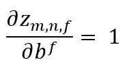

# 2D 卷积层的向前和向后传播

> 原文：<https://towardsdatascience.com/forward-and-backward-propagations-for-2d-convolutional-layers-ed970f8bf602?source=collection_archive---------10----------------------->

## 深度学习:理解理论以便更好地实践

## 推广到多通道输入和多滤波器

# 动机

已经有许多关于*到数据科学*的文章讨论了卷积神经网络的反向传播。

它们很好地解释了简单的情况(例如，只有一个通道的输入，当时只有一个卷积滤波器)，但我发现很难将反向传递实现推广到任意选择的层。

为了克服这个困难，我决定回到反向传播的理论方面。找到这些方程后，实现变得容易多了。

本文旨在给出多通道输入和多滤波器卷积层的前向传播和后向传播的关键方程，以及如何得到它们。

如果你只对结果感兴趣，请随意下结论！

# 几个定义

卷积层执行…卷积！然后，我们需要定义有用的数学运算符:

一方面，任意大小的图像和具有大小为(k1，k2)的核 K 的 C 个通道之间的*卷积*被定义为:

Convolution of image I with kernel K

另一方面，任意大小的图像和具有大小为(k1，k2)的核 K 的 C 个通道之间的*互相关*由下式定义:

Cross-correlation of image I with kernel K

明眼人会注意到，图像与核的卷积相当于图像与该核的互相关，但翻转了 180 °:

Kernel flip

因此，我们可以直接将翻转的内核视为我们想要用于卷积的内核，并且 ***让我们的层仅计算互相关*** 。

在本帖中，我们将把元素 X 视为 3 维或 4 维数组:

在 X 有三维的情况下，f 不会出现在符号上。就是这样！我们现在可以讨论卷积层本身。

# 卷积层

该层将高度 n_H_prev、宽度 n_W_prev 和 C 通道的前一层 A_prev 的输出转换成高度 n_H、宽度 n_W 和 F 通道的变量 Z。

Convolutional layer: input and output shapes

该层的参数是:

*   *F 核*(或过滤器)由它们的*权重* w_{i,j,c}^f 和*偏差* b^f 定义
*   上面解释的*内核大小* (k1，k2)
*   一个*激活*功能
*   *步长* (s1，s2)，其定义了在输入图像上应用内核的步骤
*   p1，p2 定义了我们在 A_prev 的边界上添加的零的数量

# 正向传播

卷积层转发**填充的**输入；因此，我们考虑将 *A_prev_pad* 用于卷积。

正向传播的方程式是:

Forward propagation equations

# 反向传播

反向传播有三个目标:

*   将错误从一层传播到上一层
*   计算误差相对于权重的导数
*   计算误差相对于偏差的导数

## 注释

为了便于表示，我们定义如下:

## 数学！

在实践中，我们通过**总是**知道 da_{i，j，f}或 dz_{i，j，f}来执行层的向后传递，并且我们假设对于这种情况我们知道 da_{i，j，f}。

dz_{i，j，f}的表达式由等式给出。[2]:

其中 g '是 g 的导数。

利用链式法则，我们可以计算 dw_{i,j,c}^f:

回想一下，dz_{m，n，k}仅与第 k 个滤波器相关联(由等式给出。[1])，fth 内核的权重只和 dz 的 fth 通道挂钩；

然后，我们可以用方程式得到 dz_{m,n,f}/dw_{i,j,c}^f。[1]:

情商的表达。[5]然后是:

可以注意到，这是 A_prev_pad 与内核 dZ 的互相关

对于偏置，遵循相同的程序:

因此:

最后要做的是误差的反向传播:找出 dA_prev 和 dZ 之间的关系。

记住我们在 dZ 和 dA_prev 的填充版本之间有关系(在等式中给出)。[1])，我们将考虑计算 da_prev_pad。

使用链式法则(再次！)，我们有:

我们认为 dz_{m，n，f}是和的第一项，这很好。让我们关注第二个术语:

当且仅当 m'+m=i，n'+n=j，c'=c 时，它不等于零。

因此:

所以，

我们注意到等式。[9]描述了一种卷积，其中层的滤波器被认为是图像，dZ 是内核。

我们最终通过选择 da_prev_pad_{i+p1，j+p2，c}获得 da_prev_{i，j，c}，p1 和 p2 是该层的第一和第二维周围的填充值。

# 结论

在本文中，您了解了如何计算具有任意数量滤波器和输入通道的卷积层的前向和后向传播。

正向传递由两个等式给出:

Forward pass equations

要计算卷积层的反向传播，只需实现以下四个等式:

Backward pass equations

其他细节可以在本文中讨论(例如，如何计算 n_H 和 n_W 的值),但许多文章已经讨论了这些要点，因此我鼓励您在开始实现自己的卷积层之前阅读它们。

# 来源

[1] [杜默林诉&维辛，F. (2016)。深度学习卷积算法指南(cite arxiv:1603.07285)](https://arxiv.org/pdf/1603.07285.pdf)

[2][CMSC 426 相关与卷积课堂笔记，2005 秋季戴维·雅各布](http://www.cs.umd.edu/~djacobs/CMSC426/Convolution.pdf)

[3] [卷积神经网络 UFLDL 教程](http://ufldl.stanford.edu/tutorial/supervised/ConvolutionalNeuralNetwork/)

[4] [卷积神经网络中的反向传播，Jefkine，2016 年 9 月 5 日](https://www.jefkine.com/general/2016/09/05/backpropagation-in-convolutional-neural-networks/)

祝你实现这些算法好运！

干杯，

*特里斯坦*