# 前进模式自动微分和双数

> 原文：<https://towardsdatascience.com/forward-mode-automatic-differentiation-dual-numbers-8f47351064bf?source=collection_archive---------0----------------------->

自动微分(AD)是深度学习成功故事背后的驱动力之一。它允许我们有效地计算我们最喜欢的合成函数的梯度值。TensorFlow、PyTorch 以及所有前辈都利用 AD。按照随机近似技术，如 SGD(及其所有变体)，这些梯度细化了我们最喜欢的网络架构的参数。

许多人(直到最近包括我自己)认为反向传播、链式法则和自动微分是同义词。但事实并非如此。为了成为这门手艺的真正大师，我们必须找出原因。🔥

**TL；博士** : *我们讨论区分计算机程序的不同方法。更具体地说，我们比较正向模式和反向模式(反向模式)的自动微分。最后，我们为一个简单的逻辑回归问题实现了具有双数的正向模式 AD。在* *这里可以找到普通数字代码* [*。*](https://github.com/RobertTLange/code-and-blog/blob/master/01_dual_number_ad/dual_number_ad.ipynb)

# 计算计算机程序的导数

术语“可微分编程”可能有点令人难以置信。一般来说，程序与分析或可微函数没有任何关系。除了计算数学函数的计算机函数。假设你面临的任务是拟合一些逻辑回归模型。一种方法是在给定一些真实标注数据的情况下，迭代最小化逻辑输出函数的二进制交叉熵损失:

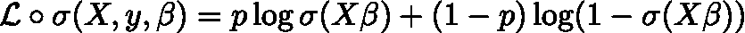

解析表达式可以很容易地翻译成一些 Python 代码:

该函数根据固定真实标签(`y_true`)和预测/拟合标签概率(`y_pred`)计算数值。在我们的例子中，`y_pred`相当于 sigmoid 压缩输出，也是β的函数。为了找到最佳拟合系数，我们需要遵循使损失函数最小化的最陡下降方向(即梯度)。为此，我们可以使用一套差异化技术:

1.  **手动鉴别**(🙌众所周知，手动微分需要在一张纸上算出导数。然后，导数可以用代码实现。这样做容易出现“数学”错误，而且(至少对我来说)相当耗时。祝你好运，为一张深网解决问题。
2.  **数值微分**(💻):我们可以简单地尝试使用两个极小的不同输入来近似梯度，而不是用链和商规则来弄脏您的手。这样我们就接近了导数的正式定义。这带来了两个主要缺点:它需要多个函数求值(每个输入维度至少两次)，并且容易出现舍入误差和截断误差(输入永远不会完全相同)。好的一面是——它非常容易实现。
3.  **符号微分** (🈂):符号方法应用符合微分规则的变换，以获得导数的表达式。这是在 Mathematica 等软件中实现的，并且依赖于一些严肃的代数运算。组合函数有导致导数的符号表示过于复杂的风险。这就是通常所说的“表情肿胀”。最终，这会导致任意昂贵的梯度评估。
4.  **自动微分**(🔁):ad 没有膨胀到无穷大，而是简化了每个可能时间点的导数表达式。例如每次手术后！所有的数学都可以被看作是一组有限的基本运算(加法、乘法、求幂等)的组合。).对于这样的运算，我们已经知道了导数的函数形式。通过链式法则的优点，我们可以将这些初等导数结合起来，并以内存存储为代价降低表达式的复杂性。

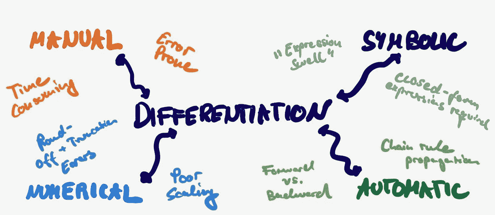

AD 的核心融合了数字世界和符号世界的精华。它在符号微分的基本规则集的帮助下计算导数的值。为了克服膨胀，符号表达在每个阶段都被简化了。简单地通过用先前计算的结果(或简单地输入数据)进行数值评估。因此，它不提供导数本身的解析表达式。相反，它迭代地评估给定数据的梯度。简单来说:f'(2) ≠ f'(x)。

让我们看看这如何应用于我们的逻辑回归问题&将逐步输出定义为 a(h) = σ(h)和 h(X，β) = X β。然后，我们可以将感兴趣的梯度改写为:

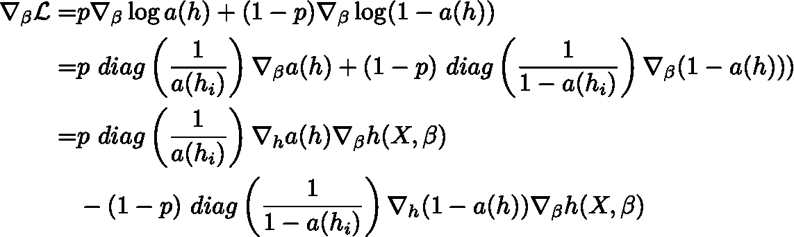

上面的表达式是手工推导的。乍一看，这可能不像是一种简化。但是我们现在可以观察到一个更普遍的原理:梯度可以分解成各个变换路径的梯度分量:

1.  预激活 h(X，β)及其梯度∇h(X，β)写参数β。
2.  激活 a(h)和它们的梯度∇a(h)写预激活 h
3.  类问题的对数 log a(h)和梯度对角矩阵∇log a(h)写激活 a

对于每个部分评估 h(X，β)，a(h)，log a(h ),我们可以很容易地计算对它们各自的输入β，h，a 的灵敏度，并获得它们的导数。最终，真实概率向量 p 提供了缩放梯度的误差信号。

# AD:前进与后退模式

我们可以继续进行*自动*以两种不同的方式计算梯度的各个分量:

1.  **正向累计模式**(⏩):简单提出模式将莱布尼茨的链式法则应用于一个*正向原始迹*中的每个基本操作。由此，获得了*导数轨迹*。在每一个阶段，我们都以“步伐一致”的方式评估操作符及其梯度！

*   原始迹:h(X，β) → a(h) → log a(h)
*   导数迹:∇h(X，β) → ∇a(h) → ∇log a(h)
*   同步评估+衍生工具:

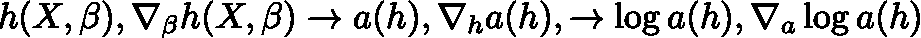

最后，总梯度∇*l*然后通过将单个片段相乘并使用 p 重新缩放来获得

1.  **反向累计模式**(⏪):另一方面，反向模式不同时计算导数，而是需要两个单独的阶段。在*正向阶段*中，评估所有中间变量，并将它们的值存储在存储器中。在接下来的*反向阶段*中，我们再次借助链式法则传播回导数/邻接。反向模式 AD 就是我们通常所说的深度学习中的**反向传播** (Rumelhart 等人，1988)。

*   正向相位:h(X，β) → a(h) → log a(h)
*   倒相:∇log a(h) → ∇a(h) → ∇h(X，β)。那么我们如何知道用哪种方式来发送我们的梯度呢？我们需要一个簿记方案，该方案由预先指定的*计算图*提供，该图指定了操作的流程。

比较工作模式时，有两个主要考虑因素:

1.  **内存存储与计算时间**:正向模式要求我们存储导数，而反向模式只要求存储激活。正向模式 AD 在变量求值的同时计算导数，而反向模式 AD 在单独的反向阶段计算导数。
2.  **输入与输出维度**:给定一个函数 f，我们可以根据要处理的维度区分两种状态:

*   n <
*   n > >m:输入尺寸大于输出尺寸。这是经典的深度学习设置。我们从前向传递获得标量损失评估，并传播回相当高维的输入。→反向模式在计算上比正向模式便宜。

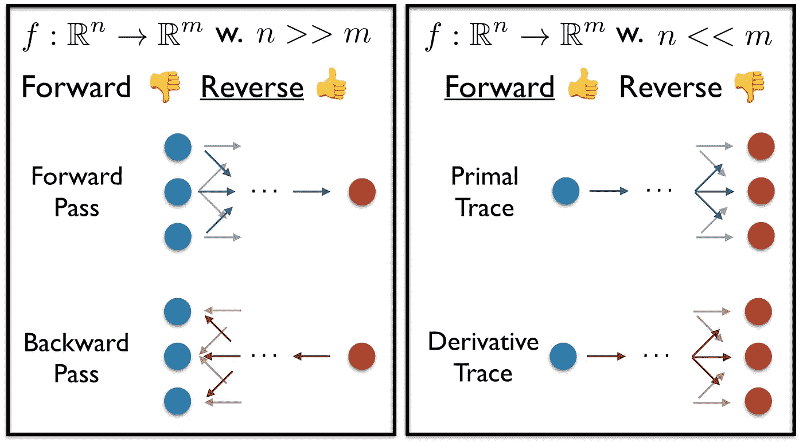

我们感兴趣的是将计算从几个单元推向多个单元。事情并不一定如此明确，因为人们可以相当容易地对正向模式计算进行矢量化。因此，不需要单独的向前传球。我假设反向模式在 DL 中的优势主要来自于减少的内存需求。

# 双数的作用

于是这里就来了一个简化正向模式 AD 的代数魔术:可以证明正向模式 AD 等价于用对偶数求感兴趣的函数。

我写这篇博文的动机源于我对这种等价性的理解不满意。所以我不得不深入调查。现在让我试着解释一下，使用任何数值计算的对偶部分来计算其各自的参数梯度是多么的优雅。那么什么是双数呢？我们可以将输入变量 x 分解成实数部分和对偶部分:

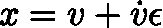

用 v，v̇实数，ϵ ≠ 0，ϵ = 0。基于这个简单的定义，下面的基本算术性质的结果:

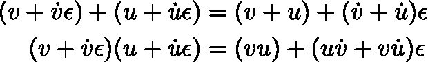

此外，可以用代数方法推导出以下公式:

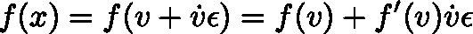

哇！通过评估 f(x)的对偶形式，并设置 v̇ = 1，我们能够恢复函数值 f(v)以及其评估的导数 f'(v)，其形式为ϵ前面的系数！最后，链式法则顺利地转化为双重设置:

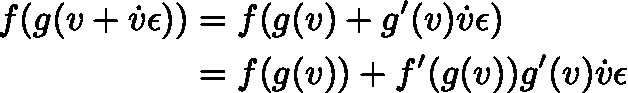

这意味着，我们可以通过简单地将导数相乘，轻松地在计算层中传播梯度。为了实现对偶数，我们只需要一个单独的存储系统来跟踪 x = (v，coeff-在 v̇前面)并将各自的导数计算应用到 x 的对偶部分。太棒了代数！

对于多元函数，事情变得有点棘手。想象两个输入:

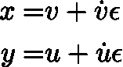

相对于 x 的偏导数通过设置 v=1 和 u=0 来计算。对于 y，我们必须翻转两位。为了并行执行，并防止多次向前传递，我们可以对事物进行矢量化，并保留一个对角矩阵:

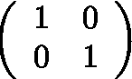

每行代表一个偏导数。所有上述规则很容易转化为多元的情况。

因此，如何看待ϵ仍有待讨论？我从这篇[博文](https://blog.demofox.org/2014/12/30/dual-numbers-automatic-differentiation/)中得到的两个直觉如下:

1.  ϵ可以被认为是无穷小数的一种形式。当平方这么小的数时，它就变得不可表示了。直观上，这类似于数值微分步长。
2.  另一种可能的方式是把ϵ想象成一个矩阵:

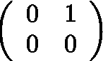

计算ϵ x ϵ然后产生所需的零矩阵。通过限制 i = -1 虚数，帮助我们计算旋转。另一方面，双数限制ϵ = 0，并允许有效和精确的导数计算。让我们看看如何将它转化为逻辑回归示例的代码。

# 让我们把它编码起来！

首先，我们需要一些合成数据来解决二元分类问题。下面的类对象生成系数、高斯噪声和特征。然后，我们取点积并对变换后的特征进行阈值处理，以获得二值标签。此外，还有一些小的实用程序可以对成批数据进行采样，并在不同的时期之间对数据进行混洗。都是很标准的东西。没有双重的。

Let’s generate some data!

接下来我们来定义一下事物的“双肉”。我们需要确保所有的基本运算(加法、乘法、sigmoid 激活以及梯度所需的对数)都作用于向量的对偶表示的实数部分和对偶部分(这需要梯度)。因此，我们需要一个双重包装器来重载/重定义操作符。

Let’s set up some dual number operations

sigmoid 函数的对偶版本将标准σ应用于实部，并使用其计算的导数来改变 n x d 维对偶矩阵的数值。因为σ'(h) = σ(h) (1 — σ)应用于向量 h 的每个元素，因此，对偶部分的整体变化由下式给出:

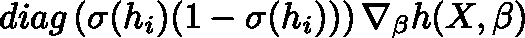

这又导致大小为 n×d 的雅可比矩阵，同样的概念也适用于对数运算符。现在，我们已经为我们的对偶数运算重新定义了算术设置，让我们研究如何获得我们的逻辑回归预测和相应的二元交叉熵损失:

A simple ‘forward’ pass and dual loss function evaluation

最后，让我们把所有的东西放在一起，形成一个最终的训练循环。我们生成二进制数据并初始化一些占位符列表来存储我们的中间结果。之后，我们计算 Sklearn 解决方案系数来衡量我们的差距。然后，我们可以简单地循环单个批次。我们将系数初始化为对偶张量、样本批次，将梯度系数/对角矩阵设置回它们的偏导数初始化。我们获得预测和损失。损失评估的对偶对应于兴趣梯度∇ *L* 。SGD 更新然后简单地采用 dual 并在最陡下降方向执行一个步骤。

让我们训练一个简单的例子，看看指标:

Run the training loop!

这个理论的结果是多么令人惊讶。损失随着处理的批次数量而减少。这些系数收敛于 Sklearn 解和训练精度。A 队的汉尼拔会说“我喜欢有计划的时候。”

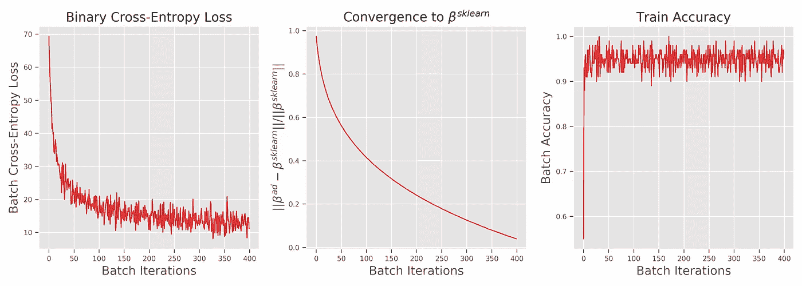

# 高效计算 Hessian 矢量积

我们已经讨论了为什么反向传播和反向模式 AD 对于标准深度学习应用更有效。前向模式 AD 仍然有用的一个原因是它在计算 Hessian-vector product，Hv 时的实用性。我们可以使用**反向对正向**配置来组合正向和反向模式，以计算二阶 Hessian。更具体地说，给定一个输入为 x 的函数 f，我们可以简单地同时使用这两种模式:

1.  正向模式:通过设置ẋ = v 来计算梯度矢量积∇ *f v*
2.  反向模式:取结果并对其应用反向传播:∇ fv = Hv

很聪明，对吧？然后，Hessian 可用于进行高阶优化，这也考虑了损失面的近似曲率。总之，对于前向模式的广告，还是有一些喜爱的。

我们已经看到了前向模式自动微分的能力和局限性。它允许我们同时计算一个函数及其导数。因此，人们能够克服反向模式 AD(又名反向传播)的两阶段原则。这是以存储所有中间节点的双重表示为代价的。此外，单独向后传递的计算工作被转移到向前传递。我们看到了对偶数神奇的代数性质是如何让我们高效而精确地做到这一点的。

# 结论

总而言之，我发现从零开始实现东西非常令人满意，也非常有洞察力。我对当前的 DL 库及其挑战有不同的看法(例如，静态与动态计算图，存储与计算)。我建议感兴趣的读者仔细看看 Baydin 等人(2018 年)的一项伟大调查。这篇文章是我的起点，提供了一个可读性很强的概述！你也可以在这里找到[的所有代码。](https://github.com/RobertTLange/code-and-blog)

1.  baydin a . g . b . a . pearl mutter a . a . Radul 和 J. M. Siskind。(2018):《机器学习中的自动微分:一项调查》，*机器学习研究杂志*，18。
2.  Rumelhart，D. E .，G. E. Hinton，R. J. Williams 等人。(1988):“通过反向传播错误学习表征”，*认知建模*，5，1。

罗伯特 *是柏林工业大学的一名博士生。本帖原载于 2019 年 9 月 1 日*[*https://roberttlange . github . io*](https://roberttlange.github.io/posts/2019/08/blog-post-6/)*。*