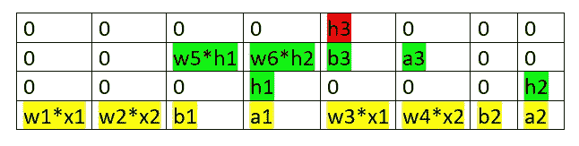

# 神经网络中的前向传播—简化的数学和代码版本

> 原文：<https://towardsdatascience.com/forward-propagation-in-neural-networks-simplified-math-and-code-version-bbcfef6f9250?source=collection_archive---------3----------------------->

我们都知道从最近十年*深度学习已经成为最广泛接受的新兴技术之一。这是由于其功能的代表性。*

*根据 ***通用逼近定理*** ，一个经过良好引导和工程化的*深度神经网络*可以逼近变量之间任意复杂和连续的关系。其实*深度学习*成功的背后还有其他几个原因。我不打算在这里讨论这些可能的原因。*

*这篇文章的目的是用更简单的方式解释 ***正向传播*** (学习阶段的核心过程之一)。*

*学习算法/模型在*正向传播*和*反向传播的帮助下找出参数(权重和偏差)。**

# *正向传播*

*顾名思义，输入数据是通过网络正向输入的。每个隐藏层接受输入数据，按照激活函数对其进行处理，并传递给后续层。*

## *为什么选择前馈网络？*

*为了产生一些输出，输入数据应该只向前馈送。在生成输出的过程中，数据不应反向流动，否则会形成一个循环，永远无法生成输出。这种网络结构被称为 ***前馈网络*** 。*前馈网络*有助于*正向传播*。*

*在隐藏层或输出层中的每个神经元处，处理分两步进行:*

1.  ***预激活:**是输入的*加权和，即权重* w.r.t 对可用输入的*线性变换。基于这个*聚集总和*和*激活函数*，神经元决定是否进一步传递该信息。**
2.  ***激活:**计算出的输入加权和传递给激活函数。激活函数是给网络增加非线性的数学函数。有四种常用和流行的激活函数— sigmoid、双曲正切(tanh)、ReLU 和 Softmax。*

*现在让我们借助一个例子来理解*正向传播*。考虑一个*非线性*可分离数据，其形式为遵循漩涡模式的两个数据点的卫星。这个生成的数据有两个不同的类。*

*可以使用`sklearn.datasets`模块的`make_moons()`功能生成数据。要生成的样本总数和关于月亮形状的噪声可以使用函数参数进行调整。*

```
*import numpy as np
import matplotlib.pyplot as plt
import matplotlib.colors
from sklearn.datasets import make_moonsnp.random.seed(0)data, labels = make_moons(n_samples=200,noise = 0.04,random_state=0)
print(data.shape, labels.shape)color_map = matplotlib.colors.LinearSegmentedColormap.from_list("", ["red","yellow"])
plt.scatter(data[:,0], data[:,1], c=labels, cmap=my_cmap)
plt.show()*
```

**

*dataset visualization*

*这里，200 个样本用于生成数据，它有两个类，以红色和绿色显示。*

*现在，让我们看看神经网络结构来预测这个*二元分类*问题的类。这里，我将使用一个具有两个神经元的*隐藏层*，一个具有单个神经元的*输出层*和 *sigmoid 激活*功能。*

**

*在*正向传播*期间，在隐藏和输出层*的每个节点发生预激活*和*激活*。例如在隐藏层的第一个节点，首先计算 **a1** ( *预激活*)，然后计算 **h1** ( *激活*)。*

***a1** 是输入的加权和。这里，权重是随机生成的。*

***a1**= w1 * x1+w2 * x2+B1 = 1.76 * 0.88+0.40 *(-0.49)+0 = 1.37 近似值 **h1** 是应用于 a1 的激活函数值。*

**

*类似地*

***a2**= w3 * x1+w4 * x2+B2 = 0.97 * 0.88+2.24 *(0.49)+0 =-2.29 近似值和*

**

*对于第一个隐藏层之后的任何层，输入是从前一层输出的。*

***a3**= w5 * h1+w6 * H2+B3 = 1.86 * 0.8+(-0.97)* 0.44+0 = 1.1 近似值*

*和*

**

*所以有 74%的几率第一次观察属于第一类。像这样对所有其他的观察预测输出可以计算出来。*

*下图显示了第一次观测的数据从输入图层到输出图层的转换。*

**

*Data transformation from the input layer to the output layer*

*现在让我们看看上面的神经网络在 Jupyter 笔记本中的实现。事实上，在构建 Tensorflow、Keras、PyTorch 等深度神经网络框架的同时。被使用。*

```
*from sklearn.model_selection import train_test_split#Splitting the data into training and testing data
X_train, X_val, Y_train, Y_val = train_test_split(data, labels, stratify=labels, random_state=0)
print(X_train.shape, X_val.shape)* 
```

*这里，按照默认的 75:25 的分割比，150 个观察值用于训练目的，50 个用于测试目的。*

*现在让我们为*正向传播*定义一个类，其中权重被随机初始化。*

```
*class FeedForwardNetwork:

 def __init__(self):
     np.random.seed(0)
     self.w1 = np.random.randn()
     self.w2 = np.random.randn()
     self.w3 = np.random.randn()
     self.w4 = np.random.randn()
     self.w5 = np.random.randn()
     self.w6 = np.random.randn()
     self.b1 = 0
     self.b2 = 0
     self.b3 = 0

 def sigmoid(self, x):
     return 1.0/(1.0 + np.exp(-x))

 def forward_pass(self, x):
     self.x1, self.x2 = x
     self.a1 = self.w1*self.x1 + self.w2*self.x2 + self.b1
     self.h1 = self.sigmoid(self.a1)
     self.a2 = self.w3*self.x1 + self.w4*self.x2 + self.b2
     self.h2 = self.sigmoid(self.a2)
     self.a3 = self.w5*self.h1 + self.w6*self.h2 + self.b3
     self.h3 = self.sigmoid(self.a3)
     forward_matrix = np.array([[0,0,0,0,self.h3,0,0,0], 
                      [0,0,(self.w5*self.h1),        (self.w6*self.h2),self.b3,self.a3,0,0],
                      [0,0,0,self.h1,0,0,0,self.h2],
                      [(self.w1*self.x1), (self.w2*self.x2),         self.b1, self.a1,(self.w3*self.x1),(self.w4*self.x2), self.b2,  self.a2]])
     forward_matrices.append(forward_matrix)
     return self.h3*
```

*这里，`forward_pass()`函数计算给定输入观测值的输出值。`forward_matrix` 是一个 2d 数组，用于存储每次观察的 a1、h1、a2、h2、a3、h3 等的值。使用它的原因只是为了用 GIF 图像来可视化这些值的转换。`forward_matrix` 的条目如下所示*

**

*forward_matrix*

```
*forward_matrices = []
ffn = FeedForwardNetwork()
for x in X_train:
   ffn.forward_pass(x)*
```

*`forward_matrices` 是所有观察值的列表`forward_matrix`。*

```
*import seaborn as sns
import imageio
from IPython.display import HTMLdef plot_heat_map(observation):
    fig = plt.figure(figsize=(10, 1))
    sns.heatmap(forward_matrices[observation], annot=True,     cmap=my_cmap, vmin=-3, vmax=3)
    plt.title(“Observation “+str(observation)) fig.canvas.draw()
    image = np.frombuffer(fig.canvas.tostring_rgb(), dtype=’uint8')
    image = image.reshape(fig.canvas.get_width_height()[::-1] +             (3,)) return imageimageio.mimsave(‘./forwardpropagation_viz.gif’, [plot_heat_map(i) for i in range(0,len(forward_matrices),len(forward_matrices)//15)], fps=1)*
```

*`plot_heat_map()`功能创建一个热图，以可视化每次观察的`forward_matrix` 值。这些热图存储在`forwardpropagation_viz.gif`图像中。这里，总共为 15 个不同的观察创建了 15 个不同的热图。*

**

*forward propagation for 15 different observations*

## *代码优化*

*而不是使用不同的变量，如 w1、w2…w6、a1、a2、h1、h2 等。单独地，矢量化矩阵可以分别用于权重、预激活(a)和激活(h)。矢量化能够更高效、更快速地执行代码。它的语法也很容易理解和学习。*

```
*class FeedForwardNetwork_Vectorised:

 def __init__(self):
    np.random.seed(0)
    self.W1 = np.random.randn(2,2)
    self.W2 = np.random.randn(2,1)
    self.B1 = np.zeros((1,2))
    self.B2 = np.zeros((1,1))

 def sigmoid(self, X):
    return 1.0/(1.0 + np.exp(-X))

 def forward_pass(self,X):
    self.A1 = np.matmul(X,self.W1) + self.B1 
    self.H1 = self.sigmoid(self.A1) 
    self.A2 = np.matmul(self.H1, self.W2) + self.B2
    self.H2 = self.sigmoid(self.A2) 
    return self.H2ffn_v = FeedForwardNetwork_Vectorised()
ffn_v.forward_pass(X_train)*
```

## ***结论***

*这是从我的角度讲的 ***正向传播*** ，我希望我能够解释*正向传播*中涉及的直觉和步骤。如果你有兴趣学习或探索更多关于神经网络的知识，请参考我的其他关于神经网络的博客文章。链接如下*

*[https://www . analyticsvidhya . com/blog/2020/10/a-comprehensive-guide-to-feature-selection-using-wrapper-methods-in-python/](https://www.analyticsvidhya.com/blog/2020/10/a-comprehensive-guide-to-feature-selection-using-wrapper-methods-in-python/)*

*[为什么更好的权重初始化在神经网络中很重要？](/why-better-weight-initialization-is-important-in-neural-networks-ff9acf01026d)*

*[分析神经网络中不同类型的激活函数——选择哪一种？](/analyzing-different-types-of-activation-functions-in-neural-networks-which-one-to-prefer-e11649256209)*

*[为什么梯度下降还不够:神经网络优化算法综合介绍](/why-gradient-descent-isnt-enough-a-comprehensive-introduction-to-optimization-algorithms-in-59670fd5c096)*