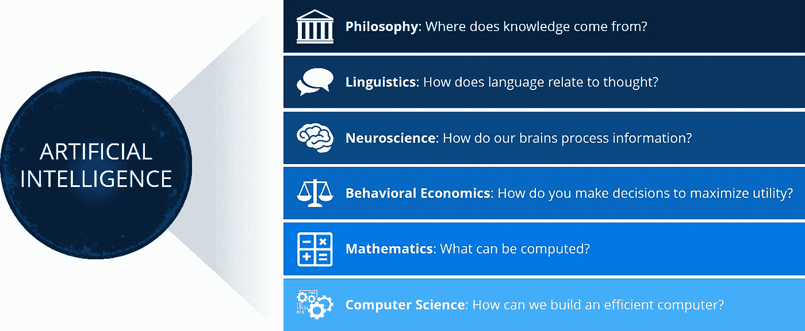
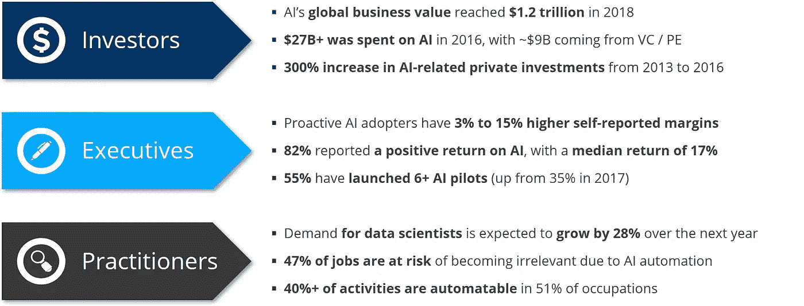
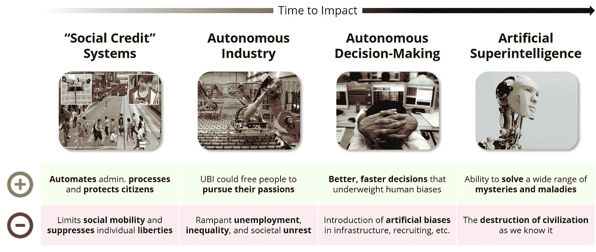
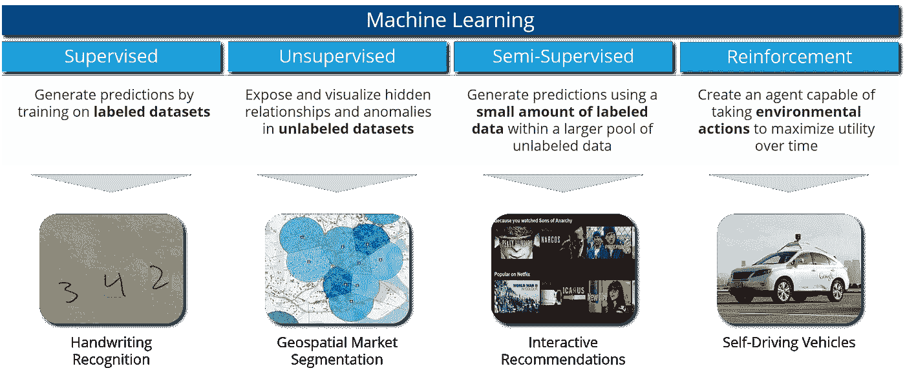
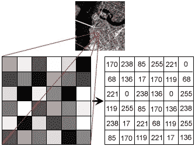
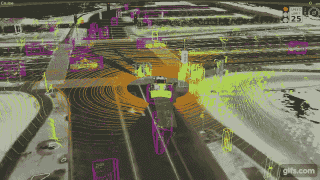
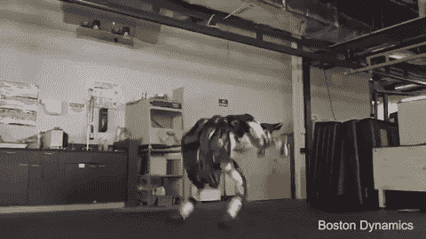

# 人工智能的基础

> 原文：<https://towardsdatascience.com/foundations-of-ai-b11d6ad7ce6f?source=collection_archive---------4----------------------->

## 理解人工智能的直观框架

Photo by [Daniel McCullough](https://unsplash.com/@d_mccullough?utm_source=medium&utm_medium=referral) on [Unsplash](https://unsplash.com?utm_source=medium&utm_medium=referral)

很少有技术像人工智能一样抓住了人类的想象力。自古以来，智能机器人和人造生物的故事就充斥着我们的神话和传说，当我们的祖先认为自主机器的存在时，引发了兴奋和恐惧。这些神话继续影响着围绕人工智能的叙事，尽管我们比以往任何时候都更接近于开发人工通用智能，但鉴于今天充斥着流行语的媒体，很难区分事实和虚构。

尽管某些用例无疑被夸大了，但人工智能有潜力改变我们工作、娱乐和生活的方方面面。在本帖中，我们将通过以下方式为理解这项技术奠定基础:

*   **定义人工智能**并描述它如何影响我们快速变化的世界
*   **将人工智能领域**简化为五个核心研究领域
*   **用轶事和例子让每个研究领域变得生动**

# 第 1 部分:定义和动机

人工智能是我们通常归因于人类思维和理性的活动的自动化，例如解决问题、决策和学习。人工智能生活在许多经典学科的交叉地带，包括哲学、神经科学、行为经济学、计算机科学和机械工程。这些跨学科的根源有助于解释为什么人工智能抓住了我们的想象力:这个新兴的研究领域为所有兴趣和背景的人提供了一点东西。随着我们对人工智能是什么以及它如何工作的理解不断发展，我们同时在学术界最具挑战性的研究问题上取得了进展:

*Source:* [Artificial Intelligence: A Modern Approach (2nd Edition)](https://www.amazon.com/Artificial-Intelligence-Modern-Approach-3rd/dp/0136042597)

## 业务影响

人工智能肯定会影响你未来十年的职业道路。尽管大多数行业仍处于概念验证(POC)开发的早期阶段，但许多早期采用者已经开始享受他们的劳动成果。在一项研究中，研究人员发现，主动采用人工智能技术的 F500 公司的自我报告利润率比竞争对手高 3-15%。这些早期的成功信号引发了一波投资浪潮，刺激了风投和公司的发展。各部门每年都要花费数百亿美元来开发和扩展新的人工智能能力。这笔资金大大增加了对数据科学家和 ML 工程师的需求，催生了新的教育模式(例如 MOOCs、bootcamps)，通过加快人工智能的采用速度来支持这种良性循环。无论你在我们的经济中扮演什么角色，你可能已经开始注意到这一波浪潮的影响:

*Sources:* [*McKinsey Global Institute*](http://www.mckinsey.com/~/media/McKinsey/Industries/Advanced%20Electronics/Our%20Insights/How%20artificial%20intelligence%20can%20deliver%20real%20value%20to%20companies/MGI-Artificial-Intelligence-Discussion-paper.ashx)*,* [*Executive Office Report on AI*](https://obamawhitehouse.archives.gov/sites/default/files/whitehouse_files/microsites/ostp/NSTC/preparing_for_the_future_of_ai.pdf)*,* [*IBM Analytics Report*](https://www.ibm.com/analytics/us/en/technology/data-science/quant-crunch.html)*,* [*Venture Scanner*](https://www.venturescanner.com/blog/2016/artificial-intelligence-startup-landscape-trends-and-insights-q4-2016)

以适度的怀疑态度对待融资数据总是明智的，而且不清楚这些趋势是否会在熊市中持续。尽管如此，这些趋势背后的势头表明，人工智能将对商业界产生持久的影响。

## 社会影响

在办公室之外，AI 也将对我们的社会产生深远的影响。虽然人工智能有潜力以我们尚未发现的方式加快和改善我们的日常生活，但它也可能很容易被误用和滥用。几个有代表性的例子包括:

“人工超级智能”(在研究界被称为人工通用智能，或 AGI)的概念尤其具有争议性。尽管我们距离开发出像终结者*或玛奇纳*那样的自主智能体还有几十年的时间，但许多思想领袖已经开始讨论超人人工智能带来的生存威胁。在一个角落里，斯坦福大学教授兼 deeplearning.ai 首席执行官[吴恩达](https://en.wikipedia.org/wiki/Andrew_Ng)对人工智能将在社会中扮演的角色持乐观态度:

> ****AI 是新电*** *。就像 100 年前电* ***改变了一个又一个产业*** *，AI 现在也会这样做。”**
> 
> **——吴恩达**

*在另一篇文章中，特斯拉和 OpenAI 首席执行官[埃隆·马斯克](https://en.wikipedia.org/wiki/Elon_Musk)主张对人工智能开发采取更加保守的方法:*

> **“如果让我猜我们的* ***最大的生存威胁*** *是什么，大概就是【AI】…有了人工智能，我们就是* ***召唤恶魔*** *。”**
> 
> **——埃隆马斯克**

*专家们对我们何时能最终实现 AGI 有不同意见，但是，正如我们很快会说明的，在过去的几年里，我们已经朝着这个目标取得了重大进展。*

# *第 2 部分:理解人工智能*

*在他们 1995 年的经典[人工智能:一种现代方法](https://www.amazon.com/Artificial-Intelligence-Modern-Approach-3rd/dp/0136042597)中，伯克利的 Stuart J. Russell 和谷歌的 Peter Norvig 将人工智能分为五个不同的研究领域，这些领域源于[总体图灵测试](https://en.wikipedia.org/wiki/Turing_test#Total_Turing_test):*

*   ***机器学习***
*   ***专家系统***
*   ***计算机视觉***
*   ***自然语言处理***
*   ***机器人***

*虽然这五个学科之间的界限已经开始变得模糊，因为我们已经朝着 AGI 取得了进展，但这个框架是理解人工智能的一个有用的起点。在第二部分，我们将提供这五个学科的例子和最新趋势。*

## *机器学习*

*机器学习(ML)是一门让机器在没有人类干预的情况下做出决策的科学**。这个子学科形成了人工智能的主干，使计算机能够使用多维数组学习和解释图像、声音和结构化数据中的模式。ML 进一步细分为四种学习类型:***

*   ***监督学习**:给定一系列特征(例如，一年中的星期、价格等。)和一个带标签的输出变量(例如，销售)，在给定一些新的输入数组的情况下，预测标签变量的最佳可能估计值。*
*   ***无监督学习**:给定一系列特征(例如，人口统计信息、邮政编码等。)，揭示并可视化阵列中隐藏的关系和异常。*
*   ***半监督**:给定一组特征和有限数量的一些标签输出变量，预测缺失标签变量的最佳估计值。*
*   ***强化学习:**给定某个目标，根据某个用户定义的效用函数，训练一个人工智能体，使其效用最大化。*

*监督学习是当今商业世界中最常用的 ML 形式，但随着我们不断发现不太传统的学习方法的新用例，这种平衡可能会发生变化。每种学习类型的示例如下:*

**

*机器学习要感谢过去几年中许多高调的创新，但它比通常认为的更难做到正确。如果没有观察到统计最佳实践，ML 模型将会过度拟合先前观察到的数据点，并将业务用户引入歧途。我们将在以后的讨论中更深入地讨论最后一点。*

## *专家系统*

*专家系统是一个**人工代理，它** **利用预先编程的知识来提供建议或做出决策**。最简单的形式，我们可以把一个 ES 想象成一个复杂的决策树或者嵌套的 if-then 逻辑:如果 *x* 、 *y* 和 *w* 发生，我们指示计算机做 *z* 。尽管专家系统不像机器学习那样被大肆宣传，但是有很多原因可以解释为什么我们更喜欢专家系统而不是机器学习:*

*   *专家系统可以利用通过反复试验发现的人类洞察力*
*   *专家系统**更可预测**并且**在面对以前看不到的输入时不太可能犯极端错误***
*   *专家系统**在历史上更快更容易实现**，尽管 ML 在最近几年变得更容易使用*

**

*Google’s Nest thermometer*

*专家系统是最普遍的人工智能类型，通常与人工智能结合在一起，以帮助降低错误预测的负面风险。谷歌的 Nest 家庭自动化技术是专家系统发挥作用的最好例子。随着时间的推移，用户将他们的偏好编程到 Nest 中，使系统能够自动将房屋温度调节到所需的水平，并减少供暖费用。使用 ML 来预测所需温度可能会导致设置和能源成本的大幅波动，因此用户定义的逻辑对于稳定这些预测至关重要。*

## *计算机视觉*

*计算机视觉(CV)是对图像或视频的自动提取、分析和解释。CV 将照片和视频转换为数字数组，使 ML 算法能够根据用户定义的输入进行推断，进行预测，甚至生成新的图像。*

**

*Example of an image being converted to an array ([source](https://naushadsblog.wordpress.com/2014/02/10/image-processing-and-computer-vision-in-java-point-operators-part-2histogram-equalization/))*

*CV 的潜在用途已经被研究了几十年，但是 CV 直到最近才成为可能，这要归功于三项创新:*

*   ***更高效的算法:**深度学习(具体来说是卷积神经网络)显著降低了 CV 任务的内存占用和计算运行时间。*
*   ***更好的计算资源** : GPU 的改进、分布式架构(例如 Spark)以及廉价云计算资源的可用性使得运行内存密集型 CV 算法比以往任何时候都更便宜。*
*   ***用于训练的图像的可用性**:社交媒体平台、社区论坛和数码/移动相机的激增极大地增加了可用于训练 CV 算法的公开图像的数量。*

**

*这三项创新为新的 CV 用例打开了闸门，包括自动驾驶汽车和自动化零售商(如 Amazon Go)。随着相机、激光雷达和其他空间传感器变得越来越便宜，我们将很快找到使用 CV 来缓解许多最低效过程的方法。*

## *自然语言处理*

*自然语言处理(NLP)是对人类语言的自动提取、分析和生成。NLP 算法以各种方式解析句子(例如，按单词拆分、按字母拆分、从左到右和从右到左阅读等)。)来自动推断作者的意思和意图。NLP 的各种用例包括:*

*   *命名实体识别和会议决议*
*   *词性标注*
*   *阅读理解和问题回答*
*   *机器翻译*
*   *文本摘要和主题建模*
*   *拼写检查和自动完成*

*像 CV 一样，NLP 在过去十年里取得了很大进展，这要归功于深度学习的创新，这些创新使得在人类语言上训练 ML 模型变得更快更容易。过去，工程师会花数小时检查、过滤和转换文本，以避免计算瓶颈。今天，像 [fast.ai 的 NLP 库](https://www.youtube.com/watch?v=5gCQvuznKn0&list=PLtmWHNX-gukKocXQOkQjuVxglSDYWsSh9&index=10&t=0s)这样的开箱即用的解决方案可以粉碎阅读理解准确性记录，而不需要时间密集型的预处理。*

**

*How Alexa and Siri interpret your commands ([source](https://chatbotsmagazine.com/how-does-alexa-skills-works-82a7e93dea04))*

*Siri 和 Alexa 是自然语言处理在实际应用中的很好的例子:通过收听“唤醒词”，这些工具允许你播放音乐，搜索网络，创建待办事项列表，以及控制流行的智能家居产品——所有这些都是在你的智能手机留在口袋里的时候。这些虚拟助手将随着时间的推移不断改进，因为它们从现有用户那里收集数据，释放新的用例，并与现代企业集成。*

## *机器人学*

*机器人学是设计、建造、操作和应用机器人来解决人类问题的**科学。机器人有成千上万种形状和大小，因此很难确定这个术语的准确含义。工业机器人的先驱约瑟夫·恩格尔伯格说得好:***

> *“我无法定义机器人，但我看到一个就知道一个。”
> - [约瑟夫·恩格尔伯格](http://www.leorobotics.nl/definition-robots-and-robotics)*

**

*Boston Dynamic’s Atlas*

*机器人研究领域在过去十年中以极快的速度发展，使得新的设计和用例似乎直接来自科幻小说。私营制造商继续在各自的领域推进机器人技术的发展:*

*   *波士顿动力公司是人形机器人领域的早期创新者，它继续向模拟人类运动靠拢。*
*   *DJI 专注于消费级无人机，让普通人比以往任何时候都更容易飞上天。*
*   *亚马逊机器人位于亚马逊物流战略的核心，每年为这家零售巨头节省数十亿美元。*

*大多数机器人依靠专家系统来完成他们的目标，但是通过将机器学习、计算机视觉和自然语言处理集成到他们的操作系统中，未来的机器人将变得更加有用。*

# *结论:通往 AGI 的道路*

*Russell 和 Norvig 的框架为思考人工智能提供了一个有用的结构，但这五个类别并不意味着相互排斥；过去十年中最激动人心的创新都发生在它们的交叉点上。随着时间的推移，这种学科融合只会变得更加明显:送货无人机、自动驾驶汽车和人工通用智能如果要取得成功，就必须紧密整合所有五个学科。尽管如此，每一个复杂的问题在解决之前都必须分解成其核心组成部分，这五个学科框架为理解人工智能提供了一个基本的心智模型。*

*当你运用这些新发现的知识时，有一些指导原则值得带回你的团队:*

*   ***持怀疑态度**:人工智能是五个深入复杂的研究领域的总称，同时拥有这五个学科的技术专长是极其罕见的。询问潜在的候选人他们以前的经历，并根据他们的专长做出自己的推断。*
*   ***建立一个多样化的团队**:因为最有价值的人工智能用例位于这些学科的交叉点上，如果你的团队想要成功，招募具有不同背景和技能的队友是很重要的。招聘各种职位(例如，数据科学家、UX 设计师、ML 工程师)是一个开始，但请有 [T 形经历](https://en.wikipedia.org/wiki/T-shaped_skills)的候选人找出可以身兼数职的人。*
*   *拥有你的专长:这五个学科中的一个领域的创新往往会给其他四个领域带来新的想法，这意味着所有五个学科领域都处于不断变化的状态。不要试图将人工智能社区作为一个整体来关注，而是关注你认为最适合你的业务和兴趣的 1-2 个学科。这样做，你就能发现机会，将最新最好的技术应用到对你最重要的问题上。*