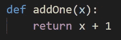
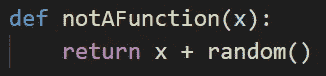
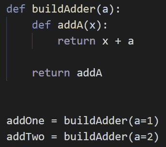
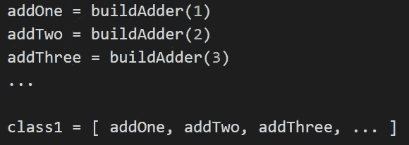
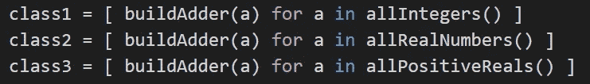
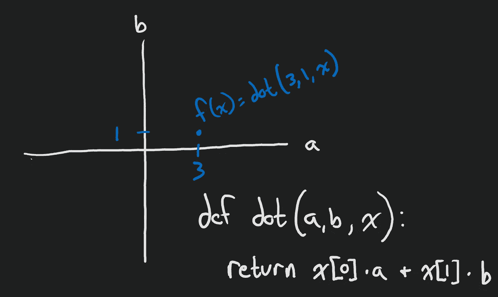
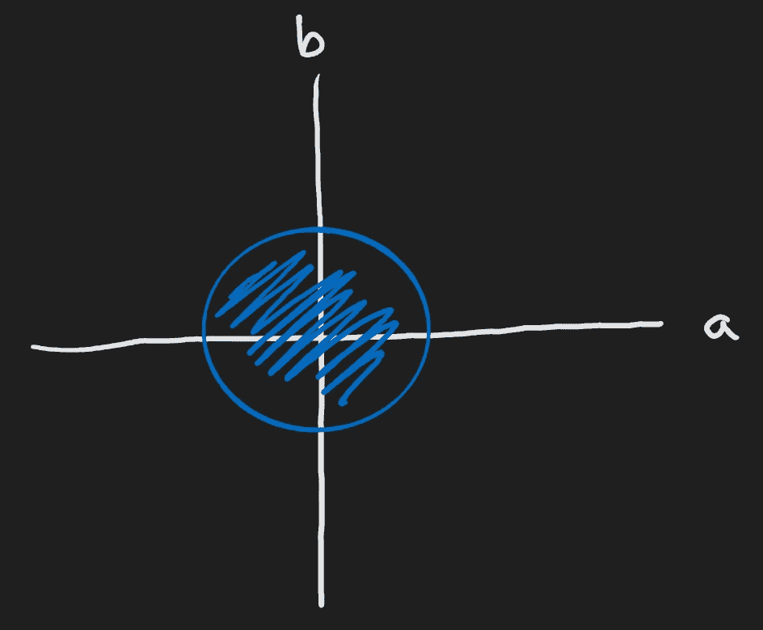
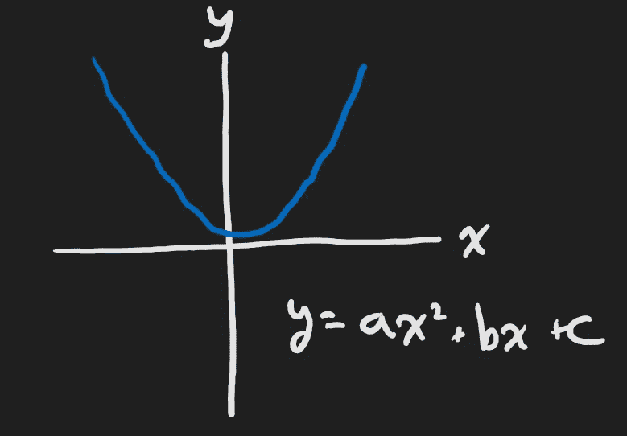

# ML 基础:参数化函数

> 原文：<https://towardsdatascience.com/foundations-of-ml-parameterized-functions-d2951a62272e?source=collection_archive---------12----------------------->

## 对参数化函数的软介绍，这是机器学习和统计学中的一个基础话题，通过小的编程例子来解释。

# 本文的目标

在这篇文章的结尾，我希望下面的句子有意义:

> 我最喜欢的**参数化函数**的可视化来自于高阶函数的几何解释。

为了实现这个目标，我将解释**参数化函数**、**高阶函数**和**功能几何**。如果你已经知道这些并且上面的句子已经有意义，这篇文章可能不适合你。如果以上任何(或全部)听起来很吓人，希望我能帮上忙！

## 什么是函数？

这听起来很基本，但我想从同一页开始，所以请允许我简单地解释一下我说的功能这个词的意思。

在编程中，函数只是一个接受一些参数并返回一些东西的过程。示例:

在数学中，我们对函数的定义更严格一些。所以让我们在定义中增加一个限制。

> 对于任何给定的输入`x`，只能有一个输出`y`。

用反例的方式解释:

为什么这不是一个函数？因为如果我连续两次通过`x = 0`，我将不会得到相同的答案。也就是说，对于给定的输入(`x = 0`)，我得到了不同的输出(`x + random()`)。

## 什么是高阶函数？

高阶函数还是函数。它接受一些参数并返回一个东西。在这种情况下，它返回的“东西”也是函数！示例:

事情变得有点复杂；让我解释一下。每次我们调用我们的高阶函数`buildAdder`，我们都会基于参数`a`创建一个*新的*函数。

在本例中，`addOne`仍然是一个接受一个数字并返回该数字加 1 的函数。但是由于我们的高阶函数，我们可以通过向`buildAdder`传递不同的参数来生成许多这样的加法函数。

## 什么是参数化函数？

在最后一个例子中，`addA`是一个参数化函数！参数化函数是作用于某些参数的函数，但它的作用方式是基于外部常数的。例如，在`addA`的上下文(范围)中，`a`是外部设置的常量值。在`addOne`的情况下，`a`是不变的*一个*。

这里的关键点是`addA`可以是许多不同函数中的一个(这里是无限个)。我们通过其**参数**、`a`来确定我们正在处理的众多函数中的哪一个。

因为`a`的值决定了`addA`承担的精确功能，我们需要一些语言来讨论`addA`可以创建的所有可能功能的集合。为了具体说明这一点，我们来看一些例子:

函数的**类**是一个参数化函数可以采用的所有函数的集合。在这个例子中，我们看到`class1`是包含每个整数值的函数的集合。我们可以更简洁地这样写:

第一类函数包含所有的`addA`，其中`a`是一个整数。下一个类包含所有的`addA`，其中`a`是一个实数。第三类包含所有的`addA`，其中`a`是一个正实数。

如果我们比较这些集合的大小，我们会发现`class2`比`class1`大。我们之所以知道这一点，是因为实数比整数多，并且`a`的值与类中的函数有一对一的映射。

## 我们如何几何地看待参数化函数？

为了更容易形象化，让我们看一个也有两个参数的二元函数。我们可以把这两个变量当作一个数组变量，也可以把这两个变量独立处理；这在很大程度上是一种风格选择。下面是一个`x`的函数示例，其中`x`是一个包含两个元素的数组:

我们指向这个网格上的任何地方，都会产生一个新的函数。该函数将由其`a`、`b`坐标定义，并且对于`x`的值表现不同。这种解释的一个有价值的用途是定义函数类的约束。例如，也许我们只想查看阴影区域中包含的函数。

# 那么这和机器学习有什么关系呢？

我们在机器学习*中做的大量工作是*寻找特定的函数。我们选择一个模型类(参数化的函数类)并优化它(为参数找到某个值)。

通过这个镜头来观察机器学习，很明显我们所做的就是在**参数空间**中搜索与我们的数据相匹配的函数！为了让这个说法更清楚，我们来想象一个例子。假设我被赋予了这个功能:

I am no artist..

如果我摆弄`a`、`b`和`c`足够长的时间，我应该能够找到一条非常接近我得到的曲线。如何找到正确的`a`、`b`和`c`？答案就在优化文献中，但那是另外一个故事了。现在，只要知道我们正在搜索这个类定义的所有可能函数的集合，直到我们找到一个看起来与我们的数据相似的函数。

在机器学习中，我们通常不会被告知用来生成我们的数据的函数类。相反，我们必须使用足够通用的函数类来模拟许多不同的函数。例如，函数类`y = a*x + b`可以模拟任何线，但是一条线绝对不足以近似生命的复杂函数。所以我们想得更大更深。这导致了最流行的函数类:神经网络。神经网络可以模拟任何函数！

神经网络的一个普遍紧张的事实是它们是**通用函数逼近器**。这意味着，给定足够多的隐藏节点，它们可以逼近任何函数。该函数的近似精度取决于网络中隐藏节点的数量。这意味着神经网络是一类足够通用的函数，可以模拟任意复杂的函数。然而，让他们这样做本身就是一门艺术！