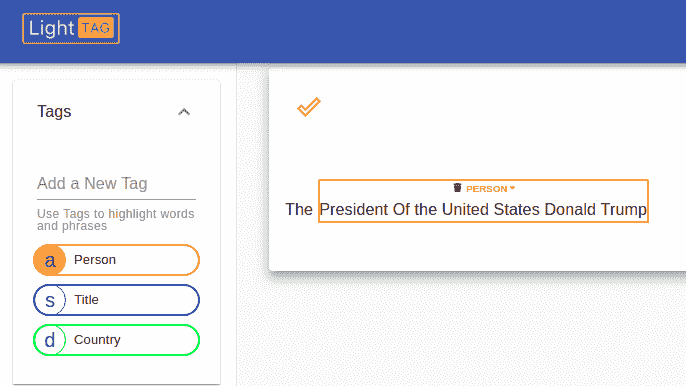
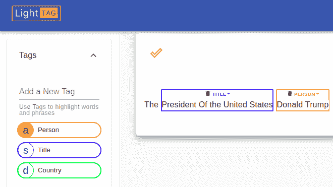
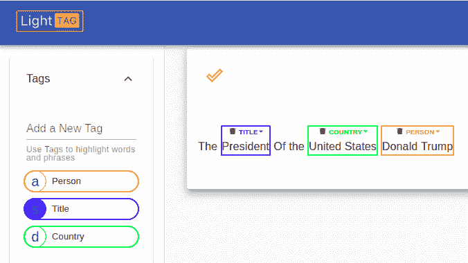
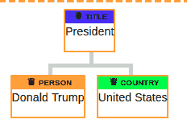
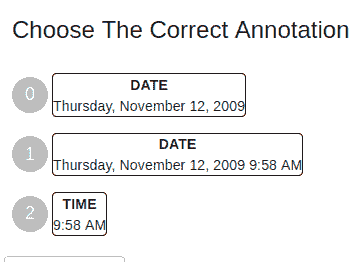
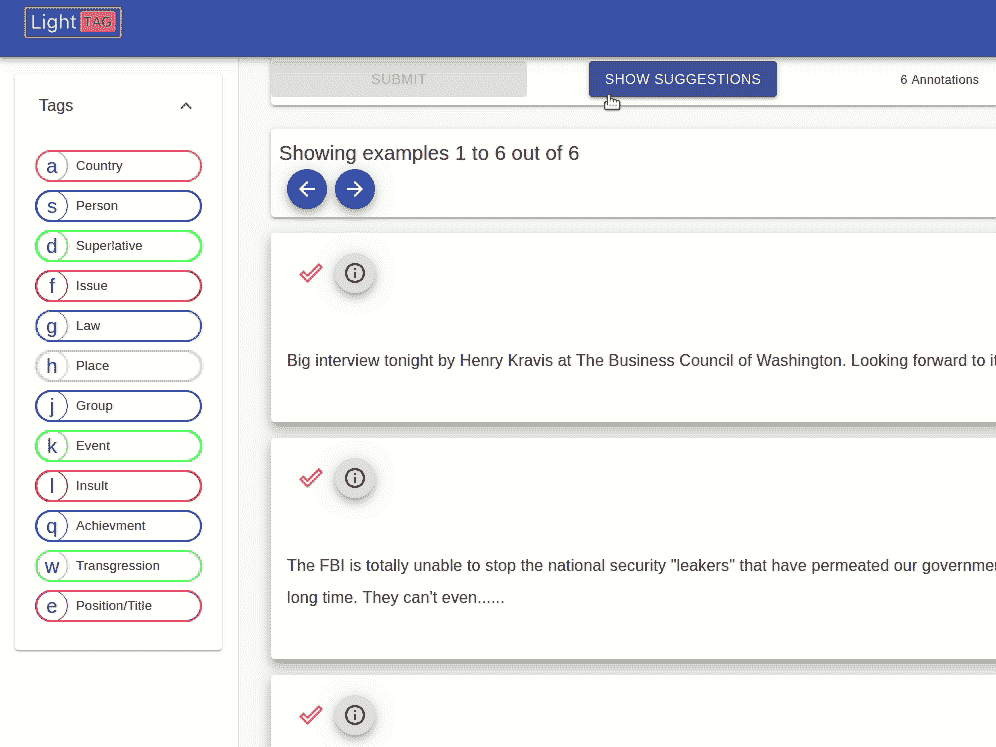
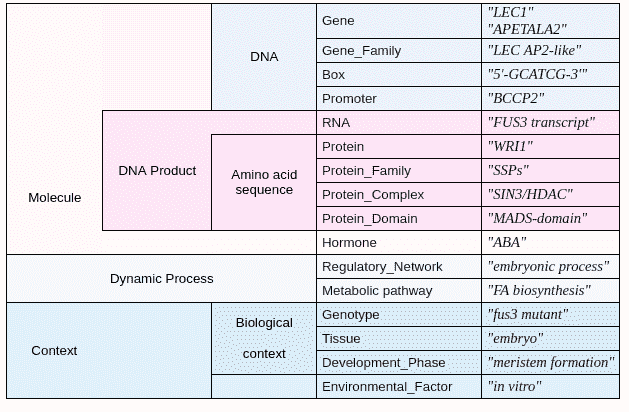

# 标注数据时会犯的四个错误

> 原文：<https://towardsdatascience.com/four-mistakes-you-make-when-labeling-data-7e431c4438a2?source=collection_archive---------9----------------------->

## 可能出错的事情以及如何修复它们的清单

It’s better to anticipate and fix errors before they reach production

为 NLP 标记数据，就像驾驶飞机一样，乍看起来很容易，但可能会以奇怪而奇妙的方式出现微妙的错误。了解什么可能出错以及为什么出错是检测和修复错误的良好开端。

# 为 NLP 标记数据乍看起来很容易，但可能会以奇怪而奇妙的方式出现微妙的错误。了解什么可能出错以及为什么出错是检测和修复错误的良好开端。

在 LightTag，我们制作[文本注释工具](http://www.lighttag.io)，并与我们的客户密切合作，以了解他们的注释工作中发生了什么，以及我们的产品如何帮助他们更快、更高质量地获得标记数据。在这篇文章中，我们将分享 NLP 实体注释中出现的四个常见问题，讨论它们的根本原因和可能的解决方案。

# 空格

White space is hard to see and can cause confusion

注释者意见不一致的最常见原因可能是前后空格和标点符号的标注不一致。也就是说，一个注释者可能会标注“Tal Perry”，而另一个注释者会标注“Tal Perry”或“Tal Perry”或“Tal Perry”。这个问题也出现在尾随标点符号上，例如“Tal Perry”

当测量注释者的一致性或决定一个黄金注释源时，这些冲突会导致较低的一致性分数和黄金集合中的模糊性。这些错误尤其令人沮丧，因为注释在概念上是正确的，人们不会真正注意到或关心这种差异。

事实上，这种微妙是这类错误的根源。通常，您的注释器并不关心您的算法如何计算一致性，也不会注意或关心“Tal Perry”和“Tal Perry”之间的区别，除非被明确告知这样做。

就这一点而言，解决方案很简单，您的[注释工具](http://lighttag.io)应该在注释者捕捉到尾随和前导空格时向他们提供视觉指示，并让他们根据您设置的准则来判断这是否正确。

# 嵌套注释

A nest is great for complex things like life. For NLP you might want something else

另一个常见的分歧来源是“嵌套注释”。例如，短语“美国总统唐纳德·特朗普”可以有多种不同的标注方式。

A Naive annotation of the phrase says a whole thing is a person

A more pedantic approach breaks it down to title and person

The most pedantic annotation separates the title and country

这种错误的原因是根本性的，语言本质上是分层的，而不是线性的，所以像突出显示跨度这样的线性注释并不总是完美的。

Annotating Nested entities in Brat

Annotating a tree relationship in LightTag

从 UX 的角度来看，一个简单的解决方案是让注释者创建嵌套的注释，比如在 [Brat](https://brat.nlplab.org/) 或 [annotate tree structures](http://lighttag.io) 中。虽然这些解决方案从 UX 的角度来看是可行的，但它们需要下游模型能够处理模型输入和输出中的这些复杂的非线性结构。

在我们的客户群中，我们还没有看到结构化注释在语言社区之外被大量采用。这主要是因为使用它们需要额外的模型和工程复杂性。我们通常看到的是注释项目，指导他们的团队以尽可能好的分辨率进行注释，并在稍后阶段应用后处理来捕捉固有的结构

Your annotation tool should show you conflicts among annotators and let you resolve them.

# 中途添加新的实体类型

Always take extra precautions when adding new things together

在注释项目的早期阶段，您经常会发现您需要没有预料到的实体类型。例如，一个比萨饼聊天机器人的标签集可能以标签“大小”、“浇头”和“饮料”开始，然后有人意识到您还需要一个“配菜”标签来捕捉大蒜面包和鸡翅。

简单地添加这些标签并继续处理还没有被标记的文档会给项目带来危险。新标签将从添加新标签之前注释的所有文档中丢失，这意味着您的测试集对于这些标签来说是错误的，并且您的训练数据将不会包含新标签，从而导致模型无法捕获它们。

迂腐的解决方案是重新开始，并确保所有的标签都被捕获。然而，这是非常浪费的，每次你需要一个新标签的时候重新开始是一个不太理想的资源使用。一个很好的折中方法是重新开始，但是使用现有的注释作为显示给注释者的“**预注释**”。例如，LightTag 的[文本注释工具](http://lighttag.io)可以让您做到这一点，向注释者显示预注释，他们可以通过单击一个按钮来接受这些预注释。从那里他们可以专注于添加新的标签。

# 长长的标签列表

Too much choice can be dangerous

增加项目成本和降低数据质量的一个可靠方法是强迫注释器处理非常长的标签列表。众所周知，ImageNet 有 20，000 个不同的类别，如草莓、热气球和狗。在文本中，SeeDev 2019 共享任务定义了“仅”16 种[实体类型](https://sites.google.com/view/seedev2019/task-description)，这里显示了这些类型，但您可以看到它们是如何迅速变得势不可挡的。

The collection of tags for the SeeDev 2019 shared task

在注释过程中，增加注释者需要做出的选择数量会降低他们的速度，并导致数据质量下降。值得注意的是，标注的分布会受到标注 UX 中标签排序方式的影响。这是由于[可用性偏差](https://en.wikipedia.org/wiki/Availability_heuristic)，在这种情况下，我们更容易识别出头脑中最重要的概念(存在于我们的头脑中)。

拥有 20，000 个类别的 Imagenet 是这个问题的一个极端例子，值得一读[关于注释是如何收集的论文](http://vision.stanford.edu/pdf/bbox_submission.pdf)。他们的方法包括将一个注释任务分解成更小的任务，其中每个子任务一个注释者将注释某个类的一个实例(而其他工作人员将有单独的验证任务)。这大大减少了注释者的认知负荷，帮助他们更快地工作，减少错误。

# 结论

数据标注需要大规模、高精度地快速完成，其中任何一个都不能影响另一个。创建质量注释管道的第一步是预测常见问题并解决它们。这篇文章展示了文本注释项目中最常见的四个错误，以及像 LightTag 这样的[文本注释工具如何帮助解决它们。](http://www.lighttag.io)

## 关于作者

Tal Perry 是团队文本注释工具 LightTag 的创始人兼首席执行官。他还是机器学习领域的谷歌开发专家，最重要的是，他是大卫的父亲和玛丽亚的搭档。

Tal and David discussing Labeled Data for NLP