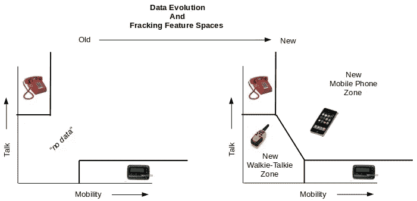
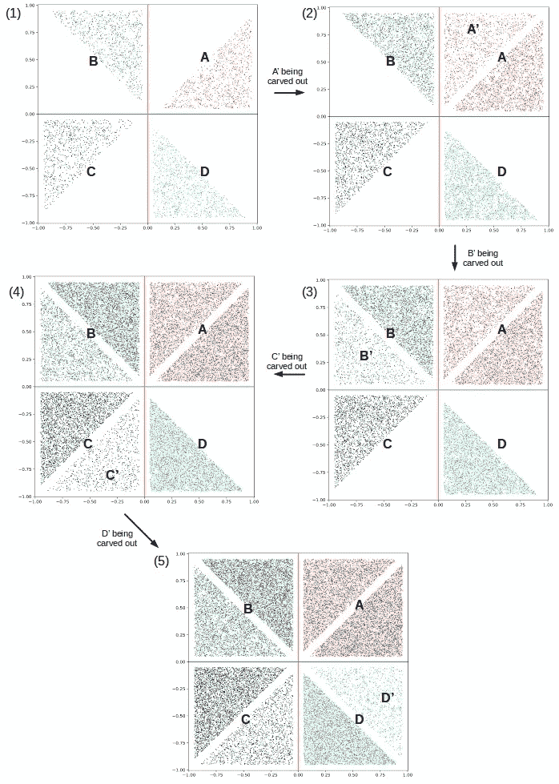

# 机器学习中的水力压裂特征

> 原文：<https://towardsdatascience.com/fracking-features-in-machine-learning-b8247626e582?source=collection_archive---------29----------------------->

特征空间破解新数据引入潜在有用的新类，如果检测到的话。具有低于可接受的分类置信度的新数据点的增长率的突增表明新的数据区正在特征空间中被划分出来……

唯一不变的是变化。数据也不例外。检测数据演变允许我们进一步分析它对未来的决策意味着什么。例如，我们可能会根据症状周围的一些初始数据，将患者分为简单的死亡或不死亡。但是随着死亡的发展，症状及其适当的治疗方案也在发展。经过轻微症状训练以检测死者存在的模型仍然可以检测到具有急性症状的死者。但是我们希望在对这些新数据进行分类的同时也能检测到异常，发出警报并将其标记为可能需要新的类。预先区分急性、中度和轻度病例，并对患者进行分类，在许多层面上都有巨大的好处。

显然，特征的数量没有改变，用于数据分类的基本概念也没有改变。但是输入数据的分布已经改变。新数据在先前没有数据的同一特征空间中划分出区域。这是特征空间细分，或者更滑稽地说，是特征空间的分裂。

在旧数据/类上训练的模型将按照它知道的类存储任何和所有数据——这并不奇怪。但是将新区域标记和识别为潜在的新兴新类别是非常有用的。这实质上是这篇文章的目标。重点是介绍一种方法。为了做到这一点，我们考虑一个具有两个特性和几个类的简单问题。虽然问题是人为的，但视觉效果可以帮助你理解问题的关键。重现结果的代码可以从 [github](https://github.com/ashokc/Fracking-Features-in-Machine-Learning) 获得。

当您在数据中检测到新的类时，该做什么取决于问题。例如，如果我们确实决定一个新的类是有保证的，我们可以标记这个标记的新数据的一部分并重新训练模型

# 1.特征空间分割

在 N 个类上训练的分类器必须将输入数据放入这 N 个类中的任何一个。包括所有旧的和任何新的数据点的整个特征空间已经被分成 N 个区域。但是训练分类器的数据可能没有完全覆盖这些区域。当新数据开始进入这些先前的空白区时，这表明数据正在演变。

Figure 1\. Features have not changed. New data has come in to carve out a distinct zone for itself in the same feature space

例如，一个模型可能已经预先根据诸如“通话”、“移动”等术语的存在/不存在将通信设备分类为*台式电话*或*寻呼机*..但是这个模型将会对*对讲机*和*移动电话*感到非常困惑，因为它们已经声称拥有同一个特征空间的不同部分。根据描述中术语的具体丰富程度，模型可能会将其中一些产品标记为寻呼机，而将其他产品标记为台式电话，这正是分类器经过训练要做的事情。但是它不是最佳的。如果我们有能力检测到新数据到达这些以前的空白区域，我们就可以检查这些数据，并可能为它们定义新的类别。添加移动电话和对讲机作为新的类别，并训练分类器来预测它们，这将是对分类器非常有用的增强。

虽然我们可以在较低的维度中可视化新出现的裂缝和新的数据区，但在较高的维度中这是不实际的。我们需要一个全球性的衡量标准，作为正在进行的新数据分类的一部分。这一全球指标的表现应该为我们寻找新兴的区域/类别提供线索。从分类置信度中得出的一个指标就是我们在这里用来识别特征空间压裂的指标。让我们回顾一下什么是分类置信度。

# 2.分类置信度

大多数分类器本质上是概率性的(有显著的例外，如 SVM，即使有从距离度量导出概率的方法)。也就是说，当要求分类器预测新数据点的类别时，它首先给出该数据点属于任何可用类别的概率列表。然后，它选择概率最高的类。现在考虑下面的论点——大部分是常识。

1.  每个新数据点都被放在一个类中，即分类器计算出的概率最高的类。概率越高，这个数据点分类的置信度就越大。
2.  落在具有大量训练数据的区域中的新数据点将以高置信度被分类。
3.  与上面第 2 点相反。也就是说，落在具有很少或没有训练数据的区域中的新数据点*肯定会被分配一个类别，但是具有较低的置信度*。

下图 2A 用一个玩具 2 特征 2 类问题说明了这一点，该问题使用逻辑回归作为建立在充分分离的数据上的分类器。在线性边界上，点属于任一类的概率为 0.5，即置信度最小。随着我们远离边界并进入包含数据的区域，某个点属于正确类的估计概率会更高，也就是说，置信度会更高。

> 通常，数据点的分类置信度是该数据点可能属于 N 个类别中的任何一个的 N 个概率中的最大值。
> 
> 分类置信度

图 2B 显示了在整个特征空间上计算的该模型的分类置信度。

Figure 2\. (2A) The classifier is trained with the well segregated data on the left, yielding a perfect decision boundary. (2B) Given the classifier in 2A, the classification confidence of points all across the feature space is shown. The classifier has high confidence in the zones with a lot of training data compared to the zones with little or no training data

# 水力压裂指示器

从上面的讨论可以得出，当新数据落在先前未填充的区域中时，那些新数据点的分类置信度会较低。因此，我们选择一个阈值置信水平，并保存由模型预测的分类置信度低于该阈值的新分类数据点的计数。当没有划分出新的区域时，该计数将以其正常的背景速率增加，因为总会有一些名义量的数据进入未被占用的区域。但是当数据发展时，新数据的更高(高于背景)部分开始进入那些先前的空白区域。这将表现为该计数的增长率持续(假设数据继续以这种方式发展)激增——当然，其他条件都相同。

> *粗略地说，我们可以通过寻找低于阈值分类置信度的新数据点数量增长率的突增来识别特征空间压裂*
> 
> 压裂指示器

作为分类任务的一部分，我们计算分类置信度所需的概率已经由分类器提供。因此，在正在进行的分类练习中，低于阈值置信度的数据点的数量及其增长率很容易计算和跟踪。当我们检测到该压裂指标持续激增时，我们可以触发一个任务，以低分类置信度对特定的新数据进行采样，并决定是否为它们创建新的类。我花了一些时间才走到这一步，但这就是方法。我们将用一个例子和代码片段来结束这篇文章

# 3.模拟

考虑下面图 3.1 中所示的四个数据区和类别(A、B、C 和 D)的初始良好隔离布局。我们特意在每个区域/类别中为传入的数据留出足够的空间，以划分出新的区域/类别。下面是给定三个顶点的情况下将数据注入任意三角形区域的代码片段。

多项式逻辑回归分类器是根据图 3.1 中的数据进行训练的。假设这些类是线性且完全可分的，那么它会得到一个完美的 f1 分数。垂直和水平轴/线实际上是获得的决策边界。具有低分类置信度(< 0.75)的点被获得用于跟踪。

Figure 3\. As time passes by the ‘active’ data zones grow from the four A-B-C-D in 3.1 to the eight zones A-B-C-D-A’-B’-C’-D’ in 3.5 in that order

# 3.1 低分类置信度区域

以下代码片段模拟了成批的新数据(当然没有标签),每批数据都向当时的活动数据区添加了初始点数的大约 1%。活动数据区从 A-B-C-D 开始，按以下顺序发展:A-B-C-D-A ' = > A-B-C-D-A '-B ' = > A-B-C-D-A '-B '-C ' = > A-B-C-D-A '-B '-C '-D '。从上面的图 3.2-3.5 可以清楚地看出，随着时间的推移，新的数据区 A '到 D '在特征空间中被划分出来。

我们跟踪低于阈值分类置信度的数据点。图 4 显示了这些数据点的空间分布。正如所料，没有训练数据显示的区域是这些图表中亮起的区域。

Figure 4\. The data points with low classification confidence are right the middle of the zones that offered no training data to the model.

这是一个 2 特征问题，我们可以将特征空间的压裂可视化，如图 4 所示。压裂指标有助于我们在更高的维度上检测同样的问题，因为它是一个全局标量测量。

# 3.2 压裂指示器

从图 4 中可以清楚地看出，当开始划分新的数据区时，点的数量的增加速率必须有一个突增。因为我们在分类练习中记录了这个数字，所以很容易生成下面的图 5。

Figure 5\. A spike in the rate of increase of points with lower than thresold classification confidence occurs when a new data zone starts to be carved out.

# 4.结论

我们的目标是通过全局测量来识别特征空间压裂，该全局测量可用于触发对受影响的新数据的评估，以评估添加新类的潜在有用性。

*   我们将数据点的分类置信度定义为所有概率中的最大值，该数据点可能属于训练的任何类别
*   我们将压裂指标定义为低于某个阈值分类置信度的新数据点数量的增长率
*   借助于一个理想的、人为的问题(恒定的新数据速率、稳定发展的新数据区等),我们证明了压裂指标的突增指向了潜在新类别的增加。

真实数据包括噪声、可变数据速率、不断发展的数据区和正在消亡的数据区。尽管如此，如图 5 所示的仪表板监控图在生产中正在进行的分类练习中还是很有用的。如果不是为了精确定位一个新类有用的确切时间，而是为了检测什么时候应该拆分一个“非上述”桶。

*原载于 2019 年 5 月 6 日*[*【http://xplordat.com*](http://xplordat.com/2019/05/06/fracking-features-in-machine-learning/)*。*