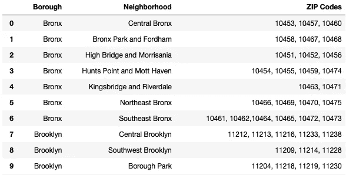
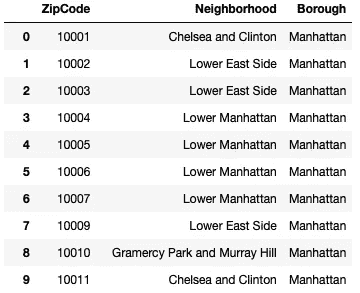
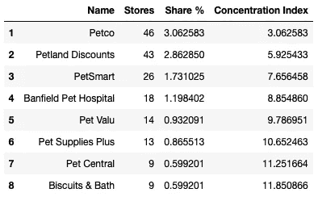
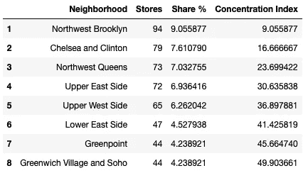
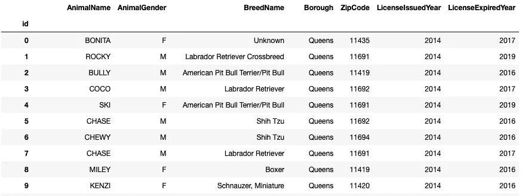
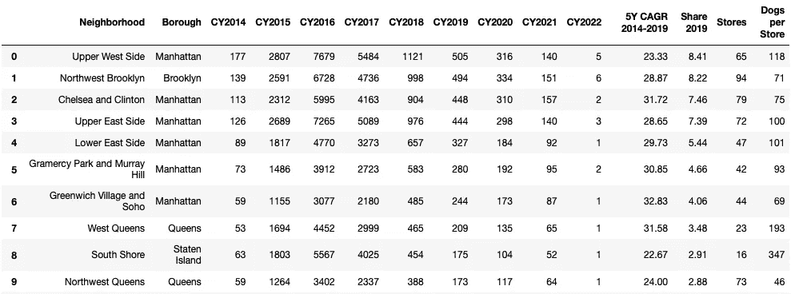

# 用数据帧构建数据

> 原文：<https://towardsdatascience.com/framing-data-with-dataframes-d9b7ce012be5?source=collection_archive---------24----------------------->

## 探索性数据分析

## 将开放数据导入业务框架

The Charging Bull in New York City. Photo: Author

在任何挑战的开始，特别是对于数据科学家经常面临的复杂和模糊的挑战，构建一个思考过程来解决基本问题是最初的任务之一。许多行业雇佣拥有特定领域知识的主题专家，他们不断开发、教授和增强独特的思维范式。

功能性组织结构将具有特定技能的员工划分到不同的部门，如人力资源、销售、营销、财务和工程等。这可能会产生筒仓效应，产生有用的信息，但不一定共享。作为回应，公司组建跨职能团队，以促进整个组织的共享和学习。

这些团队可以提高公司的整体效率，因为他们加强了公司相互依赖的内部网络。例如，可以通过整合(比如)数据科学家推断的信息和见解来改善战略决策。因此，让我们来看看如何将快速增长的数据导入企业领导者熟悉的直观框架中。

# 探索性数据分析

商业战略家和顾问经常通过进行形势分析来探索一个行业，形势分析考虑了 5C(背景、消费者、公司、竞争和合作)。增长份额矩阵，通常称为 BCG 矩阵，是由波士顿咨询集团在 1970 年推出的，是一个流行的可视化市场分析的商业框架。

波士顿矩阵根据成分增长率和市场份额评估市场，创建了四个象限，分别称为狗、问号、星星和现金牛。多元化公司在成熟、高份额的市场中拥有业务线，这些市场会产生超额现金流，也在具有高增长机会的细分市场中拥有业务线，这些细分市场通常需要大量现金投资。

**Dogs** 指的是低增长、低份额的市场，通常难以实现收支平衡。分析师的传统智慧是*清算这个领域的*业务。

**问号**是高增长、低份额的市场，既有潜力又有风险。新企业通过*选择和剥离*战略瞄准这一领域。

**星号**是问号，已被广泛用于成为市场领导者。由于激烈的竞争，持续的增长推动公司投资。

**摇钱树**是成熟的市场，在这里，根深蒂固的参与者可以用最少的投资维持他们的地位，让他们能够*榨取*可靠的现金流。

让我们用一个真实的例子来看看我们如何将波士顿矩阵中的概念应用到一个特定的行业。此外，我们可以获取免费的开放数据，并以有意义的方式组织信息来填充图表。最后，我们可以在一个交互式的、基于云的可视化环境中呈现我们的市场分析，可以通过查询来访问分层信息。

# 宠物护理行业

从蟒蛇到蟒蛇再到熊猫，数据科学家对动物有很强的亲和力。Robbrecht van Amerongen 编制了一份编程语言动物园中最受欢迎的清单。作为启发，我们可以通过搜索快速增长和备受喜爱的宠物护理行业的可用开放数据源来生成 BCG 矩阵(注意:市场研究的成本高达$9,450⁴).

美国宠物用品协会(APPA)预计，2019 年宠物护理行业将超过 750 亿美元，比上年增长 3.9%。⁵消费者支出类别主要是宠物食品(320 亿美元)、兽医护理(190 亿美元)和用品及非处方药(160 亿美元)。现在，让我们在网上搜索信息来源，以发展我们自己的市场分析。

# 纽约街区

我们可以在 Kaggle 上搜索数据集，但只会找到七个关于*宠物*的结果，尽管有无数的*猫*和*狗图像*库。⁶最权威和完整的数据集是纽约市狗许可数据集，它跟踪 15 列和 122k 记录，作为纽约市开放数据倡议的一部分。⁷

该数据集包括纽约有执照的狗的区和邮政编码信息，这提供了按位置旋转数据的可能性，但区似乎太粗糙，邮政编码似乎太精细。因此，让我们参考纽约州卫生部对纽约市社区的邮政编码定义，它将纽约市细分为 42 个可管理的社区。⁸

First 10 neighborhoods in New York, mixed format (wide and long). Image: Author

最初的 Pandas 数据帧被安排在一个多层次的索引中，除了邮政编码，它被打包成一个宽格式。不过，该表的目标是将 NYC Dog Licensing 数据集中的每个记录的邮政编码映射到其各自的邻域。因此，第一项任务是将表重新调整为长格式，以便于处理，可以通过邮政编码进行索引。

First 10 neighborhoods in New York, long format. Image: Author

# 竞争对手集中度

除了代表纽约消费市场的特许狗数据，我们还可以收集有关商业竞争的信息。Yelp Fusion API 拥有纽约各种商业的综合数据库。⁹通过搜索*宠物店*和*宠物服务*，我们可以收集到 1502 家在 2019 年积极迎合宠物护理行业的独特商家。

First 10 New York pet stores and pet services actively operating in 2019\. Image: Author

市场集中度是衡量行业竞争力的一个基本指标，市场可以介于完全竞争和垄断竞争之间。没有每个商店的收入或客户流量数据，我们不得不做出一个很大且不切实际的假设，即每个商店都是等效的。话虽如此，我们可以用每家连锁店的数量来代表总市场份额。

集中度汇总了该行业顶尖公司的总市场份额。以⁰为例，我们四大公司的 CR4 仅占 8.9%，而 CR8 占 11.9%，这表明市场高度分散。或者，美国司法部在反垄断案件中使用的赫芬达尔-赫希曼指数在 0(完全竞争)和 10，000(垄断)的范围内是 31。

Concentration Ratios for the top 8 firms in the New York pet care industry. Image: Author

类似地，我们可以将竞争对手的数据按邻居分组，并测量地理集中度或密度。我们测量 CR4 为 30.6%，CR8 为 49.9%，这意味着一半的宠物店和服务位于八个社区。所有邻域份额的平方和为 448 的邻域 HHI 仍然被认为是不集中的。

Concentration Ratios for the top 8 neighborhoods in the New York pet care industry. Image: Author

# 市场尺寸

纽约市开放数据方便地让我们下载整个纽约市狗许可数据集作为一个 CSV 文件，我们可以导入到熊猫数据框架。我们注意到它有许可证颁发的年份和许可证到期的年份，这使我们能够统计在给定的年份中有多少有效的许可证狗。这个指标与数字营销中的月活跃用户(MAU)非常相似。

First 10 of 121,713 New York licensed dogs from 2014–2022\. Image: Author

现在，我们已经收集了我们的邻居、宠物企业和特许狗数据集，我们可以将它们插入到 SQL 数据库中，并通过一些强大的查询将它们连接到单个数据框架中。通过只选择每个日历年中有效的狗许可证，我们可以计算每个街区从 2014 年到 2019 年的 5 年复合年增长率(CAGR) ⁴。

Market share and growth rate (2014–2019) of pet care industry for first 10 neighborhoods in New York. Image: Author

现在，我们已经计算了纽约每个街区的许可狗的市场份额和增长率，我们可以在 Plotly 等数据可视化引擎中以 BCG 矩阵的形式呈现我们的分析。⁵我们可以通过将数据点划分为每个社区的宠物商店的数量，并用每个商店的特许狗的数量来给这些数据点添加阴影，从而增加图表的丰富性。

纽约许可养狗的增长份额矩阵展示了一种引人注目的邻里模式，它遵循着一条从最初的狗，发展到问号，成为明星，成熟为摇钱树的轨迹。我们可以很容易地看到，四个社区享有很高的市场份额，其中两个提供了机会，因为它们没有得到宠物企业的充分服务。

Growth-Share Matrix of licensed dogs in New York. Source: Author¹⁶

为该分析编写的源代码可在 github 上获得，其中包括从 Yelp 和 NYC Open Data 收集数据集，用 Python、Pandas 和 SQL 处理数据，并在 Plotly 中呈现 BCG 矩阵。整个 Plotly 代码很短，可以由 Plotly 自动上传和托管，Plotly 为修改和可嵌入的链接提供了一个仪表板。

Visualizing the BCG Growth-Share Matrix with Plotly. Source: Author¹⁸

# 小心缝隙

宠物企业的市场份额只能通过给定社区内企业或公司拥有的实体店数量来计算，这可以通过收入或客流量数据来提高。

纽约市经济发展公司估计，纽约只有 20%的狗获得许可，因此需要注意的是，纽约市许可的狗数据集只是整个狗种群的样本。

狗数据集于 2014 年开始跟踪数据，因此在随后的几年里，注册量出现了明显的峰值。注册数量的增长不应与实际养狗数量的增长相混淆。

狗的数据集最后一次更新是在 2017 年，所以最近颁发的许可证没有被捕获，而正在进行的到期将在 2022 年前使狗的数量减少。这种数据上的差距会影响 CAGR 比率，取决于所考虑的年份。

鉴于任何数据集的局限性，我们现在应该有信心收集开放的数据源，进行市场分析并可视化 BCG 矩阵，以便我们的数据可以轻松地与企业领导者相关联。

# 参考

1.  T.J. Steenburgh 和 J. Avery，“营销分析工具包:形势分析”，哈佛商学院背景说明 510–079，2010 年。
2.  A.Ovans，“改变世界的图表”，*《哈佛商业评论》*，2011 年。
3.  R.van Amerongen，“欢迎来到受动物王国启发的编程语言动物园”， *AMIS，数据驱动博客*，2018 年 1 月 14 日。
4.  “2018-2025 年按宠物类型(狗、猫、鱼、鸟)、产品、竞争格局和细分市场预测的宠物护理市场规模、份额和趋势分析报告”，*大观研究*，2018 年。
5.  J.巴克斯特，“美国人在宠物上的支出比以往任何时候都多:720 亿美元，”美国宠物产品协会，2019 年 3 月 21 日。
6.  卡格尔，[https://www.kaggle.com](https://www.kaggle.com)，2019。
7.  心理健康和卫生部，“纽约市狗许可数据集”，载于纽约市 OpenData，[https://data . cityofnewyork . us/Health/NYC-Dog-Licensing-Dataset/nu7n-tubp](https://data.cityofnewyork.us/Health/NYC-Dog-Licensing-Dataset/nu7n-tubp)，2019 年 7 月 25 日更新。
8.  “纽约市街区的邮政编码定义”，纽约州卫生部，[https://www . Health . ny . gov/statistics/cancer/registry/appendix/Neighborhoods . htm](https://www.health.ny.gov/statistics/cancer/registry/appendix/neighborhoods.htm)，2006 年更新。
9.  Yelp Fusion，【https://www.yelp.com/fusion】T2，2019。
10.  Y.谭，“中国银行业效率与竞争的测度”，载《中国银行业的效率与竞争》，昌多斯出版社，2016 年。
11.  C.R. Laine，“Herfindahl-Hirschman 指数:从消费者角度看集中程度”，*《反托拉斯公报*，1995 年 6 月 1 日。
12.  “赫芬达尔-赫希曼指数”，美国司法部，[https://www.justice.gov/atr/herfindahl-hirschman-index](https://www.justice.gov/atr/herfindahl-hirschman-index)，2018 年 7 月 31 日更新。
13.  米（meter 的缩写））Knoop，“应用洞察:MAU 究竟是如何计算的？“*《广告周刊*》，2009 年 1 月 12 日。
14.  J.Fernando，“复合年增长率— CAGR”， *Investopedia* ，2020 年 11 月 13 日更新。
15.  剧情，[https://plotly.com](https://plotly.com)，2019。
16.  A.C. Dick，“纽约各街区许可养狗的增长份额矩阵”，载于 Plotly，[https://chart-studio . plot ly . com/~ Adam . c . Dick/2/Growth-Share-Matrix-of-Licensed-Dogs-in-New York-by-Neighborhood](https://chart-studio.plotly.com/~adam.c.dick/2/growth-share-matrix-of-licensed-dogs-in-new-york-by-neighborhood)，2019。
17.  A.C. Dick，“用 DataFrames 构建数据”，载于 GitHub，[https://github.com/acdick/framing_data_with_dataframes](https://github.com/acdick/framing_data_with_dataframes)，2019 年。
18.  A.C. Dick，《在 Plotly 中可视化 BCG 矩阵》，载于 GitHub，[https://gist . GitHub . com/AC Dick/52 eef 3c 723 a 2361 a 187 e 78 ff 808 EB 14](https://gist.github.com/acdick/52eef3cc723a2361a187e78ff808eb14)，2019。