# 利用成本敏感的机器学习进行欺诈检测

> 原文：<https://towardsdatascience.com/fraud-detection-with-cost-sensitive-machine-learning-24b8760d35d9?source=collection_archive---------1----------------------->

## 依赖于实例的成本敏感分类算法的概念


在传统的两类分类问题中，我们的目标是最小化错误分类，并使用准确性、F-score 或 AUC-ROC 曲线等指标来衡量模型性能。然而，在某些问题上，为了降低总成本，允许更多的错误分类是最好的。如果与错误分类相关的成本因样本而异，我们应该应用依赖于示例的成本敏感学习方法。但是让我们从头开始…

在本文中，我将通过在信用卡欺诈数据集上训练和测试各种模型来解释示例依赖成本敏感机器学习的概念。请注意，我选择这个任务的模型是为了说明这个概念，而不是为了获得最佳的预测结果。本文提供了部分代码，完整的代码可以在我的 GitHub 上找到。

# 什么是成本敏感学习？

传统的分类模型假设所有的误分类错误具有相同的成本，而成本敏感模型考虑了因分类类型和样本而异的成本。

让我们来看看信用卡交易的案例。未经真实持有人授权的交易被认为是欺诈性的(通常占所有交易的很小一部分)。信用卡欺诈检测系统应该自动识别和阻止这种欺诈交易，同时避免阻止合法交易。

每种分类的相关成本是多少？让我们假设下面的场景。如果系统没有识别出欺诈性交易，钱就会丢失，持卡人需要得到全部交易金额的补偿。如果系统将交易标记为欺诈，则交易会被阻止。在这种情况下，会产生管理成本，因为需要联系持卡人并更换卡(如果交易被正确标记为欺诈)或重新激活卡(如果交易实际上是合法的)。让我们也做一个简化的假设，即管理成本总是相同的。如果系统正确地将交易标记为合法，则交易会被自动批准，并且不会产生任何费用。这导致了与每个预测场景相关的以下成本:

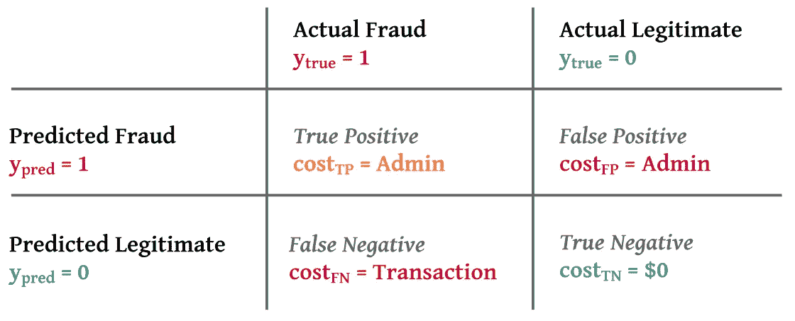

请注意，“正”是预测为欺诈的交易，“负”是预测为合法的交易。“真”和“假”分别指正确和不正确的预测。

因为交易成本取决于样本，假阴性的成本可以低到可以忽略不计(例如，对于 0.10 美元的交易)，在这种情况下，阳性预测的管理成本将超过补偿成本，或者非常高(例如，对于 10，000 美元的交易)。

> 成本敏感学习背后的思想是将这些依赖于示例的成本考虑在内，并做出旨在最小化总成本而不是最小化错误分类的预测。

# 成本敏感型培训与成本依赖型分类

让我们考虑两种不同的方法。第一个是用损失函数训练模型，该损失函数最小化实际成本($)而不是误分类错误。在这种情况下，我们需要为损失函数提供与四种情况(假阳性、假阴性、真阳性和真阴性)中的每一种相关联的成本，以便模型可以学习相应地做出最佳预测。

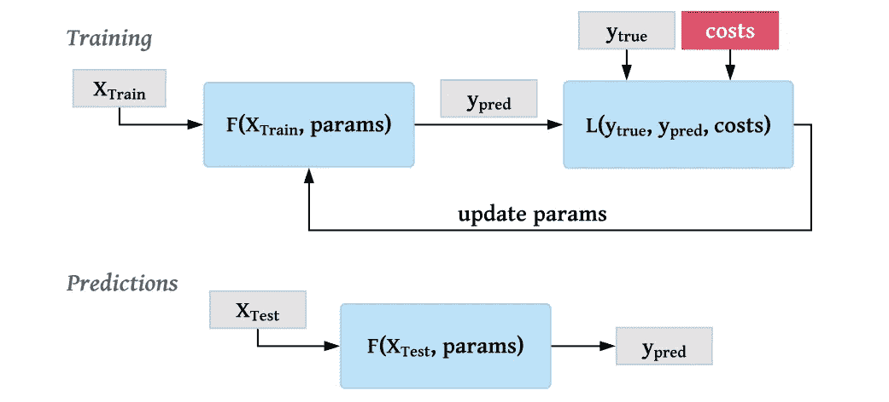

第二种方法是训练常规模型，但是在根据最低预期成本进行预测时对每个样本进行分类。在这种情况下，不需要训练集的成本。然而，这种方法只适用于预测概率的模型，然后可以使用概率来计算预期成本。

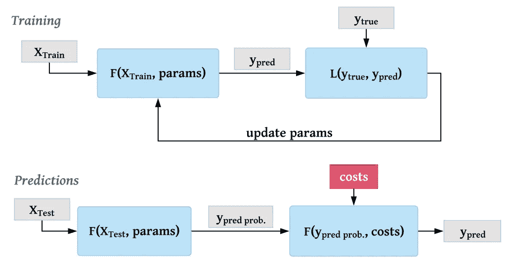

> 在下文中，我将使用成本敏感损失函数的模型称为**“成本敏感模型”**，将在进行预测时使预期成本最小化的模型称为**“成本分类模型”**

# 实施和评估模型

在这个案例研究中，我使用了一个信用卡欺诈数据集(可在 [Kaggle](https://www.kaggle.com/sion1116/credit-card-fraud-detection/data) 上获得)，有 284，000 个样本和 30 个特征。目标变量指示交易是合法的(0)还是欺诈的(1)。数据高度不平衡，只有 0.17%的欺诈交易。我对以下五个模型进行了训练和评估。

1.  **常规** **逻辑回归**(来自 scikit-learn)
2.  **常规人工神经网络**(内置于 Keras)
3.  **成本敏感人工神经网络** (Keras)
4.  **成本分类逻辑回归**
5.  **成本分类人工神经网络**

在实践中，人工神经网络(“ann”)可能不是欺诈检测的首选。基于树的模型，例如随机森林和梯度推进机器，具有可解释性的优势，并且通常执行得更好。为了说明的目的，我使用了人工神经网络，因为成本敏感损失函数的实现相对简单。此外，正如我将要展示的，一个简单的人工神经网络可以产生非常好的结果。

为了评估结果，我使用了两个不同的指标。第一个是传统的 F1-score，它衡量精度和召回率，但不考虑错误分类的示例依赖成本。


为了评估模型在成本方面的表现，我首先根据模型是预测假阳性、假阴性、真阳性还是真阴性，以及与每个案例相关的成本，来计算由预测产生的所有成本的总和。

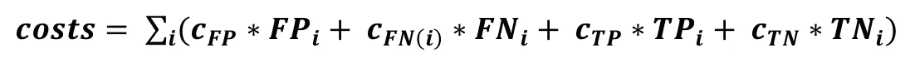

然后，我计算了在所有情况都被预测为负的情况下会发生的总成本(“cost_max”)，并将成本节约定义为实际预测减少成本的部分。


为了评估模型，我使用了五重交叉验证，并将数据分成五个不同的训练集(80%)和测试集(20%)。下一节给出的结果指的是五个测试集的平均结果。

## 逻辑回归

因为基本模型服务于 scikit-learn 库中的常规逻辑回归模型。下图显示了预测概率和交易金额之间的分布。如果没有对成本敏感的分类，欺诈概率和交易金额之间就没有明显的关联。

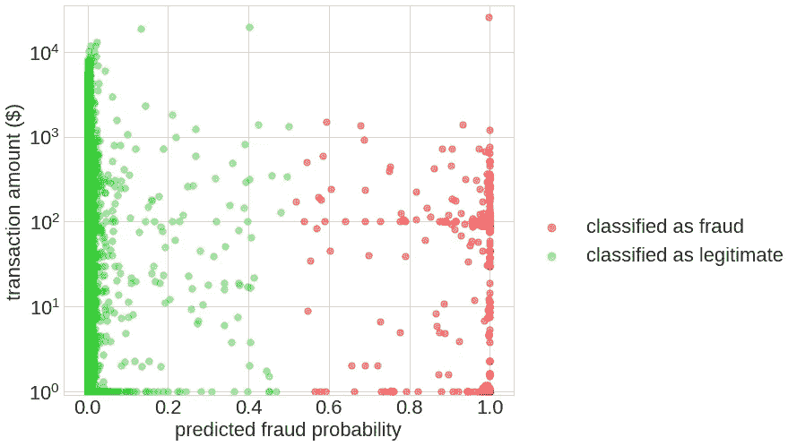

逻辑回归表现相当好，平均测试集 F1 得分为 0.73，成本节约为 0.48。


## 人工神经网络

接下来，我在 Keras 中构建了一个 ANN，它具有三个完全连接的层(50、25 和 15 个神经元)和两个脱离层。我运行了两个时期的模型，并使用了 50 的批量大小。使用 Keras 的顺序模型 API，Python 中的实现如下所示:

```
from keras.models import Sequential
from keras.layers import Dense, Dropoutdef ann(indput_dim, dropout=0.2):
    model = Sequential([
    Dense(units=50, input_dim=indput_dim, activation='relu'),
    Dropout(dropout),
    Dense(units=25, activation='relu'),
    Dropout(dropout),
    Dense(15, activation='relu'),
    Dense(1, activation='sigmoid')])
    return modelclf = ann(indput_dim=X_train.shape[1], dropout=0.2)
clf.compile(optimizer='adam', loss='binary_crossentropy')
clf.fit(X_train, y_train, batch_size=50, epochs=2, verbose=1)
clf.predict(X_test, verbose=1)
```

下面是用人工神经网络预测的欺诈概率的分布。类似于逻辑回归模型，欺诈概率和交易金额之间没有明显的关系。

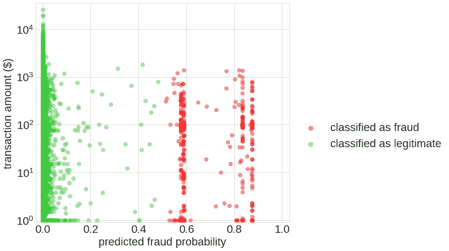

在 F1 分数和成本节约方面，人工神经网络优于逻辑回归模型。

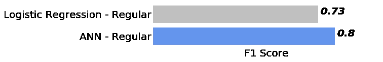

## 成本敏感人工神经网络

现在事情变得更有趣了。成本敏感型人工神经网络与常规人工神经网络相同，不同之处在于成本敏感型损失函数。之前的两个模型都使用对数损失(“二元交叉熵”)作为损失函数:

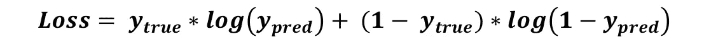

这个损失函数同等地惩罚假阴性和假阳性。现在让我们来看看一个对成本敏感的损失函数。在这里，所有四种可能的结果(假阳性、假阴性、真阳性和真阴性)都被考虑，并且每种结果都带有特定的成本。成本敏感损失函数如下所示:

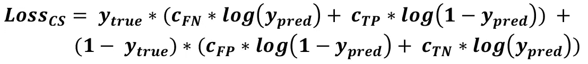

请记住第一部分，真阳性和假阳性被认为是同样昂贵的(阻止事务的固定管理成本)。真否定的成本是 0 美元(无行动)，假否定的成本是交易金额(假设我们必须偿还整个交易)。注意，在这四个成本中，只有假阴性的成本是依赖于实例的。这具有这样的效果，随着交易金额的增加，相对于正面预测的管理成本，对未识别的欺诈交易的惩罚增加。因此，损失函数应该训练一个模型，当交易金额较高时，该模型更有可能拒绝可疑交易。交易金额从 0 美元到 25，691 美元不等，平均值为 88 美元，我假设固定管理成本为 3 美元。

在 Python 中，我们相应地定义了假阳性、假阴性、真阳性和真阴性的代价。因为假阴性的代价是依赖于实例的，所以它们用长度等于样本数的向量来表示。

```
cost_FP = 3
cost_FN = data['Amount']
cost_TP = 3
cost_TN = 0
```

在 Keras 中实现一个示例依赖损失函数很棘手，因为 Keras 不允许将除 y_true 和 y_pred 之外的参数传递给损失函数。通过将损失函数包装到另一个函数中，可以将常量变量传递给损失函数。然而，假阴性的代价取决于实例。因此，我使用了一个技巧，将假阴性的成本作为逗号后的数字添加到 y_true，并在自定义损失函数中提取它们，同时将 y_true 舍入到原始整数值。Keras 中转换 y_true 的函数和自定义损失函数的实现如下所示:

```
import keras.backend as Kdef create_y_input(y_train, c_FN):
    y_str = pd.Series(y_train).reset_index(drop=True).\
            apply(lambda x: str(int(x)))
    c_FN_str = pd.Series(c_FN).reset_index(drop=True).\
            apply(lambda x: '0'*(5-len(str(int(x)))) + str(int(x))
    return y_str + '.' + c_FN_strdef custom_loss(c_FP, c_TP, c_TN):
    def loss_function(y_input, y_pred):
        y_true = K.round(y_input)
        c_FN = (y_input - y_true) * 1e5
        cost = y_true * K.log(y_pred) * c_FN + 
               y_true * K.log(1 - y_pred) * c_TP) +
               (1 - y_true) * K.log(1 - y_pred) * c_FP +
               (1 - y_true) * K.log(y_pred) * c_TN)
        return - K.mean(cost, axis=-1)
    return loss_function
```

然后，我调用定义的函数来创建 y_input 向量，训练对成本敏感的人工神经网络并进行预测:

```
y_input = create_y_input(y_train, cost_FN_train).apply(float)
clf = ann(indput_dim=X_train.shape[1], dropout=0.2)
clf.compile(optimizer='adam', loss=custom_loss(cost_FP, cost_TP,
            cost_TN))
clf.fit(X_train, y_input, batch_size=50, epochs=2, verbose=1)
clf.predict(X_test, verbose=1)
```

在下面的分布图中，我们可以看到成本敏感学习的效果。随着交易金额的增加，预测的总体分布向右扩展(欺诈概率更高)。请注意，在这种情况下，由于问题的性质和损失函数的定义，“预测的欺诈概率”意味着“我们应该将交易识别为欺诈吗？”而不是“交易是否欺诈”。

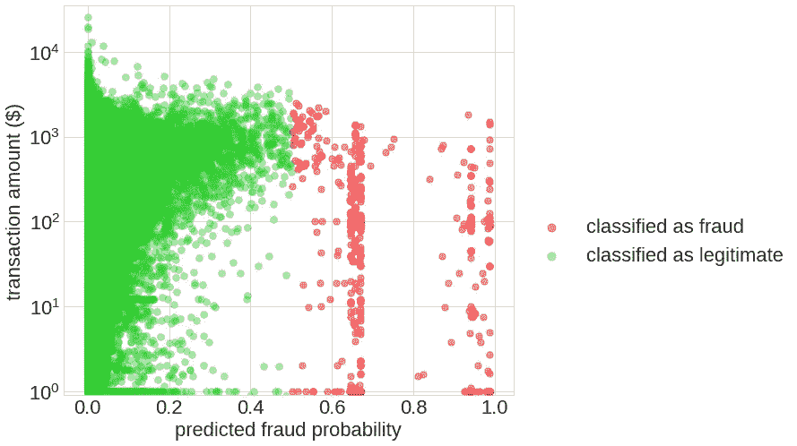

评估显示了成本敏感学习的预期效果。成本节约增加了 5 %, F1 分数下降了相似的幅度。成本敏感分类的结果是更多的误分类，而总误分类成本较低。

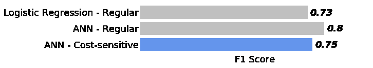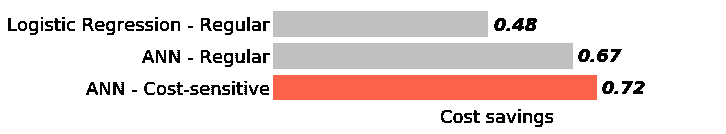

## 成本分类模型

与使用定制损失函数训练的成本敏感模型相反，成本分类模型基于预测概率计算预期成本。预测合法交易和欺诈交易的预期成本计算如下:

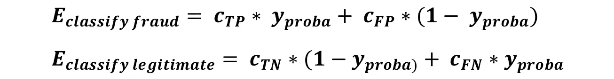

然后，分类器选择预计会导致较低成本的预测。

因此，我使用了常规逻辑回归和人工神经网络的概率预测结果，并根据预期成本对预测进行了重新分类。下图以逻辑回归模型为例，展示了成本相关分类的效果。请注意，预测概率的分布与常规逻辑回归模型产生的分布没有变化。然而，通过成本相关分类，随着交易金额的增加，该模型倾向于将欺诈概率小的交易识别为欺诈。在图的右侧，我们看到即使欺诈概率接近 1，金额非常小的交易也被预测为合法。这是由于假设真阳性携带 3 美元的管理成本。

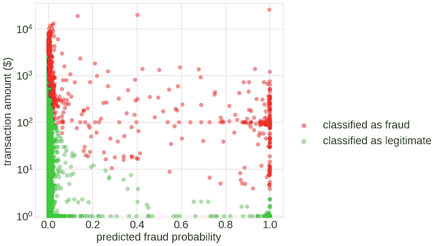

根据预期成本对预测进行分类会在成本节约方面产生更好的结果(在 F1 分数方面会产生明显更差的结果)。虽然对人工神经网络实施成本敏感损失函数可降低 5%的成本，但成本分类人工神经网络可降低 10%的成本。

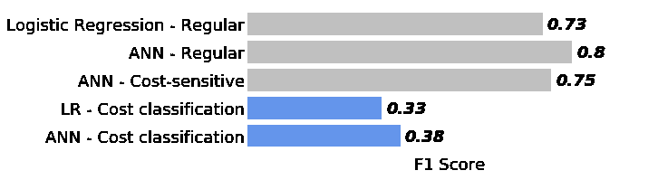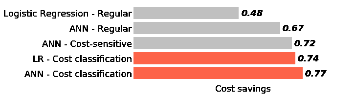

# 结论

本文阐述了两种根本不同的方法，例如基于成本敏感分类的信用卡欺诈预测。成本敏感训练模型需要自定义损失函数，而成本分类模型只需要每个类别的概率和与每个结果相关联的成本来对交易进行分类。在我的示例案例中，成本分类模型以大量的错误分类为代价实现了稍微好一点的成本节约。此外，成本分类模型更容易实现，因为它不需要用于训练的定制损失函数。然而，成本分类方法仅适用于预测概率的模型，而逻辑回归和人工神经网络可以方便地预测概率。然而，更广泛用于欺诈检测的基于树的模型通常将预测直接分成类别，使得成本分类方法不可行。基于树的模型的成本敏感方法虽然在概念上类似于本文中介绍的方法，但在实现上更加复杂。如果你对这个话题感兴趣，我建议你看看下面提到的文章。

感谢阅读这篇文章。请随时通过下面的评论区发表评论或提出问题，或者通过 [LinkedIn](https://www.linkedin.com/in/roman807/) 与我联系。

为这个插图创建的代码可以在我的 [GitHub](https://github.com/roman807/Fraud-Detection) 上访问

信用卡欺诈数据集可在 [Kaggle](https://www.kaggle.com/sion1116/credit-card-fraud-detection/data) 上获得

如果你有兴趣学习更多关于基于树的模型的成本敏感学习，我推荐[这篇来自 A. C. Bahnsen，D. Aouada 和 B. Ottersten 的论文](https://arxiv.org/pdf/1505.04637.pdf)以及 [costcla GitHub 库](https://github.com/albahnsen/CostSensitiveClassification)