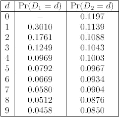
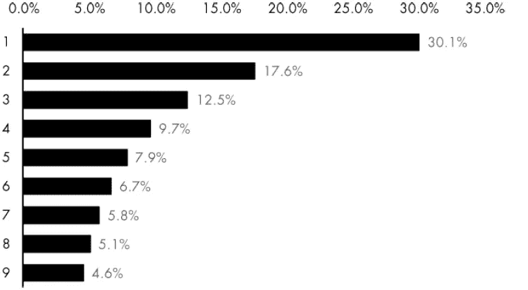
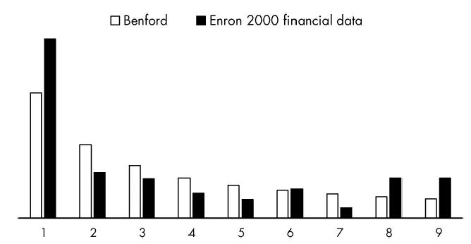
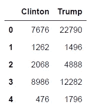
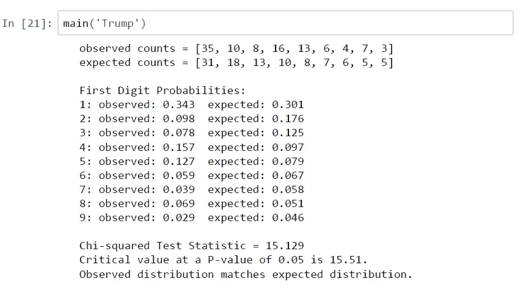
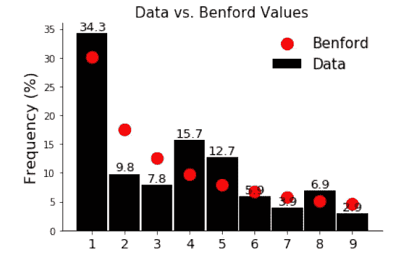
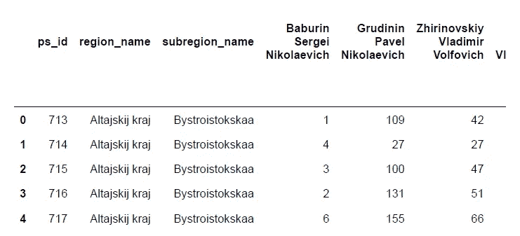
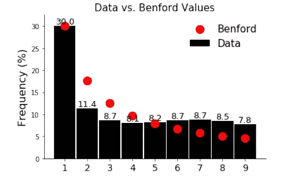
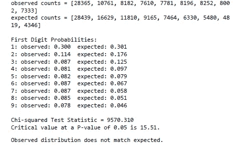

# 使用本福德定律(Python 代码)进行欺诈检测

> 原文：<https://towardsdatascience.com/frawd-detection-using-benfords-law-python-code-9db8db474cf8?source=collection_archive---------4----------------------->


# **本福德定律的发现**

你有没有注意到一个给定的数字有多少机会以数字 1 开头？数字 1 成为前导数字的概率和 9 一样吗？让你知道一个数字的前导数字代表它的非零最左边的数字。例如，在 29 和 0.037 中，它们分别是 2 和 3。嗯，上一个问题的答案是否定的……根据**本福特定律**，也称为第一位数字定律，自然发生的数字分布中前导数字的出现频率是可预测的，不均匀的，但更接近幂律分布。事实上，一个给定的数字以 1 开头的可能性是以 9 开头的 6 倍！这是非常不合逻辑的，因为大多数人会期望均匀分布 U(1，9)，其中所有数字在第一个槽中出现的可能性相同，因此他们期望概率为 1/9，即约 11.1%。让我们考虑 Pr(D1=d)是一个给定数字有第一个数字 d 和 Pr(D2=d)有前两个数字的概率，下表提供了 1881 年纽康观察到的所有十进制数字 probs。



Probabilities of leading numbers



The frequency of occurrence of leading digits according to Benford’s law

纽康注意到*最前面的页面，用于从最低数字开始的数字，比后面的页面更磨损，这就是为什么前导数字更有可能是小的而不是大的。*然后，在 1938 年，物理学家弗兰克·本福特通过收集超过 20，000 个真实世界数字的样本，重新发现了纽科姆定理，使用的数据来源包括河流、街道地址、读者文摘杂志中包含的数字、分子量、棒球统计数据、死亡率等等。因为他普及了这项科学发现，他得到了所有的荣誉。根据他的 Benford 的说法，在这些看似完全不同的数据集中出现了一种轶事模式，这些数据集中的前导数字 d 遵循对数衰减分布:

**Pr(D1=d) = log10(1 + 1/d)**

而不是像人们可能天真地猜测的那样均匀分布。

# **应用**


**建模:**本福德定律最广为人知的一个主要应用领域是直觉**建模**。它基于以下非常简单的想法:

```
***If a certain set of values follows Benford's Law then model's for the corresponding predicted values should also follow Benford's Law.***
```

它可用于人口增长、金融指数和任何本福特数据集的模型中。

**欺诈检测:**这是与数据挖掘、专家系统和神经网络等领域相关的最流行的应用程序。它来自于这样的观察:

```
***Manipulated or fraudulent data do not trend to confirm to Benford's Law, whereas unmanipulated data do.***
```

根据上面的陈述，本福德定律可以被宣布为一个重要的规则，以便在已经计算了分类值的字段(如医疗测试结果、所得税收入或客户退款)中调查数据集的欺诈模式。该标准还可以检测非虚假相关应用程序中受大量低价值交易、数据收集和缺失数据问题、缩减值和偏差影响的缺陷。

**应用本福特定律**

本文的下一个重点是本福特的法律批判角色。这些科目是与自然存在的数字相协调的财务和会计数据。如果我们假设某人拥有价值 1000 美元的股票共同基金。他的基金要达到 2，000 美元的收益率，就必须增长 100%才能翻倍。除此之外，要从 2，000 元进一步增加到 3，000 元，只需增加 50%。正如我们之前提到的第一个数字是 4，它需要再增长 33%。正如本福特定律预测的那样，为了让第一位数字 1 变成 2，需要比 3 变成 4 有更多的增长，以此类推。事实上，本福特分布是一个“*分布*”，金融项目有一种安慰的倾向。

安然公司:这是本福特定律的一个重要例证，它揭露了大企业在财务数据上的偏差。这个例子来自安然公司，它对会计欺诈进行了规范，如下图所示。2001 年安然的灾难是当时历史上最大的灾难，其结果导致许多首席执行官入狱。



Frequency of first digits from Enron’s financial data vs certain frequency based on Benford’s law (after the Wall Street Journal)

在这篇文章中，我选择了最近选举中公开的两个特定数据集。第一个是【2016 年美国总统选举第二个来自【2018 年俄罗斯总统选举。

对于我的第一个项目，我从[不切实际的 Python 项目](https://www.amazon.com/Impractical-Python-Projects-Programming-Activities-ebook/dp/B077WZ43P2)中获取数据。我只考虑了唐纳德·特朗普和希拉里·克林顿的选票，这是伊利诺伊州 102 个县的选票。曝光的谣言声称有 500 多万人非法投票。伊利诺伊州选举官员证实，黑客访问了数千份记录，但据称他们没有损害任何数据。第二个数据集可以在 [Kaggle 上找到。](http://aggle.com/datasets)

# **本福特拟合优度测试**


**假设**

1.这些数字需要是随机的，没有分配，没有强加的最小值或最大值。

2.这些数字应该覆盖几个数量级，数据集应该很大。文献中的建议要求至少有 100 到 1，000 个样本，尽管本福特定律已被证明适用于仅包含 50 个数字的数据集。

**卡方检验**

为了用 Benfardw 定律进行模拟，通常使用的拟合优度检验是卡方检验，这是一种经常使用的方法，用于确定经验(观察到的)分布是否与理论(预期的)分布显著不同。让我们假设零假设:

*何:观测分布和理论分布相同*

使用的显著性水平(p 值)为 0.05。

# 【2016 年美国大选

首先，我们导入一些库

```
#import libraries
import numpy as np
import pandas as pd
import sys
import math
import matplotlib.pyplot as plt
```

而且，我们加载我们的数据，提供一部分 EDA。



```
def load_data(filename,var):
        df=pd.read_excel(filename)
        data=df[var]
        return df,data

#Data exploratory       
data.describe()
df.info()
df.describe().transpose
df.isnull().sum()
```

下一步是创建一个函数，该函数将列的字符串名称作为参数，例如“Trump”。输出结果是观察数据的第一个数字，1，2，3，4，5，6，7，8 和 9，总量和每个前导数字出现的百分比。

```
def count_first_digit(data_str):
    mask=df[data_str]>1.
    data=list(df[mask][data_str])
    for i in range(len(data)):
        while data[i]>10:
            data[i]=data[i]/10
    first_digits=[int(x) for x in sorted(data)]
    unique=(set(first_digits))#a list with unique values of     first_digit list
    data_count=[]
    for i in unique:
        count=first_digits.count(i)
        data_count.append(count)
    total_count=sum(data_count)
    data_percentage=[(i/total_count)*100 for i in data_count]
    return  total_count,data_count, data_percentage# Benford's Law percentages for leading digits 1-9
BENFORD = [30.1, 17.6, 12.5, 9.7, 7.9, 6.7, 5.8, 5.1, 4.6]
```

如你所知，在这一步之后，我们列出了本福特定律的预期百分比，然后继续进行卡方检验。

```
def get_expected_counts(total_count):
    """Return list of expected Benford's Law counts for total sample count."""
    return [round(p * total_count / 100) for p in BENFORD]
expected_counts=get_expected_counts(total_count)def chi_square_test(data_count,expected_counts):
    """Return boolean on chi-square test (8 degrees of freedom & P-val=0.05)."""
    chi_square_stat = 0  # chi square test statistic
    for data, expected in zip(data_count,expected_counts):

        chi_square = math.pow(data - expected, 2)

        chi_square_stat += chi_square / expected

    print("\nChi-squared Test Statistic = {:.3f}".format(chi_square_stat))
    print("Critical value at a P-value of 0.05 is 15.51.")    
    return chi_square_stat < 15.51
chi_square_test(data_count,expected_counts)
```

我们测试的第一位候选人是唐纳德·特朗普，正如你在下图中看到的那样，通过更仔细地观察卡方检验结果，我们很遗憾地拒绝了零假设，并理解在 5%的风险下，投票似乎没有错。然后我们创建主定义为了汇总所有结果，你可以在我的[GitHub-eleprocha/Ben Ford-s-Law _ python _ code](https://github.com/eleprocha/Benford-s-Law_python_code/blob/master/code)中找到代码。



# 【2018 年俄罗斯总统选举


**数据。**我们在第二个数据集中使用相同的方法，可以在 [Kaggle](https://www.kaggle.com/valenzione/russian-presidental-elections-2018-voting-data) 上找到。首先，我们必须使用 df.head()显示数据帧的形状；输出如下所示:



**EDA。**为了探究这个数据集，我们使用了一个非常流行的 Python 库， [**Plotly**](https://plotly.com/python/) **。**更具体地说，我们为一些参赛者的选票分布创建直方图、箱线图和散点图。

```
#Plot.ly
#standart plotly imports
import plotly.plotly as py
import plotly.graph_objs as go
from plotly.offline import iplot,init_notebook_mode

import cufflinks
cufflinks.go_offline(connected=True)
init_notebook_mode(connected=True)

df3['Grudinin Pavel Nikolaevich'].iplot(kind='hist',xTitle='Grudinin Pavel Nikolaevich ',
yTitle='count votes',title='Votes Distribution of Grudinin Pavel Nikolaevich')

df3['Putin Vladimir Vladimirovich'].iplot(kind='hist',xTitle='Putin Vladimir Vladimirovich ',yTitle='count votes',
                                          title='Votes Distribution of Putin Vladimir Vladimirovich',colors='blue')

df3[['Baburin Sergei Nikolaevich','Grudinin Pavel Nikolaevich',
     'Zhirinovskiy Vladimir Volfovich','Putin Vladimir Vladimirovich']].iplot(kind='hist',histnorm='percent',barmode='overlay',
                                                                              xTitle='Votes',yTitle='(%) of candidates',title='Votes Distribution')

df3[['Baburin Sergei Nikolaevich','Grudinin Pavel Nikolaevich',
     'Zhirinovskiy Vladimir Volfovich','Putin Vladimir Vladimirovich']].iplot(kind='box',yTitle='Votes',title='Boxplots')

df3[['BaburiSergeiNikolaevich','',
     'Zhirinovskiy Vladimir Volfovich','Putin Vladimir Vladimirovich']].iplot(kind='scatter',yTitle='Votes',title='Boxplots')
```

**对本福德定律的模拟。**老实说，与美国大选的数据集相比，找到一个给出完全相反结果的数据集并不容易…但在这种情况下，我们检查了其中一名跑步者的选票，为了避免任何公开争议，我不会透露他的名字——令人惊讶的是，输出是负面的。换句话说，我发现了一个具有统计显著性的 p 值，因此拒绝了零假设——这意味着分布彼此相差如此之大，以至于存在操纵数据的巨大可能性！！！

```
ouput:Chi-squared Test Statistic = 9570.310
Critical value at a P-value of 0.05 is 15.51.
Out[8]: False
```



感谢您的宝贵时间！