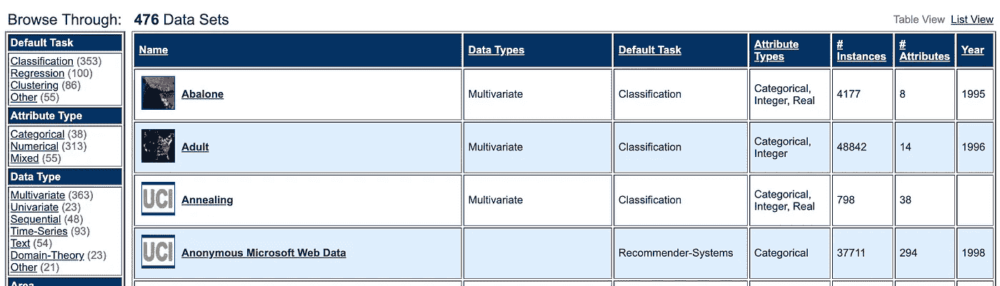

# 机器学习的免费数据集

> 原文：<https://towardsdatascience.com/free-data-sets-for-machine-learning-73e74554cc21?source=collection_archive---------8----------------------->

## 查找公开可用数据集的 5 大资源


Photo by [William White](https://unsplash.com/@wrwhite3?utm_source=unsplash&utm_medium=referral&utm_content=creditCopyText) on [Unsplash](https://unsplash.com/search/photos/free?utm_source=unsplash&utm_medium=referral&utm_content=creditCopyText)

我非常喜欢通过实际应用来学习。我发现，在研究机器学习时，获得一些公开可用的数据集来应用我学到的最新技术真的很有用。或者，在处理真实数据集之前，您可能需要一个非常简单的数据集来测试解决方案或比较不同的算法。

在下面的帖子中，我将列出我发现的获得机器学习应用程序完全免费数据集的最佳资源。

## UCI

[UCI 机器学习库](https://archive.ics.uci.edu/ml/index.php)目前有 476 个公开可用的数据集，专门用于机器学习和数据分析。数据集被有用地标记了类别，例如分类、回归、推荐系统等，因此你可以轻松地搜索数据集来实践特定的机器学习技术。

几乎所有的数据集都来自真实世界(与玩具数据集相反)，这意味着你将遇到与真实机器学习项目中面临的挑战类似的挑战。有非常广泛的主题可供选择，并且所有的数据集都已经过研究，这意味着它们有可能在模型中产生良好的结果。



[UCI Machine Learning Repository](https://archive.ics.uci.edu/ml/datasets.php)

## 卡格尔

Kaggle 是机器学习数据集的另一个重要资源。目前，在这个[页面](https://www.kaggle.com/datasets)上列出了 19515 个数据集。Kaggle 的一个优点是，在每个数据集的登录页面上都有数据预览。因此，您可以在下载之前快速想象您将要处理的数据类型。

使用 Kaggle 的好处是，您经常会发现许多与每个数据集相关的内核。在这些区域中，其他用户会显示处理数据的代码示例，这是一个很好的入门方式。此外，许多数据集在过去与排行榜的比赛相关联或曾经相关联。这提供了一个很好的资源来衡量你的模型相对于其他用户的表现。


[Kaggle](https://www.kaggle.com/harlfoxem/housesalesprediction)

## sci kit-学习

Scikit-learn 拥有各种各样的玩具和现实世界的数据集。它们可以使用通用数据集 API 获得。它们非常容易获得和操作，可以准备好训练模型，并且可以是在将它们用于真实世界数据之前对解决方案进行基准测试或评估不同算法的好方法。

玩具数据集可以通过以下方式获得(以[波士顿房价](https://scikit-learn.org/stable/datasets/index.html#boston-house-prices-dataset)为例)。

```
from sklearn.datasets import load_boston
boston = load_boston()
```

下面是一个简单的例子，说明如何使用这个数据集来训练和评估一个模型。

```
from sklearn.linear_model import LinearRegression
from sklearn.metrics import median_absolute_error, r2_score
from sklearn.model_selection import train_test_split
from sklearn.datasets import load_bostonboston = load_boston()X_train, X_test, y_train, y_test = train_test_split(boston.data, boston.target, random_state=1)regr = LinearRegression()
regr.fit(X_train, y_train)
y_pred = regr.predict(X_test)
print(r2_score(y_test, y_pred)) 
print(median_absolute_error(y_test, y_pred))
```

真实世界的数据集可以被获取，如下图下面的[所示。](https://scikit-learn.org/stable/modules/generated/sklearn.datasets.fetch_20newsgroups.html#sklearn.datasets.fetch_20newsgroups)

```
from sklearn.datasets import fetch_20newsgroups
dataset = fetch_20newsgroups()
```

## Drivendata.org

这个[网站](https://www.drivendata.org/competitions/)主办旨在解决社会问题的机器学习竞赛。每个竞赛都附有一个数据集，可以从网站上下载。它们从非常简单的([献血](https://www.drivendata.org/competitions/2/warm-up-predict-blood-donations/))到更复杂的([有故障的水泵](https://www.drivendata.org/competitions/7/pump-it-up-data-mining-the-water-table/))不等，并且可以是从各种领域和复杂程度的数据中获得实践的好方法。


[Drivendata.org](https://www.drivendata.org/competitions/)

## 五三八

以发表基于分析数据的文章而闻名的 538 已经通过 Github 公开了他们的数据集。这里有广泛的数据集，涵盖了许多不同的领域。每个数据集都有一个自述文件，其中包含一个数据字典和一些关于数据源的信息。这是一个访问一些不同寻常的数据集进行实践的好地方。


[FiveThirtyEight](https://fivethirtyeight.com/)

还有很多其他地方可以获得机器学习项目的数据，包括政府网站、研究中心和大学(这是一个很棒的[列表](https://www.una.edu/sponsored-programs/Human%20Subjects%20Research/public-datasets.html))。然而，我上面列出的资源可能是获得专门为机器学习目的而整理的数据集的最佳地方。

感谢阅读！