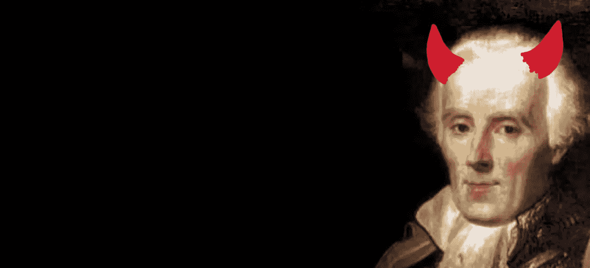
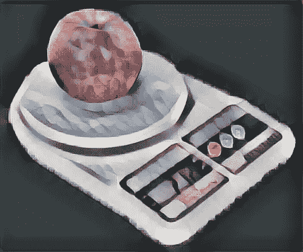

# 生成机器学习中的恶魔决定论

> 原文：<https://towardsdatascience.com/free-will-clairvoyant-demons-and-determinism-45904c354124?source=collection_archive---------24----------------------->

## 数据科学之道

## 决定论，生成机器学习，以及人类(或机器)的自由意志是否可能

[*数据科学之道*](https://medium.com/tag/the-tao-of-data-science) *专栏探讨了几个世纪以来哲学家们是如何攻克机器学习和数据科学的关键问题的。*

Laplace provided an interesting insight into generative machine learning

# 拉普拉斯的恶魔

皮埃尔·西蒙·拉普拉斯认为一切都是由原子组成的，牛顿物理学支配着原子的运动。作为一个思想实验，拉普拉斯想象了一种拥有两种知识的超视力恶魔:

*   恶魔知道宇宙中所有粒子的所有位置和速度的初始条件；
*   恶魔知道所有的(牛顿)物理定律。

拉普拉斯认为，有了这种知识，恶魔可以正确地预测宇宙中所有物质身体的任何事情，包括你。它通过从初始条件开始，并使用确定性物理定律向前投射来实现这一点。

# 在机器学习模型中构建恶魔决定论

生成机器学习用概率对不确定性建模。回想一下落在牛顿头上的苹果，它启发了他的物理学概念。假设我们想知道那个苹果的重量。

下面是一个简单的[生成式机器学习模型](https://en.wikipedia.org/wiki/Generative_model)对苹果称重的过程，我们可以用它来估计重量:

> 苹果 _ 重量~正常(μ，σ)
> 测量~正常(苹果 _ 重量，ε)

这里的“正态”是指[正态(高斯)概率分布](https://en.wikipedia.org/wiki/Normal_distribution)。如果这对你来说是新的，就把它想象成一个特定味道的随机发生器。如果你不熟悉“~”符号，它表示左手边的对象“来自”右手边的概率分布。要从该模型生成，您可以通过模拟右侧的分布，为左侧的对象分配一个值。为了估计苹果的重量，你需要进行实际测量，并使用这个模型来推断苹果的重量，也许使用类似[贝耶法则](https://en.wikipedia.org/wiki/Bayes%27_theorem)的东西。

把这个模型读作英语，我们用秤来测量苹果的重量。由于没有秤经过完美校准，我们区分报告的*测量值*和真实的*苹果重量*。我们对这个关于真实的*苹果重量*的不确定性来源(通常称为*技术噪声*)进行建模，给出以真实的*苹果重量*为中心的正态分布的测量值，并带有一些噪声参数ε。而且，我们也不确定 *apple_weight* 本身。所以我们用一个*先验*来模拟这种不确定性——一个基于所有苹果的一些平均重量和重量变化的概率分布。在这种情况下，先验是具有均值μ和标准差σ的正态分布。

这个模型违背了拉普拉斯的宇宙决定论观点。如果*测量值*偏离 *apple_weight* ，这是因为秤本身的物理特性产生了某种确定性过程。即使我们不知道这些特征是什么，我们仍然应该能够看到这种确定性机制在模型中出现。

让我们用一个简单的数学变换来改变这个模型。

> #初始条件
> Z1 ~正常(0，1)
> Z2 ~正常(0，1)
> #确定性
> apple _ weight =σ* Z1+μ
> measurement =ε* Z2+apple _ weight

如果您不熟悉数学，所有这些转换都是利用了数学事实，即任何正态(高斯)随机变量都只是标准化正态随机变量(Normal(0，1))的线性转换。换句话说，这个模型在数学上等同于第一个模型。然而，这在哲学上是非常不同的。这里 apple_weight 和 measurement 是一些初始条件的确定性函数，用 Z1 和 Z2 表示。我们用先验正态(0，1)表示的不确定性，只在初始条件的上下文中表达。因此，我们有决定论，但仍然承认我们不如魔鬼那样有洞察力。

事实上，这种建模方法(称为结构因果模型)允许直接在模型中构建更微妙的确定性物理。例如，也许不使用线性变换，我们可以详细描述导致测量值稍微偏离真实值的物理机制。让我们用函数 g(来表示这个。).

> #初始条件
> Z1 ~正常(0，1)
> Z2 ~正常(0，1)
> #确定性
> apple_weight = σZ1 + μ
> 度量= g(apple_weight，Z2)

同样，如果您是一名在 Fitbit 工作的工程师，您可能知道人体解剖结构的变化导致的不确定性如何与设备中的机械和数字组件相结合，从而导致报告的步数偏离实际步数。

概括地说，这里的 g 可以将不确定的初始条件与某种确定的自然关系结合起来，例如欧姆定律(V = IR)或质能等效性(E = MC)。我们甚至可以把它扩展到抽象的“物理学”比如经济学中的供求定律，或者围棋这样的游戏规则。

# 自由意志呢？

许多哲学家认为决定论与自由意志不相容。如果宇宙的初始条件决定了你身体的运动，那么你是做俯卧撑，还是写一篇中等文章，还是口型说“我爱你”，怎么可能由你决定？他们的结论是，要么决定论是错误的，要么自由意志是一种幻觉。

# 但是量子力学呢？

许多人认为现代物理学告诉我们，量子力学的基本定律不是确定性的，而是概率性的。一些哲学家认为量子力学定律不仅解决了自由意志的问题，甚至为意识提供了基础。量子力学对机器学习和人工智能的哲学意义值得单独发表。

然而，就预测建模方法的选择而言，我相信奥卡姆剃刀适用——对你的模型来说，最好假设宇宙是确定性的，除非你明确地建模一些量子级变化很重要的现象。你当然不需要理解量子引力来模拟一个苹果的重量。

# 相关阅读

*   [哥德尔不完全性定理及其对构建强人工智能的启示](https://medium.com/@osazuwa/g%C3%B6dels-incompleteness-theorems-and-the-implications-to-building-strong-ai-1020506f6234) —数据科学之道
*   [概率因果模型](https://plato.stanford.edu/entries/causal-models/#ProbCausMode) —斯坦福哲学百科全书
*   [因果决定论](https://plato.stanford.edu/entries/determinism-causal/) —斯坦福哲学百科全书
*   年轻的思想家现在认为自由意志是真实的——思想很重要
*   [是的，决定论者，有自由意志。即使你的原子没有做出选择，你也会做出选择。](http://nautil.us/issue/72/quandary/yes-determinists-there-is-free-will) —鹦鹉螺