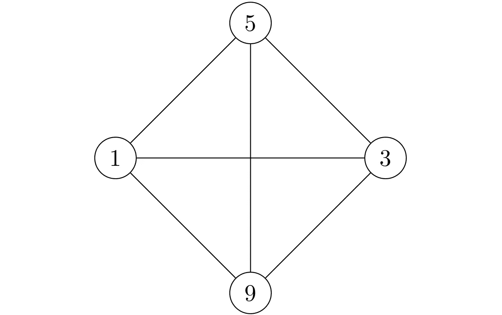
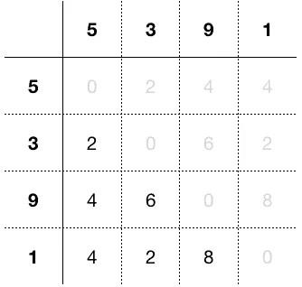

# 将数据科学家从矢量化的魔咒中解放出来

> 原文：<https://towardsdatascience.com/freeing-the-data-scientist-mind-from-the-curse-of-vectorization-11634c370107?source=collection_archive---------10----------------------->

## 朱莉娅来救我们了。


Photo by [Debby Hudson](https://unsplash.com/@dhudson_creative?utm_source=unsplash&utm_medium=referral&utm_content=creditCopyText) on [Unsplash](https://unsplash.com/?utm_source=unsplash&utm_medium=referral&utm_content=creditCopyText)

现在，大多数数据科学家使用 Python 或 R 作为他们的主要编程语言。这也是我的情况，直到今年早些时候我遇到了朱莉娅。Julia 承诺了与静态类型编译语言(如 C)相当的性能，同时保持了解释语言(如 Python、R 或 Matlab)的快速开发特性。这种性能是通过实时(JIT)编译实现的。Julia 在运行时编译代码，而不是解释代码。虽然 JIT 编译已经存在一段时间了(例如， [Matlab 在 2002 年](https://blogs.mathworks.com/loren/2016/02/12/run-code-faster-with-the-new-matlab-execution-engine/)引入了它)，但 Julia 是为 JIT 编译的性能而设计的。类型稳定性和多分派是 Julia 中的关键设计概念，使其在竞争中脱颖而出。如果你想了解更多，加州大学数据科学倡议有一本[非常好的笔记本](https://ucidatascienceinitiative.github.io/IntroToJulia/Html/WhyJulia)，它解释了这些概念。

在某个时候，我们开始使用解释语言来处理大型数据集(我猜数据集变得越来越大，我们一直使用相同的工具)。我们了解到，为了提高性能，我们希望避免循环和递归。相反，我们希望使用矢量化的操作或专门的实现，将数据结构(如数组、数据帧)作为输入，并在一次调用中处理它们。我们这样做是因为在解释语言中，我们每次执行一条指令都要付出额外的开销。虽然我很喜欢用 R 编写代码，但这涉及到一套避免循环和递归的策略，而且很多时候我的努力都指向了“如何避免解释语言的陷阱？”。我开始编写 C 函数来解决 R 脚本中的瓶颈，虽然性能明显提高了，但是使用 R 的优势却消失了。那时我开始寻找替代品，我找到了朱莉娅。

在这篇文章中，我们将从解决一个简单的 R 问题开始，在这里我将试着说明用解释型语言编程时的思维模式和局限性。然后，我们将解决与 Julia 相同的问题，展示思维模式如何完全不同，以及如何实现开箱即用的类似 C 的性能。

# 矢量化途径

有时不清楚如何使用矢量化获得最佳性能。



让我们考虑这样一个问题:给定一个点的矢量，求所有点对组合之间的距离。为了简单起见，点是一维的，我们将使用 L1 距离。给定输入[5，3，9，1]，预期输出为[2，4，4，6，2，8](由| 5–3 |，| 5–9 |，| 5–1 |，| 3–9 |，| 3–1 |和| 9–1 |产生)。

这个问题在 R 中使用`stats`包的`dist`函数解决了:

```
> as.vector(**dist(**c(5, 3, 9, 1), method=”manhattan”**)**)
[1] 2 4 4 6 2 8
```

r 的实现返回一个距离矩阵，我们将它转换成一个向量。



Distance matrix: gray cells are redundant

让我们假设`dist`不可用。你如何用 R 来编码它？

用基于循环的方法解决这个问题很简单:我们需要一个外部循环来迭代对中的第一个元素，需要一个内部循环来迭代第二个元素。由于 L1 距离是对称的(| *a-b| = |b-a|* )，我们只需要对一半的组合这样做，同时避免计算点到它们自己(矩阵的对角线)的距离。R 中基于循环的实现如下所示:

如果你用 R 编程，你会说这不是合适的 R 代码…循环很慢，产生非常冗长的代码…应该有一种向量化的方法。

丢弃环路的一种方法是用所有对的组合生成向量。基本上，我们正在寻找距离矩阵的下三角形的(行，列)坐标。然后，我们可以通过一次矢量化运算来计算距离。我们知道我们付出了内存代价，但是我们希望矢量化能够有所回报。

另一种选择是使用 R 的`outer`函数来生成具有两点的所有组合(包括冗余组合)之间的差异的矩阵。然后，我们只需要检索矩阵的下三角部分的绝对值。我们可能会感到不情愿，因为我们正在进行大约 2 倍多的操作(并将它们存储在内存中)，但这确实会产生更干净、更可读的代码。

随着我们沿着向量化的道路前进，代码变得越来越紧凑，但是它变得更快了吗？我们通过更多的内存和更多的操作来交换紧凑性…预测这些实现中哪一个是最有效的并不容易。

当我们已经有了一个简单的基于循环的解决方案(在编译语言中很难超越)时，我们可以继续尝试找出避免 R 陷阱的最佳方法。因此，如果这个函数是性能关键的，那么用 C、CPP 或 Fortran 实现它可能是有意义的。原始实现的 CPP 翻译，通过 Rcpp 库与 R 集成，如下所示:

## 实验

我用 10.000 个随机数的向量运行了不同的实现 3 次(需要 49.995。000 的距离计算，否则为 100.000.000)并取 CPU 时间和内存消耗的中间值。我用的是 2017 款 MacBook Pro，2.3 GHz 英特尔酷睿 i5，16 GB 内存运行 Mac OS 10.14，R 3.6.0，Julia 1.0.3，XCode 10.1。


正如所料，R 中基于循环的实现是最慢的(在 JIT 可用的 3.4 版之前会慢得多)。通过矢量化，我们减少了计算时间，但增加了内存消耗，随着输入大小的增加，这可能会成为一个问题。即使在我们的矢量化努力之后，我们仍然远远没有达到 R 的`dist`函数的性能。

Rcpp 允许减少计算时间和内存需求，优于 R 的核心实现。这并不奇怪，因为 R 的`dist`函数更加灵活，增加了几个选项和输入验证。虽然我们可以将 C/CPP 代码注入到 R 脚本中是一件好事，但现在我们正在处理两种编程语言，我们已经失去了 CPP 代码的交互式编程的好处。

# 朱莉娅的方式

Julia 的编程思维与 R 的完全不同。最有效的解决方案是通过基于循环的方法来预分配内存。

如果你想写更少的代码，你可以牺牲计算效率。压缩代码的一种方式是通过理解。

上述理解比基于循环的实现更紧凑，同时体现了相同的逻辑。这种方法的主要缺点是输出向量不是预先分配的。由于编译器无法预测输出的大小，因此输出会根据需要动态增长。

最后，如果您喜欢矢量化方法，在 Julia 中也可以选择。基于`outer`函数翻译 R 的实现如下所示:

与 R 不同，我们认为这是效率最低的方法，因为它需要更多的内存和不必要的(冗余)操作。

# 结果


Julia 通过提供开箱即用的类似 C 语言的性能而脱颖而出。代码紧凑性和效率之间的权衡非常明显，类似 C 的代码提供类似 C 的性能。理解是一个很好的折衷方案，因为它们更容易编码，更不容易出错，并且对于这个问题同样有效。

当使用 R 处理计算密集型任务时，我们希望找到一个专门的函数来解决我们的问题。如果一个专门的函数不可用，我们要么需要用 C/CPP 编程，要么通过矢量化途径。如果我们选择第二种，我们可能会远远达不到第一种方法的效果。

# 结束语

矢量化、理解、地图过滤-简化都是很好的工具，可以节省您的时间，并提供更紧凑和可读的代码。然而，程序员不应该因为编程语言的性能限制而被迫使用它们。当有一个简单而有效的实现时，您不希望花费时间尝试几种方法来实现解决方案。

Julia 允许您在代码紧凑性和计算效率之间进行选择，使得这种权衡非常明显。您可以实现类似 C 的循环、类似 R 的向量化或类似 Python 的理解。这取决于你。您可以优化解决方案编码所需的时间和解决方案运行所需的时间之间的比率。你可以实现自己的算法，而不需要依赖第二语言。

由于比 Python 和 R 年轻得多，Julia 正在数据科学社区中奋力拼搏。我喜欢 13 年前开始使用 Matlab 的时候，因为我可以与数据交互。我现在喜欢如何更快地编写更快的代码，以及如何在 Julia 中自由地实现几乎任何算法。试试吧，我相信你也会喜欢它的！

**代码可在:**【github.com/dcmoura/blogposts 

你可以在[推特](https://twitter.com/daniel_c_moura)、 [LinkedIn](https://www.linkedin.com/in/dmoura/) 和 [Vimeo](https://vimeo.com/danielcmoura) 上找到我(查看我的数据 vizs！)