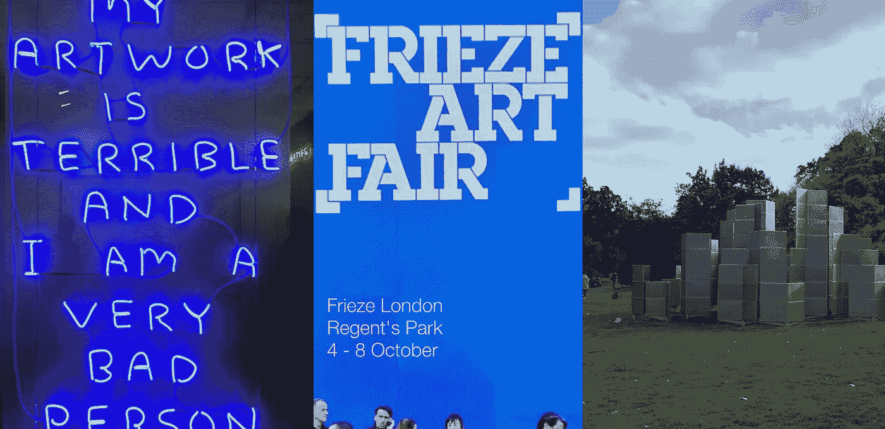
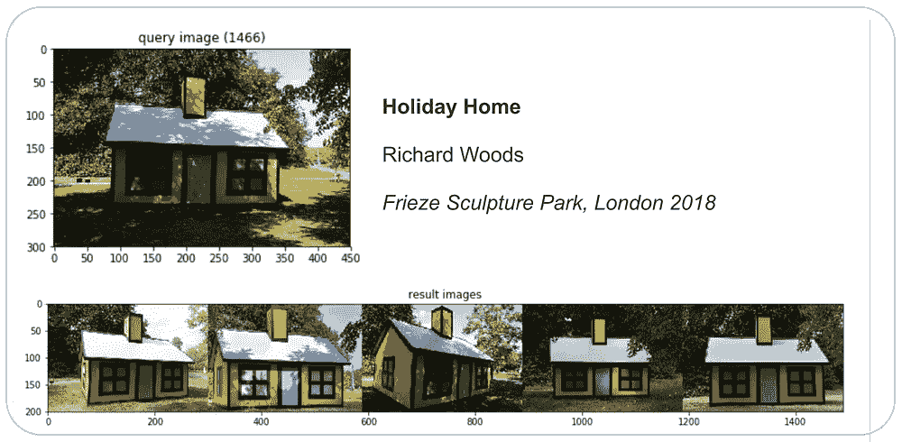
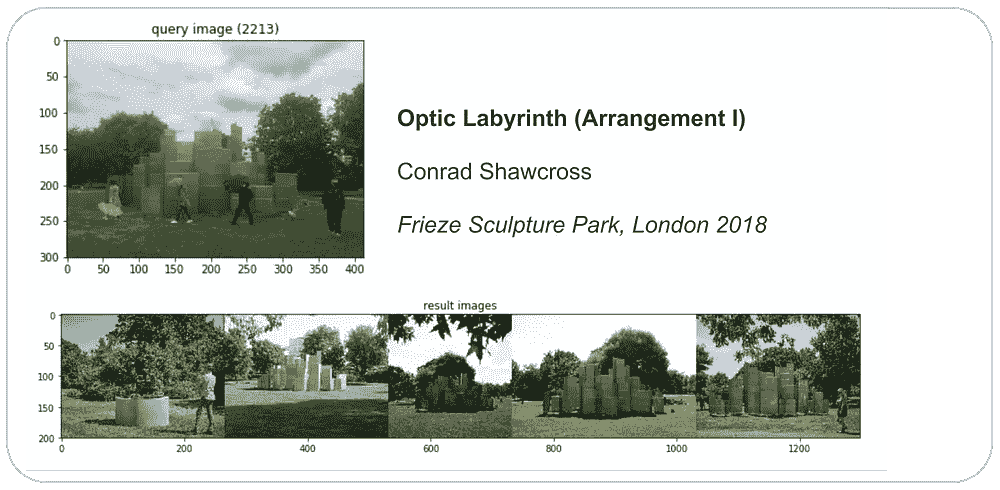
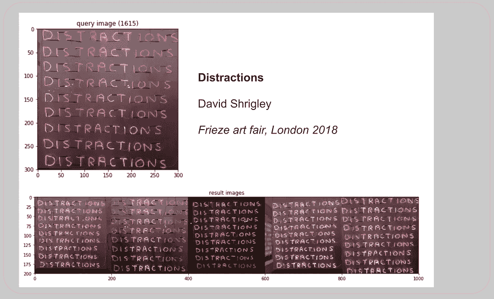
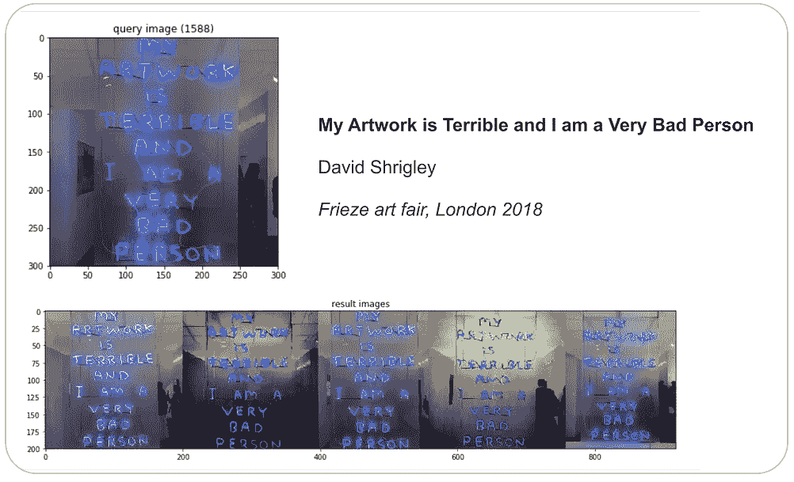
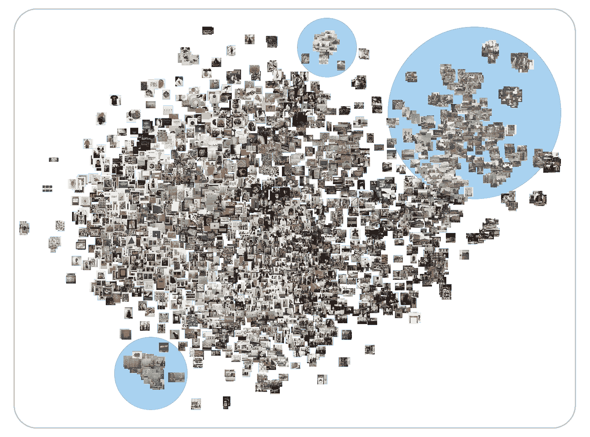
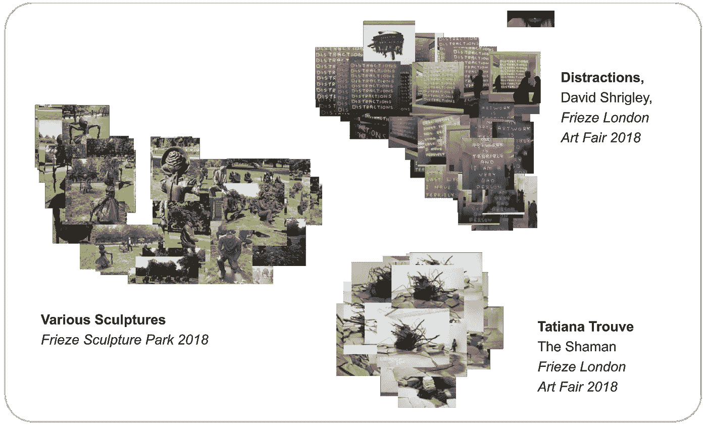

# 2018 年伦敦 Frieze 展(第三部分):计算机视觉

> 原文：<https://towardsdatascience.com/frieze-london-2018-part-3-computer-vision-50314f2f4b1?source=collection_archive---------15----------------------->

## 第 3 部分:使用计算机视觉分析 9k 社交媒体图像

## 介绍

在这一系列的最后一篇博文中，我应用计算机视觉技术来理解 2018 年 10 月 4 日至 7 日举行的 Frieze 伦敦艺术博览会的 9000 张图像。

Frieze 是每年十月在伦敦摄政公园举办的大型当代艺术博览会，吸引了成千上万的人。来自 20 多个国家的 150 多家画廊参加了盈利性艺术博览会。在过去的几年里，Frieze 还在公园里开创了一个雕塑展。

在本系列的[第二部分](/london-design-festival-2018-part-2-natural-language-processing-595f3c2dc24f?source=friends_link&sk=23ff5746ca0810a255e2023e52ebd450)和[第一部分](/analyzing-the-london-design-festival-2018-part-1-7edac3bfb165?source=friends_link&sk=5cbb7a0f8ad17446129f3be1a54b4c85)中，我展示了对 9000 篇关于展会的社交媒体帖子的自然语言处理和探索性数据分析。本文的目的是**使用计算机视觉分析来理解和联系**9000 张关于 2018 年伦敦奥运会的图片。

请向下滚动查看分析！

## 数据和方法

这一事件的官方标签是#frieze。在事件[发生时，我通过 Twitter API](/access-data-from-twitter-api-using-r-and-or-python-b8ac342d3efe) 和 [Instagram API](https://developers.facebook.com/docs/instagram-api/) 收集了 9000 个包含这个标签的帖子。[阅读第 2 部分了解更多](/frieze-london-2018-part-2-natural-language-processing-66d0627f39af)。

然后，使用[谷歌云的视觉 API](https://cloud.google.com/vision/docs/) 提取每张图像的标签。Cloud Vision API 利用“谷歌庞大的机器学习专业知识网络”(g [reat article](https://medium.com/@srobtweets/exploring-the-cloud-vision-api-1af9bcf080b8) 作者 [Sara Robinson](https://medium.com/u/7f2ab73b39f8?source=post_page-----50314f2f4b1--------------------------------) )来检测图像的特征和标签。总共有 1045 个不同的标签被赋予了 3300 张图片。

被称为**特征提取**和**反向图像搜索**的机器学习技术然后使用[基因科岗的代码](http://ml4a.github.io/ml4a/)完成，以基于视觉相似性找到图像。首先，使用预训练的卷积神经网络来提取每幅图像的“特征”，然后，计算这些特征的[余弦相似度](https://en.wikipedia.org/wiki/Cosine_similarity)，以“搜索”与查询图像相似的少量图像。

特征在计算机视觉中的主要作用是“[将视觉信息转换到向量空间](https://medium.com/machine-learning-world/feature-extraction-and-similar-image-search-with-opencv-for-newbies-3c59796bf774)”。相似的图像应该产生相似的特征，我们可以利用这些特征进行信息检索。基于这些特征，我们还可以使用一种叫做 t-SNE 的方法通过相似性对图像进行聚类。

## 图像分析

在这一节中，我将展示我的计算机视觉分析的结果。下面，我报告以下三个指标:

1.  图像的标签检测；
2.  基于视觉相似性的图像搜索:
3.  基于视觉相似性的图像聚类。

## 标签检测

每张照片的标签都是使用[谷歌云视觉 API](https://cloud.google.com/vision/) 生成的。这背后的想法是将图片分类，这样我就可以识别相似的图片。下面的条形图显示了 3，300 张图片的前 10 个标签。

我们看到，“艺术”是最常见的标签，其次是“现代”、“绘画”和“艺术品”。但是看到“树”、“草”和“天空”出现也很有趣，因为它表明许多图像是关于雕塑公园的(我们将在后面看到更多)。

然而，这些标签并没有明确描述艺术品本身——我对稍微详细一点的上下文理解感兴趣——这凸显了一些 API 标签检测技术的缺点。

## 图像搜索—视觉相似性

我们可以通过编程让计算机学习图像之间的视觉相似性，而不是使用标签来理解图像。一种叫做**特征提取**和**反向图像搜索**的技术就是这样做的。

使用在 [TensorFlow 后端](https://www.tensorflow.org/guide/keras)上运行的 [Keras VGG16](https://keras.io/applications/#vgg16) 神经网络模型，我首先为数据集中的每张图像提取了一个特征。一个特征是每个图像的 4096 元素的数字数组。我们的期望是“该特征形成图像的非常好的表示，使得相似的图像将具有相似的特征”([吉恩·科岗，2018](http://ml4a.github.io/ml4a/convnets/) )。

然后使用主成分分析(PCA)降低特征的维度，以创建一个[嵌入](https://developers.google.com/machine-learning/crash-course/embeddings/video-lecture)，然后计算一个图像的 PCA 嵌入到另一个图像的距离[余弦距离](https://en.wikipedia.org/wiki/Cosine_similarity)。我终于能够向计算机发送随机查询图像，它选择并返回数据集中具有相似特征向量的五个其他图像。

以下是四个例子:

Richard Woods, ‘Holiday Home’ Alan Cristea Gallery (left) and Conrad Shawcross, ‘Optic Labyrinth (Arrangement I)’, Victoria Miro (right) at Sculpture Park

David Shrigley, Distractions (2018) and “My Artwork is Terrible and I am a Very Bad Person”, Stephen Friedman Gallery at Frieze London Art Fair 2018

当试图从一个包含许多图片的相册中找到相似的图片时，这种技术非常有用，事实上我就是这么做的！

## 图像聚类—相似性

既然我们在向量空间中嵌入了每个图像，我们可以使用一种流行的叫做 t-SNE 的机器学习可视化算法来聚类，然后在二维空间中可视化向量空间。

> “tSNE 的目标是聚集相似数据点的小“邻域”,同时减少数据的整体维度，以便更容易可视化”(谷歌人工智能博客，2018 年)

下面我们看到基于视觉相似性的聚类形成。

在下面的图片中，我突出了一些来自博览会的艺术品——大卫·施莱格利的*分心*，塔蒂亚娜·特鲁夫的*萨满*和来自弗里兹雕塑公园的各种雕塑——以及它们的集群简介。

The clustering of images of works of art at Frieze London 2018\. Source: Instagram, Twitter, Flickr

## 结论

所以你有它！我只是刚刚涉足计算机视觉的奇妙世界。还有很多东西需要我去学习，但这对我来说是很好的第一步。

我的发现表明，使用机器学习和计算机视觉技术来理解和联系 Frieze air fair 的图像是可能的。

对我来说，下一步显然是计算在数据集中出现了多少艺术装置，以衡量“受欢迎程度”。我将继续研究这个数据集。

## 结束了

这是我关于 Frieze London 2018 的博客系列的结尾！这个系列是我正在进行的关于使用数据科学来理解和衡量城市文化影响的长期讨论的一部分。

今年，我将开始新的项目，主要是 JavaScript。敬请期待！

感谢阅读！

Vishal

[*Vishal*](https://vishalkumar.london/) *是伦敦 UCL*[*The Bartlett*](https://www.ucl.ac.uk/bartlett/)*的文化数据科学家和研究生。他对城市文化的经济和社会影响感兴趣。*