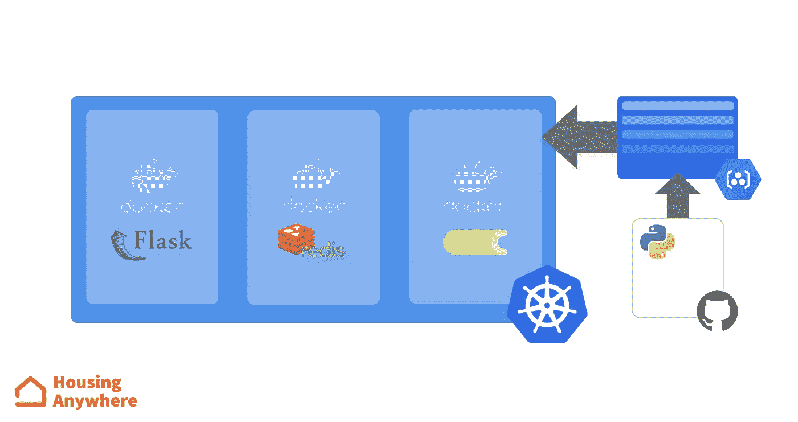
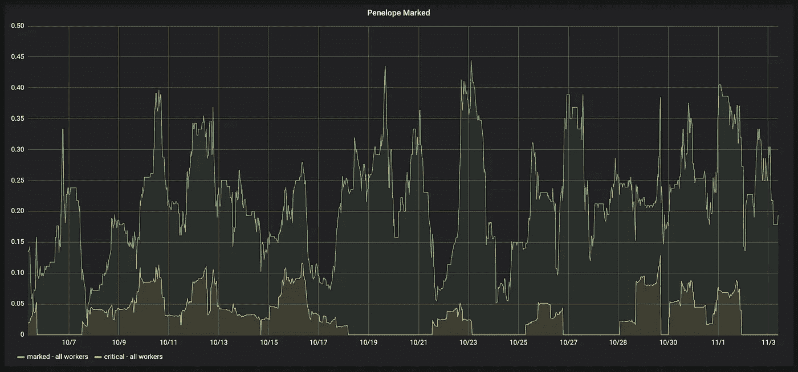
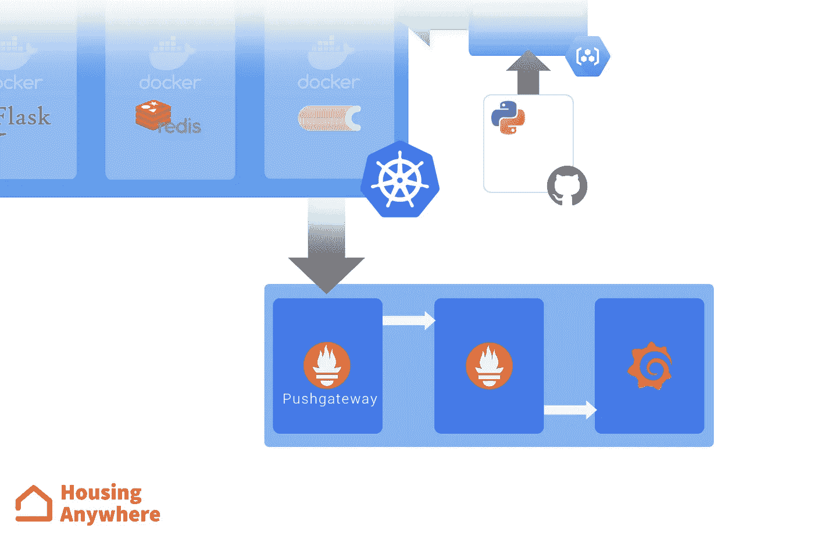
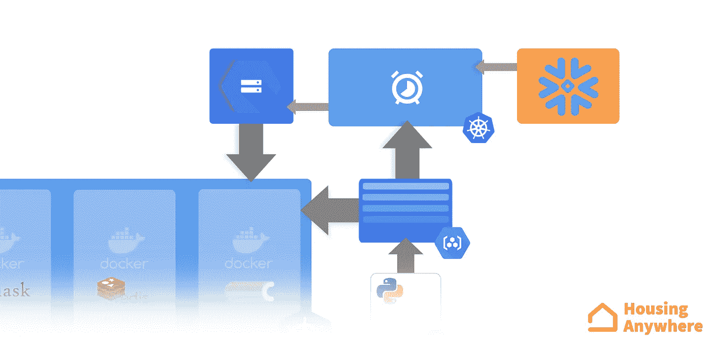

# 从 0 到持续交付的机器学习

> 原文：<https://towardsdatascience.com/from-0-to-continuously-delivered-machine-learning-971a707345cf?source=collection_archive---------35----------------------->

## 行之有效的循序渐进的方法

Photo by [Raoul Croes](https://unsplash.com/@rxcroes?utm_source=unsplash&utm_medium=referral&utm_content=creditCopyText) on [Unsplash](https://unsplash.com/s/photos/rotterdam?utm_source=unsplash&utm_medium=referral&utm_content=creditCopyText)

我大概是机器学习工程师。这个领域很新，所有的职位对我来说都是一个笑话。数据科学家、人工智能专家或人工智能工程师之间的界限非常模糊，你选择放在 LinkedIn 上的人实际上遵循了个人偏好或雇佣你的人的个人偏好。无论你第一次向人们介绍自己时说什么，都不会改变你在绝大多数公司的日常工作:你收集数据，训练模型，测试它们的表现，最终，如果你幸运的话——是的，不止是好——你会部署它们，可能是在云上。不过，在过去的几个月里，我越来越关注我公司的[机器学习产品的技术方面，而不是它们特定任务的性能。我和我的团队已经付出了很多努力来使它们处于良好的状态，但往往没有对它们的最终用户或我们的业务产生真正的影响(至少是直接的影响)。](https://housinganywhere.com/)

如果我回顾整个旅程开始的时候，考虑到我们作为一个团队在运营中的影响以及我们的产品和人员的技术成熟度，我们目前的状况确实令人印象深刻。但事情并不是这样开始的，为了达到这一点，我们经历了一个非常线性的过程，让我们获得了牵引力、支持和知识。这篇文章不会涵盖所有的初步步骤*需要*准备好部署的东西，我已经这样做了[这里](https://medium.com/data-science-housinganywhere/how-to-do-data-science-on-an-evolving-website-5fdec1c995da)，[这里](/detecting-scams-using-ai-for-real-6c96e712cf09)和不知何故还有[这里](/random-thoughts-on-my-first-ml-deployment-8e8c89df047f)，而是会试图揭示接下来发生的事情，以及什么对我们达到我们现在高兴的阶段很好。

## 部署模型

尽快起步是关键。第一阶段的目标应该是允许利益相关者评估模型的影响，并且部署不需要很花哨就能实现。唯一不能忽视的是，一旦模型投入使用，收集和比较业务指标的可靠流程。如果不存在一种方法来证明它是有用的，即使是机器学习历史上最好的模型*也不会在行业中取得任何成功。通常，这些指标甚至不是*的技术指标*，而是更可能与团队或部门的效率相关。例如，在我们的案例中，我们允许 CS(客户解决方案)部门在一项任务上花费的时间减少了 50%,而他们的效率提高了 80%。而且那个时候的分类器 F1 还挺差的，说实话。理想情况下，我们希望在完全可控和可测量的环境中拥有一个完美部署的模型，但是这从来都不是事实，尤其是在数据团队的早期阶段。在这种讨价还价的情况下，前者比后者更好。*

> *理想情况下，我们希望在完全可控和可测量的环境中拥有一个完美部署的模型，但是这从来都不是事实，尤其是在数据团队的早期阶段。*

*您可以忽略的良好工程实践的数量很大程度上取决于您公司的工程文化。我的意思是，机器学习模型是一个 Python 函数。通过在路由器上启用端口转发，理论上您需要 30 秒的时间在本地机器上将它公开为 Flask API。幸运的是，我们的运营团队非常强大，他们做得非常好，让我们能够非常轻松地采用一些尖端的云技术。*

*我们的第一次部署是在 Kubernetes 上的一个单独的吊舱。pod 包含三个不同的容器:API、一个异步任务队列(Celery)和一个 Redis 数据库，以允许两者之间的通信。*

**

*预测任务中使用的模型存储在一个 Docker 图像中。我们没有任何可靠的流程来重新培训它，在这种情况下，我们需要重新构建和推动整个映像。我们没有收集任何技术指标(已执行作业的数量、预测作业延迟等)，也没有在生产中直接发布任何暂存环境。我并不以此为荣。但老实说，我们从未觉得有更多的需求。如果我们试图在第一次部署之前解决所有这些可能的问题，我们可能永远不会有我们所拥有的影响，并且我们会在这个过程中失去动力和牵引力。*

## *成为业务关键型*

*如果一切顺利，并且你关于已经部署了实际有用的东西的所有假设都是真的，那么很有可能你的模型(现在是产品——fancier)将成为商业关键。此外，*业务关键*是一个相当时髦的词。理解这种情况的最简单的方法是试着想想如果你的产品因为某些原因搞砸了会发生什么。如果情况不好，你在某种程度上是业务关键型的。当我们将我们的技术与我们的核心平台整合后，我们就跨越了那条线。如果你在平台上弄坏了什么东西，用户能感觉到。*

> *了解你的产品是否对业务至关重要的最简单的方法是，试着想想如果它因为某种原因搞砸了会发生什么。*

*我们做的第一件事是开始在一个暂存环境中发布。测试机器学习产品是棘手的，在安全地发布到生产中之前，可能无法完全覆盖用例，但确保所有的技术组件和基本流程正常工作对于避免严重问题至关重要。如果什么东西坏了，没有人会注意到它。当然，听起来显而易见，确实如此，但是当我们甚至不确定我们的部署是否能撑过这个月时，设计这样的东西是没有用的。有趣的是，在过去 30 年中开发的工程最佳实践不仅完全适合这个新领域，而且我们实际上感觉到在这个过程中需要它们。我们没有雇用他们，只是因为有人要求我们这样做。*

> *有趣的是，在过去 30 年中开发的工程最佳实践不仅完全适合这个新领域，而且我们实际上感觉到在这个过程中需要它们。*

*同一条线上是监控。如前所述，我们已经有了一个非常稳健的战略来评估业务相关的绩效，但我们完全不知道我们的部署状态*工程方面的*。完成一项预测工作需要多长时间？我们需要向 pod 添加更多资源吗？每天执行多少个作业？预测标签的百分比是恒定的吗？对于一个经典的 API 来说，这些度量是从一开始就收集的，没有它们就发布任何东西都是非常糟糕的做法。我们感受到了过程的紧迫性，我们得到了同样的最终结果。*

**

*One of the graphs we have created on Grafana to monitor performances.*

*在我们公司，我们已经在使用 Prometheus 和 Grafana 进行监控，当然，在我们的项目中也使用这些工具是有意义的。不过，这些工作的短暂性需要一点工程上的努力，必须部署并控制 Prometheus Pushgateway 来存储这些指标，并将它们暴露给共享的 Prometheus 服务器。在 QA 团队的帮助下，我们定义了警报并创建了一些漂亮的图表。为了不搞砸，我们现在采用了最好的策略，但如果真的发生了，至少我们是第一个知道的。*

**

## *解耦模型*

*数据产品最大的资产是驱动它的模型。在几次不同的 ML 部署之后，我们意识到，除了主要与样本创建过程相关的一小部分定制代码之外，设置服务器和预测过程所需的大部分代码几乎是相同的。在另一个层面上，用 Docker 部署模型也导致了大量无用的工作，不得不构建复杂 Dockerfile 中定义的大映像，仅仅是为了改变资源的一个非常小的子集，这个子集并不严格依赖于它的实际使用方式。模型和预测逻辑可以解耦，它们的发布过程应该是不同的，而不是同步的。*

> *模型和预测逻辑可以解耦，它们的发布过程应该是不同的，而不是同步的。*

*因此，我们决定将 API 和任务队列从模型和相关文件中分离出来。我们改进了代码，以便在预测过程开始时异步检索这些资源，从云对象存储(在我们的例子中是 GCS)中获取它们。当然，这种改进也需要一个新的图像来处理逻辑，但从那以后我们没有发布任何新版本。服务一个新的模型现在实际上就是将它存储在桶中，并在我们的配置存储库中提出一个 PR，使用我们在这个项目的整个发展过程中使用的相同的 GitOps 方法。*

*这一步使我们能够不费吹灰之力地按照自己的意愿对模型进行多次重新训练。然而，发布模型版本的任务正是这个领域中的部署与传统工程部署的不同之处。描述流程和编写测试是非常简单的(即使有些复杂和无聊)。如果一个发布候选通过了它们，那就可以开始了。对于数据产品是非常不同的。当然，检查作业调度逻辑是否如预期的那样运行是可能的，但是判断一个列表是否是一个骗局是完全不同的事情。*

*在这一点上，我们需要的是一种方法来确保(足够)重新训练的模型在实时数据上的表现与当前部署的一样好，甚至更好。当然，并行地为模型服务几天并监控它们的性能工作得很好，但是执行任务所需的时间和精力经常开始成为我们团队的瓶颈。在我们的大多数设置中，简单的离线性能估计不足以验证模型，因为发送用于预测的数据可能不同于几天后从我们的数据源中检索的数据。我们设计了一个特定于任务的测试框架，将重新训练的模型暴露给部署模型使用的相同数据。在定义培训日期时采用一个聪明的策略，我们可以模拟模型的发布，并在 10 秒钟内，而不是 2 天内，对重新培训版本的实际性能进行非常可靠的评估。一个非常细粒度的日志记录策略对于实现这一目标至关重要:预测过程的所有阶段和结果都被存储起来，并可以在需要时访问。*

*我们安排了一个两周一次的 cronjob，创建一个 pod 并重新训练模型，如果发布模拟进行得很顺利，可能会保存它，并通知团队结果。然后发布新的模型(先试运行，后生产),编辑 Kubernetes 上的配置文件。包含预测逻辑的 pod 重新启动，并从存储桶中获取重新训练的版本，完全不知道其内容。*

**

*我们当前的设置允许我们完全专注于改进实际的机器学习引擎，并有非常明确的责任分离。整个过程花费了大约 8 个月的时间，我们成功地为我们的用户提供了良好的服务，没有任何停机或延迟。所有这些有多少被他们注意到了？可能是零。机器学习工程，如果存在的话，可能是这样的:在最终用户不会注意到的数据产品上做一些事情，但这些事情让世界变得更适合居住。*

> *机器学习工程，如果存在的话，可能是这样的:在最终用户不会注意到的数据产品上做一些事情，但这些事情让世界变得更适合居住。*

*没有 [*【德安沛*](https://www.linkedin.com/in/duc-anh-bui-b58521171/) *的帮助，很多事情都不可能实现。**