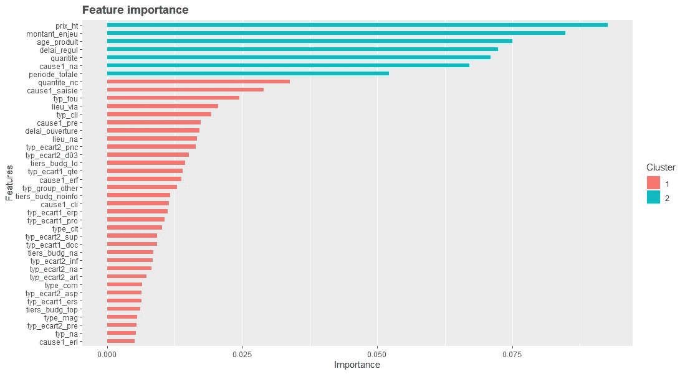

# 用 R 从 0 到机器学习

> 原文：<https://towardsdatascience.com/from-0-to-machine-learning-with-r-d339a8be6004?source=collection_archive---------12----------------------->


## R 编码，数据帧，应用模型之旅。

我最近参加了一个使用 R 的项目，我来自 Python，不得不花几天时间研究 R 文档。对于初学者来说，R 文档不像 Python 那样友好，一开始把它们放在一起可能会很痛苦。

然而，网上有很多很棒的资源:

*   文档是我最常用的网站，一旦你熟悉了语法和搜索引擎，它就是一座金矿。
*   [Datacamp](https://www.datacamp.com/home) 是从 R(甚至 Python)开始的好地方。每周都有新的内容，还有一些不错的特色，比如项目和挑战。

本文收集了从原始数据文件应用机器学习模型的所有元素和概念，其中 r。

> 让我们从 R 开始，选择一个数据集并开始沿着代码片段工作。

# 入门指南

在你的电脑上安装 [R 语言](https://cran.r-project.org/)。
安装一个免费完整的 IDE : [RStudio](https://www.rstudio.com/products/rstudio/#Desktop) 。

## 图书馆

R 基本安装并不附带每个库，**就像 Python** 中的 pip 一样，新的库是用这个命令安装的，在 R 终端中:

```
install.packages(tidyverse) # For installing tidyverse
```

安装软件包后，以下是对库的一些操作:

```
library(readr) # Load library# Load multiple libraries
p.names <- c(‘xgboost’, ‘caret’, ‘dplyr’, ‘e1071’)
lapply(p.names, library, character.only = TRUE) installed.packages()                # List available packages
remove.packages("tidyverse")   # Uninstall a package# Getting help and documentation
?functionName
help(functionName)
example(functionName)
```

# 写一些代码

## 变量

定义变量非常简单，我们同样使用" = "或"

```
# Create new variables
my_var <- 54
my.data.vector = c(34, 54, 65)# Clean a variable
my_var <- NULL
```

## Functions

Functions in R are similar to Python functions :

*   Assign the function like you would assign a variable.
*   Use the ***函数*** 关键字，参数在括号内。
*   使用 ***回车*** 作为退出点

下面这个名为 **prod_age，**的小函数以 creation_date 为参数。对于 if 语句，我们处理空情况，否则我们将值转换为 date。

```
prod_age <- function(creation_date) {
 if (is.na(creation_date)) {return(as.numeric(-1))}
 else {return(as.Date(creation_date))}
}
```

# 使用数据框架

## 加载数据，读取文件

readr 库中的 [read_delim](https://www.rdocumentation.org/packages/readr/versions/1.3.1/topics/read_delim) 函数提供了很多工具来读取大多数文件类型。

在下面的例子中，我们指定了每一列的数据类型。该文件有 56 列，我们希望所有列都作为字符读取，所以我们使用带有“c…c”的 col_types 参数，每个字符对应一列。

```
# Load the library
library(readr)# Create dataframe from CSV file
my_dataframe <- read_delim(“C:/path/to/file.csv”,
   delim = “|”,
   escape_double = FALSE,
   col_types = paste(rep(“c”, 56), collapse = ‘’))
```

## 设置数据帧的子集

不仅在导入数据集时会遇到数据帧。有时函数结果是数据帧。子集的主要工具是括号操作符。

*   要访问特定的列，使用$运算符，非常方便。

```
y_train <- my.dataframe$label
```

*   为了访问特定的行，我们使用[]操作符。您可能熟悉这个语法:**【行，列】**

```
# Works with numeric indices
y_train <- my.dataframe[c(0:100), 8]# Works with negative indices to exclude
y_test <- my.dataframe[-c(0:100), 8]
```

*   这是另一种仍然使用括号语法的技术。和**命名的**运算符的**用于子集化行和列。**

```
filtered.dataframe <- my.dataframe[
   which(my.dataframe$col1 == 2),     # Filter rows on condition
   names(my.dataframe) %in% c("col1","col2","col3")] # Subset cols
```

*   subset 函数:第一个参数是 dataframe，然后是行的过滤条件，然后是要选择的列。

```
filtered.dataframe <- subset(
   my.dataframe, 
   col1 == 2, 
   select = c("col1","col2","col3"))
```

## dplyr 图书馆

plyr 是一个流行的数据操作库。由此产生了 **dplyr** 包，它为最常见的数据操作挑战引入了一种语法。

如果您来自 Python，您可能熟悉用点号链接命令。在这里，你可以用一个特殊的管道做同样的事情: **% > %。**以下是文档中的一些示例:

```
starwars %>% 
  filter(species == "Droid")starwars %>% 
  select(name, ends_with("color"))starwars %>% 
  mutate(name, bmi = mass / ((height / 100)  ^ 2)) %>%
  select(name:mass, bmi)starwars %>% 
  arrange(desc(mass))starwars %>%
  group_by(species) %>%
  summarise(
    n = n(),
    mass = mean(mass, na.rm = TRUE)
  ) %>%
  filter(n > 1)
```

**dplyr** 其实对于数据的筛选和探索非常方便，语法也很直观。

## 修改列值

包，它为最常见的数据操作挑战引入了一种语法

## 修改列值

创建 dataframe 对象时，我们使用$操作符访问特定的列。

```
# Filtering rows based on a specific column value
my_datarame <- subset(my_dataframe, COLNAME != ‘str_value’)# Assign 0 where column values match condition
non_conformites$REGUL_DAYS[non_conformites$REGUL_DAYS_NUM < 0] <- 0# Create new column from existing columns
table$AMOUNT <- table$Q_LITIG * table$PRICE# Delete a column
my_dataframe$COLNAME <- NULL
```

## 将函数应用于列

一旦我们准备好了数据帧和函数，我们通常需要对列应用函数，以应用转换。

这里我们使用**应用**操作符。我们用它对结构化数据的 blob 进行操作，所以它不局限于数据帧。当然，每个点必须具有相同的类型。

```
# Product age function
prod_age <- function(creation_date) {
 if (xxx) {return(as.numeric(-1))}
 else { return(as.Date(creation_date))}
}# Apply function on column
mytable$PRODUCT_AGE <-
 apply(mytable[,c(‘DATE_CREA’), drop=F], 1, function(x) prod_age(x))
```

## 使用日期

当处理日期时，第一步是从日期字符串到日期对象。**为。Date** 函数正是这样做的，并使用指定的格式进行解析。在本文[的最后](https://www.r-bloggers.com/date-formats-in-r/)，你会发现每一种日期格式都可以用于*格式的*自变量。

```
# Convert a column into date format
sales$date_f <- as.Date(sales$date, format = ‘%d/%m/%Y’)# Create column from time difference
mytable$REGUL_DAYS = as.numeric(difftime(
 strptime(mytable$closing, “%Y-%m-%d”),
 strptime(mytable$opening, “%Y-%m-%d”),
 unit=”days”))
```

## 导出数据框架

几个内置函数允许将数据帧作为文件写入。一种非常常见的格式是 CSV。但是，RDS 格式被优化(序列化+ Gzip 压缩)以存储任何 R 对象。

```
# Write to CSV
write.csv(non_conformites,
 ‘C:\\Users\\path\\export.csv’,
 row.names = FALSE)# Write to RDS
saveRDS(
 feature_importance_values,
 file=”c:/path/folder/feature_importance.RDS”)
```

# 测绘

就像 Python 一样，R 附带了几个用于绘制数据的库。 **plot** 函数其实和 python 的 *plt.plot* 差不多。

RStudio 对于绘图非常方便，它有一个专用的绘图窗口，可以返回到以前的绘图。

## 折线图

```
plot(
 ref_sales$Date, ref_sales$Sales,
 type = ‘l’,
 xlab = “Date”, ylab = “Sales”,
 main = paste(‘Sales evolution over time for : ‘, article_ref)
)
```

## 各种图表

r 是统计学家的语言，它带有各种绘制数据分布的图表。

```
values <- c(1, 4, 8, 2, 4)
barplot(values)
hist(values)
pie(values)
boxplot(values)
```

# 机器学习:XGBoost 库

xgboost 包是一个很好的起点，因为它有很好的文档记录。它使我们能够快速了解数据集，如特征重要性，我们将在下面看到。

对于这部分，我们需要那些具体的库:
- **xgboost** :让我们围绕 XGB 著名算法展开工作。
- **脱字符**:分类和回归训练，包括许多数据处理函数
- **dplyr** :一个快速、一致的工具，用于处理内存中和内存外的类似数据帧的对象。

## 列车测试分离

准备好数据帧后，我们使用索引(inTrain)将其分为训练集和测试集:

```
set.seed(1337)
inTrain <- createDataPartition(y = my.dataframe$label, p = 0.85, list = FALSE)X_train = xgb.DMatrix(as.matrix(my.dataframe[inTrain, ] %>% select(-label)))
y_train = my.dataframe[inTrain, ]$label
X_test = xgb.DMatrix(as.matrix(my.dataframe[-inTrain, ] %>% select(-label)))
y_test = my.dataframe[-inTrain, ]$label
```

## XGBoost 的参数搜索

下面的函数做什么:
-把我们的训练/测试集作为输入。
-定义交叉验证的列车控制。
-定义参数网格。
-设置包含参数搜索的 XGB 模型。
-评估模型的准确性
-返回最佳参数集

```
param_search <- function(xtrain, ytrain, xtest, ytest) {# Cross validation init
 xgb_trcontrol = trainControl(method = “cv”, number = 5, allowParallel = TRUE,
 verboseIter = T, returnData = FALSE)# Param grid
 xgbGrid <- expand.grid(nrounds = 60, #nrounds = c(10,20,30,40),
 max_depth = 20, #max_depth = c(3, 5, 10, 15, 20, 30),
 colsample_bytree = 0.6,#colsample_bytree = seq(0.5, 0.9, length.out = 5),
 eta = 0.005, #eta = c(0.001, 0.0015, 0.005, 0.1),
 gamma=0, min_child_weight = 1, subsample = 1
 )# Model and parameter search
 xgb_model = train(xtrain, ytrain, trControl = xgb_trcontrol,
 tuneGrid = xgbGrid, method = “xgbTree”,
 verbose=2,
 #objective=”multi:softprob”,
 eval_metric=”mlogloss”)
 #num_class=3)# Evaluate du model
 xgb.pred = predict(xgb_model, xtest, reshape=T)
 xgb.pred = as.data.frame(xgb.pred, col.names=c(“pred”))
 result = sum(xgb.pred$xgb.pred==ytest) / nrow(xgb.pred)
 print(paste(“Final Accuracy =”,sprintf(“%1.2f%%”, 100*result)))return(xgb_model)
}
```

一旦参数搜索完成，我们可以直接使用它来定义我们的工作模型，我们用$操作符访问每个元素:

```
 best.model <- xgboost(
 data = as.matrix(my.dataframe[inTrain, ] %>% select(-IMPORTANCE)),
 label = as.matrix(as.numeric(my.dataframe[inTrain,]$IMPORTANCE)-1),
 nrounds = xgb_model$bestTune$nrounds,
 max_depth = xgb_model$bestTune$max_depth,
 eta = xgb_model$bestTune$eta,
 gamma = xgb_model$bestTune$gamma,
 colsample_bytree = xgb_model$bestTune$colsample_bytree,
 min_child_weight = xgb_model$bestTune$min_child_weight,
 subsample = xgb_model$bestTune$subsample,
 objective = “multi:softprob”, num_class=3)
```

## 计算并绘制特征重要性

同样，xgboost 包中提供了许多函数。[文档](https://xgboost.readthedocs.io/en/latest/R-package/xgboostPresentation.html)展示了其中的大部分。

```
xgb_feature_imp <- xgb.importance(
   colnames(donnees[inTrain, ] %>% select(-label)), 
   model = best.model
)gg <- xgb.ggplot.importance(xgb_feature_imp, 40); gg
```

下面是一个功能重要性图的示例，如 Rstudio 中所示。用 xgboost 生成的聚类只是按照相似的分数对特性进行分组，没有其他特定的含义。



Feature importance with ggplot

# 进一步阅读

我希望这是对 R 的简单介绍，我相信进步是通过操作和实验取得的。这里有一些资源可以让你继续学习，自己飞翔:

*   R-bloggers :关于 R 的新闻和教程，收集大量博文。
*   我总是会回到这个问题上来
*   [R 简介](https://cran.r-project.org/):如果你需要 R 编码的刷新者
*   [xgboost(R API)入门](https://xgboost.readthedocs.io/en/latest/R-package/xgboostPresentation.html)
*   [数据营](https://www.datacamp.com/home)课程和文章
*   [Kaggle R 内核](https://www.kaggle.com/kernels?sortBy=hotness&group=everyone&pageSize=20&language=R)

感谢您的关注，感谢您的反馈，一路平安！

