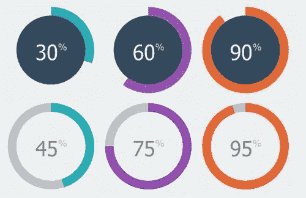
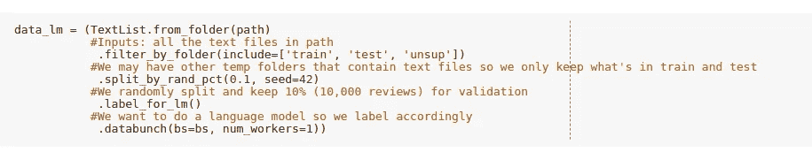
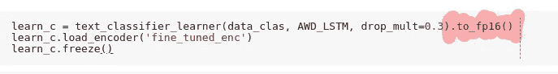
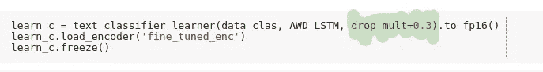
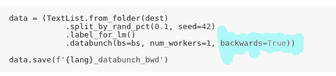

# 从 94%到 95%

> 原文：<https://towardsdatascience.com/from-94-to-95-b4bf149beb27?source=collection_archive---------32----------------------->

## 我将分享各种技术；理论上，我曾经在 IMDB 数据集上将我的 NLP 情感分析从大约 94%提高到 95%。

Image source — Google

# 技巧— 1

*   半监督学习——有一个学习分支叫做半监督学习，它允许我们使用未标记的数据来训练我们的语言模型。fastai 提供的 IMDB 数据集在`upsup`文件夹下为我们提供了未标记的数据，我们可以使用这些数据来训练我们的模型。大多数公司花费数年时间来完全标记数据，但半监督学习允许我们在不标记完整数据的情况下训练模型。我们也可以使用未标记的数据来训练我们的语言学习者关于任何语言的细节。因此，无论何时你找到一个，也使用未标记的数据。

`unsup` folder included

*   由于我们也使用了未标记的数据，我们有了更多的数据，因此也就有了更多的历元。
*   混合精度——不要使用单精度浮点数，而是使用半精度浮点数。以前，浮点运算需要 32 位，因为只有我们才能达到精度。但是，对于深度学习模型，我们需要大约。一些 GPU 支持半精度浮点。NVIDIA 的 GPU 和 Google 的 TPU 增加了支持半精度浮点的软件，并且加快了结果的速度。虽然 16 位浮点不准确，但在神经网络的某些地方，它是可行的。但是在某些领域，比如计算梯度和损耗，我们需要单精度浮点数，因为半精度浮点数的值是 0。因此，在实践中，我们使用混合精度，我们的模型根据操作类型使用单精度和半精度。那是一个艰难的选择。**不过没问题。** Fastai 很幸运在内部支持这一点。但肯定的是，我们可以明确地定义它，也像下面这样。感谢 Fastai。

*   drop_mult —我们用于迁移学习的语言模型使用 AWD_LSTM，这是一种递归神经网络，它定义了 5 种不同类型的辍学。宣布每一种类型的辍学并对这些价值观进行实验变得非常烦人。Fastai 已经说明了辍学的基本值，我们提供的是 drop_mul，它是内部每个辍学人数的倍数。如果模态严重过度拟合，可以增加该值，即更加正则化。我们的目标是创建更准确的语言模型，通常，我们定义较低的 dropout 值，因为较高的正则化值会导致较差的语言模型，从而导致对下一个单词的较差预测。

***但这里有一个抓手***

*   在 Fastiers 最近的研究中，如果我们增加正则化的值，我们会得到差的语言模型，但我们肯定会得到更准确和更好的情感分类器模型。让我们等待这项研究发表吧。通常，值在 0.1 到 1 之间。

# 诡计— 2

*   向后—根据最后一个单词，预测前一个单词，一些不寻常但有帮助的东西。Fastai 允许我们反向训练情态动词，这样我们的学习者也可以反向预测单词。然后，我们可以集成建立在前向学习器上的向上分类器和建立在后向学习器上的后向分类器，从而提高准确率。我们所做的是创建与实际数据相反的数据库，然后在此基础上训练语言学习者。

如果我发现更多的技巧，我会继续分享。在那之前，继续探索 fastai。