# 从单一决策树到随机森林

> 原文：<https://towardsdatascience.com/from-a-single-decision-tree-to-a-random-forest-b9523be65147?source=collection_archive---------6----------------------->

作者:罗莎丽亚·西里波和凯瑟琳·梅尔彻

决策树是一组非常流行的监督分类算法。它们之所以非常受欢迎，有几个原因:它们在分类问题上表现得相当好，决策路径相对容易解释，构建(训练)它们的算法又快又简单。

决策树还有一个集合版本:随机森林。随机森林本质上代表 N 个决策树的集合，因此增加了预测的鲁棒性。

在本文中，我们将简要概述决策树增长背后的算法、其质量度量、避免过度适应训练集的技巧以及决策树随机森林带来的改进。

**什么是决策树？**

决策树是一个类似流程图的结构，由[节点和](https://medium.com/greyatom/decision-trees-a-simple-way-to-visualize-a-decision-dc506a403aeb)分支组成(图 1)。在每个节点处，基于输入要素之一对数据进行分割，生成两个或更多分支作为输出。在即将到来的节点中进行越来越多的分割，并且生成越来越多的分支来分割原始数据。这种情况一直持续到生成一个节点，其中所有或几乎所有的数据都属于同一个类，并且不再可能进行进一步的拆分或分支。

这整个过程产生了一个树状结构。第一个分割节点称为根节点。末端节点被称为叶子，并且与类别标签相关联。从根到叶的路径产生分类规则。如果只有二叉分裂是可能的，我们就说二叉树。然而，在这里，我们想要处理非二进制决策树的更一般的实例。

让我们用一个例子来形象化这一点。我们收集了一个人过去航海计划的数据，即这个人是否出去航海，基于各种外部条件——或“输入特征”——如风速(以节为单位)、最高温度、前景以及船只是否在冬季储存。输入要素通常也称为非目标属性或独立变量。我们现在想要构建一个决策树，它将预测航行结果(是或否)。航行结果特征也称为目标变量或因变量。

如果我们知道准确的分类规则，我们可以手动构建一个决策树。但这种情况很少发生。我们通常拥有的是数据:一边是输入特征，另一边是要预测的目标特征。许多自动程序可以帮助我们从数据中提取规则来构建这样的决策树，如 C4.5、ID3 或 [CART 算法](https://machinelearningmastery.com/classification-and-regression-trees-for-machine-learning/) (J. Ross Quinlan)。在所有这些方法中，目标都是训练一个决策树来定义预测目标变量的规则，在我们的例子中，目标变量是我们是否会在新的一天去航海。

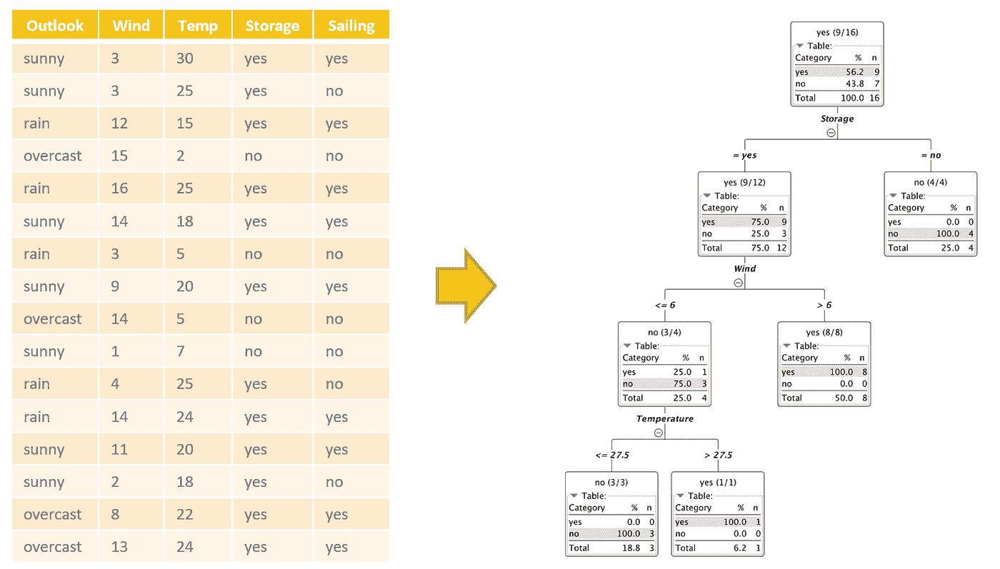

Figure 1\. Example of a decision tree (on the right) built on sailing experience data (on the left) to predict whether or not to go sailing on a new day.

**构建决策树**

让我们探索如何按照上面列出的算法之一自动构建决策树。

任何这些算法的目标是将训练集划分成子集，直到每个划分在目标类别方面是“纯的”或者足够小。要明确的是:

*   纯子集是只包含一类样本的子集。
*   每个分区操作都是通过一个规则来实现的，该规则根据其中一个输入要素的值来分割输入数据。

总而言之，决策树由三个不同的构件组成:节点、分支和叶子。节点识别分裂特征，并对数据的输入子集实施划分操作；分支从一个节点出发，并识别由划分操作产生的不同数据子集；路径末端的叶子标识数据的最终子集，并将类别与特定的决策路径相关联。

例如，在图 1 的树中，第一个节点中的拆分涉及“Storage”特性，并将输入子集划分为两个子集:一个是“yes ”,另一个是“no”。这里，输入数据集分为两个数据集:一个是“风”> 6 的数据集，另一个是“风”<= 6\. How does the algorithm decide which feature to use at each point to split the input subset?

The goal of any of these algorithms is to recursively partition the training set into subsets until each partition is as pure as possible in terms of output class. Therefore, at each step, the algorithm uses the feature that leads to the purest output subsets.

**质量度量**的数据集

在每一次迭代中，为了决定哪个特征导致最纯净的子集，我们需要能够测量数据集的纯度。过去已经提出了不同的度量和指数。我们将在这里描述其中的几个，可以说是最常用的:信息增益、基尼指数和增益率。

在训练期间，为所有候选特征计算选定的质量测量，以找出哪一个将产生最佳分割。

**熵**

熵是一个用来衡量信息或无序的概念。当然，我们可以用它来衡量一个数据集有多纯。

如果我们将目标类视为数据集中一个点的可能状态，那么数据集的熵可以在数学上定义为所有类的概率之和乘以它的对数。因此，对于二元分类问题，熵的范围落在 0 和 1 之间。

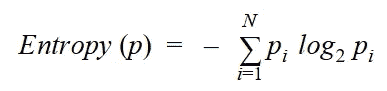

其中 p 是整个数据集，N 是类的数量，pi 是类 I 在同一数据集中的出现频率。

为了更好地理解熵，让我们处理两个不同的数据集示例，两个数据集都有两个类，分别用蓝点和红叉表示(图 2)。在左侧的示例数据集中，我们混合了蓝点和红叉。在右边数据集的例子中，我们只有红叉。第二种情况——只有来自一个类的样本的数据集——是我们的目标:一个“纯”数据子集。

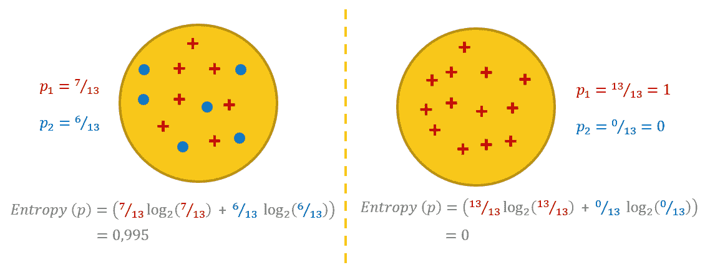

*Figure 2\. Two classes: red crosses and blue dots. Two different datasets. A dataset with a mix of points belonging to both classes (on the left) and a dataset with points belonging to one class only (on the right).*

现在让我们计算这两个二元数据集的熵。

对于左边的例子，红叉类的概率是 7/13，蓝点类的概率是 6/13。请注意，这里一个类的数据点几乎与另一个类的数据点一样多。上面的公式导致熵值为 0.99。

在右边的例子中，红叉类的概率是 13/13 = 1.0，蓝点类的概率是 0/13 = 0.0。请注意，这里我们只有红十字点。在这种情况下，上面的公式导致熵值为 0.0。

熵可以是纯度、无序度或信息量的度量。由于混合的类，左边的数据集不太纯净并且更加混乱(更加无序，即更高的熵)。然而，更多的无序也意味着更多的信息。事实上，如果数据集只有一个类的点，那么无论您尝试多长时间，都无法从中提取多少信息。相比之下，如果数据集具有来自两个类的点，则它也具有更高的信息提取潜力。因此，左侧数据集的较高熵值也可以被视为更大量的潜在信息。

决策树中每次分裂的目标都是从一个混乱的数据集转移到两个(或更多)更纯净的子集。理想情况下，分割应该产生熵为 0.0 的子集。然而，在实践中，如果分割导致子集的总熵低于原始数据集，这就足够了。

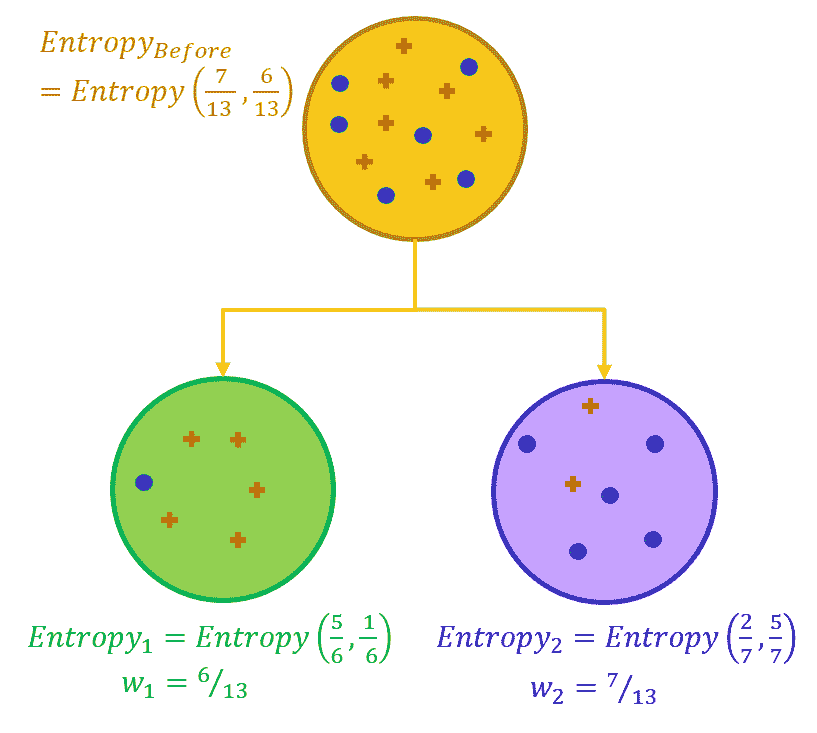

*Figure 3\. A split in a node of the tree should move from a higher entropy dataset to subsets with lower total entropy.*

**信息增益(ID3)**

为了评估一个特征对于分裂有多好，计算分裂前后的熵差。

也就是说，我们首先计算分割前数据集的熵，然后计算分割后每个子集的熵。最后，在分割之前，从数据集的熵中减去由子集的大小加权的输出熵的总和。这种差异衡量的是信息的增加或熵的减少。如果信息增益是一个正数，这意味着我们从一个混乱的数据集转移到一些更纯粹的子集。

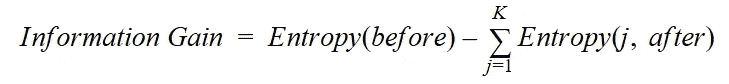

其中“before”是拆分前的数据集，K 是拆分生成的子集数，(j，after)是拆分后的子集 j。

在每一步，我们将选择分割信息增益值最高的特征上的数据，因为这将产生最纯粹的子集。应用此度量的算法是 ID3 算法。ID3 算法的缺点是偏向于具有大量值的特征，从而生成更大的决策树。

**增益比(C4.5)**

C4.5 算法中使用的增益比测量引入了 SplitInfo 概念。SplitInfo 被定义为权重的和乘以权重的对数，其中权重是当前子集中的数据点数相对于父数据集中的数据点数的比率。

然后，通过将 ID3 算法的信息增益除以 SplitInfo 值来计算增益比。

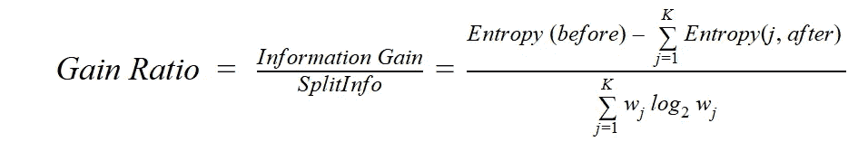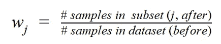

其中“before”是拆分前的数据集，K 是拆分生成的子集数，(j，after)是拆分后的子集 j。

**基尼指数(CART)**

CART 算法使用的另一个衡量纯度——或者实际上是杂质——的指标是基尼指数。

基尼系数是根据基尼系数计算的。基尼系数定义为 1 减去数据集中类别概率的平方和。

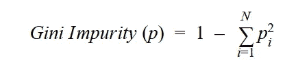

其中 p 是整个数据集，N 是类的数量，pi 是类 I 在同一数据集中的出现频率。

然后，基尼指数被定义为分割后不同子集的基尼系数的加权和，其中每一部分由子集大小相对于父数据集大小的比率来加权。

对于有两个类的数据集，基尼系数的范围在 0 和 0.5 之间:如果数据集是纯的，则为 0；如果两个类平均分布，则为 0.5。因此，具有最低基尼指数的特征被用作下一个分裂特征。

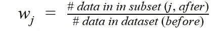

其中 K 是由分裂产生的子集的数量，而(j，after)是分裂后的子集 j。

**识别劈叉**

对于名义特征，我们有两种不同的分割选项。我们可以为训练集中所选特征的每个值创建一个子节点，也可以进行二进制分割。在二进制分割的情况下，测试所有可能的特征值子集。在最后一种情况下，该过程在计算上更加昂贵，但是仍然相对简单。

在数字特征中，识别最佳分割更加复杂。所有的数值实际上都可以是分裂的候选者。但是这将使质量度量的计算成为过于昂贵的操作！因此，对于数字特征，分割总是二进制的。在训练数据中，候选分裂点取在所选数字特征的每两个连续值之间。再次，采用产生最佳质量度量的二元分裂。然后，分割点可以是该特征的两个分区之间的平均值，即较低分区的最大点或较高分区的最小点。

**尺寸和过度配合**

决策树像许多其他机器学习算法一样，可能会过度拟合训练数据。太深的树会导致模型太详细，不能根据新数据进行归纳。另一方面，太浅的树可能会导致过于简单的模型，不适合数据。你看，决策树的大小至关重要。

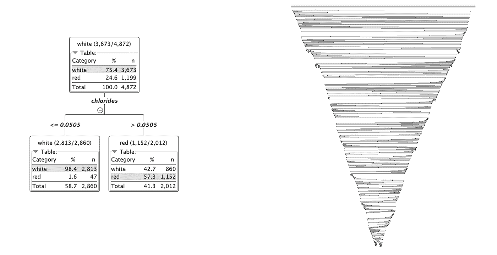

*Figure 4\. The size of the decision tree is important. A tree that is large and too detailed (on the right) might overfit the training data, while a tree that is too small (on the left) might be too simple to fit the data.*

有两种方法可以避免过度特殊化的树:修剪和/或提前停止。

**修剪**

在训练阶段之后，修剪被应用于决策树。基本上，我们让树自由增长到它的设置允许的程度，而不施加任何明确的限制。最后，我们继续删除那些没有被充分填充的分支，以避免过拟合训练数据。事实上，没有被充分填充的分支可能过度集中在特殊的数据点上。这就是为什么移除它们有助于对新的未知数据进行归纳。

有许多不同的修剪技术。在这里，我们要解释两个最常用的:减少错误剪枝和最小描述长度剪枝， [MDL 简称](https://en.wikipedia.org/wiki/Decision_tree_pruning)。

在减少错误修剪中，在每次迭代中，修剪低填充分支，并且再次将树应用于训练数据。如果对分支的修剪没有降低训练集的准确性，则该分支将被永久移除。

MDL 修剪使用描述长度来决定是否修剪一棵树。描述长度被定义为对树进行编码所需的位数加上对训练集的误分类数据样本进行编码所需的位数。当修剪树的分支时，计算并比较未修剪树和修剪树的描述长度。如果被修剪的树的描述长度较小，则保留修剪。

**提前停止**

另一个避免过度拟合的选择是根据停止标准提前停止。

一个常见的停止标准是每个节点的最小样本数。当创建的节点包含的数据样本数量少于或等于最小集合数量时，分支将停止增长。因此，这个最小值的值越大，树越浅，而值越小，树越深。

**决策树的随机森林**

正如我们在开始时所说的，决策树的进化提供了更健壮的性能，从而产生了随机森林。让我们看看创新的随机森林模型与原始的决策树算法相比如何。

多人胜于一人。简单地说，这就是随机森林算法背后的概念。也就是说，许多决策树可以比一个单独的决策树产生更准确的预测。事实上，随机森林算法是一种监督分类算法，它构建 N 个略有不同的训练决策树，并将它们合并在一起，以获得更准确和[稳定的预测](https://cran.r-project.org/doc/Rnews/)。

让我们再次强调这个概念。整个想法依赖于多个决策树，这些决策树的训练略有不同，并且在最终决策时会考虑所有这些决策树。

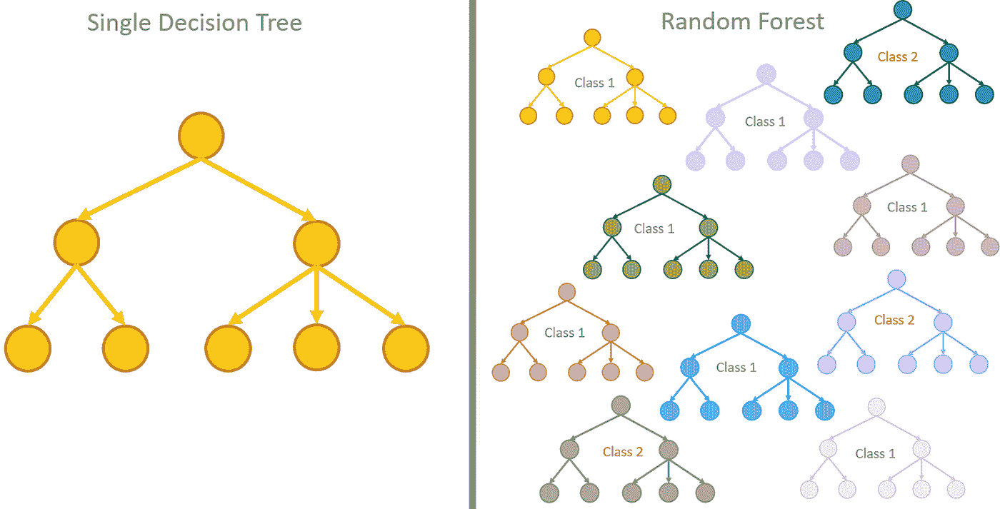

*Figure 5\. The random forest algorithm relies on multiple decision trees that are all trained slightly differently; all of them are taken into consideration for the final classification.*

**训练集的引导**

让我们把重点放在“训练略有不同”

用于随机森林的[训练算法](/ensemble-methods-bagging-boosting-and-stacking-c9214a10a205?gi=edc969d98574)将[打包](https://en.wikipedia.org/wiki/Bootstrap_aggregating)的通用技术应用于树学习者。在整个训练集上单独训练一个决策树。在随机森林中，N 个决策树中的每一个都在通过原始数据集的[自举](https://en.wikipedia.org/wiki/Bootstrapping_(statistics))获得的原始训练集的子集上被训练，即，通过带有替换的随机采样。

此外，作为原始特征集的随机子集，输入特征也可能因树而异。通常，如果 m 是原始数据集中输入要素的数量，则在每个决策树的训练过程中，每次分割时都会考虑随机提取的[m 的平方根]个输入要素的子集。

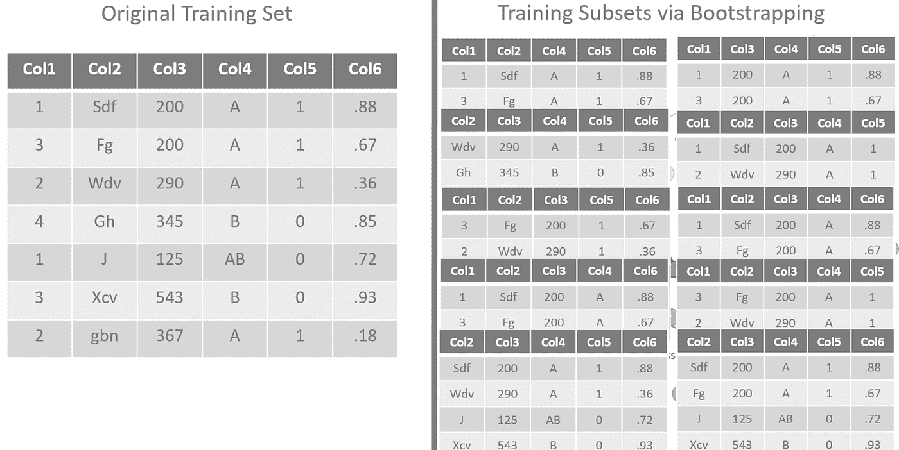

*Figure 6\. The decision trees in a random forest are all slightly differently trained on a bootstrapped subset of the original dataset. The set of input features also varies for each decision tree in the random forest*.

**多数决原则**

对于相同的输入向量，N 个稍微不同的训练树将产生 N 个稍微不同的预测。通常，多数决原则适用于做出最终决定。由 N 棵树中的大多数提供的预测被采用作为最终预测。

这种策略的优势是显而易见的。虽然来自单个树的预测对训练集中的噪声高度敏感，但是来自许多树的大多数的预测则不敏感，只要这些树不相关。自举采样是通过在不同的训练集上训练树来去相关的方法。

**出袋(OOB)错误**

测量随机森林预测误差的一个常用度量是袋外误差。

Out-of-bag error 是对 xᵢ的所有训练样本计算的平均预测误差，仅使用在其引导训练集中没有 xᵢ的树。袋外误差估计避免了对独立验证数据集的需要，但可能会低估实际的性能改进。

**结论**

在本文中，我们回顾了决策树的几个重要方面:如何训练决策树来实现分类问题，使用哪些质量度量来选择要分割的输入特征，以及避免过拟合问题的技巧。

我们还试图解释随机森林算法的策略，使决策树预测更加稳健；也就是说，限制对训练集中噪声的依赖性。事实上，通过使用一组 N 个去相关的决策树，随机森林增加了最终分类的准确性和鲁棒性。

现在，让我们使用它，看看我们明天是否会去航行！

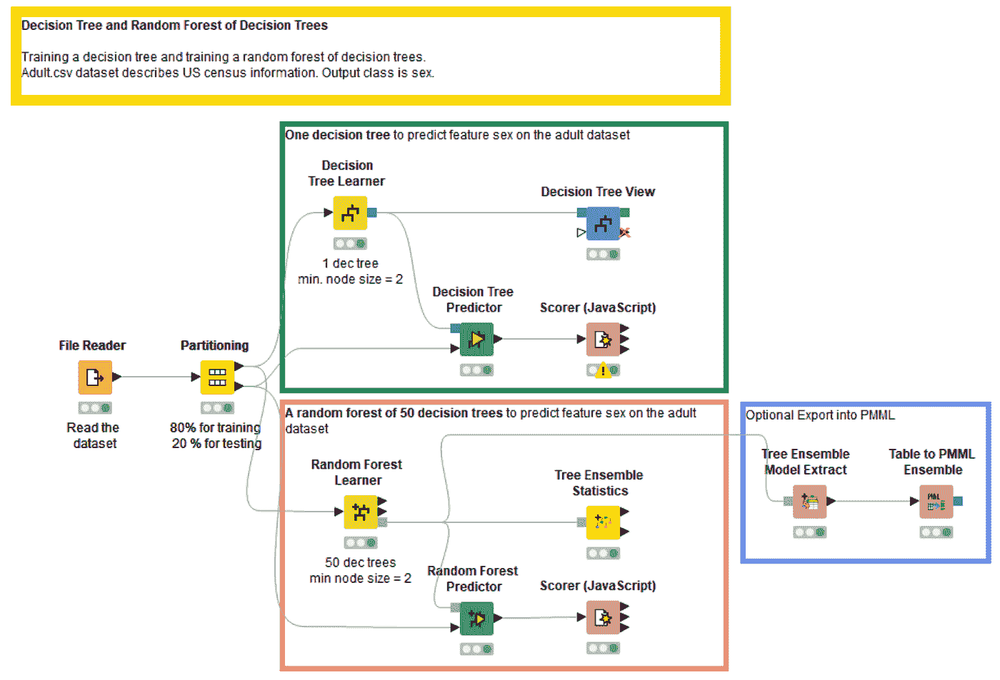

*Figure 7\. The workflow implementing the training and evaluation of a decision tree and of a random forest of decision trees. This workflow can be inspected and downloaded from the KNIME Hub at* [*https://kni.me/w/Eot69vL_DI5V79us.*](https://kni.me/w/Eot69vL_DI5V79us)

**参考**

J.罗斯·昆兰，“C4.5:机器学习程序”，摩根·考夫曼出版公司，旧金山，加利福尼亚州，美国 1993 年

**附录**

你可以在 https://kni.me/w/Eot69vL_DI5V79us 的 KNIME 开源中心找到一个如何训练和评估决策树和决策树随机森林的例子。这个工作流程也显示在图 7 中。

*如首次发表于*[*data versity*](https://www.dataversity.net/from-a-single-decision-tree-to-a-random-forest/)*。*