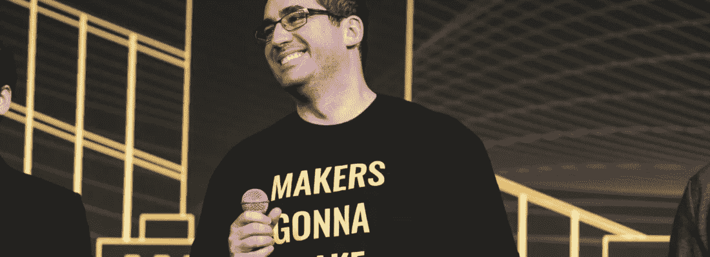
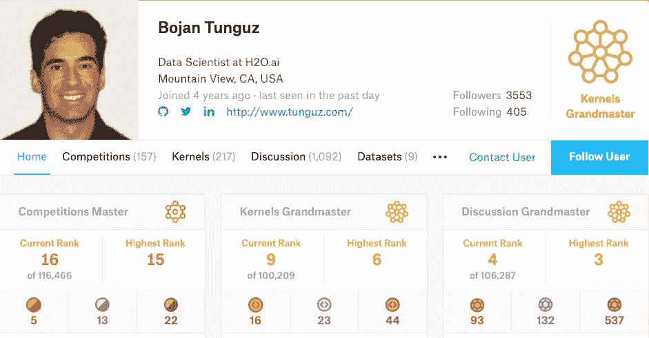
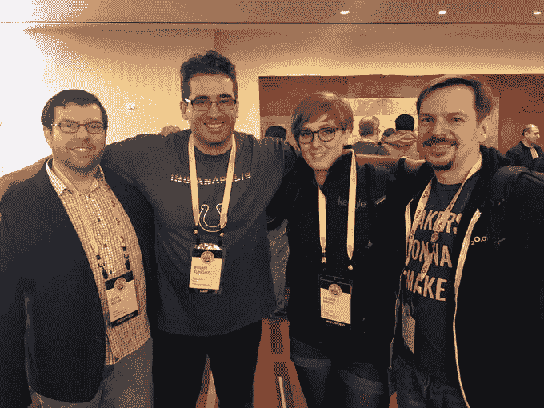

# 从学术界到 Kaggle:物理学家如何在数据科学中找到爱

> 原文：<https://towardsdatascience.com/from-academia-to-kaggle-how-a-physicist-found-love-in-data-science-d57bdc500d04?source=collection_archive---------9----------------------->

## 与 Bojan Tunguz 的对话:数据科学家，Kaggle 双特级大师，理论物理学家

> 我没有选择卡格尔生活。Kaggle 生活选择了我:Bojan Tunguz。

从别人那里学习和获取灵感总是有帮助的。这在数据科学领域更有意义，因为每天都有新的课程、MOOCs 和推荐不断涌现。如此多的选择不仅让人不知所措，有时还令人困惑。带着这种想法，我们在 [H2O.ai](https://www.h2o.ai/) 上揭示了知名数据科学家和 Kaggle 大师的故事，他们与我们分享了他们的旅程、灵感和成就。这些采访旨在激励和鼓励那些想了解成为一名 Kaggle 特级大师的人。

这次我有机会与双卡格大师、物理学家 [**博扬·东古兹**](https://www.kaggle.com/tunguz) 互动。Bojan Tunguz 出生在波斯尼亚黑塞哥维那的萨拉热窝，1993 年移居美国。他拥有伊利诺伊大学的物理学博士学位和斯坦福大学的应用物理学硕士学位。他还在斯坦福大学、德堡大学、罗德学院和伊利诺伊大学等知名大学教授各种物理课程。

博扬离成为三级大师只差一枚单人金牌了，我们希望他能尽快实现这一壮举。

以下是我与 Bojan 对话的摘录:

*   ***你有理论物理背景。从学术界到工业界的转变是如何发生的？***

***Bojan:*** 套用海明威的话，*先突然，后逐渐*。学术工作很难找到，尤其是在理论物理等过饱和的领域。当你是一个移民的时候，这要困难十倍。有一次，我认为安定下来并建立一个家庭比追求难以捉摸的学术任命重要得多。所以我被迫寻找替代方案。最初，我涉足科技写作和小规模桌面制造，但一旦我发现了数据科学，我就迷上了它。数据科学提供了我一直在寻找的科学和技术之间的平衡。

*   ***成为双 Kaggle 宗师有多难。最初是什么吸引了你，第一次胜利是什么时候？***

***Bojan:*** 我目前是内核和讨论方面的**特级大师**，距离成为竞赛特级大师还有一枚单人金牌。这些类别中的每一个都需要不同的技能和敏感度。就技术技能而言，比赛是迄今为止要求最高的。对于讨论和核心，其他技能，如沟通、社交技能、写作和数据可视化是必不可少的。同样重要的是理解 Kaggle 竞赛的动态:什么时候发布什么；以及其他 Kagglers 觉得有价值/有趣/好玩的内容。

[Bojan’s Kaggle Profile](https://www.kaggle.com/tunguz)

自从我决定从事数据科学，我就听说了 Kaggle。认真对待数据科学而不了解它几乎是不可能的。然而，我最初对加入犹豫不决，因为我认为这需要很高的技能水平。然而，一旦我加入了，我意识到这个平台上有很多有价值的资源。讨论，内核，过去的竞争解决方案，在线博客帖子等。可以帮助初学者快速上手。一旦我变得相当优秀，我也开始更频繁地组队，到目前为止，我从每个团队中学到了很多。

大约一年半前，我在 IEEE 相机传感器识别比赛中赢得了我的第一枚金牌。我还在一年前的**家庭信用违约风险竞赛**中获得了第一名。这是迄今为止对我来说最难忘和最棒的卡格尔体验。

> 我最初对加入犹豫不决，因为我认为这需要很高的技能水平。然而，一旦我加入，我意识到这个平台上有很多有价值的资源

*   ***你如何决定参加哪些比赛？***

***Bojan:*** 这很简单:我全部输入！😃不过，我一般都是一次挑一两个。在选择比赛时，我会考虑许多不同的因素。我已经有多少建模管道，需要多少努力才能获得一个好的基线，本地分数和排行榜之间的预测有多稳定，以及对我来说非常重要的是，我可以从集成中获得多大的提升。

*   你通常如何处理一个难题？你有什么喜欢的 ML 资源想分享吗？

我通常会先从小处着手，然后逐步积累。我不会试图马上得到“最好”的解决方案。

我的工具包对 Kaggle 来说是相当标准的:**熊猫**、 **numpy** 、 **sklearn** 、 **XGBoost** 、 **LightGBM** 、 **Keras** 。我在 Jupyter 笔记本工作，我是 J **upyter Lab** 的超级粉丝。

*   ***作为 H2O.ai 的数据科学家，你的角色是什么，在哪些具体领域工作？***

***Bojan:*** 大多数时候，我专注于外向角色，帮助我们的客户解决他们正在处理的数据科学和 ML 问题。我也为 [**无人驾驶 AI**](https://www.h2o.ai/products/h2o-driverless-ai/) 做出贡献，在那里我专注于各种特征转换“食谱”和无监督学习。

*   如果你要和 H2O.ai 的大师们组队，他们会是谁，为什么？

***Bojan:*** 全部！甚至在我加入 H2O 之前，我就已经能够与 Olivier Gralier 合作了，现在我参加的比赛是与 Dmitry Larko 合作。H2O.ai 的许多人都是我多年来一直敬仰的人。现在能够称他们为同事是一种难以置信的荣誉。我的梦想是和尽可能多的人合作。

*   ***你在 H2O.ai 的专业工作中运用到的通过 Kaggle 学到的最好的东西有哪些？***

***Bojan:*** 你从参加 Kaggle 比赛中学到的最重要的“元”技能之一就是能够快速适应和尝试许多不同的事情。此外，由于你的大多数“伟大”想法都有失败的可能性，你要学会至少有一个应急计划，通常是六个。

Bojan(2 from L) during SF Kaggle days ’19\. Seen at extreme right is Dmitry Larko, another Kaggle Grandmaster associated with H2O.ai

*   ***数据科学领域正在快速发展。你是如何设法跟上所有最新发展的？***

***Bojan:*** 这是我一直参加 Kaggle 比赛的主要原因之一。对于每个新的竞争，我可以应用至少一个新的技术、库或框架。Kaggle 竞赛可能是保持你的应用 ML 技能敏锐和与时俱进的最佳方式。

*   你希望在 ML 的哪些特定领域或问题上运用你的专长？

***Bojan:*** 我喜欢 NLP，希望能在这类问题上多花些时间。在某些方面，这些问题最接近“经典”人工智能应该解决的问题。

我也喜欢研究金融科技问题，但以我的经验来看，金融科技仍然比科技更好。我觉得我们仍然只是触及了 ML 在这个领域所能完成的事情的表面。

最近我有幸在 Kaggle 上做得很好的一件事是“纯”科学问题。这些问题从蛋白质分类到仅使用 ML 技术预测标量耦合常数。“纯”科学是另一个先进的人工智能技术可能产生巨大影响的领域。

*   ***给刚刚开始或希望开始数据科学之旅的数据科学有志者一句忠告？***

***Bojan:*** 现在是开始从事数据科学领域工作的最佳时机。在我看来，数据科学是当今最开放的专业领域。无论您是新手还是“经验丰富”的数据科学老手，都有大量资源可以帮助您踏上征程:**信息丰富的教科书、博客和网络研讨会；KaggleMOOCs 在线论坛；开源软件；平易近人的从业者。熟悉所有这些资源。想出一个合理的适合你的计划。培养你的技术技能是很重要的，但是也要投入时间来培养你的“软”技能:写作、交流、网络等等。对自己有耐心，给自己时间成长和发展。不要害怕失败。强调从失败中吸取教训。最重要的是，尽可能地享受旅行的乐趣。**

> 现在是开始在数据科学领域工作的最佳时机。在我看来，数据科学是当今最开放的专业领域。

成为一名 Kaggle 大师绝非易事，需要大量的努力、坚持和专注。话虽如此，也不可否认，没有什么是不可能的。我们只需要用正确的工具把我们的努力引向正确的方向。

# 阅读本系列的其他采访:

*   [***罗汉饶*** *:一个数据科学家从数独到 Kaggle*](/a-data-scientists-journey-from-sudoku-to-kaggle-120876b7fa33) 的旅程
*   [***希瓦姆·班萨尔*** *:数据科学家，负责 Kaggle 上的“数据科学为善”竞赛。*](/the-data-scientist-who-rules-the-data-science-for-good-competitions-on-kaggle-ab436595a29f)

[原载于 H2O.ai 网站。](https://www.h2o.ai/blog/from-academia-to-kaggle-and-h2o-ai-how-a-physicist-found-love-in-data-science/)