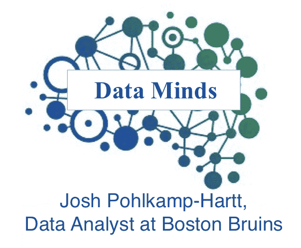

# 从苹果到波士顿布鲁因斯，一个数据专家如何将个人兴趣和职业兴趣结合起来

> 原文：<https://towardsdatascience.com/from-apple-to-boston-bruins-how-one-data-professional-combined-his-personal-and-professional-b28f0336d5d7?source=collection_archive---------27----------------------->

## Josh Pohlkamp-Hartt 分享了他在波士顿布鲁因斯获得梦想角色的五个技巧

波士顿布鲁因斯队是全美曲棍球联合会第五大最有价值的球队，据《福布斯》杂志估计，其价值约为 1B 美元。凭借六次斯坦利杯的胜利，该队年收入超过 2 亿美元。

[乔希·波尔坎普-哈特从记事起就是冰球迷。因此，说服他离开苹果公司的统计员职位并不难，他加入了波士顿布鲁因斯公司，成为一名数据分析师。在苹果工作 3 年多之前，Josh 在皇后大学完成了统计学本科、硕士和博士学位。](https://www.linkedin.com/in/jpohlkamphartt/)

在这篇文章中，Josh 分享了他在职业生涯中学到的五个技巧。这包括把兴趣和技术能力结合起来，心中有目标，学会有效沟通，知道自己的问题空间，培养对学习的热爱。

## **#1 想学什么就学什么，但要确保你把个人兴趣和技术兴趣结合起来**

哪个学位能培养出最好的数据科学家，这个问题在很大程度上与 Josh 无关。在他的职业生涯中，他遇到过各种教育背景的数据科学家。区分最好的人的东西总是他们把他们的兴趣和技术能力结合起来的能力。

对乔希来说，这就是曲棍球。在攻读博士学位期间，他有机会在金斯敦的 OHL 团队工作。它开始是为曲棍球运动员估价的独立研究收集数据的机会。过了一段时间，它变成了创建球员表现的回归模型，并向教练和管理层报告统计数据。对他来说，这是一个很好的方式，可以看到他在课堂上学到的东西转化到现实生活中。这个早期的机会也是他在波士顿布鲁因斯担任目前职务的原因。

如果你对某件事充满热情，你就已经理解了数据以及在这种情况下什么是有意义的。这为您构建模型和执行数据分析提供了优势。

## **#2:心中有一个目标**

在研究生院的时候，乔希知道他没有兴趣成为一名学者。相反，培养解决问题的技能和学习的兴趣是他继续研究生学习的动力。

他一直知道他最终会进入工业界。这就是为什么他开始将在学校学到的东西与现实生活中的经历结合起来，比如与 OHL 团队合作。这也意味着在毕业前一年，乔希没有像同龄人一样申请博士后职位，而是开始准备行业面试。由于做了充分的准备，他得到了美国银行的一份工作。有了这份工作，他在苹果公司的面试变得容易多了，因为他知道他有一个备份。由于这种心态，他能够在毕业后在苹果公司找到一份工作。

当他在苹果工作并获得了重要的行业经验时，他总是把在曲棍球工作的梦想藏在心底。这就是为什么当波斯顿布鲁因斯联系他寻求一个职位时，乔希毫不犹豫地答应了。由于他之前在 OHL 团队工作的背景，以及他在苹果公司的专业资历，他被视为值得追求的高价值候选人。

## **#3:学会有效沟通**

有效沟通的关键在于尽可能简洁明了。“少即是多”这句格言在大多数情况下都适用。

这也适用于模型领域，正如乔希在苹果公司的经历中所学到的。假设较少的简单模型通常在商业环境中更好，因为它们具有可解释性，尽管它们的性能可能会下降。商业利益相关者更有可能信任他们理解的模型，而不是你难以解释清楚的黑箱。

另一个重要的提示是避免以结论开始你的陈述和分析而埋没了线索。换句话说，要有一个清晰的叙述，在叙述中使用金字塔结构(即从最重要的开始，一步步往下)。

然而，同样重要的是要记住，没有尝试和错误，你就无法建立沟通技巧。这就是为什么建议你尽早开始通过博客学习写作，通过加入像演讲会或论文/研究分享小组这样的组织学习公开演讲。

## **#4:了解你的问题空间**

为了更有效地履行你的职责，你需要深入了解你所工作的问题空间。做到这一点的最好方法是学习如何提出好的问题，并成为一个积极的倾听者。这一点尤其重要，因为人们很少能很好地记录文档。在这种情况下，你必须像侦探一样工作，找出隐藏的部落知识。

加入一家公司或过渡到一个新的角色是练习这些技能的特别重要的时间。一个很好的类比是成为一个运动队的新成员。在这种情况下，在你开始持有观点和说出你的想法之前，最好坐下来，观察和了解团队内部的动态。

对于数据科学家来说，很大一部分职责是帮助决策者做出明智的决策。因此，你需要了解他们来自哪里，他们想去哪里。有了这样的背景，你更有可能交付有影响力的结果。

了解您的问题空间的另一个重要领域是数据清理，这是您正在处理的任何问题的重要组成部分。有了领域专业知识，您将更倾向于在数据清理阶段采取某些步骤，这将增加数据集对未来工作的效用。

## **#5:培养对学习的热爱**

数据科学是一个不断发展壮大的领域，因此培养对学习的热爱对你的成功至关重要也就不足为奇了。乔希建议从基础开始，阅读像《统计学习的 T2 元素》这样的书以及你感兴趣领域的基础论文。记住，没有人生来就知道如何阅读研究论文；这些是你通过刻意练习获得的技能。

一旦你有了一个坚实的基础，你就可以扩展到外围，深入研究最先进的技术。 [Arxiv](http://www.arxiv-sanity.com/) 是一个很好的地方，因为它拥有来自世界各地的学者和从业者的大量预印论文。重现这些论文也是理解和加速你学习的一个好方法。

要记住的另一个技巧是避免使用教程提供的玩具示例，而是使用您感兴趣或计划在某个时候使用的真实数据。这将使你更容易度过学习过程中的艰难阶段，并可能激励你将教程扩展到新的应用和见解。

## 《数据思维》是一个系列，介绍处理数据的专业人士。在这个系列中，你将了解他们的日常故事，以及给别人的建议。

## 之前的采访包括来自[红牛](/data-minds-jai-bansal-data-scientist-at-red-bull-afdb141a0e26)、[开门](/data-minds-emily-fay-data-scientist-at-opendoor-50be07f5d7ca)、 [Snapchat](/data-minds-evan-chow-data-scientist-at-snapchat-1bad17861ff8) 、[网飞](/congress-shut-down-so-she-became-a-data-scientist-at-netflix-927de653fe31)和 [Lyft](/lyft-data-scientist-shares-five-pieces-of-career-advice-89784dce64e) 的数据科学家。