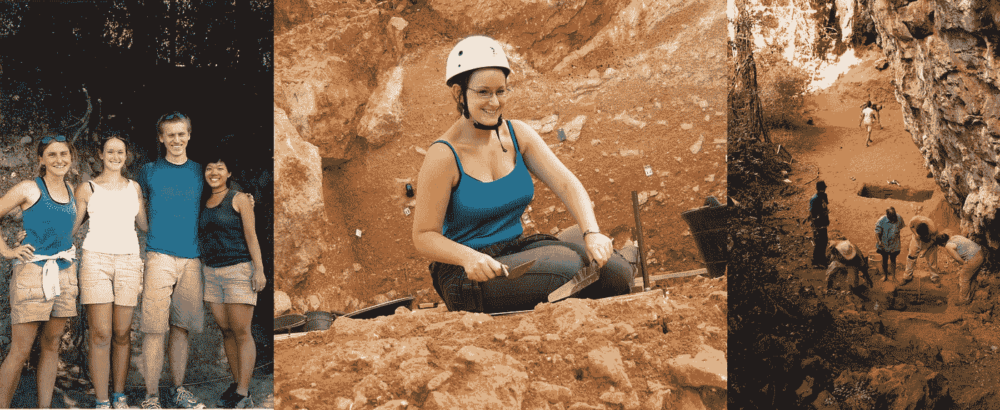

# 我成为数据科学家的旅程:如何构建一条迭代的职业道路

> 原文：<https://towardsdatascience.com/from-archaeology-to-data-science-the-joy-of-iterative-career-paths-632b07f763f5?source=collection_archive---------18----------------------->

## 发现我对数据的热爱

在学校的时候，我并没有打算做什么特别技术性的职业。我参加了数学 A-level 考试，很大程度上是为了摆脱历史和英国文学的论文写作，以及耗时的美术创作。我去了剑桥大学学习考古学和人类学(另一个反复的决定过程，但不是现在)，然后去了牛津大学攻读考古学硕士和博士学位。

Three examples of me as an archaeologist. Left: Monte Polizzo, Sicily, 2006\. Centre: Atapuerca, Spain, 2010\. Right: Lakaton’i Anja, Madagascar, 2012 (right, foreground).

作为一门学术学科，考古学的一个伟大之处在于它是一个多么广阔的教堂。你可以研究任何东西，从罗马花瓶的美学到放射性同位素年代测定，但仍称自己为考古学家。我发现自己更倾向于技术层面(毕竟我非常感谢数学 A-level)。

我感兴趣的领域是人类进化和我们物种在世界各地的最早扩散。我意识到我们对这个话题的很多想法都是定性的——“这个石器看起来有点像另一个石器，所以他们可能是同一个人”。在这里，我决定，这是一个很好的机会来尝试使用，你知道，实际的定量分析，也许可以尝试得到一些实际的答案。

这就是我如何发现自己在考古统计学这个令人难以置信的利基领域的。与其说是一片田野，不如说是一小片肮脏的土地，里面住着我和另外两个考古学的书呆子。但是突然之间，通过将统计学应用到一个全新的领域，我能够发现所有我们以前无法获得的关于过去的重要信息。我的研究反驳了一些之前关于我们认知和文化进化的经典信念，以及关于我们物种首次走出非洲时发生了什么的信念。我对在考古学中严格使用统计学的好处深信不疑。我教考古学的同学统计学。我在会议上发言。我出版了一本关于这个主题的书和一堆论文。

## 试图找出如何拥有一份有影响力的职业

然而，尽管我热爱我的主题领域，我发现自己对缺乏真实世界的影响感到沮丧。利基研究领域(至少是那些没有明显商业或工业应用的领域)的一个问题是，大多数时候，只有少数专家真正从你的工作中受益。

我觉得(现在仍然觉得)有动力去做一些真正有益于现实世界中人们的事情，而不是在学术象牙塔里。正是这种动力让我决定离开学术界。我喜欢我工作中的分析部分，我想继续与数据打交道，但我想去一个能帮助人们解决现实世界问题的地方工作。

这就是为什么我接下来决定加入英国公务员队伍，成为一名统计学家，参加“快速流”(他们为毕业生提供的加速发展计划)——我将继续与数据打交道，但我将利用它来帮助我的国家变得更好。我的第一份工作是在卫生部，为 NHS 研究金融和经济模型。我喜欢着手解决重大的有形问题，但很快发现了其中的权衡——解决全国性的重要问题意味着要应对国家规模的官僚机构，而我发现工作节奏慢得令人沮丧。我已经设法勾掉了我的“数据和分析”和“现实世界影响”框，但还缺少一些东西。

自从搬到伦敦后，我开始发现创业公司的奇妙世界，在参加聚会和会见各种各样的了不起的人建立惊人的新事物后。我想更接近现实，所以当财政部出现一个就风险资本政策向政府提供建议的职位时，我马上就申请了。在这份工作中，我保留了所有我喜欢的关于数据分析的东西，并继续对国家政策产生影响，现在我开始对主题领域增加真正的兴趣。我还将统计和分析应用到一个新的领域，成为我的政策领域 20 年历史中的第一人(企业投资计划(EIS)对启动投资的税收减免，以及相关计划及其缩写(SEIS、VCTs、SITR 和 CITR))，对这些计划进行统计上严格的评估，部分评估结果发表在政府的[患者资本审查](https://www.gov.uk/government/publications/patient-capital-review)的[咨询](https://assets.publishing.service.gov.uk/government/uploads/system/uploads/attachment_data/file/642456/financing_growth_in_innovative_firms_consultation_web.pdf)中。

## 寻找合适的工作环境

我再次发现我的工作很有趣。然而，我仍然觉得这种工作文化并不适合我，而且我离行动还差得很远。我决定尝试在创业公司工作。

我加入了一家 proptech 初创公司，从定价分析师一路晋升到收入和分析主管，再到混合数据产品经理兼首席分析师。我在这里学到了这么多，它可能值得自己的博客帖子。我最自豪的一件事是从零开始建立公司的分析和报告能力，从运行一个混乱的电子表格集合和为其他目的构建的数据库的一部分，到拥有一个为公司每个人服务的报告基础架构，并帮助人们每天做出数据支持的决策。在我最近的职业生涯迭代中，我添加了几个新的复选框——在一个你可以随时尝试新想法的地方工作，这种快节奏的合作文化适合我。然而，我开始觉得我离我真正想去的地方还有一小段距离。

## 走向数据科学

通过与开发人员合作，并更深入地钻研技术世界，我开始发现在数据分析之外还有一个全新的世界，在那里，你可以结合使用数学和编码，通过构建更加智能的模型来解决复杂的问题。有一段时间，我一直觉得在我所处的位置(例如，我设计了一个最近邻模型来估计 Airbnb 房产的夜间价格，但我无法建立一个像我脑海中那样复杂的模型)和我可以看到其他人在做的所有很酷的事情之间存在技能差距，这是我想去的地方(例如，能够自己设计和建立一个预测 Airbnb 未来价格的模型，测试它，然后与开发人员合作将其投入生产)。我发现包含我为自己确定的技能差距的术语是“数据科学”。

我开始尝试在业余时间自学数据科学，但最终我决定参加一个数据科学训练营，让自己尽快熟悉并开始使用数据科学工具。很多人问我，为什么我决定走(更昂贵的)训练营路线，而不是自学；诚实的回答是兴奋加上不耐烦！截至撰写本文时，我正在熨斗学校参加一个全日制[数据科学训练营。这是一项艰巨的工作，但我每天都学到很多东西，并且非常享受。](https://flatironschool.com/career-courses/data-science-bootcamp/online/)

对我来说，我不认为数据科学是一个特定的职业决策。相反，我认为我的整个职业生涯是一个多年的数据科学之旅，我从每一个迭代步骤中学到了很多。不仅仅是关于不同领域的技术技能和知识，还有关于我如何工作以及在职业生涯中对我很重要的价值观。关于这个迭代的职业旅程，每一步都变得更小。我非常兴奋能够完成数据科学技能提升的最后一小步，并开始我作为数据科学家的未来。