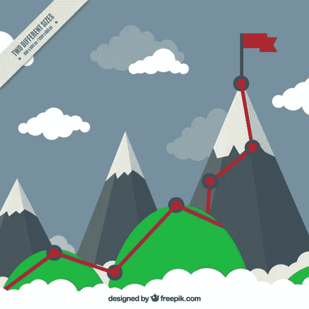
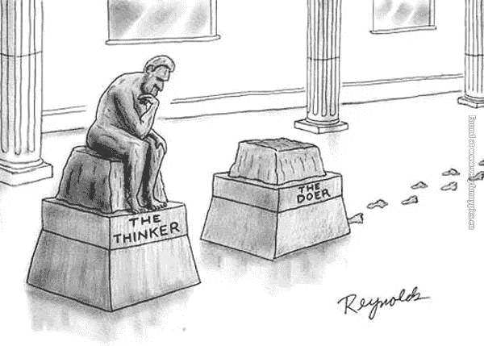
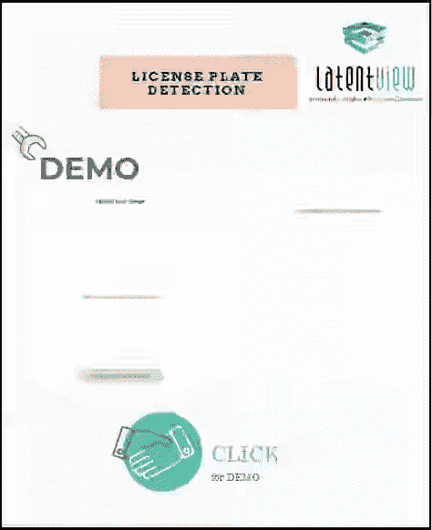

# 从商业智能到数据科学和机器学习

> 原文：<https://towardsdatascience.com/from-business-intelligence-to-data-science-94a1fd866231?source=collection_archive---------11----------------------->

## 记录我从商业智能领域到数据科学和机器学习的转变

我是一名数据科学和机器学习经理，专门为企业的分析需求设计和构建由 DS & ML 支持的解决方案。我现在在这个领域有超过 5 年的丰富经验，和许多人一样，我的职业生涯不是从数据科学和机器学习开始的。当我决定投身数据科学时，我是一名拥有近 10 年经验的商业智能专家。我想分享一下我转行到这个领域的经历，希望能对一些想转行的人有所帮助。

**It’s definitely not this hard**

**I’d imagine it to be something like this**

对于那些不熟悉商业智能(BI)的人来说，它是一个技术分支，使组织能够收集所有可用的历史企业数据，并开始使用它们来制定战术和战略业务决策。由于数据科学和机器学习领域在本世纪初刚刚起步(多亏了在 hbr 发表的文章“数据科学家:21 世纪最性感的工作”[https://HBR . org/2012/10/Data-Scientist-The-sexy-The-Job of-The-21 世纪](https://hbr.org/2012/10/data-scientist-the-sexiest-job-of-the-21st-century)),我感到一种强烈的冲动去驾驭这股浪潮。但后来我觉得这是一个我迟早要做的转变，因为在我看来，这是商业智能领域的逻辑延伸。虽然数据科学&机器学习领域是通过提供关于未来的可操作的见解和情报来给企业带来优势(有些人可能会认为这也是关于现在的)，但商业智能领域也是如此，但使用过去的数据，通过仪表板和可视化技术使用不太复杂的技术。

**Or Maybe, little harder**

也就是说，我想与所有想要成为数据科学/机器学习专业人士的人分享以下几点

1.  **几乎每个数据科学家都是公民数据科学家**

鉴于在行业人才不足的情况下，对数据科学家和机器学习专业人员的需求突然激增，大多数需求都是由从艺术巴赫、心理学等不同领域过渡到 ML & DS 的人满足的。所以永远不要觉得自己在游戏中迟到了。事实上，如果您来自 BI 领域，您可以在 DS/ML 中利用许多现有的数据技能(Pandas Dataframe 操作可以很好地在使用普通 SQL 的关系表上完成)。

显然，即使在达尔文时代，许多科学家都是出于好奇和兴趣从事科学研究的普通人，因此被称为公民科学家。因此，如果你有兴趣和动力，你也可以成为一名公民数据科学家。

**2。拥有结构化的学习路径**

如今 DS & ML 上的 MOOCs 很多。我选择了几门课程的认证。

**Its okay to be slow, but be steady**

1.  华盛顿大学机器学习专业(Coursera)【https://www.coursera.org/specializations/machine-learning T2

这是 Carlos Guestrin 和 Emily Fox 的 4 门专业课，他们创建了 Turi，后来被 Amazon 收购，涵盖了机器学习的所有重要领域——使用 python 进行分类、回归和聚类，这也是我选择这个项目的原因之一

2.deep learning . ai(Coursera)【https://www.deeplearning.ai/deep-learning-specialization/ T4

这是一个深度学习的 5 部分专业，由 Andew Ng 自己提供，解释热门话题的概念——深度神经网络、CNN、序列模型等

3.深度学习专业的 Udacity 纳米学位[https://in.udacity.com/course/deep-learning-nanodegree-nd 101](https://in.udacity.com/course/deep-learning-nanodegree--nd101)

这是一个为期 4 个月的深度学习概念专业，使用 Pytorch，这是当今深度学习研究社区中新兴和广泛使用的 DL 框架之一。我选择这个主要是因为我想坚持使用 Python 风格的框架，以获得更好的适应性。

顺便说一句，这并不是我尝试过的课程的全部，还有很多课程我只完成了一部分，但没有在这里列出。稍后我会在一个独家故事中讲述我所有的课程经历。

**3。做好动手准备**

**Be ready to code, regardless of your title**

虽然这些课程通过一些实际操作项目帮助您获得概念基础，但为了积累专业知识，实践这些概念是很重要的。帮助我的一个活动是参加热门比赛网站的比赛，如 Kaggle，Analytics Vidhya，以了解你的学习情况。例如，我参加了 Analytics Vidhya 的竞赛“贷款预测挑战 III ”,并在总排行榜上获得了第 31 名。[https://data hack . analyticsvidhya . com/contest/practice-problem-loan-prediction-iii/lb](https://datahack.analyticsvidhya.com/contest/practice-problem-loan-prediction-iii/lb)

尽管这是一场操场上的比赛，但它有助于你建立对所学技能的信心。

**4。打开其他学习渠道**

课程是学习的来源之一，但不能是学习的唯一来源。挖掘其他学习资源也是很重要的，这样可以拓展广阔的视野。以下是我从事的其他学习活动。

a)其他在线学习内容——订阅 Udemy 上一位新加坡国立大学研究员的“PyTorch 实用深度学习”。[https://www . udemy . com/practical-deep-learning-with-py torch/learn/v4/content](https://www.udemy.com/practical-deep-learning-with-pytorch/learn/v4/content)"

我喜欢他解释卷积滤波器概念的方式，卷积滤波器是一种在图像中寻找特定形状/模式的滤波器。这为上述课程中学习的概念提供了一个不同的视角。

b)关注该领域最有影响力的人的作品——我关注杰里米·霍华德(Jeremy Howard)的作品——我关注 fast.ai 的瑞秋·托马斯(Rachel Thomas)的作品

你可以在 twitter 上关注他们，或者阅读他们的博客，随时关注他们的作品。因为我选择了基于 python 的框架来学习，所以上面几乎所有的都使用 Pytorch 作为 ML & DS 的框架或基于 python 的库。因此，我的列表可能会有所偏差，但本质上的要点是，你需要追随那些在该领域有最大影响力的人，以便与他们正在做的事情保持一致。

c)阅读博客——关注在 ML & DS 领域做开创性工作的顶级技术公司的博客。我通过 Feedly 选择了以下公司的博客。

脸书人工智能研究(FAIR)，fast.ai，谷歌人工智能博客，AWS ML 博客，开放人工智能博客。无论如何，这都不是一个详尽的列表，但我只是称之为最重要的

**5。不要等着“完美”的 ML/DL 项目落地**

一旦学习完成，甚至当学习开始时，通过在解决方案设计中提出 ML、DL 概念，尝试在当前项目中实施学习内容。根据我与财富 500 强客户打交道的经验，大多数客户不会特别要求 ML/DL 项目。他们的优先事项总是满足业务目标，解决方案的设计和方法完全留给我们。所以，我建议你寻找机会，把你学到的东西运用到实际中去。例如，在我的项目中，我开始使用 ML 实现文本分类任务，使用 DL 实现简单的情感分类器。

**6。做自己喜欢的项目**

除了为客户做项目之外，做自己喜欢的项目对你和公司来说也是一个很好的学习机会。对于 DL 来说尤其如此，因为大多数项目都是文本和图像形式的非结构化数据。因此，从事一些喜爱的项目不仅可以帮助你增长知识，还可以让你的组织注意到你带来的技能，并让你的团队迷上这些概念。

例如，我承担了构建一个原型的任务，使用对象检测技术自动检测汽车牌照。稍后会有更多的介绍，但下面是我和我的团队制作的工具的快照。

License Plate Detection