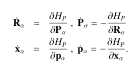

# 从化学家到数据科学家

> 原文：<https://towardsdatascience.com/from-chemist-to-data-scientist-2403de0a5e5e?source=collection_archive---------11----------------------->

Photo by [Chokniti Khongchum](https://www.pexels.com/@chokniti-khongchum-1197604) on [Pexels](https://www.pexels.com/photo/scientist-working-in-laboratory-3938023/)

从小到大，我一直对科学感兴趣。我记得在五年级的时候，我做了一个科学项目，其中包括自制胶水。中学时，我花了一个月的时间阅读有关冰川侵蚀的书籍，并制作了一个小演示，展示给我的地球科学课。2005 年，我开始在布鲁克林的米德伍德高中上学。在我大二的时候，我选修了 AP 化学，这为我以后的学术和职业生涯奠定了基础。我对化学很着迷。化学的规则有逻辑意义，比其他科学课程需要更少的死记硬背。在我高中二年级的时候，我努力参与了学校现有的科学项目。Midwood 提供了 Medsci 和英特尔科学计划等项目，我也加入了这两个项目。Medsci 是为计划被判医学预科的学生准备的，而 Intel 是为想在研究实验室工作的学生准备的。

通过加入英特尔，我开始在长岛大学的一个有机化学研究实验室做志愿者(刘)。在那里，我研究了一种化学治疗剂 Prunustatin A 的合成，但没有成功。够搞笑的是，我看到 2015 年(6 年后)发表了一篇关于这种药物的[完整合成。](https://onlinelibrary.wiley.com/doi/abs/10.1002/ajoc.201500142)

My First of mostly Research Failures ([Source](https://pubs.acs.org/doi/abs/10.1021/acs.orglett.8b02396))

2009 年，我开始在布兰代斯大学读本科，在那里我学习化学，辅修数学，并自称辅修物理。我最后写了一篇关于合成 N-杂环卡宾(NHC)用于温室气体小分子活化的毕业论文。这个想法是使用这些 NHC 过渡金属络合物来捕获天然气水合物气体，如甲烷和二氧化碳，用于清洁能源。

One of the few NHC complexes that wasn’t uncrystallizable rust ([Source](https://pubs.acs.org/doi/abs/10.1021/om301230f))

这导致了第二个作者的出版(我知道，实际上是加冕)。虽然我在大学时的重点是合成化学，但我对数学和物理产生了浓厚的兴趣，这促使我在康奈尔大学阿南思小组攻读化学物理博士学位。

在康奈尔大学时，我致力于开发用于模拟光合作用过程的数学模型。我主要是用笔和纸做数学，用 Fortran 写代码。我研究了量子力学、经典力学、量子化学、统计力学，钻了那么多抽象的数学兔子洞，这就像是美国*的一个场景。*

虽然我很享受在康奈尔大学的时光，但我很早就知道我想在工业界从事定量学科。我热爱我在学术界做的工作，但我根本不觉得我的工作对现实世界有任何影响。我研究的方法是利用量子玻尔兹曼分布的路径积分表示的量子动力学近似的延伸。没错。

或者更简洁地说:

[Try pronouncing this](https://pubs.acs.org/doi/abs/10.1021/om301230f)

[Clearly](https://pubs.acs.org/doi/abs/10.1021/om301230f)

[Proceed with Caution](https://ecommons.cornell.edu/bitstream/handle/1813/59317/Pierre_cornellgrad_0058F_10841.pdf?sequence=1&isAllowed=y)

世界上大约有 5 个人(包括我自己)关心上面的方程式。所以一毕业，我就知道我想要一份对现实世界有一些可实现的影响的工作。鉴于我的定量背景，我考虑了行业中的定量分析师和数据科学家的角色。

从学术界到工业界的转变过程并不容易。毕业后，我在一系列定量分析师、定量研究员和数据科学职位的面试中失败了。尽管我在研究生院学到了很多，但我没有足够的 python 和数据科学经验来在面试中表现出色。我对 Fortran 和 Feynman 路径积分的知识还不够。在工业界，Fortran 就像拉丁语，我只能用它来烦它，费曼路径积分只能和暴力相提并论。

我尽力兼顾论文写作、研究和自学数据科学。我知道数据科学和 python 的基础知识，但我没有足够的应用经验来做好面试。采访中有那么几个瞬间，我觉得自己就像《费城永远阳光灿烂》中的查理一样，在宣扬鸟类法律。

经过两三个月的失败面试，我终于在纽约的一家初创公司找到了一份数据科学的工作。虽然我找到了一份工作令人兴奋，但情况并不理想，因为我基本上是免费工作，并承诺未来的薪酬和公平。我知道从经济上来说这不是一个很好的选择，但从职业上来说，这是最好的选择。我在一家初创公司工作，开发一种工具来检测加密货币交易中的欺诈行为。这份工作节奏快，压力大，迫使我迅速学习 python 和数据科学方法。经过 6 个月的工作，我开发了一个欺诈检测系统，可以实时发出市场操纵警报。

在初创公司工作期间，我积极寻找另一份工作。在那里工作了 6 个月后，“也许有一天我会承诺可能是股票”的价值接近于零。

最终，我以前的化学顾问刘让我联系到了他以前的同事，他当时正在为另一家创业公司招聘研究人员。经过一系列面试，对我的个性、数据科学知识和 python 编程测试进行筛选后，我收到了一份工作邀请。我兴高采烈。免费工作了 6 个月之后，我觉得自己的努力工作和职业成长得到了极大的认可。我受雇于一家重视我现有技能的公司，并投资于我未来的职业发展。一年半后，我有了更多的经验。虽然我还有很多东西要学，但我非常感谢这两家初创公司在没有人愿意的时候给了我一个成长和学习的机会。事后看来，我应该在读研期间采取更多措施来发展我的 python 和数据科学技能。无论如何，我在促成这一转变的过程中感到很有成就感，并对任何经历类似过程的人深表同情。