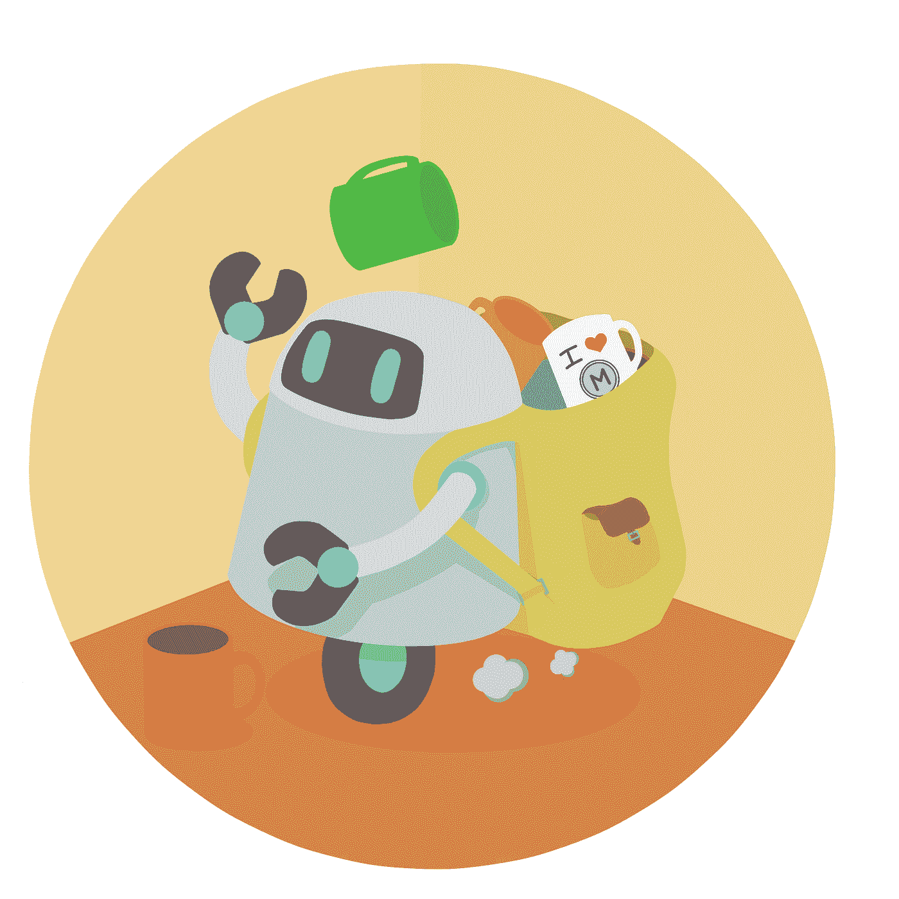
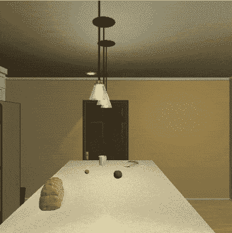
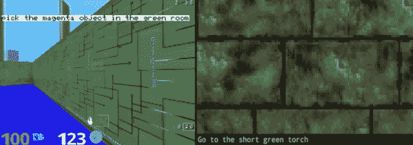
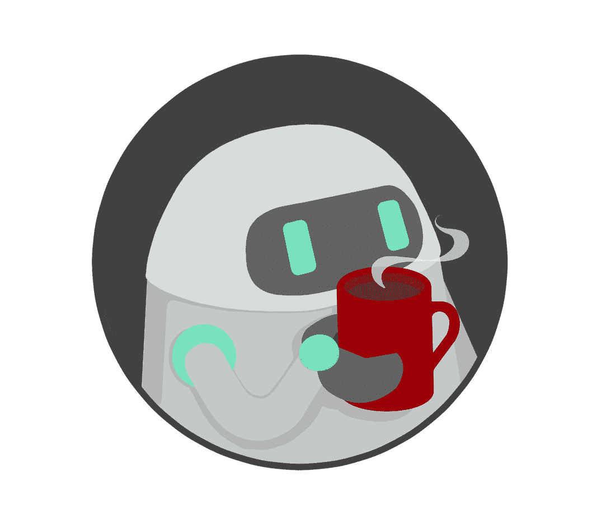
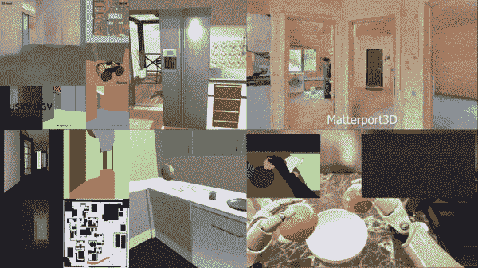
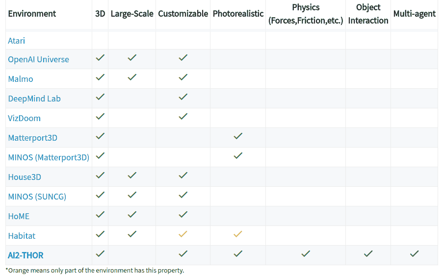
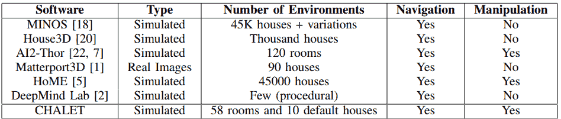
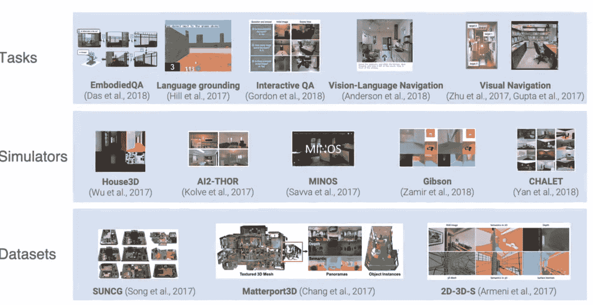

# 从杯子到意识(第一部分):杯子和智力有什么关系？

> 原文：<https://towardsdatascience.com/from-cups-to-consciousness-part-1-how-are-cups-related-to-intelligence-8b7c701fa197?source=collection_archive---------28----------------------->

## cups 中的哲学，语言基础和 3D 环境的调查

在 [MTank](http://www.themtank.com) ，我们朝着两个目标努力。 **(1)在人工智能内部建模和提炼知识。(2)在创造真正智能的机器方面取得进展。**作为这些努力的一部分，MTank 团队发布了关于我们工作的片段，供人们欣赏和学习，完全免费。如果你喜欢我们的工作，那么请表明你的支持。提前感谢！

*   第一部分:杯子和智力有什么关系？
*   [第二部分:从模拟到现实世界](https://medium.com/@TheMTank/from-cups-to-consciousness-part-2-from-simulation-to-the-real-world-a9ea1249e233)
*   [第 3 部分:用 SLAM 绘制你家的地图](https://medium.com/@TheMTank/from-cups-to-consciousness-part-3-mapping-your-home-with-slam-8a9129c2ed58)

# “意识哲学”的争论

> “真正的幸福是在杯底找到的”

> 将 [**Mtank**](http://www.themtank.com) 团队聚集在一起的一个核心想法是我们对构建“*有意识机器*”的兴趣——这是几年前我们开始一起谈论的一个模糊说法。如果有足够的时间，我们团队中的每一组成员，无论配置如何，最终都会将他们的谈话集中在这个想法上。一个我们不会与之抗争的对话重力井。

这些对话并不是我们独有的，关于思想和意识的争论无处不在——**勒内·笛卡尔'** ' *我思故我在*'，**艾伦·图灵的** ' *计算机械与智能'*，**约翰·塞尔的** ' *中文房间辩论*'，**大卫·查默斯'** ' *意识的难题*'，等等。它们是现代和古典哲学思想的主要内容。它们也是现代媒体的主要内容，尽管最初的细微差别经常被压缩成一个通用的终结者盒子。这些想法与推特炒作和现代科技新闻对“机器意识”和“人工通用智能(AGI)”等主题的说法之间有相当大的差异。

当我们看到研究人员认为可以创造一般智力的不同方法时，情况就更是如此了——例如，看到 [**Yann LeCun**](https://twitter.com/ylecun/status/1071442233344344069) 和 [**Gary Marcus**](https://twitter.com/pfau/status/1065656175675478016) 无数次地争论 AGI 需要什么，或者 [**苦涩的**](http://www.incompleteideas.net/IncIdeas/BitterLesson.html) vs [**甜蜜的**](https://twitter.com/shimon8282/status/1106534178676506624) vs [**更好的一课**](http://rodneybrooks.com/a-better-lesson/) 。可以说，对于机器是否会等于或超过人类能力的问题，有近无数的想法、理论、定义和假设的答案。

> 很难确定是什么让一个情报具有普遍性；就单一定义达成一致几乎是不可能的。智力定义不断变化的目标是这个领域本身最有趣的方面之一。哲学家们不断地争论意识是什么，声称它可能是宇宙中最神秘的概念之一，如果不是唯一的话。重力井把我们带到了它的中心。

> 所以所有这些关于意识的东西都非常令人兴奋，但是我们并不打算为这些最深层的问题提供任何答案。我们也无法阐明智力或意识。但是我们能做的是:

A cup in the hand is worth two in the sink, by instagram handle mizumitodepapu

> 教机器人以惊人的速度捡起杯子
> 
> *现实世界中的*。教它对杯子进行推理，用杯子来衡量它的价值，并了解杯子，以及数百个不同家庭中与杯子相关的事情。是的，甚至*你的*。

# 哲学“在每个杯子的底部”

> *一开始，上帝创造了天堂&地球。最后，MTank 创造了收集杯子的机器人。*”

True happiness is found at the bottom of a cup, by instagram handle mizumitodepapu

对，那为什么是杯子呢？

> 从 cups 开始，我们可以抽象出与“意识”相关的困难，并专注于创造真正普遍智能所需的简单、实用的任务(可能是)。对我们来说，**AGI 的一个恰当而实用的定义应该是一台能够完成人类所能完成的大部分任务的机器。**这可以通过环境领域(即所有家务)或一般角色(如农业、烹饪、会计、体育指导等)来缩小。

**还是那句话，为什么是杯子？**

> 因此，正如我们指出的，意识是几个世纪以来，甚至几千年来一直困扰着人类的东西。但是杯子——我们几年前就发现的杯子。在人类发展的整个过程中，杯子一直保持着相对稳定的 T2，它是抵御变化的世界的壁垒，是在时间和地理上稳定的代表。我们喜欢人们紧握着一个不起眼的杯子沉思最大的问题；**我们喜欢杯子随处可见**。

尽管智力是个体的，但它也建立在社会交往的基础上。智能机器将不得不在我们的环境中管理；他们应该适应与现代世界的互动。就我们的目的而言，我们认为家庭环境，即公寓等，将成为一个有趣的落脚点。在这些地方，我们的*代理*可以与人们一起导航一个私密的空间，并(潜在地)在日常生活中帮助他们。

> 此外，最近还发布了一系列非常棒的 3D 家庭环境，我们渴望对它们进行测试！

如果意识是足够复杂的系统的一个突现属性，那么我们希望我们的代理人的意识在寻找杯子时出现。我们希望我们的小家伙思考他来回寻找杯子的过程，思考它的用处，思考它的真正价值——思考他的真正价值。

当然，这可能看起来很牵强，没有证据，说实话，有点残酷——但我们承诺随着时间的推移，调整代理任务的多样性、复杂性和难度。只是为了让这种感觉不会像现实世界中经常发生的那样，被极度的无聊所消灭。

# 捡杯子的原因、内容和方式

**从小做起，从简单做起。**让我们训练化身代理在现实的 3D 房屋环境中导航，同时拿起杯子，让我们随着时间的推移提高速度(显著地)。当你阅读这篇文章时，有大批博士试图编写像手一样的抓取器来抓取任意物体，还有大批工业研究人员和工程师编写机器人来完成越来越复杂的任务；**我们也从这里开始**。

> 我们打算快速迭代，完成要求代理理解自然语言指令、要求我们的代理进行交流、要求我们的代理理解的任务配置。指令、环境和新生的常识共同引导他完成根据我们最深处的欲望而定义的任务，例如“拿起杯子”。

**Note**: Example of task “place cup into the sink” within the AI2Thor environment (see 3D environments later on)

**根据我们的定义，自然语言指导的捡杯子**涉及强化学习(RL)、计算机视觉(CNN 架构)和自然语言处理(NLP)的结合，以进入语言基础领域。

你所说的神话般的语言基础是什么？嗯，根植建立了超越物体物理存在的概念，即使用抽象符号或表示，然后将它们“根植”到现实世界中表示的某种意义。自然语言本身就是这样一种符号系统。

> 为了说明这一点，我们可以用“狗”的概念作为例子。当你在这篇文章中读到“狗”这个词的时候，你可能会清晰地看到一种有四条腿、皮毛和其他没有提到的特征的动物。也就是说，我们对什么是狗有一个“共同点”或理解，并且可以讨论这个概念**，而不需要一直带着一个例子。**
> 
> 我们把“狗”的概念建立在语言的基础上，也就是说，我们把这个词作为动物的抽象等价物来使用。但是它可以是我们同意的任何其他任意符号，不仅仅是一个单词，也不一定是字母 d-o-g 的组合。语言常常是我们理解另一个人的思维过程的方式，它也会让我们与代理人交流。

任何真正的智能(可能)都需要语言能力，无论是共享的还是内在的，以及代理在现实世界中的体现。然后，所述代理可以根据情况调整他们的内部目标和优先级。

> 语言指导是我们训练强化学习系统或策略来完成多项任务的方法之一。我们选择它是因为它使人机交流更加方便，同时也支持多任务学习。

> 最近的工作，像 [**Devendra Chaplot 的**](https://arxiv.org/abs/1706.07230) ，表明语言基础在 ViZDoom 环境中已经触手可及。例如，如果你把一个代理放在一个房间里，房间里有几个随机放置的物体。根据每集开始时作为输入给出的语言指令，代理学习导航到特定对象，同时避开其他对象，例如“去绿色小火炬”。DeepMind 还通过在他们的实验室环境 中向该任务 [**添加关系指令，例如“旁边的物体”或“在绿色房间中”。**](https://arxiv.org/abs/1706.06551)

**Note**: Two successful cases of task-oriented language grounding in 3D environments. Left: DeepMind’s grounding modules in Lab. Right: Gated-Attention in ViZDoom. More complicated tasks have been thought of and performed since the work in these papers e.g. “Place the cup into the microwave and turn it on”

> 这涉及到**多模态输入** — **视觉和语言**(参见我们关于 **'** [**多模态方法'**](https://medium.com/mlreview/multi-modal-methods-image-captioning-from-translation-to-attention-895b6444256e) )因为当代理人在环境中观察杯子时，他必须使用自然语言符号系统来建立单词“杯子”的含义。这个“拾起”实际上定义了现实世界中的一个特定目标。
> 
> 从这里,“杯子”的符号可以被映射——映射到一个主体的特定欲望，或“意义”——在他的视觉系统中寻找杯子的强烈欲望。这样的欲望只是开始。如果我们的代理人有四肢，那么他可能希望操纵杯子并使用他的触觉反馈系统。

我们的代理人将学习**杯子的光滑圆形**，并将“杯子”的符号与他特别喜欢的光滑圆形联系起来。他会开始明白什么是“杯状”。他会在不知不觉中让自己根植于“杯子”的意义，并开始他从杯子到意识的旅程。

# 机器人革命万岁，是吗？

All griefs with a cup of tea are less, by instagram handle mizumitodepapu

> 对于一台机器来说，要实现这个梦想，它需要一个可以玩耍的世界，也就是一个环境。迄今为止，机器人一直被困在严格控制的环境中，大多被囚禁在工厂里。
> 
> 随着*学习机*的加速发展，即将到来的机器人革命不可避免。能够处理模糊性的机器，以及我们家所代表的需求不断变化的复杂和动态的环境。大多数人会欢迎一个机器人来把我们从像吸尘、清洁和摆桌子这样的琐碎工作中解脱出来。这样的例子不胜枚举。

> 那么，这一切的良好起点是什么呢？我们能最终摆脱简单的 2D 雅达利游戏作为我们最强 RL 算法的测试平台吗？简短的回答是肯定的…

在现实世界中对我们的代理人进行培训和试验将是繁琐、缓慢和困难的。然而，通过对典型房间进行足够精确和真实的模拟，**我们可以同时训练数千名代理人完成与现实世界相关的任务**。也有可能为我们不可能处理或重现的罕见边缘情况进行培训。所有这些都可以比实时操作快得多。

因此，我们的目标是从模拟但真实的 3D 家居环境开始，例如厨房和客厅。有了这些，我们可以创建任务来**更好地代表日常问题**，包括一个人最常见的请求(“给我泡茶”、“打扫厨房”、“找到我最喜欢的杯子”)。为了在我们的家中部署这些系统，我们需要将知识和技能从模拟世界转移到现实世界。

> “模拟注定会成功”——罗德尼·布鲁克斯
> 
> “预测:任何你可以模拟和采样无数训练样本的人工智能问题，都可以用今天的算法来解决，如深度和强化学习。”—理查德·索赫尔

# 3D 环境:不仅仅是简单的游戏

各大公司和研究机构已经做出了巨大的努力来发布新的环境，以**应对复杂的 3D 世界中的学习挑战**。与 ImageNet 如何推动计算机视觉的进步类似，这一次我们开辟了一条通往不同的、更广泛的、潜在的多模式革命的道路。一个将带来全新的 RL 和 AI 算法，以及将多项进步结合在一起的方法，例如 [**近期作品**](https://learning-from-play.github.io/) **中的** [**变分推理**](https://arxiv.org/abs/1903.01599) **，** [**世界**](https://worldmodels.github.io/) [**模型**](https://planetrl.github.io/) **，** [**RL**](https://www.youtube.com/watch?v=CaDEf-QcKwA)

****

****Note**: Clockwise from top left: Gibson, AI2Thor, Habitat, UnrealROX, CHALET and House3D (bottom left). Shows examples of typical segmentation and depth masks, interaction, 2D maps, humanoids and other agent types.**

**近年来，3D 环境的发布数量激增，最终达到了与真实世界相似的规模和真实性。这些环境包括[**ai2**](http://ai2thor.allenai.org/)**，** [**HoME**](https://home-platform.github.io/) **，**[**MINOS**](https://arxiv.org/abs/1712.03931)**，**[**ViZDoom**](http://vizdoom.cs.put.edu.pl/)**，**[**house 3d**](https://github.com/facebookresearch/House3D)**，** [**栖息地**](https://aihabitat.org/) 这些环境中的许多都是建立在[**matter port 3D**](https://niessner.github.io/Matterport/)**，**[**SUNCG**](https://github.com/shurans/SUNCGtoolbox)(45K 个不同场景)等的 3D 数据集之上的。这些环境有多种不同的方式，即可定制性、规模、操作、物理和照片真实感。**

# **查看下面的表格！**

********

****Source**: Above: AI2Thor webpage. Bottom: CHALET paper**

> **可以看出，对于 RL 算法来说，这是一个非常激动人心的时刻。我们已经到了可以在越来越多的困难环境和其中的任务上进行测试的地步。对“智能的、越来越自主的系统”的需求增加，产生了培训它们的环境供应，这在推动环境的研究人员和推动研究人员的环境之间形成了一个反馈回路。**

> **也就是说，在 3D 环境的许多变体中，许多具有可测量指标的明确定义的任务将迫使研究人员最终开发出能够学习一些高级感知、预测、推理、自我运动、操纵、基础、启示、抽象、规划、意识的智能体，最终达到我们所谓的“真正智能”。**

> **令人兴奋的是，但是我们从哪里开始呢？**

**这些环境各有利弊，所以我们从 ***倒推我们希望代理做的*** 。例如，拿起杯子，更多的物理和现实是可取的，可定制性对我们来说是非常重要的。由于我们特别关注与环境中物体的互动，我们选定**互动之家** (AI2THOR)作为我们研究的基础。**

**如果‘ai2 thor’不是你的茶(呵呵)，我们创建了一个最热门的 RL 框架和环境的综合列表，你可以探索一下。**可以在我们在 GitHub** 上创建的[**RL-code-resources**](https://github.com/TheMTank/RL-code-resources)**资源库中找到。如果您对选择或列表中的环境有任何问题，请随时联系我们，我们将非常乐意讨论您的想法。****

****

****Source**: Taken from [https://aihabitat.org/](https://aihabitat.org/)**

# **AI2Thor**

> **我们从 AI2Thor 开始，因为它的 API 非常简单。在你的终端上写下“pip install ai2thor ”,这几乎是设置的范围，而且环境本身的界面是用户友好的，有很多定制的可能性。**

**我们很快发现 AI2Thor **不仅有杯子**、**，还允许物体交互**，例如打开和关闭微波炉/冰箱，打开水龙头，以及将杯子和其他物体放入/放在容器上。当我们看到这个环境包含杯子并允许与所述杯子进行简单的交互时，我们就抓住了这一点，因为这是完成我们通过人机共生达到综合感知的令人难以置信的崇高目标所需要的本质。或者至少，我们预见到智能体至少能够识别杯子并向它们导航的能力是我们许多算法的良好起点。**

# ****在 C2C #cuplife 的下期****

**在下一篇博客中，我们将更深入地探讨我们正在开发的界面，以使 ai2 成为一个开放的 ai 健身房环境。这样的界面将允许任务定制，我们的 repo **也包括几个最先进的算法的代码，可以在这些任务上进行训练**。OpenAI 不仅将 gym 作为一套环境，而且作为一种在代码结构中定义它们的通用方法来推广；我们扩展了任务的概念以及它们与环境本身的关系(虽然是独立的概念)。**

> **请随意喜欢我们的材料，跟随我们或和我们一起笑，因为我们开始了谦虚、雄心勃勃、积极、挑衅和轻松的尝试，讲述从杯子到意识的旅程。如果你等不及下一期，你可以关注我们回购的最新消息。**

> ****一定要给我们的回购打个星，恰如其分地命名为**[**cups-rl**](https://github.com/TheMTank/cups-rl)**(可定制的统一物理模拟(CUPS)用于强化学习算法)。否则在这里找到我们，或者在我们的** [**网站**](http://www.themtank.com) **找到我们。****

**一如既往地感谢您的阅读！**