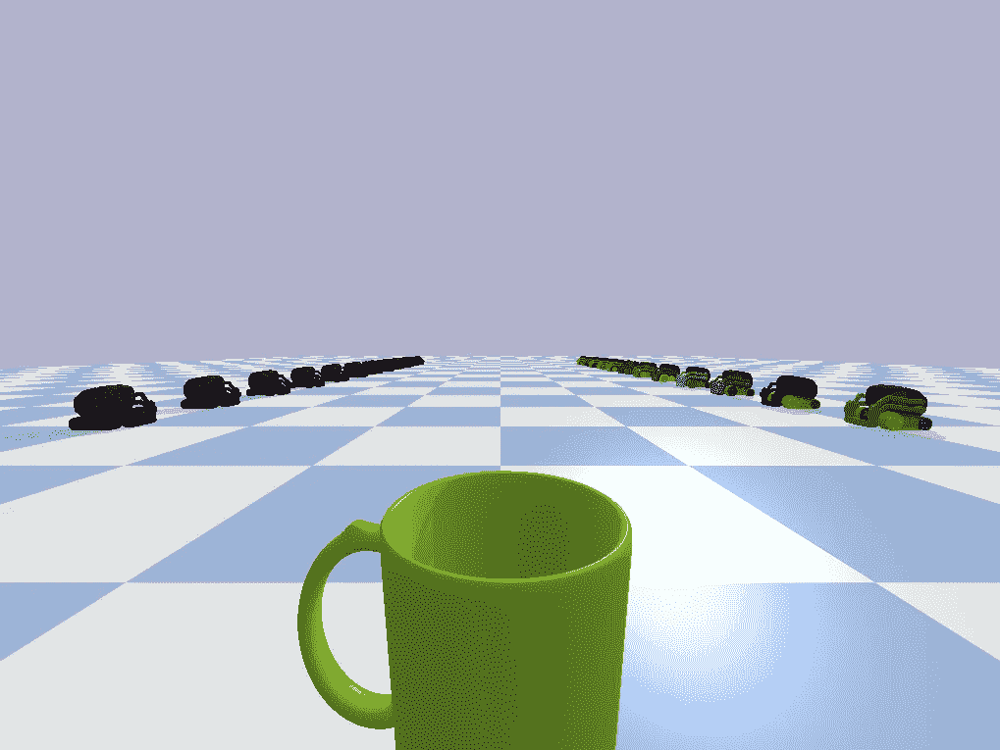
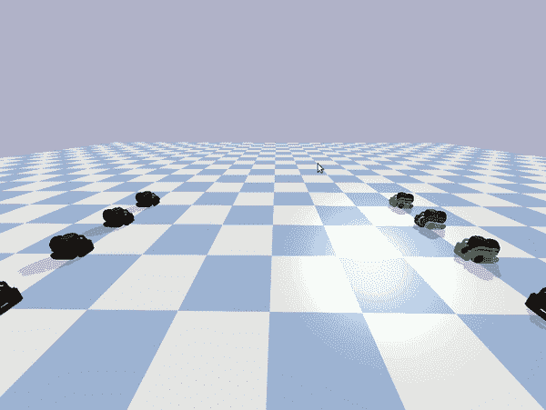
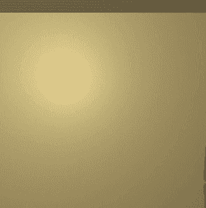
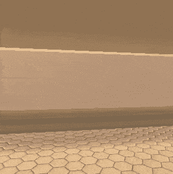
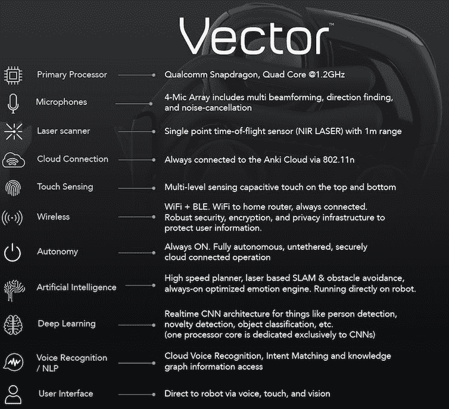
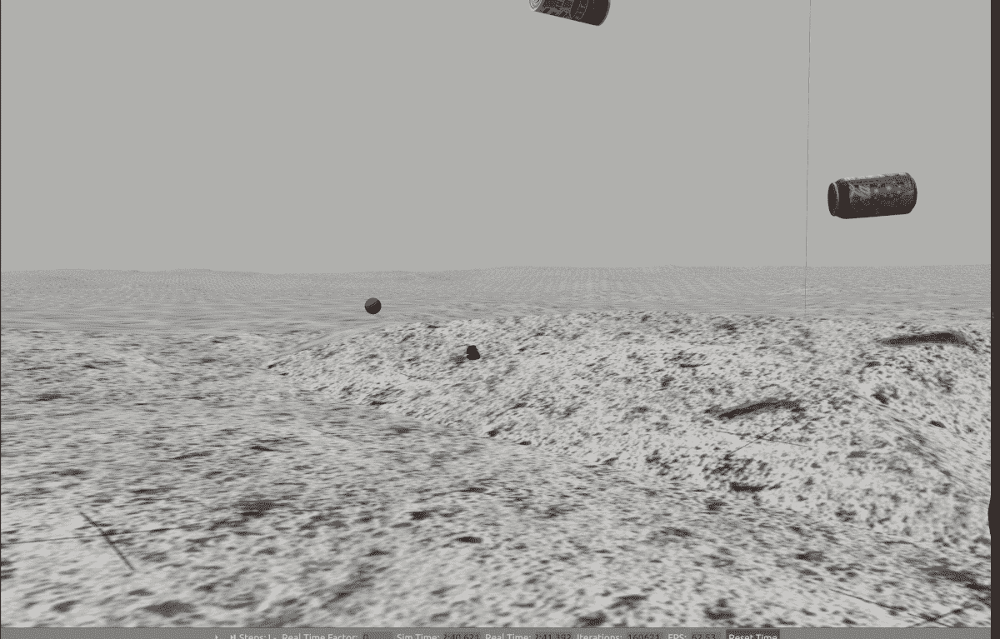
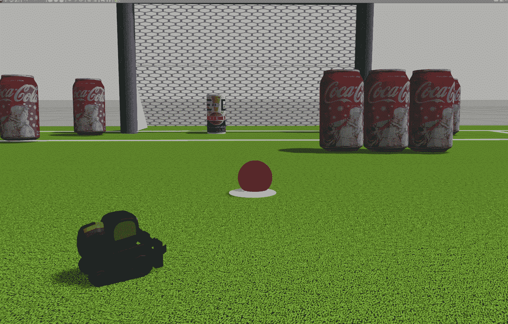
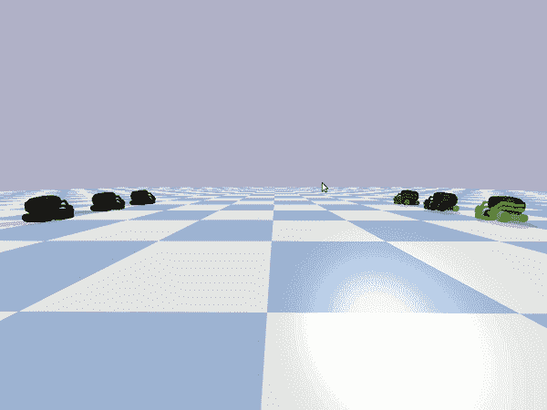

# 从杯子到意识(下):从模拟到真实世界

> 原文：<https://towardsdatascience.com/from-cups-to-consciousness-part-2-from-simulation-to-the-real-world-a9ea1249e233?source=collection_archive---------21----------------------->

## 【AI2Thor 的任务接口，物理模拟和一个名为 Vector 的真实机器人



The moments of suspense as two teams of Vector robots (black vs multi-coloured) face each other before the “battle of the cup” commences. Created using the PyBullet physics simulator.



Round 1: Fight! 10 vs 10 Vectors. Cups fall mid-battle to cause carnage, hence “Cup Carnage”; a violent sport indeed. Scroll down for round 2 with 20 on each team!

在[银行](http://www.themtank.com)，我们朝着两个目标努力:

**(1)在人工智能内部建模和提炼知识。**

(2)朝着创造真正智能的机器前进。

作为这些努力的一部分，MTank 团队发布了关于我们工作的片段，供人们免费欣赏和学习。如果你喜欢我们的作品，那么请通过与其他也会喜欢它的人分享来表达你的支持。提前感谢！

*   [第一部分:杯子和智力有什么关系？](/from-cups-to-consciousness-part-1-how-are-cups-related-to-intelligence-8b7c701fa197)
*   第 2 部分:从模拟到现实世界
*   [第 3 部分:用 SLAM 绘制你的家的地图](https://medium.com/@TheMTank/from-cups-to-consciousness-part-3-mapping-your-home-with-slam-8a9129c2ed58)

> “如果大脑创造了一种感知无线电程序，并用它来指挥有机体的行为，那么什么是倾听呢？而不是像一些泛灵论者认为的宇宙本身，或者像二元论者声称的物理宇宙之外的某个实体，我想说的是，意识体验是我们注意力内容的一个模型:它是虚拟的，是有机体模拟自我模型的一个组成部分，并由注意力导体产生”

## —**巴赫的**认知架构中的[现象体验和知觉束缚状态](http://ceur-ws.org/Vol-2287/paper29.pdf)

# 介绍

在我们的上一篇博客中，我们简要介绍了一些常见的关于意识的思想实验和争论。再一次，我们想提醒你，我们不打算为这些关于意识本质的深层问题提供答案——我们只是专注于很好地拿起杯子。世界级的世界杯选拔赛，以及它对人类的潜在意义。

也就是说，从唯物主义者的角度来看，世界仅仅是由物体及其相互作用组成的 T21。因此，让我们把“对象”放回客观状态，并让我们的代理进入各种环境，开始尝试有趣的任务。在主观世界的任何蛛丝马迹开始潜入它们的“自我模型”之前，我们萌芽中的意识——代理人——必须从某个地方开始。

在这一集里，我们深入探究了我们的特工可能生活的几个世界——我们的小家伙将迈出第一步的地方。他的奖励功能将引导他完成伟大的旅程——从他的模拟进入我们的模拟。我们将谈到我们对令人惊叹的开源 3D 照片逼真环境 AI2Thor 的功能进行扩展的工作，以及将我们的工作引入更具物理真实感的模拟(PyBullet 和 Gazebo)所采取的步骤，我们还将介绍一个名为 Vector 的简单而真实的机器人，它可以解决现实世界的导航问题。

欢呼吧，让采杯开始吧！

# **快速回顾一下**

> 在 [**第一部分**](/from-cups-to-consciousness-part-1-how-are-cups-related-to-intelligence-8b7c701fa197) 中，我们谈到了项目目标、语言基础，并调查了一些 3D 环境。最后，我们详细讨论了名为 AI2Thor 的 [**真实感 Unity 环境。如果你对这些概念不熟悉，或者你想了解我们的思考，你可以在这里找到第一部分。**](http://ai2thor.allenai.org/)

# ai2 存储环境包装

一些人认为，你完全可以通过完成越来越困难和多样的人类任务来到达 AGI。按照这种思路，能够在模拟和现实世界中有效地指定任务，并且能够客观地衡量每个任务的性能，这一点很重要。因为我们想做很多任务，所以我们需要一个**通用接口来定义一组不同的任务，并使其可定制以满足我们所有的需求**。

> 此外，我们希望帮助研究社区的其他人在 3D 环境中训练强化学习(RL)算法，并使他们能够为他们的特定目标修改这些环境。

**输入 AI2Thor 和我们的贡献:**

*   我们创建了一个通用结构，用于定义 AI2Thor 环境中的环境设置和可重复实验。
*   一种在我们的环境中运行通用 RL 算法的简单方法，同时遵循 OpenAI Gym 环境接口(step()和 reset())。
*   任务界面旨在允许更快地创建不同的奖励功能和任务定义，即任务的核心和灵魂，例如“拿起杯子”。
*   基于策略和价值的算法基准示例(A3C 和 Rainbow ),带有大量注释说明，有助于用户理解算法背后的细节和数学，以及如何在我们的环境中运行它们的完整过程。请关注下一篇博客，我们将在那里对此进行更深入的探讨。

> 最终，我们希望能够对来自整个开源世界的不同最先进(SOTA)算法进行基准测试。我们试图尽可能多地保留原始源代码，但也对它们进行了调整和微调，以适合我们设计的任务。但是让我们利用 gif 的力量从抽象的想法走向现实。



**Note**: Example task of “put the cup in the microwave” which can be made within our task interface.

上面我们可以看到一个简单任务的执行，在一个模拟的厨房里， ***把杯子放进微波炉*** 。我们看到，在 AI2Thor 中，家庭环境是复杂和现实的，加上与环境的互动是相当丰富的。在下面的图片中，我们看到一个浴室场景，一个特工在训练捡起我们用 Unity 游戏引擎放在地上的杯子。



**Note**: An example of an RL agent training on our “NaturalLanguagePickUpMultipleObjectTask” in one of our customised scenes (edited with Unity).

# 简化任务定义的包装器

我们的包装器(【https://github.com/TheMTank/cups-rl】)试图通过实现相应的 gym env 子类，使 AI2Thor 可用作 **OpenAI gym 环境**。我们还包括一些任务、代理培训和脚本的示例，以简化学习过程。我们正在不断改进它，以提供更好的用户体验，但这是迭代的，所以请耐心等待。

> 健身房环境提供了恰到好处的抽象，因此可以通过在每集开始时调用 reset 函数和 step 函数在每一步向环境提供您的操作，以通常的 RL 方式运行您的实验，如下所示:

> 如果你想“按原样”使用环境，这**是非常强大的**，**但是我们发现当试图在保持这个简单界面的同时使它可定制到许多任务时，这是有问题的**。遵循 gym 的建议，我们应该定义一个尽可能通用的环境类，然后从这些基类中的一个或几个继承，为特定的任务定制环境。

> 我们认为这个过程对于我们的用例来说可能过于复杂，因此我们决定采用一种不同的方法来使它对我们来说更加直观。我们希望对我们有意义的东西，对最终用户来说也更容易理解。我们相信，当目标是数百个任务和数不清的“任务变化”时，这是更具可伸缩性的，但仍然希望保持环境的重要、公共部分，在所有任务之间共享。

# **相同界面，更多控制**

基本环境和该环境中的特定任务之间的自然划分将我们分为两大类:'**ai2 torenv**和' **BaseTask** '。这里的目标是将我们对 AI2Thor 的包装与奖励函数的细节以及为特定任务重置环境的细节分离开来。

*前者包括场景的细节，将要考虑的对象，像分辨率或灰度格式这样的图像细节。后者包括该特定任务所需的初始化/重置条件，以及在每一步观察到的奖励的计算。*

我们为什么要这样做？

> 这样，用户可以独立于环境细节定制和创建任务**。我们通过将基本任务划分为它们的目标的子类，并依靠底层环境代码来运行并在任务间保持不变来实现这一点。**
> 
> 同时，我们确保用户不必为了实验定义而将他的思想分成独立地考虑环境和任务。我们通过使用单个配置文件来指定环境和任务参数来实现这一点。

**作为一个例子**，如果我们想要改变任务存储库上给出的示例任务来拾取杯子，而不是像在健身房环境中通常做的那样，从环境中创建一个新的子类并修改 step 和 reset 函数(可能添加大量的样板文件和意大利面条代码，可能还有一些 bug ),我们将创建一个新的任务类，如下所示:

## 然后轻松修改配置文件，在几秒钟内改变环境和任务条件:

Change the task to pick up (and put down) apples as fast as possible instead

任务和配置组合允许“任务变化”，例如 PickUpTask 允许您指定“苹果”或“杯子”采摘或两者兼而有之；每一项都是相同的任务，但都有特定的变化。

> 如果所有这些关于包装器、任务和通用代码接口的讨论让你感到兴奋，那么不要犹豫去尝试一下。请随意添加一个问题，或者您自己的拉动请求，包括新的任务，这样您就可以将您的结果与其他人进行的同类实验进行比较。您可以随时给我们发电子邮件，询问任何问题或要求澄清。

> 我们希望 GitHub [README](https://github.com/TheMTank/cups-rl#cups-rl---customisable-unified-physical-simulations-for-reinforcement-learning) 能提供足够的信息，但是请随时联系我们，因为我们会很快回复。从您那里获得反馈将有助于我们使它更加强大，并可能使更多的人在方便的时候使用它进行自己的实验和环境定制。所以不要害羞！

# 模拟物理是通往真实世界机器人的道路

****我们的现象体验对我们自己来说是非常真实的，但我们的自我却不是真实的。换句话说，当托诺尼和科赫(摘自他们 2015 年关于综合信息理论(IIT)的论文)认为只有物理有机体才能有意识体验，而模拟不能时，他们完全搞反了:物理系统不能有意识，只有模拟可以。”****

***巴赫的** [**现象体验与感性束缚状态**](http://ceur-ws.org/Vol-2287/paper29.pdf)*

> *AI2Thor 提供了一组不同的照片真实感场景和一个简单操作的物理引擎，通过它我们可以测试我们代理的泛化能力；然而**我们总是渴望**对环境的每一部分有更精细的控制和物理真实感。*

*例如，**完全指定我们代理的身体**的能力:传感器、致动器、关节、链接等。此外，我们希望这些部件能够与丑陋的物理现象相互作用，这可能会导致我们的机器人摔倒，或者在非常令人沮丧的情况下，上帝保佑，甚至打破一个杯子。*

*希望这样，我们至少可以避免打破真实的世界杯。*

*这种程度的真实性和对环境的控制使我们能够更接近于最终将这些算法部署在真实的机器人中，在真实的家庭中。让我们能够以外科手术般的精度控制附属物，并随着时间的推移改善对象操作，例如，机器人手指穿过杯柄或使用勺子微妙地倒糖。*

> *但在此之前，让我们介绍两位最新的团队成员，他们非常适合测试我们早期的假设:Vectors **00301ed1** 和 **00a10115。***

**

# ***介绍我们的第一只机器人豚鼠 Vector***

*他可能很小，但对于我们想要测试的许多常规任务和算法来说，他是完美的。机器人公司 Anki 从 Cozmo 开始，最近随着他们著名的 [kickstarter 活动](https://www.kickstarter.com/projects/anki/vector-by-anki-a-giant-roll-forward-for-robot-kind)转移到 Vector。*

*我们必须跟上潮流，因为它有强大的 python SDK 和从您的台式机/笔记本电脑设备运行任何 python 代码的全部功能，即从 vector 接收状态信息(图像、3D 姿势、电池等)，并向机器人发送适当的命令(将左轮向前移动 50 毫米，充电)。*

> *这让我们可以在真实世界和 Vector 的世界中自由测试许多最先进的算法，例如同步定位和映射(SLAM)、主动 cup 识别、路径规划导航到 cup 或 RL 纯端到端方法等。*

**

***Note**: Full specification of Vector. It’s incredible the amount of things that can be fit on such a small and inexpensive robot; truly jam-packed.*

***此外，我们试验了一个** [**ROS**](http://www.ros.org/about-ros/) **包，它将允许我们管理来自传感器、致动器的独立控制，并使用强大的库来处理导航和感知问题，例如路径规划和 SLAM。***

> *能够模拟矢量也很重要。我们发现 Anki 慷慨地分享了他们的设计文件(OBJ 和 MTL 格式)。我们还创建了相应的 URDF/SDF 文件，我们可以与你分享，这样你就可以玩向量，即使不买他！这些允许我们在模拟中模拟机器人的物理交互。*

*在本博客的第一部分中，我们介绍了许多不同的 3D 环境，重点是照片真实感和其他特性，但是除了 ai2 之外，很少有其他的具有广泛的物理特性。即使是阿尔托的物理学对于我们的需求来说也是有限的。了解了这一点，我们知道我们必须找到一种方法来增加我们模拟的物理真实性，例如，通过指定力、扭矩、关节、摩擦和详细对象的惯性。*

*好奇什么样的模拟在物理精度、控制和定制方面是绝对最好的？嗯，研究了一段时间后，我们最终选择了 [**PyBullet**](https://pybullet.org/wordpress/) (也像 ai2thor 一样易于安装，“pip install pybullet ”)和 [**Gazebo**](http://gazebosim.org/) (它是为用 ROS 控制的机器人设计的)。使用这些工具我们可以获得多少功率和控制的示例可以在下面的多个不同环境中的模拟矢量中看到(使用 URDF/SDF 文件):*

**

*Physics simulations can literally bring us to the moon. Try to casually handle that edge case in the real world! Created with Gazebo and ROS.*

**

*GOOOOOOOOOOAAAAAAAAL! Created with Gazebo and ROS.*

**

*And now we’ll leave you with round 2! The final round of “Cup Carnage”. 20 vs 20 Vectors. At the end, we see that one Vector got to run away with his cup into the far distance, clearly making this a win for the multi-coloured team. Created using PyBullet.*

# *解构通往具身 AGI 的道路*

*老实说，我们不知道我们会在哪里结束。我们不断地重新规划、完善和重新确定我们的目标，并愿意快速转向最有前途的技术，以增加机器人在世界上捡起杯子的数量；**我们真正的关键绩效指标** (KPI)。*

*为了最大化这个 KPI，我们不断地讨论人们可以分割 AI 问题的许多方法(“分而治之”)，以及在我们的代理设计中选择哪些抽象来帮助我们向通用机器迈出微小的一步(例如，无模型与基于模型，PyTorch 与 TensorFlow)。例如，一个有趣的划分是将一个机器人(甚至一个人)的*硬件*分成几组**传感器**和**致动器**，两者都使*软件*分别执行**感知**和**控制**。以下是对此观点的一些思考，以及我们计划如何使用这些抽象:*

***感知***

*就人类的感知而言，主要的感官是视觉、触觉、听觉、嗅觉和味觉。后两个对我们的机器人来说是一个不寻常的起点，而前三个似乎是最重要的。*

*更具体地说，视觉可能是最有用的起点。为了在我们的代理中实现“视觉”，我们将使用我们的 [**计算机视觉专业知识**](http://www.themtank.org/a-year-in-computer-vision) 来部署诸如对象检测、深度估计、SLAM 和对象姿势识别等技术，以使我们的代理能够了解他所生活的世界。触觉和听觉会及时出现。也许有一天，我们的代理人会感受到一杯新茶的温暖，或者听到水壶烧开的声音。*

***控制***

*在控制端，对于取杯任务，我们将其分为**导航**和**抓取**。我们接下来的几篇博客将关注导航到特定位置和特定物体(如杯子)的艺术。在这之后，我们将抓住杯子，举起它，轻轻地把它放在新的位置。在每一种情况下，我们都有更传统的技术以及更现代的“学习”方法供我们使用。*

# ***下一期 C2C (#cuplife)***

*在我们的下一篇博客中，我们将讨论我们在 cups-rl 报告中的一些任务上运行的两个 SOTA RL 算法。这应该向读者展示我们打算如何使用它来对不同的算法进行基准测试，当然，还有发现、挑选和囤积许多许多杯子。无模型 RL 范式中政策和基于价值的方法之间的史诗般的战斗。*

*可供选择的两种算法是: **A3C** 和 **RainbowDQN** 。你会把钱押在这些硬汉中的哪一个身上？跟随我们的媒体去寻找答案吧！*

```
*P.S. we changed priorities and decided to get our feet very wet in mapping algorithms like SLAM in part 3 of this blog. We realised that understanding where you are located and having a map is a universally useful and a fundamental pillar for many tasks for our embodied agents and for them to understand their environment and clearly AGI embodied agents will need to be able to do this. However, check out the repo for the code for these A3C and RainbowDQN RL models. What can we say, the road to AGI is long, winding and treacherous. We must be willing to adapt fast. Check out part 3 [here](https://medium.com/@TheMTank/from-cups-to-consciousness-part-3-mapping-your-home-with-slam-8a9129c2ed58)!*
```