# 从杯子到意识(第三部分):用 SLAM 绘制你的家

> 原文：<https://towardsdatascience.com/from-cups-to-consciousness-part-3-mapping-your-home-with-slam-8a9129c2ed58?source=collection_archive---------9----------------------->

## **SLAM 简介，深入了解 SLAM 前端和传感器套件**

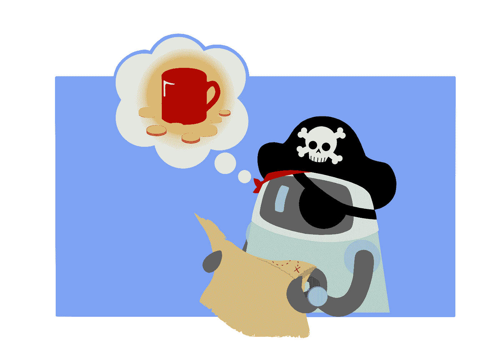

Our favourite animated robo-mascot treasure hunting for cups with his map. By instagram handle mizumitodepapu

在 [MTank](http://www.themtank.com/) ，我们朝着两个目标努力:
**(1)在 AI 内部建模和提炼知识。(2)朝着创造真正智能的机器前进。作为这些努力的一部分，MTank 团队发布了关于我们工作的片段，供人们欣赏和学习，完全免费。如果你喜欢我们的工作，那么请表明你的支持。提前感谢！**

*   第一部分:杯子和智力有什么关系？
*   [第二部分:从模拟到现实世界](https://medium.com/@TheMTank/from-cups-to-consciousness-part-2-from-simulation-to-the-real-world-a9ea1249e233)
*   第 3 部分:用 SLAM 绘制你的家

# 介绍

> *“你所需要的只是一个计划、一张路线图和朝着目的地前进的勇气”*——厄尔·南丁格尔

在本系列的前一部分中，我们谈到了通往 AGI 之路是如何被分为感知和控制的。在控制范围内，导航和抓取是构建用于家务的通用机器人路线图的关键部分。但是正如柴郡猫在《爱丽丝梦游仙境》中对爱丽丝说的那样，

> 如果你不知道你想去哪里，你走哪条路真的重要吗？

这是两部分中的第一部分，我们将讨论我们的**看似被绑架的机器人如何找到他们的方位**。我们是什么意思？从他们的角度来看，每栋房子都是他们被扔进或突然醒来的神秘地方。正如人们可以猜测的那样，这一发现过程几乎完全属于感知领域，从逻辑上讲，这也是我们应该开始的地方。一个人必须先**感知** **，然后才能相应地**行动，包括了解你的周围，绘制你的环境，即了解哪里是什么，哪里是“被占领的”，哪里可以畅通无阻。

> 考虑一下制造能完成一般任务的机器人的第一步。忘记让机器人做单一的任务，例如，用 roomba 打扫地板，用 alexa 告诉你时间，还有一个烤面包机器人。为了执行一般任务，我们需要我们的机器人知道它的环境，即识别什么是障碍，以及东西在哪里，并使用这些信息来导航和完成任务。

似乎很简单。

# 模拟中的映射

在第一部分中，我们介绍了我们挑选杯子的哲学动机和愿望，并介绍了一组模拟的 3D 房屋环境。在[第 2 部分](/from-cups-to-consciousness-part-2-from-simulation-to-the-real-world-a9ea1249e233)中，我们介绍了 ai2 house 环境的包装器、一些强化学习(RL)实验和两个名为 PyBullet 和 Gazebo 的特定物理模拟，使我们能够将机器人向量放到月球上。

知道了**映射是我们的下一个里程碑**，我们自然开始在 PyBullet 模拟中实现初始映射。由于 PyBullet 包含深度和彩色 RGB 图像，以及相机的姿态(位置和方向)，我们可以使用来自虚拟相机的深度信息来**将每个 2D 像素转换为其在空间中的 3D 坐标，创建所谓的点云。**

> 使用该点云，我们可以创建一个网格数据结构，定义机器人可以移动到哪里以及机器人周围的障碍物在哪里，即占用网格。这种深度图像，到点云，到占用网格管道是计算机视觉和机器人学中非常常见的操作。

扩展一个官方的 PyBullet 代码示例，从深度信息创建一个点云，我们能够在模拟的厨房中获取地板上和屋顶下的所有点。由此，我们创建一个占用网格，每个网格单元显示**10 cm2**区域的可能可通过性。这样，网格中的每个区域都被分配了一个被占用的概率。事实上，这是机器人导航最常见的格式和方法。

**Note**: Our own simulated PyBullet kitchen and living room with dynamic objects (e.g. beer bottle, bowl, cup, etc) and occupancy grid mapping with exact pose information. Within this GIF, we also present a semantic object occupancy grid map, mapping aggregation and a simulated robot with 2 wheels and a caster wheel moving around the living room with depth and segmented views displayed from the viewpoint of the robot. The semantic map describes which grid cells are occupied by specific objects. The aggregation combines the information from 3 viewpoints (local maps) into one merged map.

## **那么我们学到了什么？**

这教会了我们很多关于占用网格、传感器模型以及将多个视点聚合到一个大的占用网格中的知识。但是上面提到的一切都是使用 PyBullet 提供的相机的精确姿势(位置和方向)找到的。我们知道接下来有必要找到一种方法**在世界**中定位代理的姿势，特别是在真实世界中。

正如我们在[上一篇博客](/from-cups-to-consciousness-part-2-from-simulation-to-the-real-world-a9ea1249e233)中提到的，我们决定从模拟转向**首先让算法在真实机器人上工作**。一个简单的原因是:与虚拟场景相比，真实摄像机会出现更多问题。

> 在未来，为了扩大我们的机器人可以处理的任务、杯子、水壶和环境的数量，我们肯定需要模拟。但是现在，真实的世界杯选拔赛每次都胜过黑客帝国风格。如你所见，通往 AGI 的道路漫长、曲折且充满危险。这一切都始于首先找到自己。

# 同步定位和绘图(SLAM)

> “直到我们迷失了，我们才开始发现自己” —亨利·大卫·梭罗

使用已知的定位(映射问题)创建地图*相对来说*容易，在已知的地图内定位*也相对来说*容易(定位问题)。两者都有许多解决方案和变体，但是如果我们既没有机器人的姿态，也没有地图，会怎么样呢？也就是说，当我们不知道自己身在何处时，如何创建环境地图？

这个，*相对*来说，**就没那么容易**了。

> 回到我们被绑架的机器人，他刚刚被放在一个未知的房间里。一睁开眼睛，它怎么知道自己在哪里？大多数人会自然地使用他们周围的参考地标，即床、电视的角落、开着的门，来粗略地定位他们自己在环境中的位置。映射和本地化是密不可分的，它们相互需要，就像烤面包需要黄油一样，本质上是一个鸡和蛋的问题。

为了以极快的速度拿起杯子，并在机器人从未见过的家中操作，它应该能够在环境中定位自己，同时绘制地图，即找到世界各地的三维位置。这就是为什么在我们的旅程中，我们不可避免地到达了**同步定位和绘图(SLAM)** 领域。

> SLAM 研究可以通过用于解决问题的传感器套件进行分类(稍后将详细介绍)。例如，您可以使用一台相机(或一组相机)通过在环境中检测到的地标来找到机器人的姿势。但是当灯关闭时，你可能不相信这些相机的弱点，或者视觉场景可能会令人困惑，在这种情况下，你可以使用雷达来代替。或者，就像大多数制造自动驾驶汽车的公司一样，如果你需要一个更可靠的传感器，可以发现距离你数百米远的物体的高细节，你可以使用昂贵的激光雷达。

**没有一种传感器可以解决我们所有的问题。**我们将需要将许多传感器结合在一起(即传感器融合),以寻求建造能够以我们能够理解的方式理解世界的机器人，同时保持低成本。为此，我们决定将精力集中在视觉算法上。即基于摄像机的 SLAM，或如文献中所命名的视觉 SLAM (V-SLAM)。

两年多前，我们在我们的[计算机视觉报告](https://www.themtank.org/a-year-in-computer-vision)中提到了 SLAM，现在我们很高兴有机会真正深入这项迷人的技术。如果您正在寻找一篇好的评论，或关于最新技术的详细信息，我们推荐:

*   *SLAM:基本算法* [*第一部分*](https://people.eecs.berkeley.edu/~pabbeel/cs287-fa09/readings/Durrant-Whyte_Bailey_SLAM-tutorial-I.pdf) *和* [*第二部分*](https://ieeexplore.ieee.org/document/1678144?denied=)
*   [*视觉里程计和视觉 SLAM 概述:移动机器人学的应用*](https://link.springer.com/article/10.1007/s40903-015-0032-7)
*   [同时定位和绘图的过去、现在和未来:走向健壮感知时代](https://arxiv.org/abs/1606.05830)

# 典型 SLAM 系统的架构

一个典型的视觉 SLAM 算法有两个很容易并行的主要部分，这意味着即使两个部分互连，它们也可以独立运行。根据文献，我们将这些称为“前端”和“后端”。

## **前端**

**前端**将传感器数据抽象成易于评估的模型。它负责预处理输入，以及检测和跟踪相关的标志，以估计我们观察它们的姿势序列。

在 VSLAM 的情况下，实现这一点的算法是视觉里程计(VO)，它本质上是根据显著的视觉特征来计算两帧之间的相对姿态(变换)。

最常见的方法是从一帧中提取关键点(例如使用 SIFT、ORB ),然后**在下一帧中匹配这些相同的关键点**或者**用光流**跟踪它们。此外，在匹配/跟踪来自不同位置的那些观察到的关键点时，这些算法的性质可能导致错误数据关联的误差，因此通常在之后应用另一种算法来移除可能的离群值，这些离群值可能会将附加误差传播到我们的估计，例如随机样本一致性(RANSAC)。

另一个重要的考虑是，如果我们持续跟踪**每张图像**的每个显著点，我们将消耗大量的内存，包括大量的**冗余信息**。出于效率原因，通常仅观察到所有图像的子集，这些“关键帧”由选择算法选择，同时仅在关键帧之间匹配和跟踪观察到的特征。一个简单的关键帧选择算法是每第 5 或第 10 帧取一个，但其他方法只涉及如果图像与前一帧相比有足够大的变化就添加一个关键帧(例如，测量变化的视差或关键点移动的距离)。

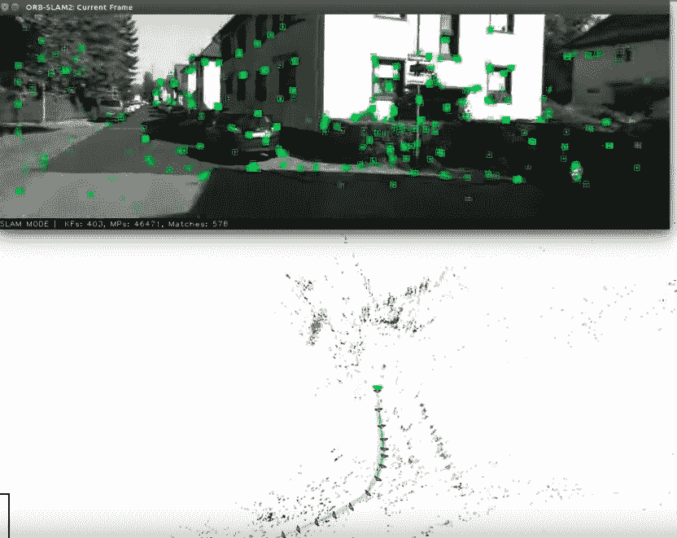

**Source**: [ORB-SLAM in the KITTI dataset (Sequence 00) YouTube link](https://www.youtube.com/watch?v=8DISRmsO2YQ) **Note**: The top view is from the KITTI dataset with ORB features overlayed from ORB-SLAM2\. On the bottom we see top-down trajectory in green but only the blue frustums are keyframes. In red are the features which are tracked.

**Note**: By adapting a simple VO example in Python (from [here](https://github.com/uoip/monoVO-python)) and by using every 10th frame as a keyframe we were able to get reasonably good results on a sequence in one of our houses. The top down trajectory is shown on the right on the black background as we go around a table 3 times with the camera attached to a chair. But this example was carefully cherry-picked; other sequences didn’t show as reliable results on the trajectory estimation. In general, the algorithm suffers from severe drift problems, e.g. by using only every 5th frame as a keyframe this caused caused the drift errors to accumulate much faster. This per keyframe error can be blamed on many factors e.g. calibration, initialisation or monocular scale issues.

此外，我们可以计算两个连续点云之间的转换(例如，使用迭代最近点(ICP)算法的点云配准)来定位代理的轨迹。

**Note**: [Pointcloud registration](https://en.wikipedia.org/wiki/Point_set_registration) is about finding the transformation from one pointcloud to the other so that they overlap and align together in a way that makes most sense. The GIF shows the resulting point cloud (yellow + blue) after the registration step is performed, i.e. one of the point clouds (yellow) is transformed to be aligned to the other one (blue: which is the reference to align to), optimising the transformation so that overlaying this transformed point cloud onto the reference represents a single scene as consistently as possible. This obviously implies some overlap and consistency between both pointclouds. This relative transformation between two frames/pointclouds can be the basis of RGB-D or LiDAR odometry. For reference, a famous algorithm for computing this registration is called Iterative Closest Point (ICP).

此外，我们可以使用在图像中发现的特征的较低维度的表示，而不是它们的完整描述，例如通过使用“视觉单词包”方法(DBoW ),其创建可能特征的字典，并将图像转换为由可能特征(或字典中的“单词”)的组合形成的向量，用于更压缩的表示。然后，这可以用于位置识别/重新定位和循环闭合。

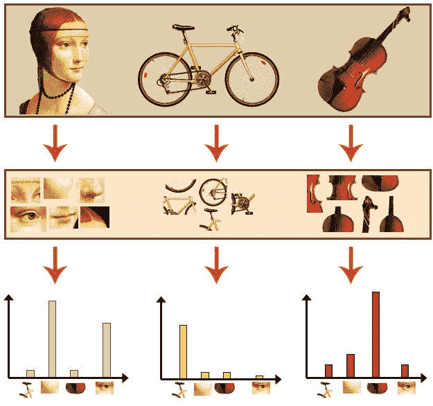

**Source**: [Bag of Visual Words in a Nutshell](/bag-of-visual-words-in-a-nutshell-9ceea97ce0fb) **Note**: First row are the images, the second row are the image patches from these images and the third row are the histograms “bag of visual words” in a simplified four word dictionary.

## **后端**

**后端**通常是使用从前端提取的所有信息的组件，以便构建、扩展和进一步校正机器人的轨迹和地图。它包括几个算法，如束调整，其目标是通过在一对以上的帧上实施重投影一致性来纠正错误。它还扩展到使用估计的不同姿态生成和优化图形，以及比较由前端存储的视觉单词包，以完成重新定位和循环闭合。

> 闭环包括当机器人识别出先前看到的位置时对图形进行修正。利用这些信息，我们可以减轻在整个 SLAM 过程中可能遇到的累积“漂移”误差。

为了让您更清楚地了解这些不同部分如何相互作用，这里是我们最喜欢的 SLAM 系统之一的高级架构。

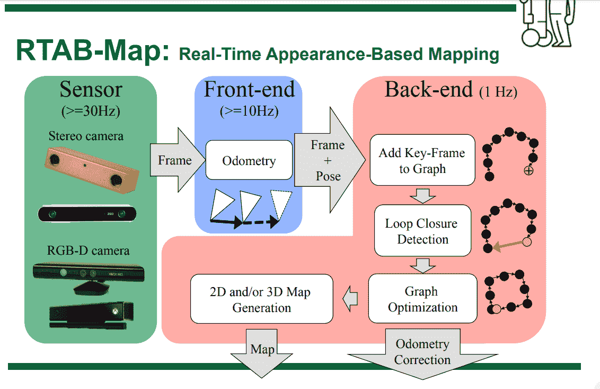

**Source**: [RTAB-Map slides](https://introlab.3it.usherbrooke.ca/mediawiki-introlab/images/3/31/Labbe2015ULaval.pdf) **Note**: Without the back-end, SLAM essentially reduces to odometry. RTAB-Map is an amazing SLAM algorithm that works out of the box and creates a dense pointcloud and an occupancy grid. It can be used with an IMU, stereo camera and an RGB-D camera (more on what these sensors do below)

# 传感器套件:单声道、立体声、RGB-D、IMU

不言而喻，不同的传感器配置可以使 SLAM 的任务更容易或更困难。通常，你的传感器提供的信息越多越好，但是对于额外的传感器，你还需要以一种巧妙而有原则的方式合并和融合它们的信息。从计算角度来说，这可能会变得非常昂贵。理想情况下，通过使用多个传感器，它们的优点和缺点相互抵消，系统变得异常稳定，但这种选择通常需要权衡。

**单目** SLAM 涉及使用单个摄像机作为 SLAM 相应算法的输入。这受到比例问题的影响，即从单目 SLAM 系统的角度来看，如果相机相应地缩放，我们无法区分普通家庭和“[玩偶之家](https://twitter.com/Rainmaker1973/status/1185156216315695105)”之间的大小差异。这个比例问题可以通过各种方式解决，例如良好的初始化程序或使用物体的已知长度或真实世界的距离。尽管处理这些缺陷在算法上可能更加繁琐。就机器人硬件和架构而言，拥有单个传感器是一个非常简单和优雅的解决方案。一些著名的例子是 MonoSLAM，ORB-SLAM 和 LSD-SLAM。

**Note**: Example of tracking points using a monocular camera.

从初始位置(从红色图像)的一组“n”个观察点(在这种情况下是房子上的 4 个)，我们在场景中移动并捕捉第二个图像(以绿色突出显示)。使用匹配算法，我们可以在第二幅图像中找到第一幅图像上观察到的点，并使用该信息来计算相机的运动(里程计)和场景的结构(观察点的 3D 坐标)。来自运动的结构(SfM)是另一个著名的领域，与单目 SLAM 有许多相似之处。通过查看关键点在两帧之间移动了多少，我们可以计算第二帧中相机的外部变换。

我们发现我们的一台 RGB 摄像机的水平视场(FoV)非常小，为 69.4 度，如果移动太快，可能会导致跟踪失败。更大的 FoV 理论上允许即使在更长的位移之后也能跟踪相同的关键点。在未来，我们还将试验更宽 FoV 的相机，如鱼眼镜头相机，它在给定的时间内观察更大的区域，因此与较窄 FoV 的相机相比，在以更高的速度跟踪观察到的场景方面，可能会使我们的生活变得更容易。

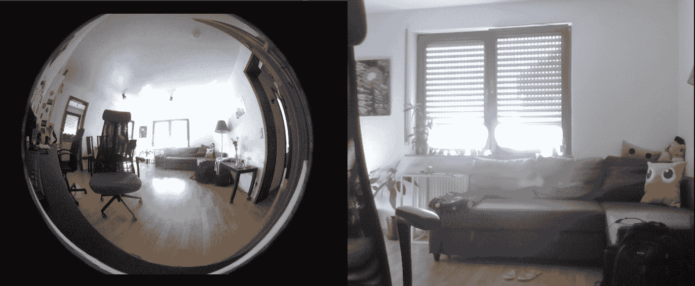

**Note**: With a common laptop webcam we can barely capture the center of the living room (right), whereas the 200 degree wide angle camera (left) allows us to look at the entire living room, part of the kitchen on the left and also a small peek into the bedroom after the corridor to the right.

**立体视觉**涉及使用两个摄像头来寻找场景的结构。从不同的已知位置同时拍摄两幅图像具有显著的优点。例如，在单目 SLAM 中，匹配发生在不同时间的两幅图像之间，这意味着在这些时间之间，场景中的任何对象都可能移动，这将完全破坏视觉里程计计算，而在立体视觉中，匹配是在同时拍摄的图像之间进行的，即不需要移动。然而， **stereo SLAM** 实际上大多数 SLAM 仍然会有这个“动态对象问题”,因为它们仍然必须跟踪跨多个帧拍摄的相同特征。流行的立体声灌篮是 VINS 融合或软式灌篮。

此外，典型的匹配算法需要在计算上昂贵的匹配搜索，但是由于在这种情况下摄像机的相对位置是已知的，我们可以将两个图像投影到一个假想的平面，以便使搜索更容易并且防止匹配上的一些错误。这个过程称为立体纠正，如下图所示。

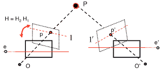

**Note**: The dotted rectangles represent the original unrectified images. The [epipolar lines](https://stackoverflow.com/questions/17607312/difference-between-disparity-map-and-disparity-image-in-stereo-matching) help on matching by constraining the search to the epipolar lines marked in solid red. The solid black rectangles represent the rectified images, in which the epipolar lines are all parallel to the horizon, allowing for a more efficient search of possible matches.

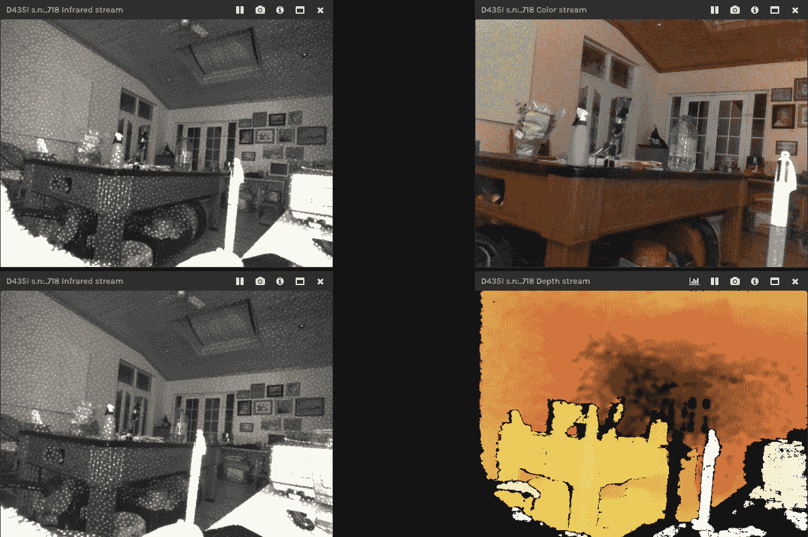

**Note**: Example of the left and right stereo infrared images (from the RealSense D435i camera we bought in the top and bottom left) with a calculated disparity image on the bottom right and colour image in top right. If you alternate closing your left eye and right eye, you should observe that objects closer to you appear to jump in position more compared to objects further away (see the pen in both infrared images being in different positions). This is essentially how stereo vision can calculate disparity/depth (bottom right). The pen is so close that it gives a blind spot to one camera from calculating disparity in certain parts of the disparity image. Calculating this disparity from two (preferably rectified) stereo images essentially computes the inverse depth map which can be visualised with a colour map going from white to yellow to red, in which white represents close distances and yellow is further away.

**被动对主动。**立体视觉不一定非要用被动式 RGB 相机计算视差图，也可以做主动式立体。主动立体将光束投射到世界上，通过使用变形模式，它可以帮助提高深度的准确性。更多关于整流和有源与无源立体声的信息[在这里](https://github.com/IntelRealSense/librealsense/blob/master/doc/depth-from-stereo.md)。

**RGB-D** **SLAM** 通常指 SLAM 系统的输入是彩色和深度图像时。深度可以通过使用商业深度相机来实现，商业深度相机通常包含立体相机，但是如何检索和优化的细节留给深度相机的内部。由于具有这些像素的深度信息，RGB-D SLAM 能够计算密集图，即包括所有可见像素的密集图。与上述稀疏特征(即少量关键点)相比，这代表了可以在密集地图中使用和显示的丰富信息。在下一篇博客中，我们将介绍 RTAB 地图(之前展示的架构)，这是一个优秀的 RGB-D SLAM 系统，但其他著名的例子包括 [KinectFusion](https://www.microsoft.com/en-us/research/wp-content/uploads/2016/02/ismar2011.pdf) 和[kintinulous](https://github.com/mp3guy/Kintinuous)。

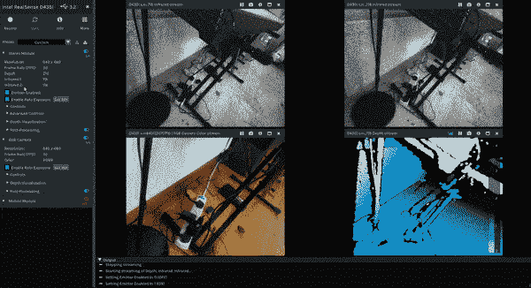

**Note**: We bought the RealSense D435i depth camera from Intel. Above is the RealSense viewer. In the color RGB image (bottom left) we can’t see as much in dark areas compared to the infrared images (top 2) which can see better in the dark. Also enabling and disabling the emitter will show or remove the white projected dots. The emitter improves depth accuracy (you can see as it turns off and on in the depth image in the bottom right) and is good for textured areas. One can disable the IR emitter and use the infrared cameras as a typical stereo pair but it is grayscale only.

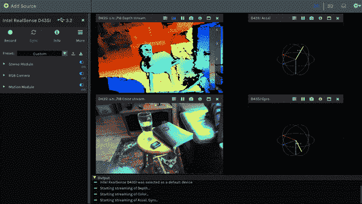

**Note**: The depth accuracy is high and it works out of the box. Active stereo RGB-D cameras works better at low light as well as night time. The camera also contains an internal IMU and we can see the accelerometer and gyroscope display on the right. Half way through, we switch to the 3D point cloud viewer.

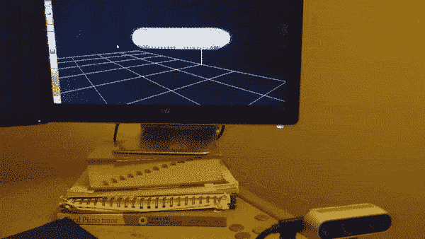

**Note**: An example of the RealSense rs-motion program which demonstrates how a Complementary Filter can be used to estimate orientation but not position on the D435i using the inbuilt IMU only.

**惯性测量单元(IMU)** 通常包含加速度计和陀螺仪(有时还包含磁力计)。在 D435i 包含的 IMU 中，第一个测量加速度，第二个测量角速度，两者都测量 3 个自由度(DoF ),从而在这个 6 DoF IMU 中形成 6 DoF。许多其他变体也是可能的，例如，内置的磁力计将使其为 9 DoF，更简单的 3 DoF IMUs 通常用于自动驾驶汽车。

> 然而，从这些中提取位置涉及双重积分(因为加速度的积分是速度，而速度的积分是位置),甚至现有技术的解决方案也涉及大量的定位偏差，这些偏差将随着时间的推移而显著累积。这就是所谓的漂移，也是为什么 IMU 定位系统通常需要结合视觉反馈来减少漂移。
> 
> IMU 的主要用途是根据原始数据以高频率计算机器人的方位。例如，在我们的 D435i 中，加速度计可以设置为 250Hz(每秒 250 次测量)，陀螺仪可以设置为 200Hz，并且可以对原始数据使用滤波器(例如卡尔曼或互补滤波器)来计算 IMU 的方向。

当你在 VO 系统中增加一个 IMU，就叫做**视觉惯性里程计(VIO)** 。如果您选择并仔细调整正确的 VIO 系统，还有许多方法(松耦合和紧耦合)可以输出几乎“无漂移”的定位。我们推荐“ [**用于飞行机器人**](http://rpg.ifi.uzh.ch/docs/ICRA18_Delmerico.pdf) 的单目视觉-惯性里程计算法的基准比较”论文，以了解使用 IMU 的顶级 VIO 或 SLAMs 的概况。在下一篇博客中，我们将谈论一些伟大的 VIO 系统，如 VINS-Mono 和 ROVIO。

所有 SLAM 狂热者可能都梦想最终的 SLAM 系统能够处理任何情况(弱光、低纹理、快速运动、循环闭合、遮挡、动态对象和场景)，并且仍然非常健壮。我们称这种神秘的神话生物为**“跑酷满贯”**。

虽然这可能是纯粹的废话，只是一个荒谬的梦想，但适用于快速无人机的算法，如这些 VIO 系统，接近速度和灵活性的要求。因此，也许其中一个可能是我们正在寻找的跑酷大满贯，或者也许在未来的某一天，我们梦想中的大满贯将会到来。这个博客系列的第 4 部分将是我们试图找到这个街头顽童 SLAM 算法，用技术问题无情地测试它，并奖励一个 SLAMdog 百万富翁 100 万美元。

**Source**: [ROVIO YouTube](https://www.youtube.com/watch?v=ZMAISVy-6ao) **Note**: Incredibly fast movements, could this be our ultimate champion SLAM, the Parkour SLAM?

# 基于功能与直接

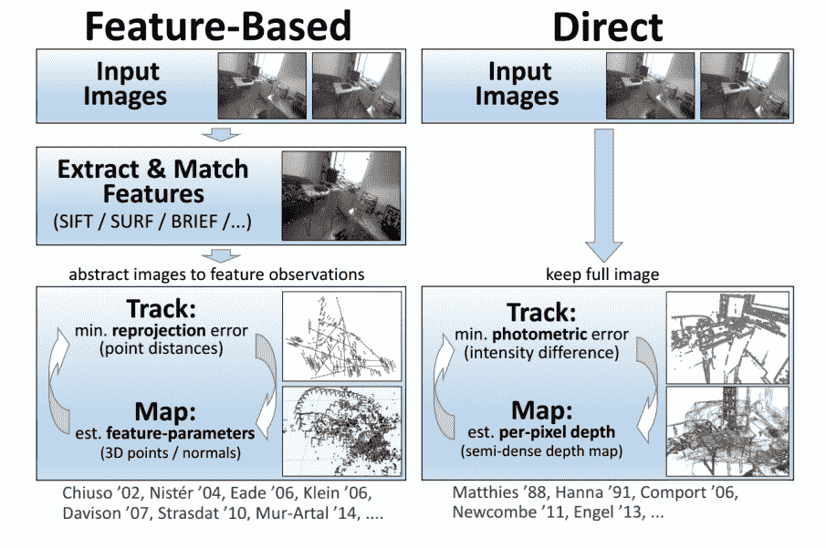

**Source**: [wavelab waterloo slides](http://wavelab.uwaterloo.ca/slam/2017-SLAM/Lecture14-Direct_visual_inertial_odometry_and_SLAM/slides.pdf). Very good slides that are worth checking out to go deeper into many direct methods and compare them on a high level with feature-based SLAMs.

从自 2012 年以来一直主导计算机视觉的深度学习(DL)革命的角度来看，很容易被大多数 SLAMs 使用“经典”关键点或特征检测器(例如 SIFT，ORB，FAST，Harris corners)的事实所迷惑。考虑到围绕 DL 的大肆宣传和良好业绩，这是令人惊讶的。那么为什么没有深球呢？

> 首先，重要的是要提到，在“经典”分类管道中，关键点描述符被用作特征工程步骤，然后典型的分类器被用于输出类，例如支持向量机(SVM)。这个范例被 DL 完全破坏了，但是主要的收获是关键点和关键点描述符是不同的:关键点描述符是描述以关键点为中心的图像块的统计属性的值的向量，关键点指的是点本身，即它们的位置。

关键点在这里是非常常见且直观有用的，因为 SLAM 找到这些检测和跟踪的 2D 关键点所代表的 3D 点的几何关系和位置。事实上，这就是 VSLAM 所做的事情。

> SLAM 可能会随着 DL 的使用而得到很大的改进——关键点检测、语义或者可能是“端到端 SLAM”。然而，经典的特征检测器目前做得很好。有关 DL 和 SLAM 如何相互帮助的更多信息，请查看 Tomasz Malisiewicz 关于[实时 SLAM 和深度学习 vs SLAM](http://www.computervisionblog.com/2016/01/why-slam-matters-future-of-real-time.html) 的精彩博客。

**Note**: This image highlights the difference between keypoints (2D pixel positions) or image descriptors of an image. In general, it’s important for feature detectors to repeatedly find re-identifiable parts of an image which can be found in successive frames e.g. corners, edges, points. Whereas the descriptor of each keypoint is a vector describing an image patch around the keypoint.

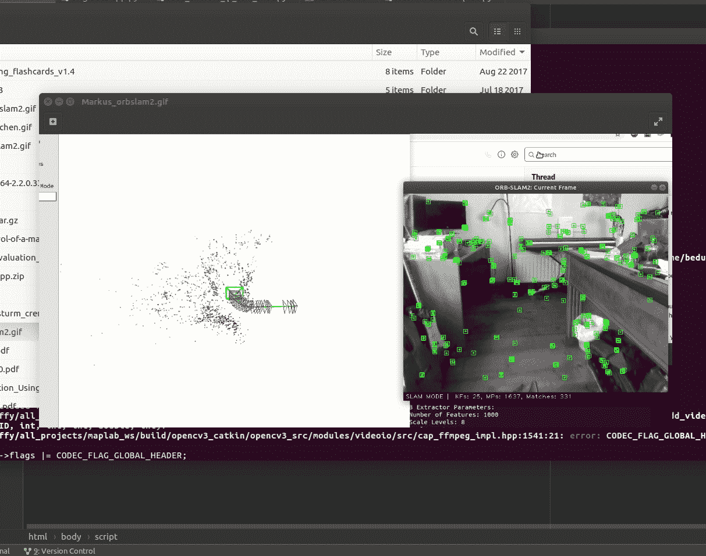

**Note**: Example of keypoints extracted using ORB features in ORB-SLAM2 algorithm running on a sequence from one of our houses. When referring to the word “features” it can mean a combination of the keypoint and its descriptor or just the keypoint. At the end of the GIF we see an example of loop closure fixing the accumulated drift. Keep an eye out for part 4 of this blog which covers the back-end and loop closure for greater depth on this.

SLAM 中还有另一个新兴的范例，它避免了稀疏关键点检测器的使用。这些所谓的“**直接**方法使用像素强度——来自图像的未经处理的 RGB 值——来直接估计相机的运动。这最小化了光度损失，而基于特征的方法通常最小化了[几何损失](https://en.wikipedia.org/wiki/Reprojection_error)。**光度学**本质上意味着我们正在计算如何使用直接来自两幅图像的像素值将第一幅图像投影扭曲成第二幅图像。通过最小化强度差异，我们对来自原始图像和经变换的合成生成图像的变换实施一致性。

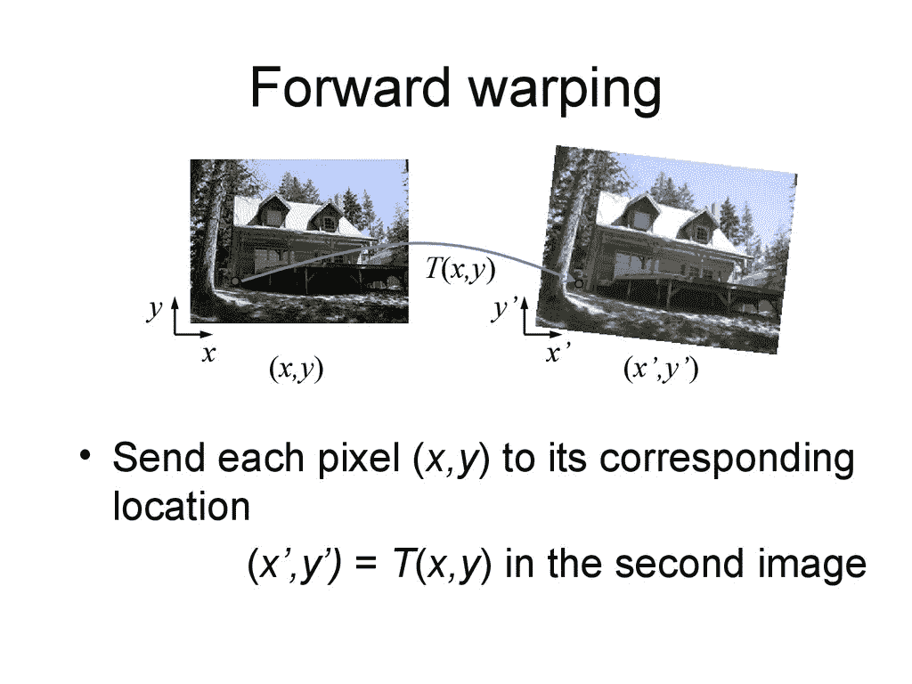

**Source**: [link](https://ppt-online.org/48421) **Note**: This highlights the projective transformation (T) between the first image to the second. Finding the correct T is the goal here.

直接方法中有许多变化。例如，我们可以使用 [**中的稀疏点直接稀疏里程表**](https://arxiv.org/abs/1607.02565) **(DSO)** 。中的 DSO 论文很好地比较了密集+直接、密集+间接、稀疏+直接、稀疏+间接这四种组合。我们鼓励你去看看，特别是如果你像我们一样感到困惑的话。

另一篇著名论文 [**半密集视觉里程计**](http://rpg.ifi.uzh.ch/docs/TRO17_Forster-SVO.pdf) **(SVO)** 是基于特征和直接方法的混合。这意味着它仅跟踪来自边缘和角落的高梯度像素(使用直接光度误差),但是依赖于基于特征的方法来联合优化结构和运动。这些组合就是为什么它被认为只是“半直接”的原因。

Direct 有可能能够跟踪图像中纹理较少的部分，而基于特征的 SLAM 可能会发现这更加困难。许多著名的满贯狂热者相信直接满贯最终会战胜间接满贯。但是基于特征的 SLAM 的结果说明了一切。只有时间能证明一切。

# 结论

总之，我们讨论了一切，从映射背后的动机，模拟中的映射，到本地化和映射如何迫切需要彼此(SLAM)；以及许多相关领域(例如视觉里程计、SfM)和不同 SLAM 算法之间的变化轴(例如它们的前端与后端、传感器套件等)。).不仅如此，还包括使用的具体方法，例如直接与基于特征、稀疏与密集地图/点云，以及这些系统是否具有全局优化和闭环。为了说明不同的 SLAM 是如何变化的，你可以在下表中找到许多著名 SLAM 之间的比较。

**Source**: [Visual SLAM algorithms: a survey from 2010 to 2016](https://link.springer.com/article/10.1186/s41074-017-0027-2) **Note**: This compares many different SLAMs across their varying dimensions. For example, the visual SLAM algorithms used with the raw image data could be feature-based (ORB-SLAM, MonoSLAM) vs direct (DTAM, LSD-SLAM) vs semi-direct (SVO) vs RGB-D (KinectFusion, SLAM++).

我们希望这个博客能够在很大程度上介绍和总结 SLAM 的前端组件。在某种意义上，这个组件主要负责计算相机的里程表。在我们看到的一些案例中，它可以在不需要任何后端组件的情况下产生高度精确的定位。

然而，机器人的轨迹越长，漂移就会积累得越多，即使每 10 公里仅平移 1 毫米或旋转 1/100 度，这种漂移也会增加。因此，在我们看来，需要一个后端系统和识别以前位置的能力。幸运的是，我们将这个组件的细节留到了本博客系列的下一部分，其中将包括束调整、姿势图创建和优化，以及循环闭合。

## 但是最激动人心的部分还在后面！在下一期的 C2C (#cuplife)中，我们将展示我们对 SLAM 中大量先进系统的选择和评估，包括我们测试过的一些算法以及我们认为该领域未来可能的发展方向。敬请期待！