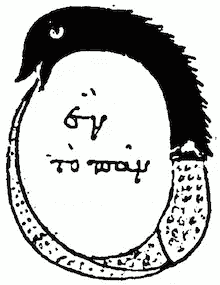

# 从数据科学到 AI？

> 原文：<https://towardsdatascience.com/from-data-science-to-ai-fcaa0e464010?source=collection_archive---------19----------------------->

## 一个是人，另一个是机器…它指引着我们！

让我们玩个游戏，好吗？对于我给你的每个单词，你会告诉我在人工智能和数据科学之间首先想到的是什么？好吗？没有欺骗，没有宗教战争(如果你觉得有些奇怪，强迫自己朝着一个方向，问问自己为什么)。

准备好了吗？

走吧，一次一个，阅读并意识到你的联想——
数据科学还是 AI？

*   自治
*   统计数字
*   机器人
*   机器学习
*   终结者
*   光学字符识别
*   2001:太空漫游
*   形象化

完成了吗？好，我先来:

*   自主— *AI*
*   统计学— *数据科学*
*   机器人— *人工智能*
*   机器学习— *都有！*
*   终结者— *艾*
*   OCR(光学字符识别)——*数据科学*
*   2001:太空漫游— *艾*
*   可视化— *数据科学*

这些和你的相配吗？如果他们这样做，原因可能是文化或时代精神。如果我们把时间拨回到 30 或 40 年前，一个自动识别你的糟糕书法的系统[*抱歉，10%的人用摄像机拍下了不清晰的书法 T20，这仍然是人工智能。“会阅读的机器眼”！今天，OCR 可以在移动设备上完成，尽管它并不总是准确，但它太普遍了，以至于不再被视为人工智能。*

为什么有些东西可以不被认为是人工智能？数据科学也会发生同样的情况吗？首先，人工智能是一个负载很重的术语，与科幻小说有很强的关联，也与[人类思考和学习的能力有很强的关联。这些联系引发了我们的情感反应，或者与我们的年轻、我们的激情，或者甚至是我们对什么使我们成为人类的哲学思考有关。](https://medium.com/the-future-beyond/beyond-machine-learning-55000cae5da4)

现在…数据科学有没有让你思考是什么让你成为人类？如果不是，那是因为它是一个比人工智能更精确的术语，而且没有人工智能那么神秘。

但是还有更多。更具体的东西。

## 数据科学是人类——人工智能是机器

AI 是[一台**机器**获取并应用知识和技能](https://medium.com/the-future-beyond/what-is-intelligence-59e553757a3a)的能力，而数据科学是一个人对数据**的系统学习和应用。人类可以利用数据科学来创建人工智能系统的组件。相反的情况只发生在科幻小说中，只有在遥远的星系中，人工智能系统才有能力进行数据科学。**

在这之间呢？机器什么时候变得智能？

没有硬性门槛。人工智能需要 4 种基本能力:感知、知识保留、思考和适应。这些包括感知、过滤、解释、存储、抽象、推理、理解、学习和在环境中行动。这些功能越发达，系统就越智能。因此，即使是计算器也有一定程度的智能。类似于狗、海豚和任何人类的智力水平。如果一个人工智能系统胜过人类，那么它通常被称为拥有[超级智能](https://en.wikipedia.org/wiki/Superintelligence)(除了非常具体的任务，截至 2019 年，我们离超级人工智能还非常远)。

那么，为什么 AI 也经常被描述为一个巨大的技术领域，包括机器学习、深度学习、统计学等等？一个关键的原因是人工智能的 4 种能力可以用这些方法来开发。如果是人类应用它们，那就是数据科学创造了人工智能；如果是机器，那就是 AI 创造 AI。例如，当机器学习系统被训练时，它是由机器完成的，因此它是一个解决某个任务的人工智能系统。数据科学是围绕培训的一切。这也意味着许多数据科学工具具有智能的某些能力，可以被定义为人工智能。如上所述，人们是否愿意称它们为人工智能，或者“超自动化”取决于文化因素。

[Ouroboros](https://en.wikipedia.org/wiki/Ouroboros)

## 数据科学可以产生人工智能

然而，数据科学并不是产生人工智能的唯一途径。有人认为进化、[、量子力学](https://medium.com/the-future-beyond/the-2016-state-of-consciousness-research-82d065c7e6d7)以及其他尚待发现的方法也能产生人工智能元素。尽管如此，今天数据科学和人工智能之间有着强大的协同作用:虽然数据科学实际上让事情发生，但人工智能为我们提供了强大的工具和抱负，为我们指明了道路。

