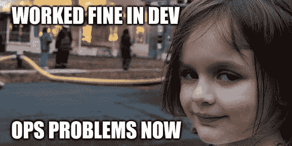
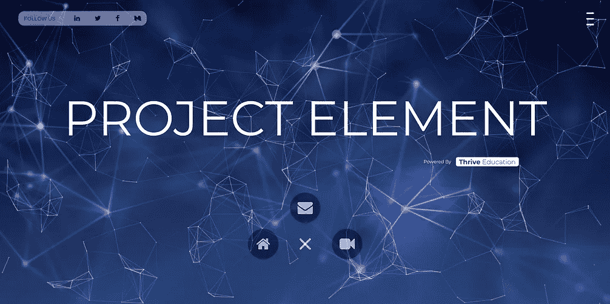
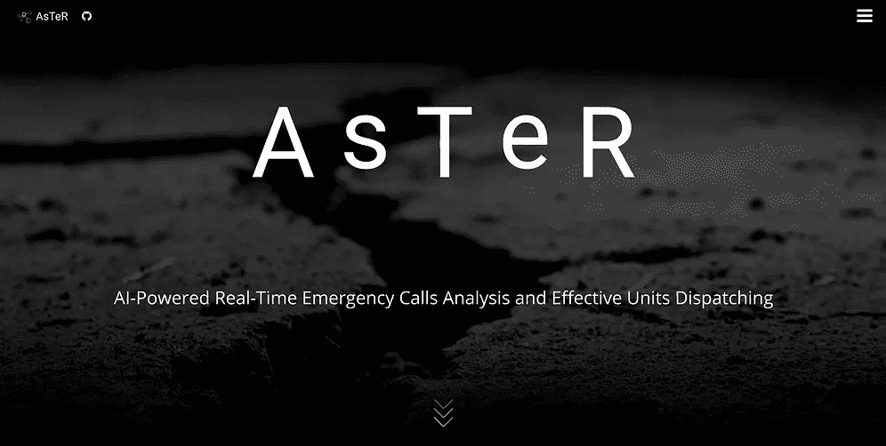

# 从开发到生产——让 Flask 应用程序在 AWS 上运行所需要知道的一切

> 原文：<https://towardsdatascience.com/from-dev-to-prod-all-you-need-to-know-to-get-your-flask-application-running-on-aws-ecedd4eec55?source=collection_archive---------24----------------------->

## 获得正确的配置，确保它是安全的，确保通过端点访问资源，并有一个漂亮的渲染，…所有这些都是因为 AWS 而变得容易！



作为一名机器学习工程师，我从未真正面临过把我的算法发布出去的问题。嗯，直到最近，当我决定开始我的多重创业之旅…不幸的是，当你开始时，你没有 DevOps 或软件工程团队。这些人对客户使用这些服务的世界很有经验，他们知道如何跨越最后一步，让你的产品从零到一。

现在，我不得不花几个小时阅读教程和文档来学习基础知识，最后，将我自己的算法作为全球可用的独立容器化服务。出于可复制性的明显原因，我对这些步骤进行了模板化，我非常乐意与您分享这些模板！:)【模板托管[这里](https://github.com/Coricos/Challenger/tree/master/templates/beanstalk)。]

# 准备战场！

他的初始化步骤至关重要，取决于你的实践。在这里，我揭露了我做这件事的方式，但是你可以自由地创新。到目前为止，我唯一的假设是，你有一个适当的 AWS 帐户，并且你知道如何在服务之间导航！

*   安装并配置 AWS CLI: [AWS 教程](https://docs.aws.amazon.com/cli/latest/userguide/cli-chap-configure.html)。
*   安装并配置 AWS Elastic Beanstalk CLI: [AWS 教程](https://docs.aws.amazon.com/elasticbeanstalk/latest/dg/eb-cli3-install-advanced.html)。
*   下载模板:您目前有三种选择:您可以从[文件夹](https://github.com/Coricos/Challenger/tree/master/templates/beanstalk)模板中单独下载每个文件；您可以克隆 project [Challenger](https://github.com/Coricos/Challenger) 的整个存储库，这是我存放模板的地方；您可以使用 subversion 通过以下命令下载特定的文件夹:

```
sudo apt install subversion
svn checkout [https://github.com/Coricos/Challenger/trunk/templates/beanstalk](https://github.com/Coricos/Challenger/trunk/templates/beanstalk)
```

*   定义您的开发环境:

```
virtualenv -p python3 beanstalk
cd beanstalk
source bin/activate
pip install -r requirements.txt
```

*   在`application.py`中构建您的 flask 服务器！首先在您的本地机器上试一试，检查一下一切都运行正常，并确保将服务器启动封装在`__main__`中。另外，这是 AWS 的特定要求，但是您的应用程序的名称应该明确为`application` …


# 有用！现在怎么办？

B 因为我发现 **AWS Elastic Beanstalk** 是运行我的应用程序的最佳服务，我天生就愿意展示它。为什么？主要是因为在 beanstalk 实例上运行的内容可以在任何其他类似的服务和云提供商上产生。这给了您无限的灵活性(我甚至没有说使用 Docker 来获得更好的可部署性)。

该服务由一个运行在 EC2 实例上的基本容器组成，该容器链接到一个 S3 存储桶。在我们的例子中，应用程序本身不需要大量的计算能力(到目前为止我们没有谈到深度学习)，所以我们将选择 *t2.micro* 实例(单个虚拟内核和 4gb RAM)。从那以后，它将只与配置有关，因为 AWS 使我们的生活更容易:您不必考虑子网、安全组、VPC、IP 网关、NAT 这是在您生成实例时自动创建和定义的。尽管如此，对于那些需要控制它们的人(在 VPC 工作或使用 RDS)，你可以通过`.ebextensions`文件夹中的`security.config`来配置一切。关键配置以`.elasticbeanstalk`文件夹中的`config.yml`文件结束:

```
environment-defaults:
  {flask-app}:
    branch: null
    repository: null
global:
  application_name: {my-app}
  default_ec2_keyname: {my-ec2-key}
  default_region: {region}
  profile: {my-profile}
  workspace_type: Application
```

对于配置部分，没有太多事情要做:给应用程序和服务起一个好听的名字(~ environment)；如果需要，定义它的 EC2 键名，否则使用缺省值；选择要在其中生成实例的区域；选择了您的用户配置文件；使用`Application`负载平衡器(这是我的建议)。

从那里，您已经可以访问并可视化您的在线运行的应用程序，使用一个名称，例如 *{flask-app}。{id}。{zone}.aws.com* 。然而，这缺少了一些东西:信息传输过程中的加密。你可能不是我，但我真的不喜欢使用不使用 **HTTPS** 的网站或终端…


# 把公主带到城堡里！

不幸的是，没有 **SSL 证书**，您的实例无法使用 HTTPS。通常，人们会使用 OpenSSL，这非常简单，但是在我们的例子中，AWS 通过他们的**证书管理器**服务又一次让它变得简单。如果你想让它更有趣，可以通过 53 号路线服务购买一个域名。然后，您可以使用 AWS 为您的 beanstalk 创建自己的证书，或者与您新获得的域名相关(我向您保证，这样看起来更专业)。现在，必须配置两个对象来重定向请求:一个是`Canonical Name`，比如 *{cname}。将您的 EB 实例作为值的域名*;一个`Alias`，比如{ *别名* } *。您的 EB 实例的域名*。有了这两张唱片，你就可以上路了！

# 请用 HTTPS！

您错过的是信使:HTTPS 请求到您的实例的特定重定向。这个信使被称为**监听器**，有一个简单的配置:将外部世界的 HTTPS 定向到实例上的 HTTP。(可在`listener.config`买到！)

```
option_settings:
  aws:elb:listener:443:
    InstancePort: 80
    ListenerEnabled: true
    InstanceProtocol: HTTP
    ListenerProtocol: HTTPS
    SSLCertificateId: {certificate}
```

但这还不是全部！为了确保您的实例接受 HTTPS，您必须配置服务器:这就是`https.config`为您做的！；)

# 部署部署部署。

一旦你弄清楚了你的 Flask 应用程序，如何填充所有缺失的配置设置，如何获得你的 SSL 证书，是时候部署了！(不需要初始化，我们已经为此构建了配置文件。)

```
eb create flask-app
```


# 想要更多吗？给你！

以下是我不想在之前的教程中介绍的一些内容，但对于接下来的步骤同样重要:

*   使用**环境变量**！当你在生产环境中工作时，记得要多疑；)我的做法通常是用我的变量填充一个`environment.json`文件，并用`deploy-env.sh prod`将它们部署在弹性 Beanstalk 实例上。
*   如果您使用**标题**(例如`Flask-JWT`)，请确保将`headers.config`添加到您的`.ebextensions`文件夹中。
*   如果你使用 **websockets** (例如`Flask-sockets`)，你将不得不使用 Docker 镜像并使用`websocket.config`。我可能要为那部分做另一个模板(如果那是你要找的，就同时 ping 我)，因为我花了不止几个小时才弄明白…



Examples using such Configurations: [project-element](https://www.project-element.com/) & [project-aster](https://www.project-aster.com/)

*有兴趣保持联系吗？*:D[Twitter](https://twitter.com/DindinMeryll)|[LinkedIn](https://www.linkedin.com/in/dindin-meryll/)|[Github](https://github.com/Coricos)|[Medium](https://medium.com/@merylldin)