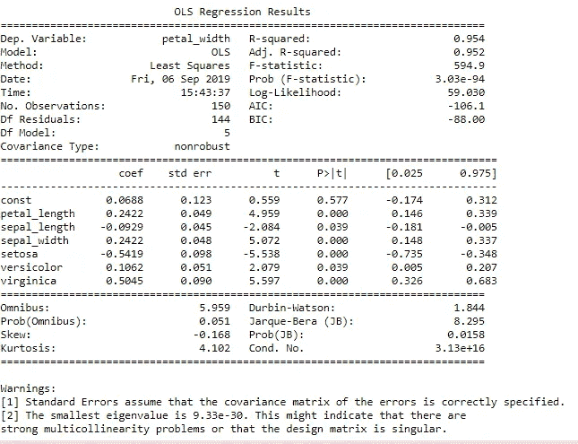
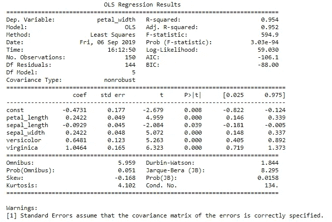

# 从计量经济学到机器学习

> 原文：<https://towardsdatascience.com/from-econometrics-to-machine-learning-ee182f3a45d7?source=collection_archive---------5----------------------->

## 为什么计量经济学应该成为你技能的一部分

作为一名拥有计量经济学硕士学位的数据科学家，我花了一些时间来理解让机器学习成为与计量经济学不同的学科的微妙之处。我想和你们谈谈这些乍一看并不明显的微妙之处，它们让我在整个旅程中都感到好奇。

## 首先…什么是机器学习？…什么是计量经济学？

> [***计量经济学***](https://en.wikipedia.org/wiki/Econometrics) *是将统计方法应用于经济数据，以便赋予经济关系以实证内容。更准确地说，它是“基于理论和观察的并行发展，通过适当的推理方法对实际经济现象进行的定量分析”*

> [***机器学习****(****ML****)*](https://en.wikipedia.org/wiki/Machine_learning)*是计算机系统用来执行特定任务的算法和统计模型的科学研究，不使用明确的指令，而是依靠模式和推理。它被视为人工智能的一个子集。机器学习算法基于样本数据(称为训练数据)构建数学模型，以便在没有明确编程执行任务的情况下做出预测或决策*

很好，所以他们看起来都需要数据，都使用统计模型，都做出推论，所以根据他们的定义，机器学习似乎可以处理更广泛的问题，而不仅仅是经济。那么，计量经济学为什么还存在？！这是我在开始计量经济学研究的同时发现机器学习时问自己的问题。

作为一名未来优秀的经济学家，我需要完美地处理数字，拥有扎实的`[Statistics](https://en.wikipedia.org/wiki/Statistics)`背景，成为`[linear algreba](https://en.wikipedia.org/wiki/Linear_algebra)` 和`[Mathematical optimization](https://en.wikipedia.org/wiki/Mathematical_optimization)`的专家，最后拥有处理数据的计算机技能。这些技能将用于理解、演示应用我的回归、分类、聚类算法或时间序列预测。在这一年里，我将深入学习一些算法，如*`[Linear Regression](https://en.wikipedia.org/wiki/Linear_regression)`*`[Logistic Regression](https://en.wikipedia.org/wiki/Logistic_regression)`*`[Kmeans](https://en.wikipedia.org/wiki/K-means_clustering)`*`[ARIMA](https://en.wikipedia.org/wiki/Autoregressive_integrated_moving_average)`*`[VAR](https://en.wikipedia.org/wiki/Vector_autoregression)`*……等等。等等？*这些算法也用于机器学习！*****

## **从理论效率到经验效率**

**机器学习和计量经济学的一个根本区别在于它们的理论基础。计量经济学有扎实的数理统计和概率论基础。算法在数学上是稳健的，具有可论证的和吸引人的性质，这些算法主要基于其基础的稳健性进行评估。**

**对于机器学习，数学当然不会缺席，但它的存在是为了解释算法的行为，而不是展示其可靠性和吸引人的属性。这些算法主要根据它们的经验有效性进行评估。一个非常有启发性的例子是 Xgboost 算法的成功，它的成功归功于它在几个机器学习竞赛中的统治地位，而不是它的数学证明。**

## **从精确到近似**

**另一个区别是，计量经济学只有一个解决方案，给定一个指定的模型和数据集，参数回归的参数是使用代数公式计算的。系数的`[best linear unbiased estimator](https://en.wikipedia.org/wiki/Gauss%E2%80%93Markov_theorem)` ( **蓝色**)由[普通最小二乘](https://en.wikipedia.org/wiki/Ordinary_least_squares) (OLS)估计器在某些假设得到尊重的情况下给出。这里的“最佳”是指与其他无偏的线性估计量相比，给出估计的最低方差。**

**而大多数机器学习算法过于复杂，无法用单一的数学公式来描述。他们的解决方案是通过称为训练阶段的迭代方法在算法上确定的，训练阶段的目标是找到最适合我们数据的解决方案，因此由机器学习算法确定的解决方案是近似的，并且只是最有可能是最优的。**

## **从参数模型到非参数模型**

**计量经济学模型(即:大多数时候是参数模型)是基于经济理论的。然后使用传统的统计推断工具(如最大似然法)来估计参数模型 mθ中参数向量θ的值。渐近理论然后发挥了重要作用(泰勒的发展，大数定律和中心极限定理…等)。**

**另一方面，在机器学习中，通常构造非参数模型，几乎完全基于数据(没有进行底层分布假设)和所使用的元参数(树深度、惩罚参数等)。)通过交叉验证、网格搜索算法或任何超参数优化算法进行优化。**

## **从理论到实证的验证**

**你会明白的，模式会和以前一样，计量经济学依靠稳健的数学测试来验证模型，我们通常说的是模型的`[goodness of fit](https://en.wikipedia.org/wiki/Goodness_of_fit)`。它通过假设检验、残差的正态性评估、样本分布的比较来评估。我们还将讨论`[R²](https://en.wikipedia.org/wiki/Coefficient_of_determination)` ，它是从自变量中可预测的因变量方差的比例，以及`[AIC|BIC](https://en.wikipedia.org/wiki/Akaike_information_criterion)`，它通过`[p-value](https://en.wikipedia.org/wiki/P-value)`评估每个模型相对于其他每个模型或变量评估的质量。**

**机器学习模型的评估将取决于它的预测，其基本思想是，如果模型能够很好地预测，那么它已经成功地学习了数据中的隐藏模式。为了确保模型不会过度拟合，数据集将被分为训练集和测试集，然后使用`[cross-validation](https://en.wikipedia.org/wiki/Cross-validation_(statistics))`砖块来验证模型的泛化能力，并确保数据分离没有偏差。最后，我们将使用 KPI 来衡量与现实的差距，如`[RMSE](https://en.wikipedia.org/wiki/Root-mean-square_deviation), [MAE](https://en.wikipedia.org/wiki/Mean_absolute_error)`或`[Accuracy](https://en.wikipedia.org/wiki/Accuracy_and_precision)`。**

## **从理论趋同到目的分歧**

**计量经济学和机器学习都试图定义一个函数，该函数定义一组将对预测变量建模预测变量:**

********

*   **ɛ是随机变量 i.i.d .，规律 N (0，σ2)的实现也称为残差，来自计量经济学，否则 y = f(x)属于机器学习。**

**理论上，这两者在现阶段似乎是一致的，但在方式和目标上，他们也会有分歧。机器学习的目的是 **y** 在大多数情况下，而计量经济学的目的是估计每个预测因子的β。**

****

> **计量经济学的主要目的不是预测而是量化一种经济现象**

## **从理论到实践！**

**如果我们在实践中观察这些差异，我们将从一个经典的计量经济学模型和一个最广泛使用的模型线性回归开始。为此，我们将通过主要服务于机器学习模型的`[sklearn](https://scikit-learn.org/stable/index.html)`库的实现和更加面向计量经济学的`[statsmodels](https://www.statsmodels.org/stable/index.html)`库的实现来观察我们建模的结果。**

```
**#import library
import pandas as pd
import numpy as np
import seaborn as sns
import statsmodels.api as sm
from sklearn import linear_model#import data 
iris = sns.load_dataset("iris")**
```

**让我们比较一下这两种实现**

```
**dummies = pd.get_dummies(iris["species"], drop_first=False)
iris = pd.concat([iris, dummies], axis=1)
iris.head()**
```

****

**由于物种是一个分类变量，我们需要将它转换成计算机可以处理的格式，所以我们转向一次性编码格式。让我们从机器学习开始。**

****

**我们可以通过模型对象提取模型系数和斜率参数β0。让我们用 statsmodels 试一试。**

****

**与 sklearn 相比，Statsmodels 给了我们很多信息，我们得到了非常好的 R，我们之前讨论过的 AIC、BIC、每个变量的系数和警告。让我们试着预测一下:**

**我们得到了相同的 R 和非常好的 mae 和 Rmse …但是我们认为两个模型的系数不相等。Statsmodels 警告我们，我们的模型有可能是`[Multicollinear](https://en.wikipedia.org/wiki/Multicollinearity)`！这是指一个[多元回归](https://en.wikipedia.org/wiki/Multiple_regression)模型中的两个或更多解释变量高度线性相关的情况，这意味着我们的数据集中有冗余信息。这些信息来自物种变量，我们必须放弃一个类别，因为很明显，如果鸢尾不是 setosa 或 verginica 它是杂色的。**

> **这意味着，尽管我们的模型有很强的 R，因此有很强的预测能力，但这些系数是有偏差的，无法解释的。**

**sklearn 尚未将此信息传输给我们。让我们通过传递 drop_first = True 来更正它。**

****

**Statsmodel 删除了它的警告，我们现在有了无偏系数。此外，偏度接近 0，峰度也意味着我们的残差可能是正态的，Jarque-Bera 的概率证实了这是一个很好的模型。让我们重新运行我们的 sklearn 模型:**

****

**最后，我们得到了相同的，让我们做一些阅读。可以看出，在所有其他因素都相同的情况下，花瓣长度增加 1%会使花瓣宽度增加 0.24 厘米。在分类变量的情况下，我们总是指缺失类别。我们可以看到，在所有因素都相同的情况下，verginica 物种的花瓣比缺失物种 setosa 宽 1.04 厘米。所有的 p 值在 5%的阈值下是显著的，因此我们的系数被认为是稳健的和无偏的。我们已经看到了线性回归模型的分析，它也可以转置到分类。逻辑回归在模型分析中提供了一个非常有趣的读数，我会在以后的文章中讨论比值比的读数。**

**阅读模型分析，我会在以后的文章中讨论优势比的阅读。**

## **最后**

**计量经济学的概率基础无疑是它的强项，它不仅具有模型的可解释性，还具有不确定性的量化。然而，机器学习模型的预测性能是有趣的，因为它们允许我们突出计量经济学模型的不良规范，并且其中一些算法更适合于非结构化数据。计量经济学旨在严谨，但成为一种非常相关的经济因素分析工具，如果你的经理要求你量化一种影响，它除了给你统计和数学上的合法性外，还可能是相关的。**