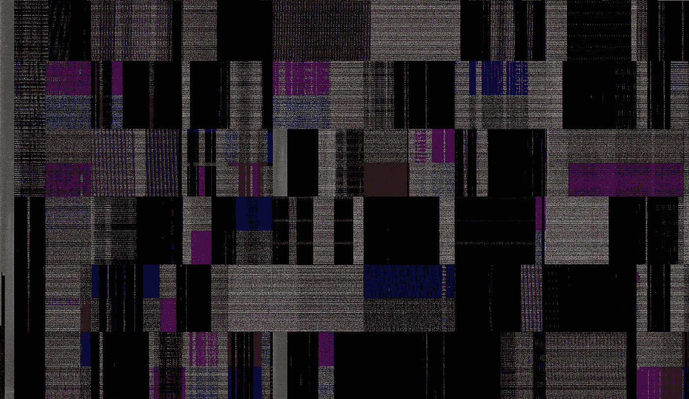
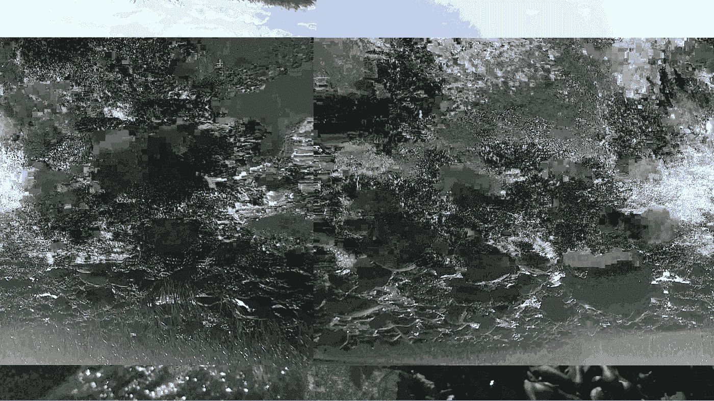

# 从错误到自主

> 原文：<https://towardsdatascience.com/from-error-to-autonomy-207e285e62f5?source=collection_archive---------24----------------------->

# 数字误差的艺术潜力。

到目前为止，计算自治的想法是有问题的，科学界还没有达成共识。自从 19 世纪开始计算和数据分析以来，阿达·洛芙莱斯已经构建了一种思想，使机器创造多样化的作品合法化，然而，洛夫莱斯认为，机器不可能“创造”没有预先编程的东西。(洛夫莱斯，1842 年)。计算自治的可能性在 XX 世纪被正式考虑，即由著名科学家艾伦·图灵，他反对洛夫莱斯的陈述。

艾伦·图灵认为，现在可重新编程的计算机可以模拟人类的智力，如果为此目的对它进行足够的编程的话。在这个意义上，数学家鼓励在计算机编程中包含伪随机算法(图灵，1950)。这些目前被定义为*随机过程*:允许做出看似随机的决定，但可以通过数学概率计算的算法集。一方面，这是整合计算艺术的基础之一，因为该设备开始被探索作为其随机结果的创造力的助手，这些随机结果似乎模拟了人类的创造力。另一方面，艺术家们的实验方法论暗示了计算艺术的一个重大问题:艺术家不再认识自己的输出。

Vilém Flusser 和 Edmond Couchot 都用黑盒类比的方式处理了艺术家与技术的关系:不知道产生图像的机制的功能。Couchot 认为任何由技术中介产生的图像都是模型过程的模拟，因为编码和解码过程模拟并介入了*媒介*的特性。与图像的代表性内容相关，在后来的研究中，Hito Steyerl 将*的劣质图像*概念化:在数字毁灭的美学中趋向于抽象的图像。这些图像往往会遭受意想不到的失败，并收集*编码伪像、*，即由内容的编码和解码过程引起的众所周知的失真。在 Steyerl 看来，它们就像图像中的瘀伤，来自数据的压缩和传输，这证明了它们的动态和运动。(斯特耶尔，2009 年)

在用于读取和解码图像的介质的过程中，有时会发生改变数字内容的数据故障。正是从这个事实出发，Steyerl 反映了人类希望变得像数字图像一样的愿望。她认为，这些图像作为*事物*独立存在，因为它们表现出自主性并参与我们现实的构建，这些事物积聚力量，但也退化(STEYERL，2010)。与此同时，丹尼尔·洛克在他的“数字自主性”文章中重新思考了计算误差，认为这是一种不太可能的数字重新定义，它是由推动进步的自身法则决定的。用作者的话来说，“作为事物的图像通过它所隐藏的小故障保持其自主性”，小故障是由错误导致的*编码工件*。(鲁尔克，2011 年)。

数字的转换会导致意外的和不可避免的错误，这些错误通常是由于对内容的操作及其持续的时空更新而发生的。在实践中，错误过程的起源在于数字信息的不断重新适应，这从其“明显”的故障中揭示了媒体的证据。通过以上，调查图像的编码文物使我探索它们在艺术领域的潜力。像罗莎·门克曼这样的艺术家试图保存和再现这个错误的时刻。从她的角度来看，失败可以鼓励对系统功能的新理解。它可以导致一个反身的时刻，反过来，可能会显示自己是进步的*外骨骼*，一个宣泄的时刻(MENKMAN，2011)。内容的条件容易受到不同解释的影响，这些解释可能不完全是负面的，因为它可以引导用户到临界维度或揭示计算系统的一些重要因素。

“错误是对规范的违反，事实上，这代表了新的创造性解决方案的巨大潜力。”

有趣的是，这是 2018 年 9 月举行的电子艺术节(Ars Electronica festival)的主题，当时就当前对错误的需求进行了辩论，以促进数字自主性的改善。例如，在神经网络的功能和预测分析的结构中。这些过程通过计算和测量误差以及随机变异程度来优化，以自我管理它们的行为并模拟更自治的系统。

在这一点上，我承认:反乌托邦式的技术完全能够超越人类能力的想法可能永远不会实现。然而，为模拟机器行为而输入的数据的日益增加的复杂性反映了其未来的能力。计算系统对故障的敏感性与其行为的形式特征有关，计算机被认为是一个封闭系统，只在确定性过程下起作用。从这个意义上说，由于法典编纂的有限性，对任何技术过程的操作的限制似乎是显而易见的，但在实践中，这些限制确实在不断扩大其可能性。因此，数字自主的可能性取决于计算的未来发展和插入数据的复杂性。

人工智能对计算创造的期望仍然很高，并且正在迅速发展。更多的*智能物*和*智能体*正在被关注，并且显然可以在无人监管的环境中(半)自主操作。可以预见的是，可能会产生一种机制，这种机制结合并适应他们的发现，以调整他们的自主行动，其目的不是取代人类，而是通过模拟我们的行为来帮助生产。假设这些艺术领域的自主能力，我想知道计算设备是否能够模拟艺术家的创造力？正如图灵会说的:如果他们“被教得足够多”；我想象那将成为一种与我们完全不同的创造力。然而，我承认，基于算法计算来定义某种创造能力是有风险的，因为这与人类的内在复杂性直接相关，而这是目前无法模拟的。