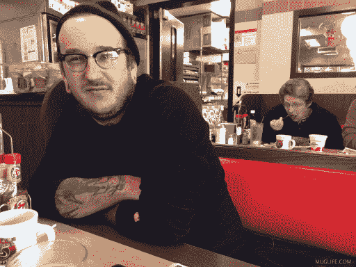

# 从 FaceApp 到 Deepfakes

> 原文：<https://towardsdatascience.com/from-faceapp-to-deepfakes-3d1048713da0?source=collection_archive---------10----------------------->

## 关于挪用与人工智能的思考

考虑到我在摄影和性别研究方面的背景，我对森村泰正和 T2 辛迪·雪曼的作品感兴趣也就不足为奇了。两位艺术家都使用自画像来探索身份的表现，经常参考其他媒体。谢尔曼因她在《T4》系列电影《无题剧照》中扮演二流电影女演员而出名。森村以再现著名的历史艺术品而闻名，将自己作为主题插入其中。两人都投入了大量的工作来改造自己，模糊了神话和现实之间的界限。

*My take on “American Gothic” with help from FaceApp.*

现在，由于人工智能(AI)的发展，任何拥有智能手机的人都可以变形或将自己(或其他人)插入另一个场景。

当 FaceApp 在 2017 年火起来的时候，我花了一段时间才最终试图明白这到底是怎么回事。交换面孔，看看我几十年后可能的样子，对我来说没多大作用。但后来我顺便参观了格兰特·伍德的标志性画作*美国哥特式*。我无法告诉你看到那个农民冲我咧嘴笑时我有多开心。

My friend Travis and a stranger in the background, brought to life with Mug Life.

Mug Life 是另一款利用神经网络和深度学习的应用。它通过将静态图像转化为 3D 动画来提升游戏质量。这张照片让我开心多了，尽管我从未在自己的照片上用过它。

Me after Meitu. I look nothing like this in real life.

不过，在和某人讨论了我们作为动漫角色的样子后，我还是把自己的一些照片放到了美图应用程序中。这个应用程序以一种别人没有的方式让我反胃。[该公司将自己](http://global.meitu.com/en/company)宣传为“移动美容体验的先驱”，使用“获得专利的面部识别和机器学习算法来绘制每个用户独特的面部特征。”应用程序中的设置清楚地表明了美丽对美图的意义:更苗条的脸，更大的眼睛，没有雀斑或胎记的更亮的皮肤，以及化妆。

美图提出了几个问题。就个人而言，我担心认识我的人看到上面的照片后会一本正经地说:“你在那张照片里看起来真的很好！”但是也有关于[数据隐私](https://techcrunch.com/2017/01/19/meitu-app-collects-personal-data/)的问题。这是整个美白的问题。FaceApp 的“热”过滤器也做到了这一点，尽管这显然是一个缺陷，而不是一个功能。这位[首席执行官为](https://www.washingtonpost.com/news/the-intersect/wp/2017/04/26/everything-thats-wrong-with-faceapp-the-latest-creepy-photo-app-for-your-face/?utm_term=.fdf461441b08)道歉，称“这是由训练集偏差引起的底层神经网络的不幸副作用，而不是有意的行为。”在像 FaceApp 这样的东西中复制偏见可能不会对整个世界产生太大影响。但这些同样的“不幸的副作用”也在人工智能的其他应用中发挥作用，包括贷款决策和预测性警务。

让我们在这里控制它。到目前为止，这些应用主要用于娱乐，人们为社交媒体制作迷因和自拍。这些图像与赞助广告、品牌大使和影响者一起填充提要。像机器人 Lil Miquela 这样的有影响力的人已经出演了广告活动，登上了杂志封面，在 Spotify 上发布了单曲，最近[被聘为《Dazed》杂志的艺术编辑](https://qz.com/quartzy/1425735/dazed-just-hired-cgi-influencer-lil-miquela-as-its-arts-editor/)。

CGI influencer Lil Miquela with actress Tracee Ellis Ross.

像密凯拉这样的虚拟影响者的崛起带来了一些令人兴奋而另一些人害怕的可能性。公司可以雇佣容易驾驭的模特来推产品。Quantum Capture 首席执行官摩根杨预测名人可能会开始使用 CGI 替身:“围绕这一点建立了一个非常有趣的收入模式，其中你可能无法接触到人才本身，但你可能会接触到他们的数字化身，而实际的人将从使用他们的化身中赚钱。”

这些虚拟形象引发了许多其他问题，包括关于拨款和谁受益(经济上和其他方面)的问题。不管怎样，我们面对的未来是，人类和人工智能之间的界限只会越来越模糊。

用于驱动 Mug Life 等应用程序和创建头像的技术已经帮助创建了如此令人信服的复制品，以至于人们无法区分什么是真实的，什么是虚假的。显然，就连凯丽·费雪也认为她在《T2》和《星球大战外传：侠盗一号》中的出现是因为旧镜头，而不是 CGI 制作。

“We’re entering an era in which our enemies can make anyone say anything at any point in time.”

虽然对娱乐业来说很棒，但乔丹·皮尔[在他的视频中强调了“深度假货”的潜在危险](https://www.siliconrepublic.com/machines/jordan-peele-ai-obama-fake-news)，美国前总统奥巴马似乎称唐纳德·川普为“完全彻底的笨蛋”这个视频可能会像病毒一样传播开来，因为许多人觉得它很有趣，但人们的担忧是真实的。

Deepfakes 已经被用来试图通过虚假的色情视频骚扰和羞辱女性。这个术语实际上来自于一个名为 [Reddit 的用户](https://www.theguardian.com/technology/2018/nov/12/deep-fakes-fake-news-truth)的用户名，他通过使用 TensorFlow 建立生殖对抗网络(GANs)来创建这些视频。现在，情报官员正在谈论弗拉基米尔·普京利用假视频影响 2020 年总统选举的可能性。关于 deepfakes 作为对民主和国家安全的威胁以及如何检测它们的更多研究正在进行。

从个人层面来说，我觉得很纠结。我欣赏这些技术为表演和娱乐带来的可能性。我对算法和它们能产生什么一样感兴趣。但我也担心它们如何被使用，被谁使用，以及会产生什么(不)预期的后果。

*感谢阅读！想法、问题和反馈总是很受欢迎。*