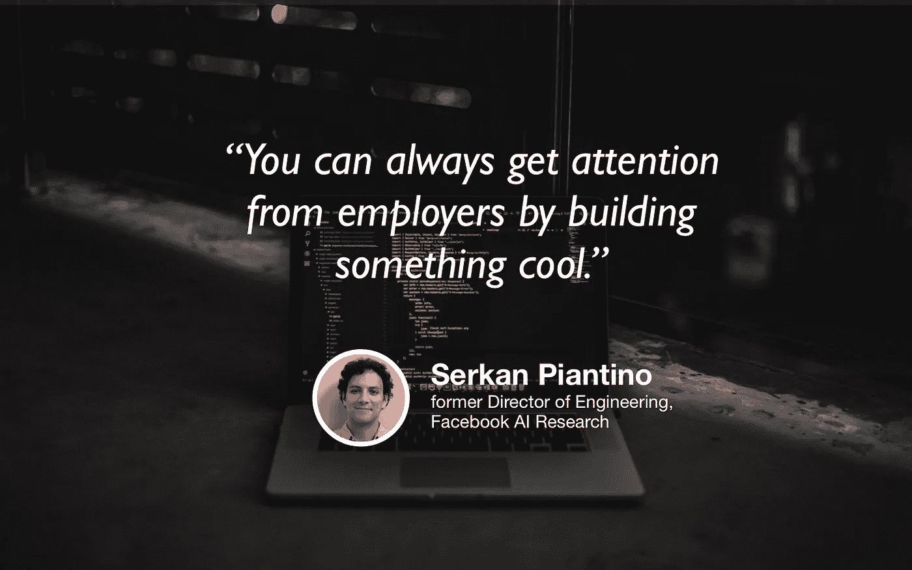

# 从脸书到创业公司:数据科学正在成为一个工程问题

> 原文：<https://towardsdatascience.com/from-facebook-to-startups-data-science-is-becoming-an-engineering-problem-4625d45ef2e0?source=collection_archive---------21----------------------->

## [苹果](https://podcasts.apple.com/ca/podcast/towards-data-science/id1470952338?mt=2) | [谷歌](https://www.google.com/podcasts?feed=aHR0cHM6Ly9hbmNob3IuZm0vcy8zNmI0ODQ0L3BvZGNhc3QvcnNz) | [SPOTIFY](https://open.spotify.com/show/63diy2DtpHzQfeNVxAPZgU) | [其他](https://anchor.fm/towardsdatascience) | [剪辑](https://youtu.be/b--mNmeAq3M)

## 塞尔坎·皮安蒂诺在 [TDS 播客](https://towardsdatascience.com/podcast/home)

*编者按:这是迈向数据科学播客“攀登数据科学阶梯”系列的第七集，由 Jeremie Harris、Edouard Harris 和 Russell Pollari 主持。他们一起经营一家名为*[*sharpes minds*](http://sharpestminds.com)*的数据科学导师创业公司。可以听下面的播客:*

如果你关注了我们的播客，你会知道一个清晰的主题在一个接一个的采访中浮现。每当我们向我们的客人询问数据科学的发展方向时，我们都会得到两个答案之一:要么 1)数据科学正在成为产品/业务角色，数据科学家需要像精通数据的产品经理一样思考；或者 2)数据科学正在成为一个工程问题，数据科学家需要更像工程师一样思考。

在今天的播客中，我们采访了一位专注于考虑第二种可能性的人:数据科学正在成为工程师的游戏。Serkan Piantino 曾担任脸书人工智能研究所的工程总监，现在运营机器学习基础设施初创公司 Spell。他们的目标是为数据科学家开发开发工具，让在云上训练模型像在本地训练模型一样容易。这段经历，再加上他在脸书的经历，让他对数据科学家应该使用的工程最佳实践以及整个领域的未来有了独特的看法。

以下是我从聊天中得到的最大收获:

*   大多数人在工具上投资不足。任何时候你发现你在一遍又一遍地重复使用相同的代码，你应该认真考虑把它变成一个库。相关:你还需要留意新的工具，这些工具可以自动化或增强你的过程。正如 Serkan 指出的，最好的软件工程师花 80%的时间以这种方式优化流程——对于数据科学家来说，他认为这个数字应该更高。
*   构建使您更高效的工具具有您可能没有想到的优势。具体来说，提高效率的一个效果是，测试和深入理解您的模型需要更少的工作，这反过来使您更有可能发现模型中的错误、过度拟合或偏差。
*   机器学习逐渐成为软件工程工具带中的另一个工具。正如 devtools 在软件工程中至关重要一样，类似的工具在数据科学中将变得越来越重要。
*   尽管数据科学和工程似乎正在融合，Serkan 认为我们将永远需要数据科学家。他强调，仅仅因为不同的数据科学任务随着时间的推移被抽象出来(想想:`GridSearchCV`和`BayesSearchCV`用于超参数调优，或者更一般的 AutoML ),并不意味着理解模型背后的数学或数据库管理背后的工作原理没有价值。
*   为您的模型运行健全性检查不是可选的。作为标准流程的一部分，除了使用所有标准模型评估策略(如 AUC 曲线、混淆矩阵等)，您还应该*始终*使用精心选择的边缘案例测试您的模型。
*   如果你没有上过像斯坦福这样的华而不实的学校，但你想进入像脸书这样的顶级科技公司，你的最佳策略是打造一些能吸引公司内部人们注意力的酷东西。项目是王道，但最好的项目*不是* Kaggle 竞赛:它们是有明确用例的应用程序，是你的面试官可以想象自己使用的东西。
*   要远离的一件事是:网上有很多肤浅的教学资源(例如，“在 5 分钟内学会如何构建 GAN！”).这些都是危险的，因为它们制造了理解的幻觉——当你不得不建立一些真实的东西时，这种幻觉很快就会瓦解。当你不明白某件事的时候，学会注意是一项至关重要的技能，可以帮助你避免这个陷阱。

## [TDS 播客—剪辑](https://youtu.be/b--mNmeAq3M):

如果你在推特上，随时欢迎和我联系 [@jeremiecharris](https://twitter.com/jeremiecharris) ！