# 从分形到吸引子

> 原文：<https://towardsdatascience.com/from-fractals-to-attractors-b0e4ce9dcc71?source=collection_archive---------9----------------------->

我一直喜欢分形艺术，但在写一篇关于分形的文章时，我偶然发现了一种叫做吸引子的东西。由吸引子创造的艺术非常迷人。我可以花几天时间去探索。在这里，我将尝试一下巨大的可能性。

什么是吸引子？更正式的定义如下。在[动力系统](https://en.wikipedia.org/wiki/Dynamical_system)的[数学](https://en.wikipedia.org/wiki/Mathematics)领域中，**吸引子**是一组数值，系统趋向于朝着这些数值进化。

吸引子是状态的[集合](http://mathworld.wolfram.com/Set.html)(相空间[中的点](http://mathworld.wolfram.com/PhaseSpace.html))，相邻状态在动态演化过程中向其靠近。吸引子被定义为不能自身分解成两个或更多吸引子的最小单位。这个限制是必要的，因为一个[动力系统](http://mathworld.wolfram.com/DynamicalSystem.html)可能有多个吸引子。

事实上，我今天在这里的目的不是教你关于吸引子的知识，而是向你展示当它们变成艺术时是多么令人惊叹。独特的形状和独特的配色方案将画布变成美丽的东西。而且，这都是用数学完成的。对于那些觉得我的数学令人沮丧或“难看”的人来说，我理解这是可能的，但这是一个需要更深入探索的美丽主题。所以，继续美丽吧！

我将在这里包含创建以下艺术的代码。您可以使用这些代码并尝试创建您自己的艺术。

# 定义

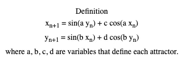

Here a, b, c, and d are variables. There can be more but we’ll focus on four and show the results of those.

数字可以输入数据帧并立即使用，而不必逐个输入。这将一个接一个地呈现多个图形。有如此多的吸引子和如此多的美丽艺术可以简单地从数学方程、数字和代码中呈现出来。可能性是无限的。

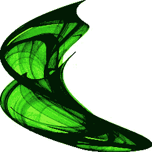

The equation here is different than the Clifford attractor’s

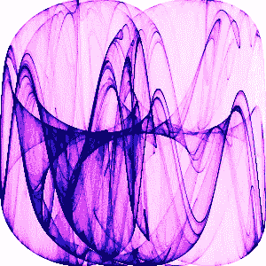

下面是我用额外的 python 代码创建的另外两个吸引器。

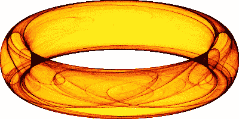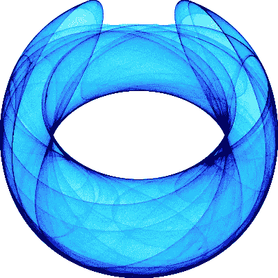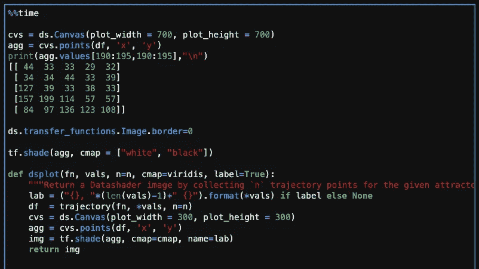

Code for Clifford Attractors

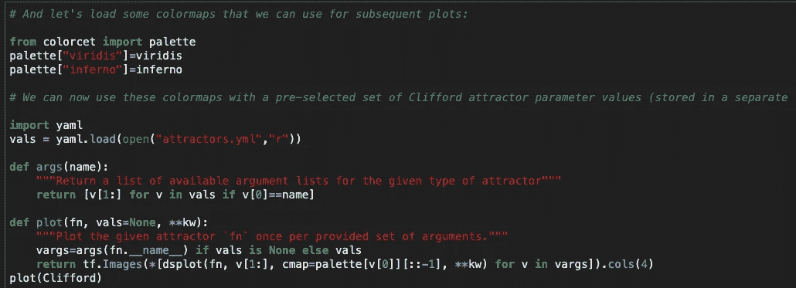

Code Continued for Clifford Attractors

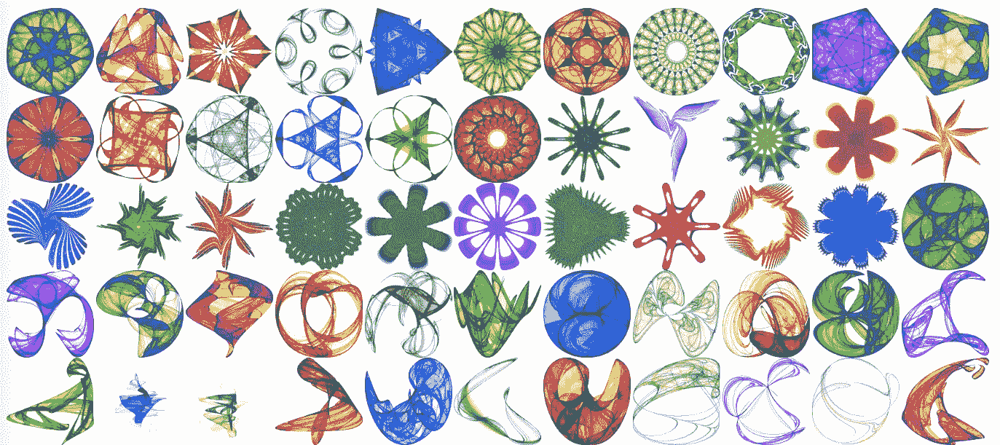

Here there are fifty five strange attractors but there are so many more that can be created. Below you will find the code for one specific Lazaro Alonso example. See if it intrigues you. Play with the code and try to create your own artwork.

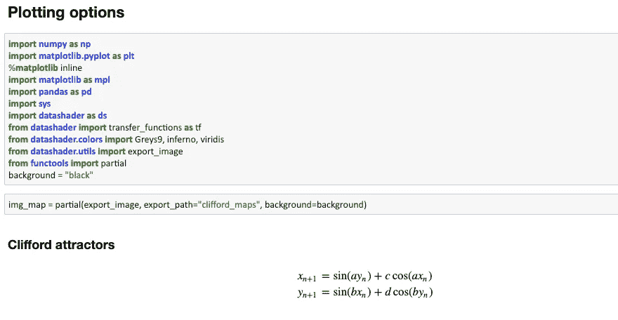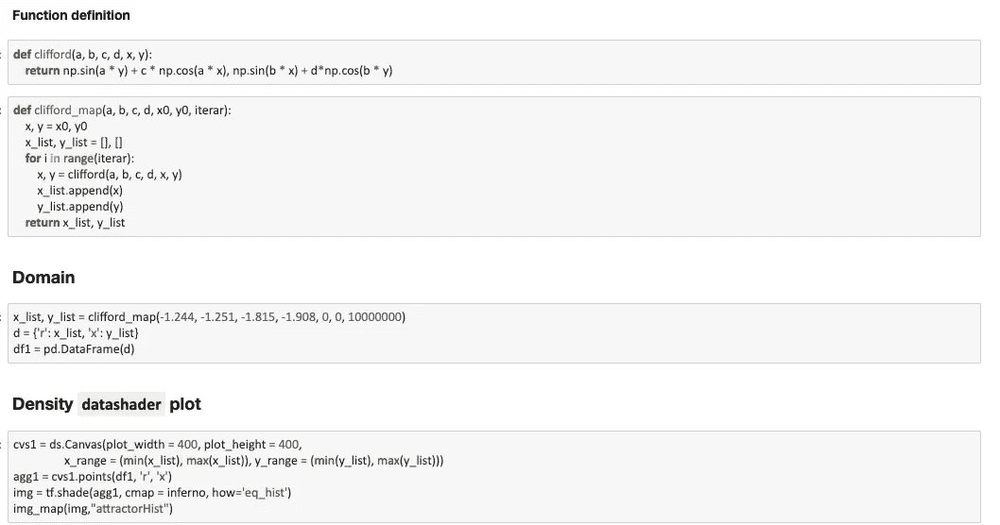

From all this code, what do you get? It’s amazing!!

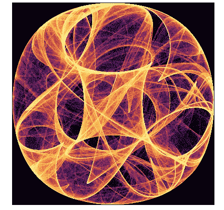

You can use this code to change the color, the background, the gradients, etc. See what you can do as you change the code to make your own creation.

虽然我很想在这里嵌入一个交互式吸引子生成器，但完成它比我预期的更具挑战性。外面有更多的世界。我无法阻止自己回到对计算机和数字组合能产生什么的敬畏中来！这是数学和数据科学中令人惊奇的一部分，应该进一步探索。