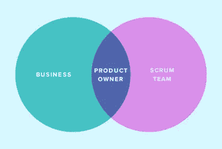
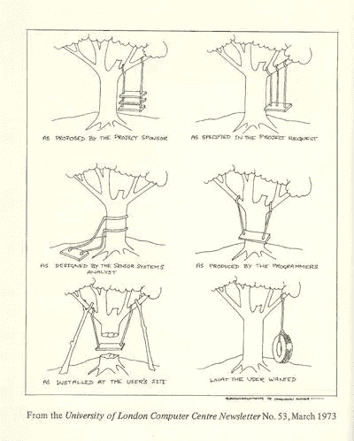
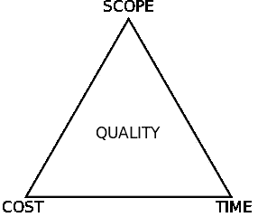

# 在利益相关者的支持下，从脆弱到敏捷

> 原文：<https://towardsdatascience.com/from-fragile-to-agile-with-the-stakeholders-buy-in-6f973425c835?source=collection_archive---------21----------------------->

## 项目成功的最重要因素是**在过程中获得利益相关者的支持**

Photo by [Michael Payne](https://unsplash.com/@mpayne66?utm_source=medium&utm_medium=referral) on [Unsplash](https://unsplash.com?utm_source=medium&utm_medium=referral).

# 很难把一个敏捷型的钉子放进一个商业型的洞里！

TMI 警告:在 2015 年 8 月一个阳光明媚的早晨，在我的预产期，我在我的分娩球上蹦蹦跳跳，不耐烦地等待我的宝宝出现，但没有任何杂音！我必须让自己有事可做，所以我决定参加基于计算机的 ScrumMaster 认证考试——我参加[迈克·科恩](https://medium.com/u/7235ff520fbc?source=post_page-----6f973425c835--------------------------------)的培训已经有几个月了，但是我忽略了考试，现在看起来是个好时机，因为我的手在接下来的 12 个月里会很忙！

获得资格是容易的部分；我一点也不知道，即使我学会了所有的理论，实践是一个完全不同的野兽…四年下来，我成功地交付了几个具有挑战性的项目，我逐渐意识到，项目成功的最重要因素是**获得利益相关者的认可**，所以这就是我在本文中要讨论的。

这里的主要困境是，通过采用 SCRUM，你依赖于外部团体(即不仅仅是开发团队)，如果他们没有履行他们的角色和职责，整个项目可能会崩溃。

所以，让我们看看什么会出错…

## “我没有足够的时间在每次迭代中与团队合作”

产品负责人的参与是敏捷团队成败的关键。敏捷方法的协作性质，即产品所有者是团队的一部分，在时间管理方面会给他们增加很多压力。传统上，他们的输入是在项目的**开始**和**结束**(签署软件符合规范)时被请求的，但是在敏捷项目中，他们被要求参加所有的仪式，保持待办事项列表整洁，区分优先级，并且每天与 Scrum 团队互动。

你需要向他们说明，他们有权做出与产品相关的决策，并利用他们的领域知识专注于功能，而不是管理本身。最重要的是，他们需要快速回答重要的问题，及时提供有价值的信息，并确保开发团队不受阻碍。你应该与产品负责人合作，支持他们需要的任何东西，并指导他们如何最好地为团队增加价值。

Courtesy: [boost.co.nz](https://www.boost.co.nz/blog/2018/05/stakeholders-in-scrum-product-owner)

## “我不需要每次冲刺复习都签到；给我发个报告就行了！”

利益相关者是忙碌的人。他们的日常工作要求很高，需要参加很多会议，做决策，管理多个项目。他们偶尔会对开发出来的软件不感兴趣，只要它能做到广告上说的那样。与产品负责人类似，他们习惯于参与项目的开始和结束，并不奇怪他们试图保护自己的时间，并取消任何他们似乎不必要的会议。

涉众不一定理解的是，Sprint 评审是为了团队的**利益；不是让他们去发现团队在做什么，而是让团队去发现涉众真正想要什么。你需要让他们明白，在缺乏详细规格的情况下，这是检验产品并做出相应调整的机会。这是他们可以要求任何改变和增加的时候，所以**如果他们不出现，他们就没有发言权**！**

这些评论经常会陷入一些陷阱:

**它们太长**:在两个小时的评审中，有 20 分钟的时间是有价值的，所以他们的时间被浪费了，
**它们太技术性了**:低级别的实现细节正在被讨论，
**没有什么可看的**:涉众只想评审完整的工作流，而不是每个 sprint 开发的增量部分。

调整 Sprint 评审的结构以关注**产品**是吸引利益相关者参与的关键。这使得每个人都更容易调整他们对项目的目标和愿景，并继续交付一个有凝聚力的产品。

## “但是我已经知道我想要什么了！”

通常情况下，人们认为他们已经知道他们想要什么，他们对软件应该做什么有一个清晰的想法，所以他们认为如果他们能写下来，让你继续做，会更有效率。你不能真的对利益相关者或产品负责人说:“我不相信在我给你看之前你知道你想要什么”——你需要在这个问题上更加外交化，并强调在项目过程中持续的投入是无价的。边缘案例在项目开始时并不明显，需要在发生时处理。此外，利益相关者*想要的*和他们*需要的*可能是不同的，并且很可能会带来实质上不同的**成本**！

我喜欢用的一个比喻是“软件开发是蝴蝶效应的体现”:微小的变化可能会导致巨大的下游影响，所以除非利益相关者可以讨论和验证他们的需求，否则开发人员将不可避免地做出**假设**，这些假设在您获得的过程中变得越来越难以解开。

这部老掉牙但很好的轮胎摇摆卡通很好地总结了这一点:

Courtesy: [businessballs.com](https://www.businessballs.com/amusement-stress-relief/tree-swing-cartoon-pictures-early-versions)

## “我不能等待一个新特性的整个迭代”

敏捷宣言[的第二个原则](https://agilemanifesto.org/principles.html)表明，即使在开发的后期，变化也是受欢迎的。利益相关者如何解释这一点:改变是要适应的 ***现在*** ！

固定迭代的想法是经过深思熟虑的，它试图**控制**需求的不断波动，并保护团队不要开始很多事情却没有完成。需要与产品所有者和其他利益相关者就**最佳迭代长度**达成一致:即，他们愿意等待新需求开始的可接受长度是多少，而开发团队需要足够长的周期来完成功能并满足他们的预期速度。

## “这是一个监管项目，你能在截止日期前完成吗？”

是啊！！与流行的观点相反，敏捷方法确实可以在日期驱动的项目中发挥巨大作用。基于“铁三角”,有了固定的时间表，你必须变通其他两个目标中的一个，即要么**增加更多的人员**到项目中，要么**缩小范围**以实现这一目标。

Courtesy: [Wikimedia](https://upload.wikimedia.org/wikipedia/commons/8/88/Project-triangle-en.svg)

然而，你需要记住，如果更多的资源在项目的整个过程中保持不变，那么它们将是有益的——将更多的开发人员分配到一个已经运行较晚的项目中，将会使它运行得更晚(这在 Fred Brooks 的[神话人月](https://en.wikipedia.org/wiki/The_Mythical_Man-Month)中有很好的记录)。关于范围，你确实依赖于产品所有者——他们必须优先考虑实现最小可行产品所需的特性。“从电影中学习”也是我推荐的一种方法:尽可能晚地对最终发布日期做出承诺。

要记住的一件重要事情是，在固定时间表的项目中，质量需要很高，这样错误和相关延迟的风险才能最小化。自动化测试和**持续集成**来拯救你，你应该把它们的附加值卖给管理层。此外，像 [Atlassian Portfolio](https://www.atlassian.com/software/jira/portfolio) 或 [ALM Works Structure](https://almworks.com/structure/overview.html) **这样的工具可以可视化**计划的组成部分(范围、人员和时间)来帮助你实时计划。

**短迭代**和使用**工作软件**作为主要的进度度量保证了当最后期限到来时，你保证交付一个具有正确特性的功能产品。即使你受困于不切实际的预算、进度和范围预期，你仍然应该以敏捷的方式运行项目，因为它提供了明确的证据，表明你将比在传统管理的项目中更早地失败，因此你有更多的选择…

> 计划就是一切，计划什么都不是——d·艾森豪威尔

# 准备好——准备好——Scrum！

以我的经验来看，从任何利益相关者那里获得认同的最好方法是让他们和你一起参加仪式，并参与日常的 Scrum 执行。有组织的演示和培训对于创造一种向敏捷过渡的最佳方式的感觉也是必不可少的。

另一方面，培养敏捷氛围并证明它不脆弱的需要，并没有给你全权去忽略那些不一定看到价值的涉众的反馈。相反，套用奈杰尔·尼科尔森在《哈佛商业评论》中的话:当有人反抗时，一个有效的领导者不会把他们视为需要解决的问题，而是需要理解的人！

感谢阅读！

*我定期撰写关于领导力、技术和数据的文章——如果你想阅读我未来的帖子，请* [*在 Medium 上关注我*](https://medium.com/@semika) *！*