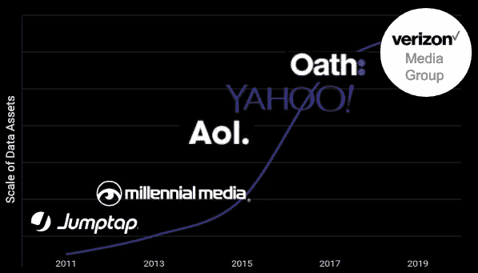
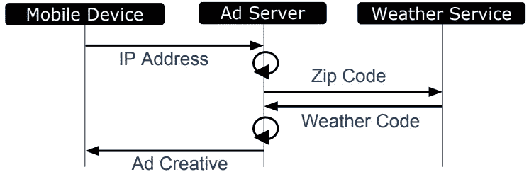
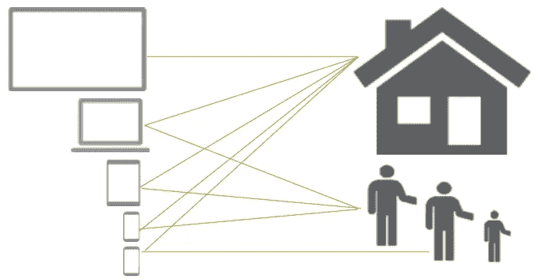
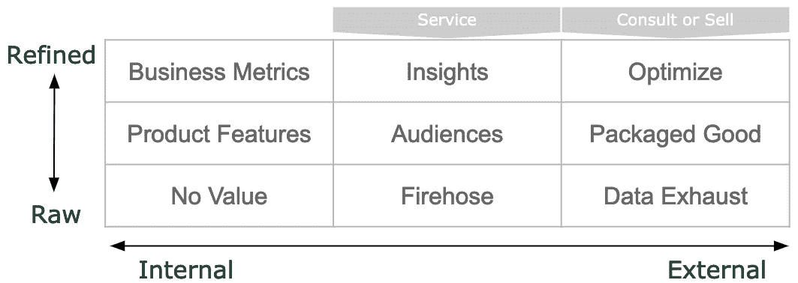
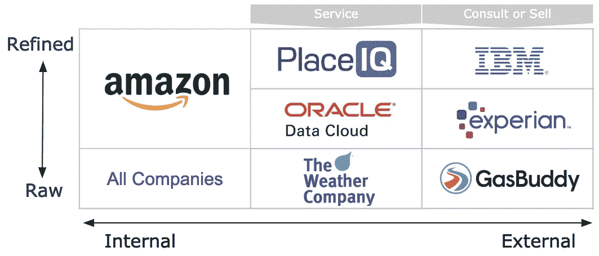

# 数据货币化的经验教训

> 原文：<https://towardsdatascience.com/from-jumptap-to-verizon-lessons-on-data-monetization-7e061204dc72?source=collection_archive---------6----------------------->

## 谈论你的组织的隐藏价值的框架

Graph is illustrative of the journey not actual scale

2011 年 4 月。“Jumptap 是定向移动广告的领导者” [Adam Towvim](https://www.linkedin.com/in/adamtowvim/) 指着他的 iPhone 4 告诉我。当他递给我的时候，那块闪亮的砖看起来像是被冰覆盖着。“用你的手指在屏幕上摩擦，”他示意道。霜神奇地消失了，露出了邓肯甜甜圈冰咖啡促销。

亚当给我看的广告很吸引人，但它不是由数据支持的。我们会面几周后，我加入了 Jumptap，领导团队最终将数据整合到公司的所有技术中。7 年后的今天，我回头看我们构建的客户喜爱的数据产品。这些产品让[从广告商那里赚了数十亿美元](https://www.oath.com/insights/brightroll-dsp-powered-by-adlearn-machine-learning-optimization/)，并推动了[数十亿美元的收购](https://www.cnbc.com/2015/06/23/verizon-closes-aol-acquisition.html)。我思考着我们一路走来学到的教训。

当我们能够传达数据资产的价值和目的时，我们就取得了最大的成功。为了做到这一点，我们投入时间开发了一种通用的数据语言和工具来进行交流，我们与客户进行了深入的交流，并了解我们的数据如何解决他们的问题，当我们谈论数据时，我们要求数据和我们自己都保持完整性。在本文中，我描述了使成功成为可能的框架，以及可以使您的数据对话更有价值的工具。

## 学习语言

在一个充斥着数据点的世界里，令人痛苦的是缺乏关于数据的清晰交流。管理数据产品 20 年的经验告诉我，光是数据这个词就很危险。你需要上下文和定义来描述任何有价值的东西。无论是构建数据产品还是设定数据驱动的目标，管理者都必须花时间去学习、教授和使用一个比数据更好的词。

例如，如果你的公司存在于广告技术生态系统中，并希望将消费者行为数据货币化，你必须开始使用这些词的某些版本:

*   **标识符:**与目标设备、用户、消费者或家庭相关联的字符串。
*   **信号**:可以与标识符相关联的唯一观察值。一组信号通常被称为[特征](https://marketing.adobe.com/resources/help/en_US/aam/c_signal_trait_segment.html)。
*   **段**:所有共享共同信号或特征的 id 的集合。

为什么？这些词实际上对行业有一定的意义，并使团队能够围绕参与所需的技术和法律框架进行联合。Adtech，edtech，fintech，[等](https://www.bbva.com/en/fintech-proptech-femtech-edtech-and-other-related-neologisms/)。每个都有自己的基本数据字典。如果你不会说这种语言，你可能会有错误的对话。

在我的职业生涯中，我一直在接近尾声时加入注定要失败的数据货币化对话。一家数据提供商拥有一套令人满意的受众智能，但该团队尚未弄清楚如何将细分集成到应用程序中。几个月的业务发展审查质量和规模浪费了，因为没有办法连接这些点。差距可能是技术上的、法律上的、财务上的或者以上所有的。只需一次分歧就能扼杀一笔交易。

几乎有[数百万博客](https://www.google.com/search?q=better+conversations)提供如何更好地进行对话的建议，但我的经验证明，围绕复杂数据建立联系的唯一方式是建立一个简单的呼叫流程图，上面标有定义的数据元素(见下文)。你不需要成为一名工程师来组装这些。目标是开始一个实用的对话，而不是记录架构。

Call Flow for Weather Specific Ad Creative

当我们被要求设计一个根据当前天气动态更新的广告时，我们的团队需要集成一个天气数据服务。IP 地址是解析我们传递给气象服务的邮政编码所需的信号。他们回复了一个**段**，一个两位数的天气代码。创意团队将这些代码存储在天气广告中，并使用它们来动态更新广告创意，以反映当前的天气。这很简单，也很有效。

随着数据点之间跳跃次数的增加，这些图表的价值也会增加。大多数数据应用程序，如将[移动运营商细分市场带给广告商](https://www.joranlawrence.com/2014/09/millennial-media-acquired-by-aol-with.html)，需要一个用户**标识符**，并且不像这个天气示例那样简单。如果这些点只是在罕见的情况下连接起来，那么一笔 10 亿美元的交易是不会有回报的。尽早将产品和工程引入对话至关重要。这里成功的关键是使用普遍接受的数据语言。你的行业已经有了一个——学习它。

如果你认为你发明了一种新的数据类型或数据的独特用途，花时间与你的团队和合作伙伴一起明确定义它是什么，不是什么。创建一个命名约定，坚持它，并推广它。与普遍的看法相反，利用数据赚钱并不容易。只有当一个组织花时间定义其数据资产，并学会如何在内部以及最终与客户讨论它们时，价值提取才是可能的。

## 知道问题

数据对话往往以关于数据数量的争论开始和结束。不要让规模立即打消你追求数据驱动产品的念头。市场将永远重视规模，但客户将帮助确定规模和精度之间的正确平衡。重要的是找到一个值得解决的问题。我们在 Jumptap 经历了这一点，并在此过程中学到了关于数据货币化的重要经验；了解问题，了解你的客户，然后确定合适的规模。

2011 年，针对移动设备的广告商没有消费者购买数据。为了触及受众群体，广告商必须信任出版商的上下文元数据，并抱最大希望。Jumptap 领导团队认识到了这一市场需求，我们开始设计一种将消费者行为数据引入移动广告的方法。

我们的第一次迭代专注于快速扩展。我们从 [DataLogix](https://web.archive.org/web/20110304005844/http://datalogix.com/) (现归甲骨文所有)获得了消费者购买数据的许可。他们向我们证明，对于某些产品类型，某些邮政编码显示出高于平均水平的购买行为。我们已经可以针对预定义的邮政编码组，因此我们根据 DataLogix 购买数据创建了专门的位置目标，并开始向广告商出售这些基于位置的受众。初步成功后，客户开始质疑产品的精确度。他们期望购买行为和设备之间有一对一的匹配。我们的解决方案没有提供这一点，但我们已经向一组客户证明，我们正在向市场仍未提供的解决方案冲刺。

我们的第二次迭代重视精度胜过规模。数据提供商可以向我们发送任何有电子邮件地址的用户的受众分群。我们联系了我们的出版商合作伙伴，请他们收集他们用户的电子邮件，并在地址上添加模糊哈希后发送给我们。我们向出版商支付了数百万封链接到有效移动设备 id 的散列电子邮件，并继续从我们的数据合作伙伴那里下载数据。更精确的产品是[相当成功的](https://gigaom.com/2012/09/11/jumptap-weeds-out-fantasy-shopping-with-new-approach-to-mobile-ad-targeting/)，但是这一次我们遇到了无法克服的困难。我们无法从合作伙伴那里获得足够的电子邮件地址。

The Complex Map of Consumer Purchase Data

我们回到客户那里，找到了平衡规模和精度的折中方案。我们想出了如何[准确地将移动设备](https://vimeo.com/album/3024049/video/105290039)与具体家庭联系起来。然后，有针对性的广告被发送到我们能接触到的所有与家庭相关的设备上。这个伸缩性很好。我们的客户认识到，当整个家庭都收到类似的信息时，影响购买行为是非常有效的。

我们立即投入了广告预算，这些预算受到当时移动广告缺乏针对性的限制。然后，我们采用相同的技术堆栈，用它来驱动市场上最早的一些[跨设备瞄准和测量](https://vimeo.com/album/3024049)解决方案。我们能够大规模交付产品，同时保持市场认可的精确度水平，这是 Jumptap 最终以超过 2 亿美元的价格出售给 [Millennial Media 的关键因素。](https://www.joranlawrence.com/2013/08/jumptap-is-aquired.html)我们知道我们要解决的问题，我们倾听客户的意见，我们在规模和精度之间进行权衡。

## 进行对话

每个组织都将创建数据视为自然的业务过程。在某种程度上，他们得出结论，数据可能有一定的货币价值。多年来，我开发了一个框架来帮助推动围绕数据货币化的对话，以帮助团队确定是否值得追求以及如何让团队支持决策。

第一步在本文的开头部分已经介绍过了。组织必须定义正在考虑的数据集，确认组织拥有使用数据的合法权利，并估计当前规模。以我的经验来看，10 家公司中有 9 家在执行盈利计划之前必须回头重写一些数据使用或隐私语言。这需要时间，而且可能会引起争议。先这样做，或者以后付出代价。

下一步是通过评估数据提炼和外部化的潜力来探索货币化机会。想一想您的数据或您对数据的处理是如何与众不同的。下面的矩阵是推动对话的好工具。

所有数据都从左下方开始—原始的、内部的，不创造任何价值。矩阵迫使团队思考数据集如何移动到不同的盒子中。提炼时向上，分享或出售时向右。

*   我们对数据类型有唯一的访问权吗？
*   数据类似于原材料还是成品？
*   我们可以向其他公司提供我们的数据吗？
*   我们想投资改进我们的数据吗？
*   我们的数据已经有市场了吗？
*   我们对数据的处理有什么不同吗？

回答这些最初的问题，并将数据资产放入当前和期望的盒子中，有助于团队支持更广泛的数据战略。为了更好地说明这些选项，我根据公司当前的货币化对话状态，将公司名称放入下面的主要方框中。一个公司可以有多个盒子里的产品。

亚马逊进行了对话，并得出结论，他们的战略是围绕他们的数据资产创建一个堡垒，同时通过数据优化和内部数据服务进行创新。他们在数据民主化服务上投入了大量资金，以增强员工的能力。他们利用客户情报来发展业务，并取得了巨大的成功。他们现在是数据驱动型企业的典范。

寻求成为下一个亚马逊并不是一个糟糕的决定。然而，如果领导层决定关注内部，他们需要定期沟通并捍卫这一决定。具有创新精神和创业精神的员工会发现值得考虑的商业机会。不要害怕进行对话。如今，提供[数据即服务(DaaS)](https://en.wikipedia.org/wiki/Data_as_a_service) 是一个巨大的机遇。在获取、交付或提炼数据方面具有竞争优势的公司，如 [Datalogix](https://www.forbes.com/sites/greatspeculations/2015/02/20/heres-why-oracle-paid-over-1-2-billion-for-acquiring-datalogix/#476746605d7d) (被甲骨文收购)，以及[气象公司](https://www.marketwatch.com/story/ibm-finally-reveals-why-it-bought-the-weather-company-2016-06-15)(被 IBM 收购)，有可能达到十亿美元的估值。

沿着这条路走下去是一个需要大量投资的重大战略决策。如果这是货币化对话的结果，那么下一步就需要达成一致并制定详细的计划。试着呆在一个盒子里，非常强调差异化。矩阵中的另一家 DaaS 公司 PlaceIQ 是位置数据生态系统的早期远见者之一，但他们在建立规模和差异化方面面临挑战。多年来，他们已经开发了几乎每一个盒子中的产品，然后通过其当前的平台为客户提供高度精确的位置洞察，取得了成功。

最后一栏，数据卖家，由于脸书([不是卖家](https://motherboard.vice.com/en_us/article/8xkdz4/does-facebook-sell-data))和其他行为者在消费者数据实践和政策上不够透明，这些天正在应对负面新闻。尽管如此，出售数据是一项可以正当进行的合法业务。早在互联网出现之前，原始数据供应商就开始出售精细数据集，如家庭人口统计数据、购买历史记录或其他用于各种目的的高价值列表。这些数据的老爷爷们还在卖收缩包装的软件。这不是数据业务的发展方向，但对于一些数据集来说，这仍然是一个值得考虑的有效商业模式。

一批新的数据卖家已经发现，各种原始和精炼数据类型都有数字市场。在美国，除了金融和医疗垂直行业，数据交换通常不受监管。这在未来可能会发生变化，但今天像甲骨文公司、T2 公司、洛塔梅公司和 T4 公司这样的公司提供了通用的方法来将定义的数据资产货币化。小众买家，如位置情报提供商 [Cuebiq](https://www.cuebiq.com/privacypolicy/) 、[un cast](https://www.unacast.com/)和 [Safegraph](https://www.safegraph.com/) 从多个[移动应用发行商](https://www.nytimes.com/interactive/2018/12/10/business/location-data-privacy-apps.html)购买并汇总原始位置信号，这些发行商提供服务以换取出售精确位置信号的权利。正如 matrix 所建议的那样，将这样的原始数据出售给数据生态系统是价值链上的一个低端。然而，如果您的公司正在考虑转向 DaaS 业务或成为数据顾问，从这里开始是测试数据价值的完美有效的方法。

我看到绝大多数专家反对出售数据，但我认为公司需要采取务实的态度。进行货币化对话。如果您的公司对数据资产拥有完全的权利，有限的风险暴露，并且没有建立数据业务的短期意图，那么应该考虑加入数据生态系统。使用多样化的收入流以其他方式建立企业价值，或者随着时间的推移向数据价值链的上游移动。

货币化对话既不是一劳永逸的练习，也不是你想永远做下去的跑步机。每个公司都需要找到正确的节奏。如果你的公司走上亚马逊的道路，你应该定期重新评估这个决定，但不是每个月。如果有机会出现，测试市场。如今，数据的保存期限如此之短，以至于一个测试项目可以在有限的暴露情况下提供大量的知识。最重要的是，在团队评估货币化机会时，花时间记录机会、厌恶和结果。记录对话有助于避免重复讨论同一个问题。它还可以帮助创新型员工发现领导层尚未考虑到的机会。

## 要求诚信

大规模利用数据赚钱并不容易。对于每一个估值达到 10 亿美元的 Datalogix，就有 100 家像 T2 rocket fuel 这样的公司找到了数据的独特应用，但却犯了严重的错误。要想取得成功，你需要一个非常正直、有能力沟通复杂事物的团队。我选择这两个特征是因为以今天的技术，假设你可以用数据做任何事情。这一事实很容易夸大能力，低估复杂性。团队需要清楚地传达价值，然后交付。结果(用数据表示)最终会揭开真相。不要冒险假装。

挑战在于，激烈的竞争将不断推动团队利用他们的数据做越来越多的事情。投资于安全、隐私和政策培训系统非常重要。所有这些都不能弥补在数据使用方面表现出完整性的领导力。像[欧洲 GDPR](https://www.natlawreview.com/article/eu-regulators-provide-guidance-notice-and-consent-under-gdpr) 这样的法规是技术自大和多年不透明数据收集的结果。如果我们让这减缓我们的进步，那将是一场悲剧。解决办法很简单。团队需要接受数据透明、同意和控制的新规范。这是一种公平的平衡。随着公司从使用数据中获利，他们也需要为消费者提供对数据更大的访问和控制。如果一个组织希望保持数据驱动优势，管理层必须让这种新模式成为公司文化的一部分。

创新数据使用的例子在我们身边比比皆是。从把你带到这个页面的[谷歌搜索](https://www.google.com/search?q=joranlawrence&oq=joranlawrence)，到因为当地政府[众包坑洞位置](https://www.wired.com/insights/2014/03/potholes-big-data-crowdsourcing-way-better-government/)而在你的汽车中平稳行驶，数据被用来让我们的生活变得更好。机会是无穷的，但是很容易被与构建这些产品相关的风险和复杂性所淹没。当工作感觉巨大或数据资产不可获得时，很容易发现异议。我的经验向我证明，企业数据蕴含着巨大的价值。关键是使用简单的语言将大问题分解成微小的数据点，进行货币化对话以使团队保持一致，然后在团队交付时以残酷的诚实进行沟通。遵循这一框架并确定您的公司在哪里有数据机会可能是增长和停滞的区别。这是最后一课。

