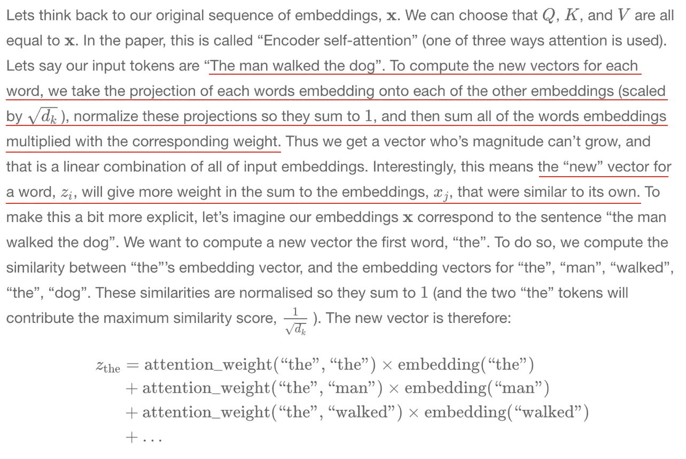
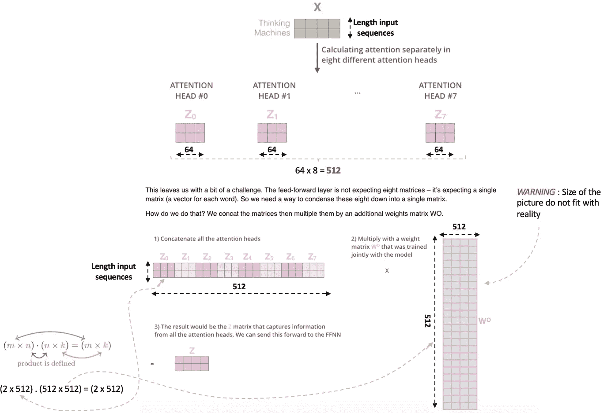
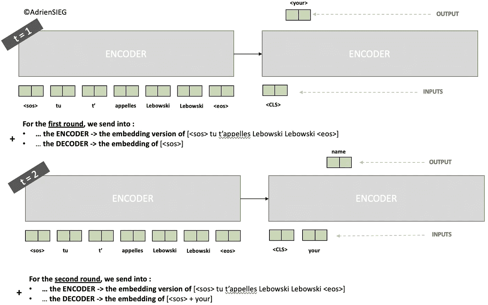
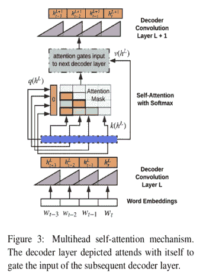
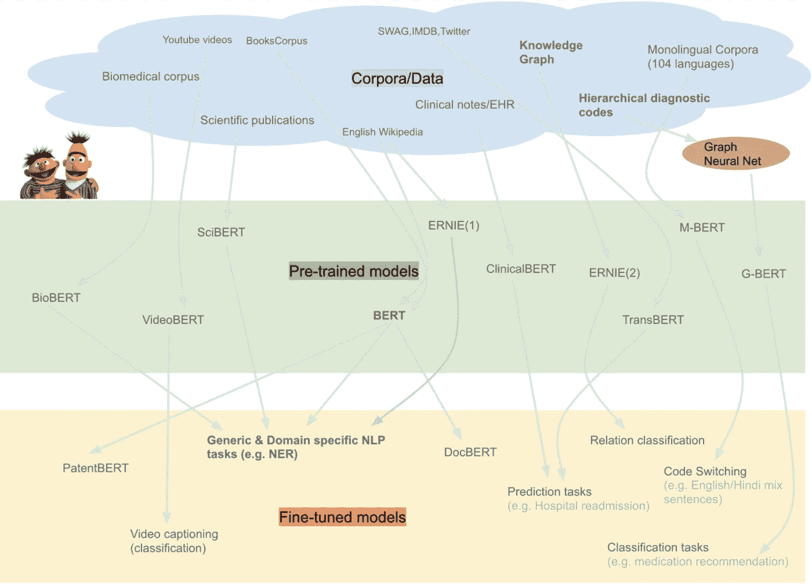

# 从预训练的单词嵌入到预训练的语言模型——关注 BERT

> 原文：<https://towardsdatascience.com/from-pre-trained-word-embeddings-to-pre-trained-language-models-focus-on-bert-343815627598?source=collection_archive---------1----------------------->

## **从**静态单词嵌入**到**动态(语境化)单词嵌入

*“在每个 NLP 实践者的工具箱中，***被* ***预训练语言模型*** *所取代，这似乎只是时间问题”**Sebastian Ruder**

**

*adsieg.github.io*

## *静态单词嵌入*

*   *Skip-Gram & CBOW(又名 **Word2Vec***
*   ***手套***
*   ***快速文本***
*   ****外来*** : Lda2Vec，Node2Vec，字符嵌入，CNN 嵌入，…*
*   ***庞加莱嵌入**学习分层表示*

## *上下文化(动态)单词嵌入(LM)*

*   ***CoVe** ( *语境化嵌词* s)*
*   ***无级变速器** ( *交叉训练*)*
*   ***ELMO** ( *来自语言模型的嵌入*)*
*   ***ULMFiT** ( *通用语言模型微调*)*
*   ***伯特** ( *来自变压器*的双向编码器表示)*
*   ***GPT**&**GPT-2**(*创成式预训*)*
*   ***变压器 XL** (意为超长)*
*   ***XLNet** ( *广义自回归预训练*)*
*   ***恩里耶** *(通过知识整合增强表现)**
*   ***(flai Embeddings**(*用于序列标记的上下文字符串嵌入*))*

*还有很多其他的…*

**

*adsieg.github.io*

## *什么是好的模式？*

*最佳模型将能够捕获 4 个组件:*

*   ***词汇**方法*(关于一种语言的单词或词汇)**
*   ***句法**方法*(在一种语言中创造结构良好的句子的词语和短语的排列- >语法)**
*   ***语义**方法*(关于语言中的意义——>引申意义，理解歧义)**
*   ***语用**方法*(词语与文档的接近度)**

## *模特的主要家族有哪些？*

**

*[https://nlp.stanford.edu//~johnhew//structural-probe.html?utm_source=quora&utm_medium=referral#the-structural-probe](https://nlp.stanford.edu//~johnhew//structural-probe.html?utm_source=quora&utm_medium=referral#the-structural-probe)*

***语言建模**是在单词序列上分配概率分布的任务，该概率分布与语言的分布相匹配。虽然听起来令人生畏，***(即埃尔莫、伯特、GPT)* 的语言建模本质上只是在一片空白中预测单词。更正式地说，给定一个上下文，语言模型预测一个单词在该上下文中出现的概率。***

*****这种方法为什么有效？因为这种方法迫使模型学习如何使用整句话中的信息来推断遗漏了什么单词。*****

# ***0.静态与动态***

*   *****静态单词嵌入**未能**捕获多义词**。它们为**不同上下文**中的**同一个单词**生成**同一个嵌入**。###语境化单词嵌入旨在**捕获**不同语境**中的单词语义**，以解决**多义**问题和**单词依赖于语境的性质**。***
*   *****静态单词嵌入只能利用来自下游任务的无监督模型的向量输出**——而不是无监督模型本身。它们开始时大多是**浅模型**，并且在训练后经常被丢弃(例如 word2vec、Glove)# # #**上下文化(动态)单词嵌入**训练的输出是**被训练的模型和向量**——而不仅仅是向量。***
*   ***传统的单词向量是**浅层表示**(单层权重，称为嵌入)。他们只是**在模型的第一层**融入了之前的知识。对于新的目标任务，网络的其余部分仍然需要从头开始训练。他们**未能捕捉到可能更有用的高层信息**。单词嵌入只在**捕捉单词的语义**时有用，但我们还需要理解更高层次的概念，如**回指**、**长期依赖**、一致、否定等等。***

## ***演变:***

************

***[http://ruder.io/10-exciting-ideas-of-2018-in-nlp/](http://ruder.io/10-exciting-ideas-of-2018-in-nlp/)***

******迁移学习****——一种不是从头开始训练模型的技术，我们使用在大型数据集上预先训练的**模型，然后**针对特定的自然语言任务对它们进行微调**。******

*****一些特殊性*:****

*   ******ULMFiT** →通过**微调**进行传送****
*   ******ELMo** →通过**特征提取转移******
*   ******伯特** →转移注意力**提取******

## ****为什么使用迁移学习？****

> ****在 vision 中，它已经实践了一段时间，人们使用经过训练的模型从庞大的 ImageNet 数据集学习特征，然后针对不同的任务在较小的数据上进一步训练它。****

*   ****用于文本分类(或任何其他受监督的 NLP 任务)的大多数**数据集都相当**小**。这使得训练深度神经网络非常困难，因为它们会**倾向于过度适应这些小的训练数据**并且**在实践中不能很好地概括**。******

> ****在计算机视觉领域，几年来，趋势是在巨大的 ImageNet 语料库上预先训练任何模型。这比随机初始化好得多，因为该模型学习一般的图像特征，并且该学习可以用于任何视觉任务(比如字幕或检测)。****

****在 NLP 中，我们在**上训练一个通用语言建模(LM)任务**，然后**在文本分类(或其他任务)上微调**。原则上，这将执行得很好，因为模型将能够**使用从生成性预训练中获得的语言语义知识**。****

*   ****它能够**捕捉语言中的长期依赖******
*   ****它有效地**合并了层级关系******
*   ****它可以帮助模型**学习情绪******
*   ****对于 LM 来说，大数据语料库很容易获得****

# ****伯特****

********

****[https://mostafadehghani.com/2019/05/05/universal-transformers/](https://mostafadehghani.com/2019/05/05/universal-transformers/)****

## ****改进？****

********

1.  ******GPT**vs**埃尔莫**vs**伯特- >** 所有预训练模型架构的区别。**伯特**使用双向转换器*对*对 **GPT** 使用从左到右转换器*对*对**埃尔莫**使用独立训练的从左到右和从右到左 LSTM 的串联来为下游任务生成特征。在所有层中，BERT 表示是由左右上下文共同决定的。换句话说，它是深度双向的，与 **ELMo** ( *浅层双向*)和 **OpenAI GPT** ( *一个方向，从左到右*)相反。****
2.  ****变形金刚证明了**递归**和**卷积**对于构建高性能的自然语言模型并不重要****
3.  ****他们使用**一种自我注意操作**来实现最先进的机器翻译结果****
4.  ****由于其**并行性**和**运行时**的特性，注意力是一个**高效操作******
5.  ****传统的语言模型采用前 n 个标记并预测下一个标记。相比之下，BERT 训练了一个语言模型，在预测时将**上一个和下一个标记**都考虑在内——实际上是**双向的**。****
6.  ****如果你简单地要求一个深度神经网络通过阅读所有维基百科来学习典型的英语句子是什么样子，那么它对英语语言学习了什么？ [**当计算机已经将句子中的每个单词表示为实值向量，而没有解析树的显式表示时，BERT 对类似人类的解析树进行编码，并在这些向量空间中找到树结构**](https://nlp.stanford.edu//~johnhew//structural-probe.html?utm_source=quora&utm_medium=referral#the-structural-probe) 。BERT 能够从 Penn 树库中重建解析树。****

********

****[https://nlp.stanford.edu//~johnhew//structural-probe.html?utm_source=quora&utm_medium=referral#the-structural-probe](https://nlp.stanford.edu//~johnhew//structural-probe.html?utm_source=quora&utm_medium=referral#the-structural-probe)****

*   ****针对特定 NLP 任务 *(如 POS、NER 等)对**每层的重要性进行评分。)***，**表示在网络中基本句法信息被更早的** *(较低层)*捕获，随后是**较高层的语义信息**。这反映在右图中。*(这个观察结果也类似于在 ELMo 模型中看到的情况)*。****
*   ****此外，与**句法任务**相关的信息似乎**更多地局限于几个层**，其中用于**语义任务** ( [SPR](https://aclweb.org/anthology/Q15-1034) and Relations)的信息通常**遍布整个网络******
*   ****检查输出单词向量显示，不仅单词的不同含义以不同的表示形式被捕获，它们还以细粒度的方式在空间上被分离。****

********

****[https://arxiv.org/pdf/1906.02715.pdf](https://arxiv.org/pdf/1906.02715.pdf)****

********

****7.**每个单词必须经过的距离**:在一个简单的 RNN 中，单词“Echt”必须经过多个步骤。最后的红色层必须存储编码信息。在超过 50 个单词的大句子中，**每个单词需要移动的距离线性增加**。由于我们不断地改写那些编码信息，我们肯定会漏掉句子中出现较早的重要单词。在编码之后，它还必须经过传播才能到达解码的目的地。****

****有了**注意力机制**，我们不再试图将完整的源句子**编码成固定长度的向量**。相反，我们允许解码器在输出生成的每一步“关注”源句子的不同部分。****

****注意机制的显著成就是提高了**对模型的空间理解。******

# ****工作？****

********

# ****1.→从单词到向量****

********

*   ******记号化**就是把它劈成碎片的任务，叫做*记号*，或许同时扔掉某些字符，比如标点符号。****
*   ****使用**词块**(如 playing - > play + ##ing)代替单词。这可以有效地减少词汇表的大小，并增加每个单词的可用数据量。****
*   ******数字化**旨在将每个标记映射到语料库词汇中的唯一整数。****
*   ******令牌嵌入**的任务是为序列中的每个单词获得嵌入(即一个实数向量)。该序列的每个单词被映射到模型将在训练期间学习的 *emb_dim 维向量*。你可以把它看作是对每个令牌的向量查找。这些向量的元素被视为模型参数，并像任何其他权重一样通过反向传播进行优化。****
*   ******填充**用于使*批次*中的输入序列具有相同的长度。也就是说，我们通过添加' *<填充符> '* 记号来增加一些序列的长度。****
*   ******位置编码**:****

****回想一下**位置编码**的设计是为了帮助模型学习**序列的一些概念和记号**的相对位置。这对于基于语言的任务至关重要，尤其是在这里，因为我们没有使用任何传统的循环单元，例如 *RNN* 、 *GRU* 或 *LSTM*****

****直观地说，我们的目标是能够根据特定单词的位置来**修改该单词所代表的意思。我们不想改变单词的完整表示，但是我们想通过使用预定的(非学习的)正弦函数向令牌嵌入中添加 *[-1，1]*** 之间的**数，对**进行一点修改，以编码其位置**。对于**编码器的其余部分，**单词将根据单词在**中的位置**略有不同地表示(即使是同一个单词)。******

******编码器**必须能够利用这样一个事实，即**一些字在给定位置**，而在同一序列中，其他字在其他特定位置。也就是说，我们希望网络能够**理解相对位置**和**，而不仅仅是绝对位置**。****

********

****[https://www.mihaileric.com/posts/transformers-attention-in-disguise/](https://www.mihaileric.com/posts/transformers-attention-in-disguise/)****

****作者选择的正弦函数允许位置被表示为彼此的**线性组合**，从而允许网络**学习记号位置之间的相对关系**。****

****让我们考虑一个例子:****

****************

******位置嵌入**可以理解为序列中不同单词之间的**距离。这里的直觉**是将**这些值添加到嵌入中提供了**嵌入向量之间有意义的距离，一旦它们被投影到 Q/K/V 向量中，以及在点积注意力**期间。******

********

****[https://mc.ai/seq2seq-pay-attention-to-self-attention-part-2/](https://mc.ai/seq2seq-pay-attention-to-self-attention-part-2/)****

# ****2.→编码器模块****

********

****[https://jalammar.github.io/illustrated-transformer/](https://jalammar.github.io/illustrated-transformer/)****

****总共 N 个编码器模块链接在一起，产生**编码器的**输出。****

*******注:*** *在* ***伯特’****s 实验中，块数 N(或者他们所说的 L)被选为 12 和 24。*****

*   ****编码块的**输入**和**输出**的尺寸相同。因此，**使用一个编码器模块的输出作为下一个编码器模块**的输入是有意义的。****
*   ****一个特定的模块负责*寻找输入表示之间的关系，并将它们编码*到其输出中。****
*   ****这些块彼此不共享权重。****
*   ****这种通过块的迭代过程将帮助神经网络捕获输入序列中单词之间更复杂的关系。****
*   ******转换器**使用 ***多头注意力*** ，这意味着它用**不同权重矩阵**计算注意力 ***h* 不同时间**，然后将结果串联在一起。****

********

## ****注意机制****

****让我们深入研究一下注意力机制。请注意，**编码器模块**和**解码器模块之间的多头自我关注是不同的。******

********

****[https://mc.ai/seq2seq-pay-attention-to-self-attention-part-2/](https://mc.ai/seq2seq-pay-attention-to-self-attention-part-2/)****

## ****一个头自我关注****

****一个 **RNN** 保持一个隐藏状态，允许它将它已经处理过的先前单词/向量的表示与它正在处理的当前单词/向量的表示合并。**自我关注**是转换器用来将对其他相关单词的“理解”烘焙到我们当前正在处理的单词中的方法。****

********

****[https://jalammar.github.io/illustrated-transformer/](https://jalammar.github.io/illustrated-transformer/)****

****这句话中的“ *it* 指的是什么？它指的是街道还是动物？****

*   ****从每个**编码器的输入向量**的创建**三个向量**和****
*   *****对于**的每个单词**，我们创建**一个查询向量**，**一个关键向量**，以及**一个值向量*******
*   *****这些向量是通过**将嵌入**乘以**三个矩阵**创建的，这三个矩阵是我们在训练过程中训练的。*****

*****注意**这些新向量**在尺寸上比嵌入向量小。它们的**维度是 64** ，而嵌入和编码器输入/输出向量的维度是 512。*****

> *****为什么维度是 64？正如我们必须拥有的:*****
> 
> *******- >输出的维数**是【输入序列长度】x【嵌入维数— 512】*****
> 
> *****->我们在多头自关注过程中使用 **8 头**。给定自我关注向量的**输出大小为【输入序列长度】x【64】。因此**所有多头自关注**过程产生的连接向量将是[输入序列长度]x([64]x[8])=[输入序列长度] x ([512])*******

**********

*****How Self-Attention works?*****

*******查询 q:****查询向量 *q* 对左侧正在关注的单词/位置进行编码，即正在“查询”其他单词的那个。在上例中，突出显示了“the”(所选单词)的查询向量。*******

********键 k:** 键向量 *k* 对关注的右边的单词进行编码。如下所述，关键向量与查询向量一起确定各个单词之间的关注度得分。******

********q×k** **(逐元素)**:查询向量和一个关键向量的逐元素乘积。该乘积是在所选查询向量和每个关键向量之间计算的。这是点积(逐元素积的总和)的前身，包含它是为了可视化，因为它显示了查询中的单个元素和关键向量是如何贡献点积的。******

********q k** :选择的查询向量和每个 keyvectors 的点积。这是未标准化的注意力得分。******

********Softmax** :所有目标词的 *q k* / 8 的 Softmax。这将注意力分数归一化为正值，并且总和为 1。常数因子 8 是向量长度的平方根(64)。这个 softmax 分数决定了每个单词在这个位置的表达量。显然，在这个位置的单词将具有最高的 softmax 分数，但是有时关注与当前单词相关的另一个单词是有用的。******

*******这三个向量怎么算？*******

************

******我们为输入序列中的每个单词计算自我注意。******

************

## ******关注“分数”******

> ******【K 的 Q x 转置】是**查询向量**和**关键向量**的乘积标量。**关键向量**比**查询向量**越接近，由【Q x 转置】得到的分数越高。******
> 
> ******Softmax 将为我们提供一种概率分布，该概率分布保持增加与相应查询向量相似的关键向量的值，并因此保持减少远离查询向量的关键向量。******

*   ***********d _ v****设置为****d _ k****=****d _ v****=****emb _ dim/h .***********

******记住 ***Q*** 和 ***K*** 是令牌到一个 ***d_k* (即 64)维空间**的不同投影。因此，*我们可以把* ***这些投影的点积看作是表征投影之间相似性的度量*** 。对于通过 *Q* 投影的每个向量，通过*K*投影的点积测量这些向量之间的相似性。如果我们分别通过 *Q* 和 *K* 将**v _ I***和 *u_j* 称为**第 I 个令牌**和**第 j 个*令牌*的投影，它们的点积可以看做:*********

************

******这是衡量**的方向有多相似 *u_i* 和*v _ j*和**它们的长度**有多大(方向越近，长度越大，点积越大)。********

****考虑这个矩阵乘积的另一种方式是作为输入序列中每个记号之间的**特定关系的编码(该关系由矩阵 *K* 、 *Q* 定义)。******

********

****[https://lesdieuxducode.com/blog/2019/4/bert--le-transformer-model-qui-sentraine-et-qui-represente](https://lesdieuxducode.com/blog/2019/4/bert--le-transformer-model-qui-sentraine-et-qui-represente)****

********

****[https://towardsdatascience.com/deconstructing-bert-part-2-visualizing-the-inner-workings-of-attention-60a16d86b5c1](/deconstructing-bert-part-2-visualizing-the-inner-workings-of-attention-60a16d86b5c1)****

****我们看到"*"的查询向量和***" store "*(下一个单词)的关键向量**的**乘积在大多数神经元中都是强正的。对于除下一个令牌之外的令牌，**键查询产品包含一些正值和负值的组合**。结果是“The”和“store”之间的关注度得分较高。*******

********

******举例**:考虑一下这个短语——“***行动得到结果*** ”。为了计算第一个单词“Action”的自我关注度，我们将**计算短语中所有单词相对于“Action”**的得分。当我们对输入序列中的某个单词进行编码时，该分数决定了其他单词的重要性。****

********

****[https://www.analyticsvidhya.com/blog/2019/06/understanding-transformers-nlp-state-of-the-art-models/](https://www.analyticsvidhya.com/blog/2019/06/understanding-transformers-nlp-state-of-the-art-models/)****

********

****[https://www.analyticsvidhya.com/blog/2019/06/understanding-transformers-nlp-state-of-the-art-models/](https://www.analyticsvidhya.com/blog/2019/06/understanding-transformers-nlp-state-of-the-art-models/)****

****让我们回到最初的例子:****

****************

****总而言之，当谈到单头自我关注时****

****注意力背后的主要思想是**查找表**，一个有大量其他值的表**你问它一个查询**和**它返回一个最接近它的**。在这里使用的方法中，我们给它提供了三个值，**键**、**值**和**查询**。有大量的键，基本上是 n 维空间中的 1 维向量，其中每个键都有一些对应的值。****

********

****[https://medium.com/datadriveninvestor/lets-build-attention-is-all-you-need-1-2-de377cebe22](https://medium.com/datadriveninvestor/lets-build-attention-is-all-you-need-1-2-de377cebe22)****

********

****注意功能可以描述为一个**字典对象**。****

********

****[https://persagen.com/resources/biokdd-review-nlu.html](https://persagen.com/resources/biokdd-review-nlu.html)****

## ****B —多头自我关注****

****这篇论文指出“**附加注意**”比上述自我注意表现得更好，尽管它要慢得多。加法注意力使用更复杂的兼容性函数，即前馈神经网络。****

****在 Transformer 的架构中，自我关注不是一次而是多次计算，并行且独立。因此称为**多头关注**。输出被连接并进行线性转换，如下图所示:****

********

****变压器使用**八个注意力头**，所以我们最终为每个编码器/解码器提供**八套。每个集合用于**将输入嵌入投影到不同的表示子空间**。如果我们做同样的自我关注计算，我们会得到八个不同的 Z 矩阵。******

****然而，**前馈层并不期望八个矩阵**。我们需要将它们连接起来，并通过将它们与附加权重矩阵 w0 相乘，将这八个压缩成一个矩阵****

********

****在多头注意力中如何将 8 个矩阵 Z1…Z8 返回成单个矩阵 Z？****

********

> ****在一个矩阵 W0 上串联一个排序，维数为 512 x 512([(nom bre de têtes)x(dimension reqête or cléou valeur，即 64)]x[dimension des embedding])，快速研究在一个排序空间上的结果。****

********

****[https://lesdieuxducode.com/blog/2019/4/bert--le-transformer-model-qui-sentraine-et-qui-represente](https://lesdieuxducode.com/blog/2019/4/bert--le-transformer-model-qui-sentraine-et-qui-represente)****

****总而言之…****

********

****[https://jalammar.github.io/illustrated-transformer/](https://jalammar.github.io/illustrated-transformer/)****

****结果如下:****

********

****[https://jalammar.github.io/illustrated-transformer/](https://jalammar.github.io/illustrated-transformer/)****

# ****辍学、新增和正常****

****[https://web . Stanford . edu/class/archive/cs/cs 224n/cs 224n . 1184/lectures/lectures 12 . pdf](https://web.stanford.edu/class/archive/cs/cs224n/cs224n.1184/lectures/lecture12.pdf)****

****在这一层之前，总有一层输入和输出具有相同的尺寸(*多头关注*或*前馈*)。我们称该层为*子层*及其输入 *x.*****

****在每个*子层*之后，以 10%的概率应用丢失。把这个结果叫做 *Dropout(Sublayer(x))* 。这个结果被添加到*子层*的输入 *x，*，我们得到 *x + Dropout(子层(x))。*****

********

****注意，在*多头注意力*层的上下文中，这意味着**将令牌 *x* 的原始表示添加到基于与其他令牌**的关系的表示中。这就像告诉令牌:****

> *****“学习与其余令牌的关系，但不要忘记我们已经了解的关于你自己的内容！”*****

****最后，用每一行的平均值和标准偏差计算标记方式/行方式的归一化。这提高了网络的稳定性。****

********

****[https://jalammar.github.io/illustrated-transformer/](https://jalammar.github.io/illustrated-transformer/)****

********

****[https://arxiv.org/pdf/1607.06450.pdf](https://arxiv.org/pdf/1607.06450.pdf)****

****我们计算**用于归一化**的平均值和方差，该平均值和方差来自单个训练案例中一层中神经元的所有总计输入。****

# ****位置式前馈网络****

****除了注意子层之外，我们的编码器和解码器中的每一层都包含**一个完全连接的前馈网络**，该网络分别且相同地应用于**每个位置**。这由两个线性转换组成，中间有一个 ReLU 激活。****

********

****[https://mc.ai/seq2seq-pay-attention-to-self-attention-part-2/](https://mc.ai/seq2seq-pay-attention-to-self-attention-part-2/)****

****虽然不同位置的线性变换是相同的，但是它们在层与层之间使用不同的参数。另一种描述方式是两个内核大小为 1 的卷积。输入和输出的维数是 dmodel=512，内层的维数是 dff=2048。****

****神经元的形式与一个激活的相关函数，形式类似于:****

********

*****Ici W1 a pour dimensions[dimension des embedding]x[dimension d ' entre d '渡厄·FFN-奥乔瓦]和 W2[dimension d ' entre 渡厄·FFN-奥乔瓦]x[dimension des embedding]。来源*[*ici*](https://arxiv.org/abs/1706.03762)*。*****

# ****3.→解码器模块****

****每个**解码层**由子层组成:****

1.  ****屏蔽多头注意(带**前瞻屏蔽**和**填充屏蔽******
2.  ****多头注意(带垫口罩)。v(值)和 K(键)接收*编码器输出*作为输入。Q (query)接收来自屏蔽多头注意子层的*输出。*****
3.  ****点式前馈网络****

****这些子图层中的每一个都有一个围绕它的残差连接，然后是图层规范化。每个子层的输出是`LayerNorm(x + Sublayer(x))`。****

****变压器中有 N 个解码器层。****

****当 **Q** 接收来自解码器第一关注块的**输出， **K** 接收**编码器输出**，**关注权重代表基于编码器输出**给予解码器输入的重要性。换句话说，**解码器通过查看编码器输出并关注自身输出**来预测下一个字。******

****`Decoder`包括:****

1.  ****输出嵌入****
2.  ****位置编码****
3.  ****解码器层****

****目标经过嵌入，该嵌入与位置编码相加。该求和的输出是解码器层的输入。解码器的输出是最终线性层的输入。****

********

****What are the inputs of Transformer?****

****我们同时输入和输出句子。输出最初可以用任何东西填充，模型忽略你填充的任何东西。它使用整个输入句子和输出句子一次性预测下一个单词。一旦我们预测了单词，我们在输出序列中替换它，模型只考虑到该点的输出，而忽略它前面的内容。我们继续这样做，直到我们有一个完整的句子。****

## ****多头掩蔽自我注意****

****在*编码器*中，自关注层过程输入**查询来自上一层**的**输出的**、**键**和**值**。**编码器中的每个位置可以照顾到上一层编码器的所有位置**。****

****在*解码器*中，自关注层使**每个位置能够关注解码器**中所有以前的位置，包括当前位置。****

********

****[https://persagen.com/resources/biokdd-review-nlu.html](https://persagen.com/resources/biokdd-review-nlu.html)****

********

****To prevent positions from attending to subsequent position ([http://www.peterbloem.nl/blog/transformers](http://www.peterbloem.nl/blog/transformers))****

****换句话说，自关注层仅被允许关注输出序列中**前面的位置。掩蔽多头注意力是通过在自我注意力计算中的 softmax 步骤之前掩蔽未来位置(将它们设置为-∞)来完成的。**该步骤确保位置 *i* 的预测仅依赖于小于 *i* 位置的已知输出。**因为我们希望这些元素在 softmax 之后为零，所以我们将它们设置为。******

********

****[http://www.peterbloem.nl/blog/transformers](http://www.peterbloem.nl/blog/transformers)****

****对于 RNNs——不存在这样的问题，因为**它们无法预测输入序列:输出 I 仅取决于输入 0 至 i** 。使用 transformer，输出依赖于整个输入序列，因此预测下一个单词/字符变得非常容易，只需从输入中检索即可。****

****要使用自我关注作为自回归模型，我们需要确保它**不能预测到结果** e。在应用 softmax 之前，我们通过**对点积矩阵**应用遮罩来做到这一点。**该掩码禁用矩阵对角线上方的所有元素**。****

****在我们**像这样禁用了自我关注模块**之后，模型**在序列**中不再向前看。****

****“**解码器关注**层的工作方式类似于多头自我关注，除了它从其下面的**层创建其**查询矩阵**，并且**从编码器堆栈**的输出中获取键和值矩阵。******

****************

****解码器中的自关注层允许解码器中的**每个位置关注解码器中的所有位置，直到并包括该位置**。我们需要在解码器中防止**向左的信息流**，以保持**的自回归特性**。我们通过屏蔽(设置为∞)**soft max 输入中与非法连接**相对应的所有值，在比例点积注意中实现这一点。****

# ****4.→最终的线性和 Softmax 层****

****解码器堆栈输出一个浮点向量。我们如何把它变成一个单词？这是最后一个线性层的工作，接着是一个 Softmax 层。****

> ******线性层是一个简单的全连接神经网络，它将解码器堆栈产生的矢量投影到一个更大的矢量中，称为 logits 矢量**。这个空间就是词汇量(所有单词)的大小。我们只是将权重矩阵(由解码器块提供)投影到“词汇空间”中。****

****从数学上讲，这意味着什么？****

> ****从代码的角度来看。关于矩阵 W1 的乘法。*这是一个完整的连接，它是一个简单的在一个不可改变的尾巴空间里的一个故事。*****
> 
> ****在我们的词汇词典中，这是一个单词。elle aura donc pour dimensions[dimension des embedding，即*d model*]x[nom bre de mots dans notere]。****

****让我们假设我们的模型知道 10，000 个独特的英语单词(我们模型的“输出词汇”)，这些单词是从它的训练数据集学习来的。这将**使 logits 向量有 10，000 个单元格宽** — **每个单元格对应一个唯一单词的分数**。这就是我们如何解释线性层之后的模型输出。****

****然后 **softmax 层**再**将这些分数转化为概率**(都是正数，加起来都是 1.0)。**选择概率最高的单元格，并产生与之相关的单词作为该时间步长**的输出。Softmax 为我们提供了**最有可能预测到**的单词(我们采用给我们最高概率的列中的单词)。****

********

****[https://jalammar.github.io/illustrated-transformer/](https://jalammar.github.io/illustrated-transformer/)****

****该图从底部开始，矢量作为解码器堆栈的输出产生。然后它被转换成一个输出字。****

# ****5.→剩余连接****

****一个[残差连接](https://arxiv.org/pdf/1512.03385.pdf)基本上就是取输入，加到子网络的输出，让训练深度网络在计算机视觉领域变得更容易。层归一化是深度学习中的一种归一化方法，类似于批量归一化。在图层标准化中，统计数据是跨每个特征计算的，并且**独立于其他示例**。输入之间的独立性意味着每个输入都有不同的规范化操作。****

********

# ****7.→模型训练—如何训练 BERT？****

## ****A —屏蔽语言建模(MLM)****

> ****屏蔽语言模型从输入中随机屏蔽一些标记，目标是**仅基于其上下文**预测屏蔽单词的原始词汇 id。与**从左到右语言模型预训练**不同，MLM 目标允许表示融合左右上下文，这允许我们预训练**一个深度双向转换器******

****谷歌人工智能研究人员随机屏蔽了每个序列中 15%的单词。任务？来预测这些蒙面文字。这里有一个警告—被屏蔽的单词并不总是被屏蔽的标记[MASK]替换，因为[MASK]标记在微调过程中永远不会出现。****

****因此，研究人员使用了以下技术:****

*   ****80%的情况下，单词被替换为掩码标记[MASK]****
*   ****10%的时候，这些单词被随机的单词替换****
*   ****10%的时间单词保持不变****

********

****XLNet****

## ****B-下一句预测****

****通常，语言模型不能捕捉连续句子之间的关系。伯特也预先接受了这项任务的训练。****

****对于语言模型预训练，BERT 使用句子对作为其训练数据。每一对的选句都挺有意思的。我们试着借助一个例子来理解一下。****

****假设我们有一个包含 100，000 个句子的文本数据集，我们希望使用该数据集预先训练一个 BERT 语言模型。因此，将有 50，000 个训练示例或句子对作为训练数据。****

*   ****对于 50%的配对，第二句实际上是第一句的下一句****
*   ****对于剩余的 50%的对，第二个句子将是来自语料库的随机句子****
*   ****第一种情况的标签是***‘是下一个’***，第二种情况的标签是***‘不是下一个’*******

# ****应用程序？****

## ****A- Real 应用程序:预培训与微调****

********

****A review of BERT based models ([https://towardsdatascience.com/a-review-of-bert-based-models-4ffdc0f15d58](/a-review-of-bert-based-models-4ffdc0f15d58))****

****在领域/应用特定语料库上预训练的模型是**预训练模型。**在特定领域语料库上的训练已经表明，当在下游自然语言处理任务(如 NER 等)上对它们进行微调时，会产生更好的性能。对于那些领域，对比微调 [BERT](https://arxiv.org/pdf/1810.04805.pdf) *(在图书语料库和维基百科上训练过)*。****

*   ****[比奥伯特](https://arxiv.org/abs/1901.08746) *(生物医学文本)*****
*   ****[塞伯特](https://arxiv.org/abs/1903.10676) *(科学出版物*)****
*   *****(临床笔记)*****
*   ****[G-BERT](https://arxiv.org/pdf/1906.00346.pdf) ( *医疗/诊断代码表示和建议*)****
*   ****[M-BERT](https://arxiv.org/pdf/1906.01502.pdf) 来自 104 种语言，用于零触发跨语言模型转移*(一种语言中的任务特定注释用于微调模型，以便在另一种语言中进行评估)*****
*   ****[厄尼](https://arxiv.org/pdf/1905.07129.pdf) *(知识图)+* [厄尼](https://arxiv.org/pdf/1904.09223.pdf) (2)将知识融入预训练但通过使用 KG 屏蔽实体和短语。****
*   ****[trans Bert](https://arxiv.org/pdf/1905.07504.pdf)——无监督，跟随两个监督步骤，用于故事结局预测任务****
*   ****[videoBERT](https://arxiv.org/pdf/1904.01766.pdf) ( *联合学习视频和语言表示学习的模型*)通过将视频帧表示为特殊的描述符令牌，以及用于预训练的文本。这用于视频字幕。****

******微调型号**。使用预训练模型针对特定任务进行微调的模型:****

*   ****[文档分类](https://arxiv.org/pdf/1904.08398.pdf)(文档分类)****
*   ****[PatentBERT](https://arxiv.org/pdf/1906.02124.pdf) (专利分类)****

## ****b 案例研究****

*   ****[使用 BERT](https://medium.com/southpigalle/how-to-perform-better-sentiment-analysis-with-bert-ba127081eda) 进行更好的情感分析:通过在预训练的模型上应用一个新层和 softmax 进行微调+使用 Docker 和 Tensorflow + API****
*   ****[使用 BERT 和 TensorFlow](/building-a-multi-label-text-classifier-using-bert-and-tensorflow-f188e0ecdc5d) 构建多标签文本分类器:在多标签分类中，不使用 **softmax()** ，而是使用 **sigmoid()** 来获取概率。Sigmoid 允许处理非独占标签(也称为多标签)，而 softmax 处理独占类+计算一个 *logit* (也称为分数)****
*   ****[逻辑回归& BERT](https://www.kaggle.com/kashnitsky/simple-logistic-regression-bert-0-27-lb) :使用 BERT 嵌入运行逻辑回归****
*   ****[使用 PyTorch 的 BERT 微调教程](https://mccormickml.com/2019/07/22/BERT-fine-tuning/):****
*   ****[驯服 BERT——基线](https://www.kaggle.com/mateiionita/taming-the-bert-a-baseline):微调 BERT 模型，而不是使用预先训练的权重+使用 BERT 层的混合，而不是只使用最后一层的输出+调整 MLP 模型的一些超参数****
*   ****[BERT:Faire comprender le langage naturalàa machine，en pre-entrant des Transformers bi-directionals profonds](https://lesdieuxducode.com/blog/2019/4/bert--le-transformer-model-qui-sentraine-et-qui-represente):法国分类****

# ****奖金:****

## ****1.为什么要除以平方(dk)？****

********

## ****2.微调****

*****来自*[*https://yashuseth . blog/2019/06/12/Bert-explained-FAQs-understand-Bert-working/*](https://yashuseth.blog/2019/06/12/bert-explained-faqs-understand-bert-working/)****

*   ****序列分类任务的微调程序是什么？****
*   ****句子对分类任务的微调程序是怎样的？****
*   ****问答任务的微调程序是怎样的？****
*   ****单句标注任务的微调程序是怎样的？****

## ****3.伯特即服务****

****输入记号的最终隐藏状态(变换器输出)可以被连接和/或汇集在一起，以获得句子的编码表示。[**bert-as-a-service**](https://github.com/hanxiao/bert-as-service)是一个开源项目，提供针对生产优化的 BERT 语句嵌入。 [**使用 Tensorflow 和 ZeroMQ**](https://hanxiao.github.io/2019/01/02/Serving-Google-BERT-in-Production-using-Tensorflow-and-ZeroMQ/) 在生产中服务 Google BERT。****

## ****4.库尔贝克·莱布勒散度****

********

****[https://en.wikipedia.org/wiki/Kullback–Leibler_divergence](https://en.wikipedia.org/wiki/Kullback%E2%80%93Leibler_divergence)****