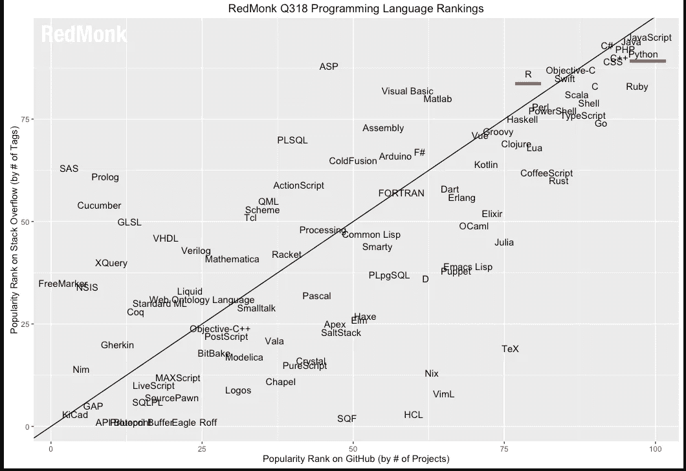
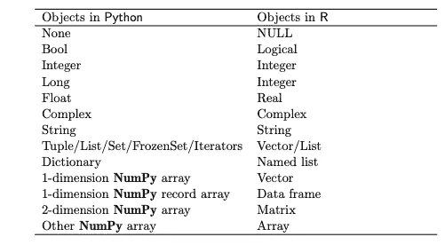
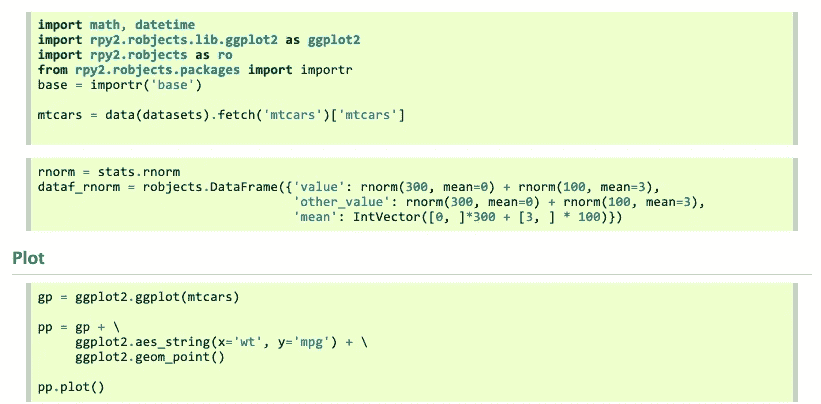
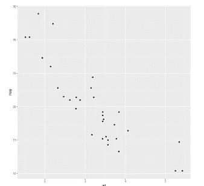
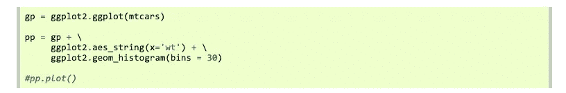
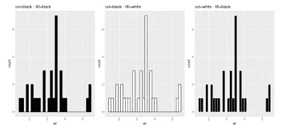

# 从“R 与 Python”到“R 与 Python”

> 原文：<https://towardsdatascience.com/from-r-vs-python-to-r-and-python-aa25db33ce17?source=collection_archive---------0----------------------->

## 在单个项目中充分利用 Python 和 R’的优点。

> 重点应该放在技能上，而不是工具上

如果你对数据科学感兴趣，可能会立即想到的两种编程语言是 **R** 和 **Python** 。然而，我们不是将它们视为两种选择，而是经常将它们进行比较。r 和 Python 本身都是优秀的工具，但经常被视为竞争对手。如果你在谷歌搜索栏中输入`R vs Python`，你会立即得到大量关于一方优于另一方的话题的资源。

这种观点的原因之一是因为人们已经根据他们使用的编程语言的选择将数据科学领域分成了不同的阵营。有一个 **R 阵营**和一个 **Python 阵营**，历史是两个阵营无法和谐相处的见证。两个阵营的成员都坚信他们选择的语言优于对方。所以，在某种程度上，分歧不在于工具，而在于使用这些工具的人

# 为什么不两个都用？

数据科学社区中有人同时使用 Python 和 R，但他们的比例很小。另一方面，有许多人只致力于一种编程语言，但希望他们能够获得对手的一些能力。例如，R 用户有时渴望 Python 固有的面向对象能力，类似地，一些 Python 用户渴望 R 中可用的大范围统计分布。

上图为[红和尚](https://redmonk.com/sogrady/2018/08/10/language-rankings-6-18/)2018 年第三季度调查结果。这些结果基于语言在 **Stack Overflow** 和 **Github** 上的受欢迎程度，清楚地表明 R 和 Python 都被评为相当高。因此，我们没有内在的理由不能在同一个项目中与他们合作。我们的最终目标应该是做更好的分析，获得更好的洞察力，选择编程语言不应该成为实现这一目标的障碍。

# R 和 Python 概述

让我们来看看这些语言的各个方面，以及它们的优点和缺点。

## 计算机编程语言

自 1991 年发布以来，Python 一直非常流行，并广泛应用于数据处理。它广受欢迎的一些原因是:

*   面向对象语言
*   通用
*   有很多扩展和令人难以置信的社区支持
*   简单易懂，易于学习
*   像 pandas、numpy 和 scikit-learn 这样的包使 Python 成为机器学习活动的绝佳选择。

然而，Python 没有专门的统计计算包，不像 r。

## 稀有

r 的第一个版本发布于 1995 年，从那时起，它已经成为业内最常用的数据科学工具之一。

*   包括几乎所有你能想到的统计应用的软件包。CRAN 目前托管超过 10k 个软件包。
*   配备了出色的可视化库，如 ggplot2。
*   能够独立分析

就性能而言，R 不是最快的语言，而且在处理大型数据集时，有时会占用大量内存。

# 利用两个世界的优点

我们能利用 R 的统计能力和 Python 的编程能力吗？那么，当我们可以轻松地将 SQL 代码嵌入到 R 或 Python 脚本中时，为什么不将 R 和 Python 融合在一起呢？

基本上有两种方法可以让我们在一个项目中同时使用 Python 和 R。

## Python 中的 r

*   [派珀 ](http://bioinfo.ihb.ac.cn/softwares/PypeR/)

PypeR 提供了一种通过管道从 Python 访问 R 的简单方法。PypeR 也包含在 Python 的包索引中，这提供了一种更方便的安装方式。当 Python 和 R 之间不需要频繁的交互数据传输时，PypeR 特别有用。通过管道运行 R，Python 程序在子进程控制、内存控制和跨流行操作系统平台(包括 Windows、GNU Linux 和 Mac OS)的可移植性方面获得了灵活性

Conventions for conversion of Python objects to R objects

*   [**pyRserve**](https://pypi.org/project/pyRserve/)

pyRserve 使用 [Rserve](http://www.rforge.net/Rserve/) 作为 RPC 连接网关。通过这样的连接，可以在 Python 的 R 中设置变量，也可以远程调用 R 函数。R 对象作为 Python 实现的类的实例公开，在许多情况下，R 函数作为这些对象的绑定方法。

*   [**rpy2**](https://rpy2.bitbucket.io/)

rpy2 在 Python 进程中运行嵌入式 R。它创建了一个框架，可以将 Python 对象翻译成 R 对象，将它们传递给 R 函数，并将 R 输出转换回 Python 对象。rpy2 使用得更频繁，因为它是一种正在积极开发的产品。

在 Python 中使用 R 的一个好处是，我们可以在 Python 中轻松使用 R 的优秀包，如 ggplot2、tidyr、dplyr 等。作为一个例子，让我们看看如何在 Python 中轻松使用 ggplot2 进行映射。

*   **基本情节**

[https://rpy2.github.io/doc/latest/html/graphics.html#plot](https://rpy2.github.io/doc/latest/html/graphics.html#plot)

*   **几何**

[https://rpy2.github.io/doc/latest/html/graphics.html#geometry](https://rpy2.github.io/doc/latest/html/graphics.html#geometry)

## 资源

为了更深入地了解 **rpy2** ，您可能想看看以下资源:

*   [rpy2 的官方文档](https://rpy2.github.io/doc/latest/html/index.html)
*   [RPy2:为数据科学结合 R + Python 的力量](https://community.alteryx.com/t5/Data-Science-Blog/RPy2-Combining-the-Power-of-R-Python-for-Data-Science/ba-p/138432)
*   [使用 RPy2 从 Python 访问 R](https://www.r-bloggers.com/accessing-r-from-python-using-rpy2/)

## R 内的 Python

我们可以使用下面的一种方法在 Python 中运行 R 脚本:

*   [**rJython**](https://r-forge.r-project.org/projects/rjython/)

这个包通过 Jython 实现了 Python 的一个接口。它旨在让其他包能够嵌入 python 代码和 r。

*   [**rPython**](https://cran.r-project.org/web/packages/rPython/index.html)

rPython 又是一个允许 R 调用 Python 的包。它使得运行 Python 代码、进行函数调用、分配和检索变量等成为可能。从 r。

*   [**耍蛇人**](https://github.com/asieira/SnakeCharmR)

《耍蛇者》是 rPython 的现代改良版。它是“rPython”的一个分支，使用了“jsonlite ”,对 rPython 做了很多改进。

*   [**皮托尼尔**](https://bitbucket.org/Floooo/pythoninr/)

PythonInR 通过提供从 R 内部与 Python 交互的函数，使得从 R 内部访问 Python 变得非常容易。

*   [**网状**](https://github.com/rstudio/reticulate)

reticulate 包为 Python 和 r 之间的互操作性提供了一套全面的工具。在上述所有选择中，这一个是使用最广泛的，因为它是由 Rstudio 积极开发的。Reticulate 在 R 会话中嵌入了一个 Python 会话，实现了无缝、高性能的互操作性。这个包使你能够将 Python 代码编织成 R 语言，创建一个将两种语言编织在一起的新型项目。

[网状包](https://rstudio.github.io/reticulate/)提供以下设施:

*   以多种方式从 R 调用 Python，包括 R Markdown、获取 Python 脚本、导入 Python 模块以及在 R 会话中交互使用 Python。
*   R 和 Python 对象之间的转换(例如，R 和 Pandas 数据框之间，或者 R 矩阵和 NumPy 数组之间)。
*   灵活绑定到不同版本的 Python，包括虚拟环境和 Conda 环境。

## 资源

关于使用 **reticulate** 包的一些重要资源有:

*   [文档](https://rstudio.github.io/reticulate/)非常健壮，有很多例子和用例来帮助你开始。
*   [https://longhowlam . WordPress . com/2017/04/10/test-driving-python-integration-in-r-using-the-reticulate-package/](https://longhowlam.wordpress.com/2017/04/10/test-driving-python-integration-in-r-using-the-reticulate-package/)
*   [包装中的蛇:结合 PYTHON 和 R 与 RETICULATE](https://www.mango-solutions.com/blog/snakes-in-a-package-combining-python-and-r-with-reticulate)

# 结论

R 和 Python 都是非常健壮的语言，它们中的任何一种实际上都足以执行数据分析任务。然而，他们两个肯定都有高低之分，如果我们能利用两者的优势，我们最终会做得更好。无论哪种方式，拥有这两方面的知识将使我们更加灵活，从而增加我们能够在多种环境中工作的机会。

# 参考

*本文改编自* Andrew Collier *于 2018 年在 Pydata Berlin 发表的这篇* [*精彩演讲*](https://www.youtube.com/watch?v=pjDGB9i7kyI) *。*

[http://blog . yhat . com/tutorials/RP y2-coming-the-power-of-r-and-python . html](http://blog.yhat.com/tutorials/rpy2-combing-the-power-of-r-and-python.html)