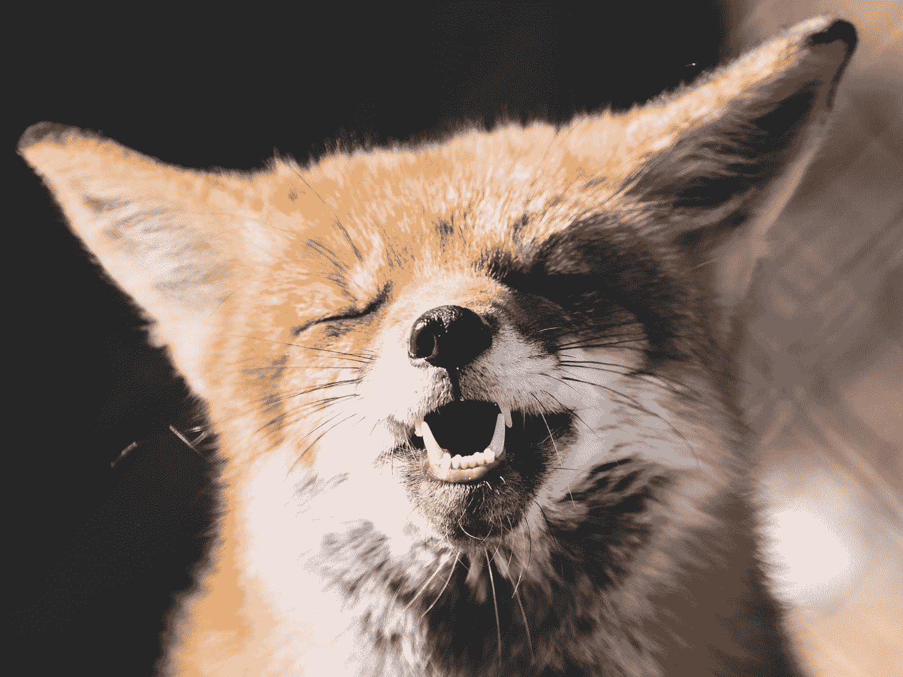
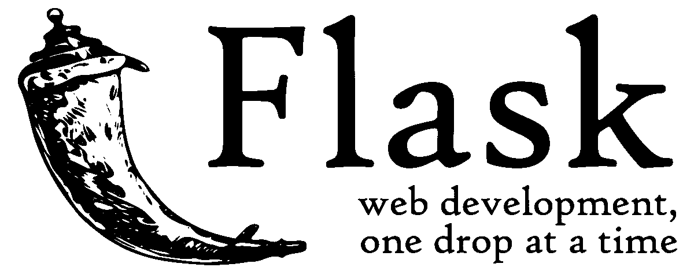
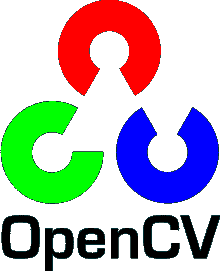
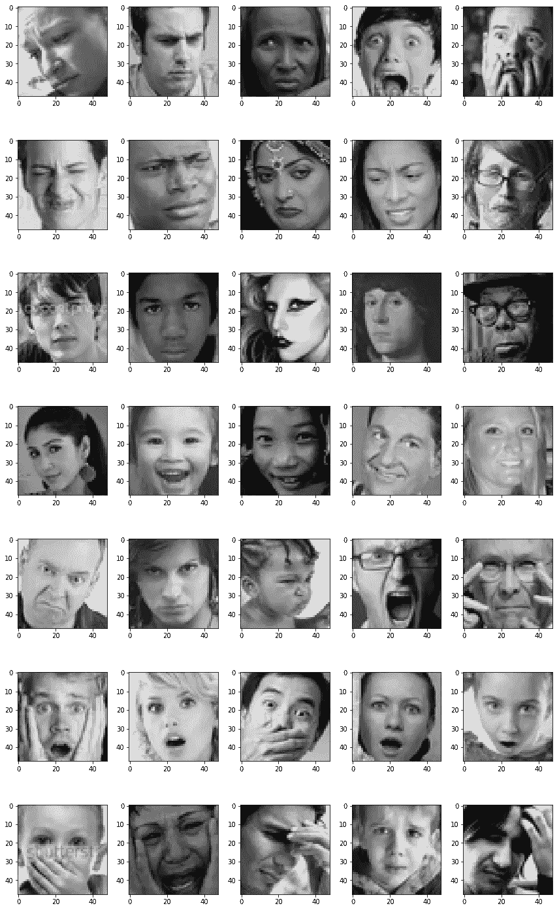
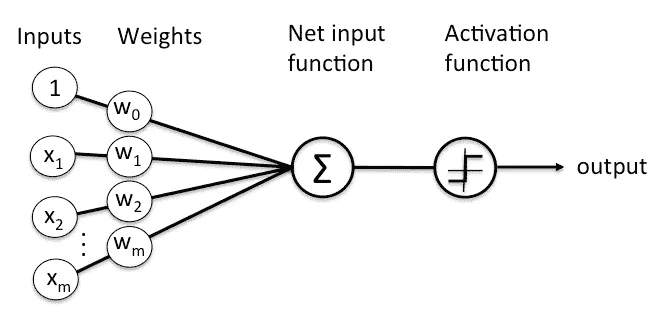
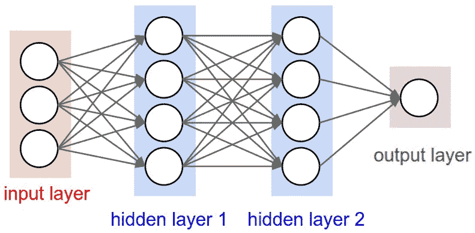
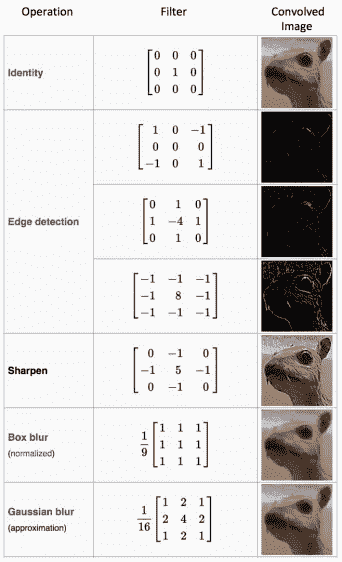
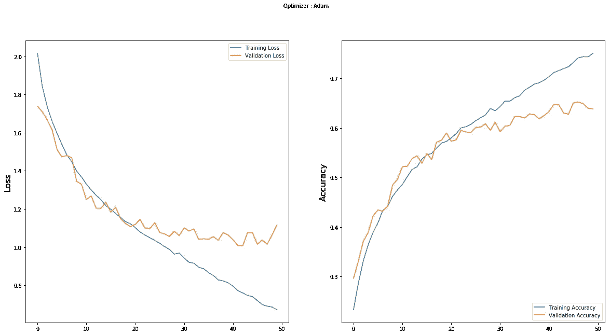
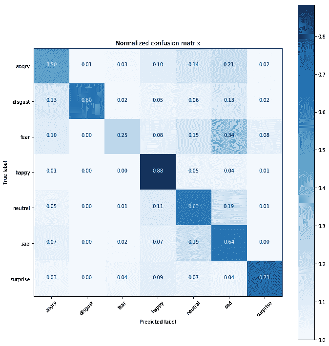
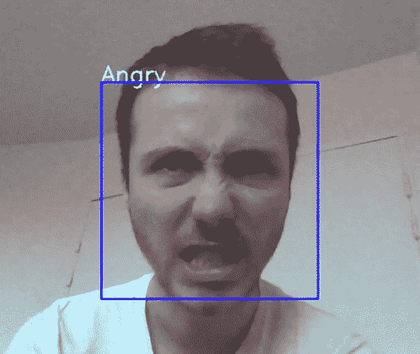

# 从原始图像到深度学习的实时预测

> 原文：<https://towardsdatascience.com/from-raw-images-to-real-time-predictions-with-deep-learning-ddbbda1be0e4?source=collection_archive---------6----------------------->

## **使用 Keras、Flask 和 OpenCV 的人脸表情识别**



Photo by [Peter Lloyd](https://unsplash.com/@plloyd?utm_source=medium&utm_medium=referral) on [Unsplash](https://unsplash.com?utm_source=medium&utm_medium=referral)

在我看来，人工智能最令人兴奋的领域之一是计算机视觉。我发现非常有趣的是，我们现在如何从复杂的原始数据结构(如图像)中自动提取知识。

本文的目标是探索一个计算机视觉应用的完整例子:构建一个具有深度学习的人脸表情识别系统。我们将了解如何:

*   设计一个卷积神经网络
*   通过输入一批图像来训练它
*   将其导出，以便与实时图像数据一起重新使用

# 工具


Keras 是一种高级神经网络 API，用 Python 编写，能够在 TensorFlow、CNTK 或 Theano 之上运行。我们将用它来建立、训练和输出神经网络。



Flask 是一个用 Python 编写的微型 web 框架，它允许我们将模型直接提供给 web 界面。



OpenCV 是一个计算机视觉库，有 C++、Python 和 Java 接口。我们将使用这个库来自动检测图像中的人脸。

# 数据源

数据来源于往届 Kaggle 竞赛《表征学习中的挑战:面部表情识别挑战》:

[https://www . ka ggle . com/c/challenges-in-re presentation-learning-face-expression-recognition-challenge](https://www.kaggle.com/c/challenges-in-representation-learning-facial-expression-recognition-challenge)

该数据由 48x48 像素的面部灰度图像组成。面部已经被自动注册，使得面部或多或少地居中，并且在每个图像中占据大约相同的空间。每张图片对应七种表情中的一种(0 =生气，1 =厌恶，2 =恐惧，3 =快乐，4 =悲伤，5 =惊讶，6 =中性)。数据集包含大约 36K 幅图像。

原始数据包含在数组中，每个像素有一个灰度值。我们将这些数据转换成原始图像，并将其拆分到多个文件夹中:

```
images/
    train/
        angry/
        disgust/
        fear/
        happy/
        neutral/
        sad/
        surprise/
    validation/
        angry/
        disgust/
        fear/
        happy/
        neutral/
        sad/
        surprise/
```

我们 80%的图像包含在 train 文件夹中，最后 20%在 validation 文件夹中。

# 快速数据可视化

首先让我们看看我们的图像是什么样子的:



Sample of the training images

你能猜出这些图像与哪些表情有关吗？

这项任务对人来说很容易，但对预测算法来说可能有点挑战，因为:

*   这些图像的分辨率很低
*   这些面不在同一位置
*   一些图像上写有文字
*   有些人用手遮住部分脸

然而，所有这些图像的多样性将有助于建立一个更通用的模型。

```
4103 fear images
436 disgust images
4982 neutral images
7164 happy images
3993 angry images
3205 surprise images
4938 sad images
```

除了“厌恶”类别，我们训练数据集中的面部表情相当平衡。

# 设置数据生成器

深度学习模型通过输入批量数据来训练。Keras 有一个非常有用的类可以自动从目录中获取数据:ImageDataGenerator。

```
Found 28821 images belonging to 7 classes.
Found 7066 images belonging to 7 classes.
```

它还可以在获取图像的同时执行数据扩充(随机旋转图像、缩放等。).当数据集很小时，这种方法通常被用作人工获取更多数据的方法。

函数 flow_from_directory()指定生成器应该如何导入图像(路径、图像大小、颜色等)。).

# 设置我们的卷积神经网络(CNN)

我们选择使用卷积神经网络来解决这个人脸识别问题。事实上，这种类型的神经网络(NN)对于提取图像的特征是很好的，并且被广泛用于图像分析主题，如图像分类。

**快速提醒什么是 NN:**

神经网络是由多层人工神经元(节点)组成的学习框架。每个节点获得加权的输入数据，将其传递给激活函数，并输出该函数的结果:



A node

神经网络由几层节点组成:



A classic NN architecture

*   将获取数据的输入图层。输入图层的大小取决于输入数据的形状。
*   一些隐藏层将允许神经网络学习数据中复杂的相互作用。具有许多隐藏层的神经网络被称为深度神经网络。
*   给出最终结果的输出层，例如类别预测。这一层的大小取决于我们想要产生的输出类型(例如，我们想要预测多少个类？)

经典神经网络通常由几个完全连接的层组成。这意味着一层的每个节点都连接到下一层的所有节点。

卷积神经网络也具有卷积层，该卷积层将滑动函数应用于彼此相邻的像素组。因此，这些结构对我们可以在图像中观察到的模式有更好的理解。我们将在后面对此进行更详细的解释。

现在让我们来定义 CNN 的架构:

我们用以下全球架构定义我们的 CNN:

*   4 个卷积层
*   2 个完全连接的层

卷积层将从图像中提取相关特征，完全连接的层将专注于使用这些特征来很好地分类我们的图像。这个建筑的灵感来自于以下关于这个主题的工作:【https://github.com/jrishabh96/Facial-Expression-Recognition 

现在让我们来关注这些卷积层是如何工作的。其中每个都包含以下操作:

*   卷积运算符:使用滑动矩阵从输入图像中提取特征，以保持像素之间的空间关系。下图总结了它的工作原理:


A convolution operator

绿色矩阵对应于原始图像值。橙色滑动矩阵被称为“过滤器”或“内核”。此滤镜在图像上滑动，每步滑动一个像素。在每一步中，我们将滤波器与基础矩阵的相应元素相乘，并将结果相加。有不同类型的过滤器，每一种都能够检索不同的图像特征:



Different filter results

*   我们应用 ReLU 函数在 CNN 中引入非线性。也可以使用其他函数，如 tanh 或 sigmoid，但 ReLU 在大多数情况下表现更好。
*   池用于减少每个特征的维数，同时保留最重要的信息。像卷积步骤一样，我们对数据应用滑动函数。可以应用不同的函数:max、sum、mean…max 函数通常执行得更好。


Max pooling operation

我们还为每一层使用一些通用技术:

*   批量标准化:通过提供零均值和单位方差的输入，提高 NNs 的性能和稳定性。
*   Dropout:通过随机不更新某些节点的权重来减少过度拟合。这有助于防止神经网络过分依赖层中的一个节点。

我们选择 softmax 作为最后的激活函数，因为它通常用于多标签分类。

现在我们的 CNN 已经定义好了，我们可以用更多的参数来编译它。我们选择 Adam 优化器，因为它是计算效率最高的优化器之一。我们选择分类交叉熵作为我们的损失函数，因为它与分类任务非常相关。我们的衡量标准将是准确性，这对于平衡数据集上的分类任务也非常有用。

在这里，我们从头开始定义和训练我们的 CNN，但您可能希望对需要更多计算资源的问题应用迁移学习方法。Keras 有几个预先训练好的模型可供使用:

[](https://keras.io/applications/) [## 应用程序— Keras 文档

### Keras 应用程序是深度学习模型，可与预训练的权重一起使用。这些型号可以是…

keras.io](https://keras.io/applications/) 

# 训练模型

一切都准备好了，现在开始训练我们的模型吧！

```
Epoch 1/50
225/225 [==============================] - 36s 161ms/step - loss: 2.0174 - acc: 0.2333 - val_loss: 1.7391 - val_acc: 0.2966

Epoch 00001: val_acc improved from -inf to 0.29659, saving model to model_weights.h5Epoch 2/50
225/225 [==============================] - 31s 138ms/step - loss: 1.8401 - acc: 0.2873 - val_loss: 1.7091 - val_acc: 0.3311

Epoch 00002: val_acc improved from 0.29659 to 0.33108, saving model to model_weights.h5...Epoch 50/50
225/225 [==============================] - 30s 132ms/step - loss: 0.6723 - acc: 0.7499 - val_loss: 1.1159 - val_acc: 0.6384

Epoch 00050: val_acc did not improve from 0.65221
```

我们的最佳模型设法获得了大约 65%的验证准确率，这已经很不错了，因为我们的目标类有 7 个可能的值！

在每个时期，Keras 检查我们的模型是否比前一时期的模型表现得更好。如果是这种情况，新的最佳模型权重被保存到文件中。这将允许我们直接加载模型的权重，而不必在其他情况下使用它时重新训练它。

我们还必须保存我们的 CNN 的结构(层等)。)到一个文件中:

# 分析结果

我们在训练阶段的每一步都有产出。所有这些输出都保存在“历史”变量中。我们可以使用它在训练和验证数据集上绘制损失和准确性的演变:



Evolution of loss and accuracy with the number of training epochs

在 50 个周期结束时，验证准确度开始稳定在 60%和 65%之间。

训练损失略高于第一个时期的验证损失，这可能令人惊讶。事实上，我们习惯于看到机器学习中验证损失比训练损失更高。在这里，这仅仅是由于辍学的存在，它只适用于培训阶段，而不是在验证阶段。

我们可以看到，在第 20 次迭代之后，训练损失变得比验证损失小得多。这意味着我们的模型在太多的时期后开始过度适应我们的训练数据集。这就是为什么验证损失在之后没有减少很多的原因。一种解决方案是提前停止模型的训练。

我们也可以使用一些不同的丢弃值并执行数据扩充。这些方法在这个数据集上进行了测试，但是尽管它们减少了过拟合效应，但是它们并没有显著增加验证的准确性。使用它们稍微增加了模型的训练持续时间。

最后，我们可以绘制混淆矩阵，以了解我们的模型如何对图像进行分类:



我们的模型非常适合预测快乐和惊讶的面孔。然而，它预测的是非常糟糕的恐惧面孔，因为它把它们和悲伤的面孔混淆了。

随着更多的研究和更多的资源，这个模型肯定会得到改善，但这项研究的目标主要是集中在获得一个相当好的模型相比，在这个领域已经做了什么。

现在是时候在真实情况下尝试我们的模型了！我们将使用 flask 来服务于我们的模型，以便通过网络摄像头输入来执行实时预测。

# 实时预测

对于这一部分，我重用了来自以下存储库的一些代码:

*   [https://github.com/log0/video_streaming_with_flask_example](https://github.com/log0/video_streaming_with_flask_example)
*   [https://github . com/piyush 2896/面部表情识别挑战](https://github.com/piyush2896/Facial-Expression-Recognition-Challenge)

首先，让我们创建一个类，它将为我们提供之前训练的模型的预测:

接下来，我们实现一个 camera 类，它将执行以下操作:

*   从我们的网络摄像头获取图像流
*   使用 OpenCV 检测人脸并添加边界框
*   将人脸转换成灰度，重新缩放，然后发送给我们预先训练好的神经网络
*   从我们的神经网络中获取预测，并将标签添加到网络摄像头图像中
*   返回最终的图像流

最后，我们的主脚本将创建一个 Flask 应用程序，将我们的图像预测渲染到一个网页中。

这是结果！



Our face expression recognition app

有用！我们的应用程序能够检测面部位置并预测正确的表情。

然而，该模型似乎在恶劣的条件下工作不佳(低光，人没有面对相机，人移动…)，但仍然是一个好的开始！

感谢阅读这篇文章，我希望你喜欢它！

你可以在这里找到完整的代码:

[](https://github.com/jonathanoheix/Real-Time-Face-Expression-Recognition) [## jonathanoheix/实时人脸表情识别

### 带有 Keras、Flask 和 OpenCV-jonathanoheix/实时面部表情识别的面部表情识别应用程序

github.com](https://github.com/jonathanoheix/Real-Time-Face-Expression-Recognition) 

在 LinkedIn 上找到我:

[](https://www.linkedin.com/in/jonathanoheix/) [## Jonathan Oheix -数据科学家- Influans | LinkedIn

### 查看 Jonathan Oheix 在全球最大的职业社区 LinkedIn 上的个人资料。乔纳森列出了 8 份工作…

www.linkedin.com](https://www.linkedin.com/in/jonathanoheix/)