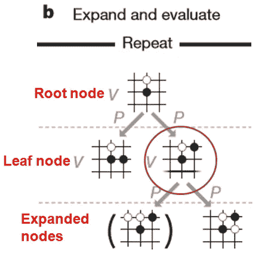

# 为 Connect4 从头开始实施 AlphaZero

> 原文：<https://towardsdatascience.com/from-scratch-implementation-of-alphazero-for-connect4-f73d4554002a?source=collection_archive---------0----------------------->

*一步一步的演示如何在游戏中使用 PyTorch 和标准 python 库实现 alpha zero*

Demis Hassabis, the head of Google DeepMind. Credit: [https://www.telegraph.co.uk/science/2017/12/06/entire-human-chess-knowledge-learned-surpassed-deepminds-alphazero](https://www.telegraph.co.uk/science/2017/12/06/entire-human-chess-knowledge-learned-surpassed-deepminds-alphazero)

2016 年，谷歌 DeepMind 的计算机程序 AlphaGo 在一场有数百万人观看的比赛中以 4 比 1 击败了围棋世界冠军 Lee Sedol，这一壮举在此前一直由人类主导的超复杂围棋比赛中从未被任何计算机程序实现过。然而，[在大约一年后的 2017 年由 DeepMind 出版的](https://www.nature.com/articles/nature24270)alpha go Zero，通过在没有任何人类数据输入的情况下实现类似的壮举，将边界向前推进了一大步。(AlphaGo 参考围棋特级大师游戏进行初始训练)同一组随后发布的一篇[论文](https://science.sciencemag.org/content/362/6419/1140)成功地将相同的强化学习+监督学习框架应用于国际象棋，仅经过 4 个小时的训练就超过了之前最好的国际象棋程序 Stockfish。

出于对这种强化学习模型的敬畏，我想了解它是如何获得一些见解的，没有什么比尝试从零开始构建自己的国际象棋人工智能程序更好的了，严格遵循上述论文中描述的方法。然而，事情很快变得过于昂贵，难以承受，因为即使程序已经启动并运行，训练它达到合理的技能水平很可能需要数百万的 GPU 和 TPU 成本。

由于无法与谷歌的雄厚财力相比，我决定尝试在 Connect4 上实现 AlphaZero，这是一种比国际象棋简单得多的游戏，对计算能力的要求也更低。这里的重点是证明 AlphaZero 算法最终可以很好地创建一个强大的 Connect4 AI 程序。这里描述的方法的实现脚本都可以在我的 Github [repo](https://github.com/plkmo/AlphaZero_Connect4) 上找到。

# **连接 4 板**

首先，我们需要用 Python 创建 Connect4 板供我们使用。我创建了一个名为“board”的类，有 4 个方法“__init__”、“drop_piece”、“check_winner”、“actions”。

Connect4 board in Python

1) "__init__ "构造函数将一个 6 行 7 列的空 Connect4 板初始化为 np.array，存储板的状态以及当前要玩的玩家

2)“drop _ piece”在每个玩家玩游戏时用“X”或“O”更新棋盘

3)“check _ winner”如果有人在当前棋盘状态中获胜，则返回 True

4)“动作”返回给定当前棋盘状态下可以下的所有可能的棋步，因此不会下非法的棋步

# **大局**

AlphaZero 中有 3 个关键组件，稍后我将更详细地描述它们的实现。它们是:

1)深度卷积残差神经网络

*输入:连接 4 板状态*

*输出:策略(可能移动的概率分布)，值(O 胜:+1，X 胜:-1，平局:0)*

2)蒙特卡罗树搜索(MCTS)

*在迭代过程中，由来自神经网络的策略指导的自我游戏生成游戏数据集以训练神经网络*

3)评估神经网络

*玩家 vs 玩家，各自分别由当前网和先前网引导，保留赢得下一轮比赛的网*

# **深度卷积残差神经网络**

Neural network architecture of AlphaZero used here

我们使用具有类似于 AlphaZero 的上述架构的深度卷积残差神经网络(使用 PyTorch)来将输入 Connect4 板状态映射到其相关联的策略和值。策略本质上是玩家应该从当前棋盘状态(策略)移动的下一步棋的概率分布，值代表当前玩家从该棋盘状态中获胜的概率。**这个神经网络是 MCTS 的一个组成部分，它通过其策略和值输出来帮助指导树搜索，我们将在后面看到。**我们使用一个初始卷积块，接着是 19 个残差块，最后是一个输出块来构建这个神经网络(我称之为 ConnectNet ),如下所述。

**卷积块**

**残留块**

**输出块**

**放在一起**

在输入到神经网络之前，原始的 Connect4 板被编码成 6×7×3 的 1 和 0 的矩阵，其中 6×7 的板尺寸中的每一个的 3 个通道分别编码“X”、“O”(1 存在，0 为空)和要移动的玩家(0 为“O”，1 为“X”)。

Encoder to encode Connect4 board for neural net input

最后，为了正确地训练这个具有双头输出的神经网络，自定义损失函数(AlphaLoss)被定义为简单的均方误差值和交叉熵策略损失之和。

Neural Net loss function implemented via PyTorch

# **蒙特卡罗树搜索**

一个游戏可以被描述为一棵树，树根是棋盘状态，树枝是所有可能的棋盘状态。在像围棋这样的游戏中，随着游戏的进行，分支的数量呈指数增长，简单地用蛮力评估所有分支实际上是不可能的。因此，蒙特卡罗树搜索(MCTS)算法被设计成以更智能和更有效的方式进行搜索。从本质上讲，人们希望优化探索-开发的权衡，人们希望进行足够彻底的搜索(探索)以发现可能的最佳回报(开发)。这在定义置信上限(UCB)的 MCTS 算法中的一个等式中被简洁地描述:

这里， *Q* 是平均行动值(平均报酬)， *cpuct* 是确定探索水平的常数(设为 1)，*P(s =状态，a =行动)*是神经网络的策略输出给出的选择行动 *a* 的先验概率， *N(s，a)* 是行动 *a* 所对应的分支被访问的次数。来自状态 *s* 的所有被探索分支(动作)的分子 sum 中的 *N* sum over *b* 本质上是 *(s，a)* 的父级被访问的次数。

MCTS 算法按以下步骤进行。

1.  挑选

Select — AlphaGo Zero

Recursively selects the nodes based on highest UCB (best move) until leaf node or terminal node is reached. Adds node of best move if its not yet created.

从 *s* 开始，搜索选择具有最高 UCB 的下一个分支，直到到达叶节点(其分支都没有被探索的状态)或终端节点(结束游戏状态)。我们可以看到，如果奖励 *Q* 高，那么就更有可能选择那个分支。第二个探索项也起了很大的作用，其中我们看到如果动作 *a* 只被访问了几次，那么这个项将会很大，并且算法更有可能选择相关的分支。神经网络通过提供先验概率 *P* 来指导选择，当神经网络未被训练时，先验概率最初将是随机的。

2.展开并评估

Expand and Evaluate — AlphaGo Zero

Expand only nodes that result from legal moves, mask illegal moves and add Dirichlet noise to prior probabilities of root node.

这里，通过用神经网络评估与扩展节点相关联的状态来扩展叶节点，以获得并存储 *P* 。当然，非法移动不应该扩大，将被掩盖(通过设置先验概率为零)。如果该节点是根节点，我们还将在这里添加狄利克雷噪声，以向探索提供随机性，使得每个 MCTS 模拟都可能不同。

3.支持

Backup — AlphaGo Zero

Recursively update the visits counts and values of nodes once leaf node is evaluated.

现在，神经网络对叶节点进行评估，以确定其值 *v* 。这个值 *v* 然后被用于更新它上面的所有父节点的平均值 *v* 。更新应该是这样的，即 O 和 X 将发挥到最好(最小最大)，例如，如果 O 赢了(对叶节点评估的 v = +1)，则在该叶节点的直接父节点中，将轮到 O 出牌，并且我们将为该父节点更新 v = +1，然后为所有其他父节点更新 v = -1，其中 X 将出牌，以表示该动作对 X 不利。最后，在平局的情况下，更新 v = 0。

Code snippet for each simulation of Select, Expand and Evaluate, and Backup. num_reads here is the parameter controlling the number of simulations.

上述选择、扩展、评估和备份的过程代表了 MCTS 算法的每个根节点的一个搜索路径或模拟。在 AlphaGo Zero 中，进行了 1600 次这样的模拟。对于我们的 Connect4 实现，我们只运行 777，因为它是一个简单得多的游戏。在对该根节点运行 777 次模拟之后，我们将为根节点制定策略 *p* ，该策略被定义为与其直接子节点的访问次数成比例。这个策略 *p* 然后将被用于选择下一个移动到下一个棋盘状态，并且这个棋盘状态然后将被视为下一个 MCTS 模拟的根节点，以此类推，直到当有人赢或平局时游戏终止。*对每个根节点运行 MCTS 模拟直到游戏结束的整个过程被称为 MCTS 自玩。*

Function to execute MCTS self-play

在运行 MCTS 模拟的 MCTS 自玩游戏的每个步骤中，我们将有一个棋盘状态 *s* ，它的关联策略 *p* ，以及值 *v* ，因此当 MCTS 自玩游戏结束时，我们将有一组( *s，p，v* )值。然后，这组( *s，p，v* )值将用于训练神经网络，以改进其策略和值预测，然后，这个训练的神经网络将用于迭代地指导随后的 MCTS。通过这种方式，人们可以看到，最终在许多许多次迭代之后，神经网络和 MCTS 一起将非常善于生成最优移动。

# **评估神经网络**

在一次迭代之后，其中使用 MCTS 自播放数据训练神经网络，然后再次使用由相应神经网络引导的 MCTS，将该训练的神经网络与其先前版本进行比较。表现更好的神经网络(例如赢得大多数游戏)将用于下一次迭代。这确保了网络总是在改进。

# **迭代流水线**

总之，一个完整的迭代管道包括:

1.自我游戏使用 MCTS 生成游戏数据集( *s* 、 *p* 、 *v* )，神经网络通过提供选择动作的先验概率来指导搜索

2.用 MCTS 自弹自唱产生的( *s* 、 *p* 、 *v* )数据集训练神经网络

3.通过将经过训练的神经网络与来自前一次迭代的神经网络进行比较来评估经过训练的神经网络(在预定义的历元检查点)，再次使用由相应神经网络引导的 MCTS，并且仅保留表现更好的神经网络。

4.冲洗并重复

# **结果**

迭代 0:

alpha_net_0(用随机权重初始化)

151 游戏 MCTS 自玩生成

迭代 1:

alpha_net_1(从迭代 0 开始训练)

148 游戏 MCTS 自玩生成

迭代 2:

alpha_net_2(从迭代 1 开始训练)

310 游戏的 MCTS 自我发挥产生

评估 1:

阿尔法 _ 网络 _2 与阿尔法 _ 网络 _0 竞争

在 100 场比赛中，alpha_net_2 赢了 83 场，输了 17 场

迭代 3:

alpha_net_3(从迭代 2 开始训练)

584 游戏 MCTS 自玩生成

迭代 4:

alpha_net_4(从迭代 3 开始训练)

753 游戏 MCTS 自玩生成

迭代 5:

alpha_net_5(从迭代 4 开始训练)

1286 年 MCTS 自弹自唱游戏产生

迭代 6:

alpha_net_6(从迭代 5 开始训练)

1670 年 MCTS 自弹自唱游戏产生

评价 2:

阿尔法 _ 网络 _6 与阿尔法 _ 网络 _3 竞争

在 100 场比赛中，alpha_net_6 赢了 92 场，输了 8 场。

Typical Loss vs Epoch for neural net training at each iteration.

在 Google Colab 上几周的零星训练期间，总共生成了 4902 个 MCTS 自玩游戏的总共 6 次迭代。上面显示了每次迭代的神经网络训练的典型损失对时期，表明训练进行得相当好。从迭代中选定点处的评估 1 和 2 中，我们可以看到神经网络确实总是在改进，并且在生成获胜移动方面变得比其先前版本更强。

现在可能是展示一些真实游戏的时候了！下面的 gif 展示了 alpha_net_6(以 X 的身份玩)和 alpha_net_3(以 O 的身份玩)之间的一个示例游戏，其中 X 赢了。

此时此刻，我还在训练网/MCTS 自弹自唱。我希望能够达到一个阶段，使 MCTS +网络能够产生完美的移动(连接 4 是一个解决的游戏，这样首先移动的玩家总是可以迫使获胜)，但谁知道这将需要多少次迭代…

反正都是乡亲们！希望你会觉得这篇文章有趣和有用。非常欢迎对实现和改进提出任何意见。要进一步阅读 AlphaZero 如何工作的更多细节，没有什么比阅读 DeepMind 的实际论文更好的了，我强烈推荐！

要了解最新的人工智能/数据科学趋势、论文和新闻，请查看我的@ follow AI _ bot([https://t.me/followai_bot](https://t.me/followai_bot))，这是您的个性化人工智能/数据科学电报机器人。