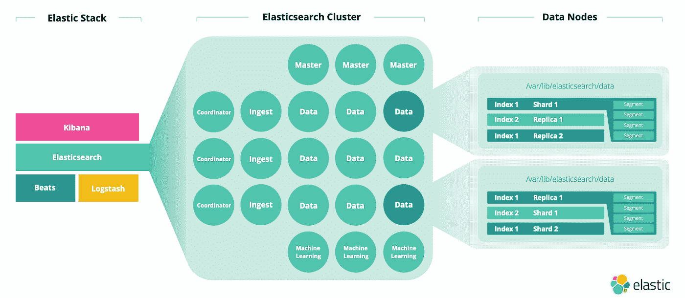
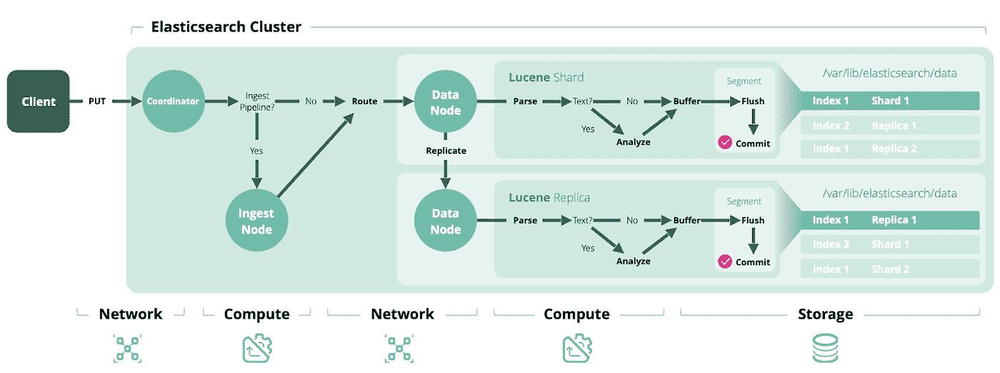
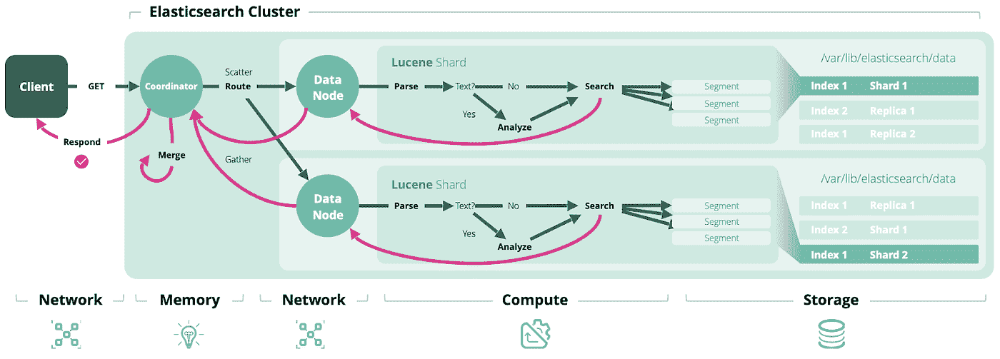
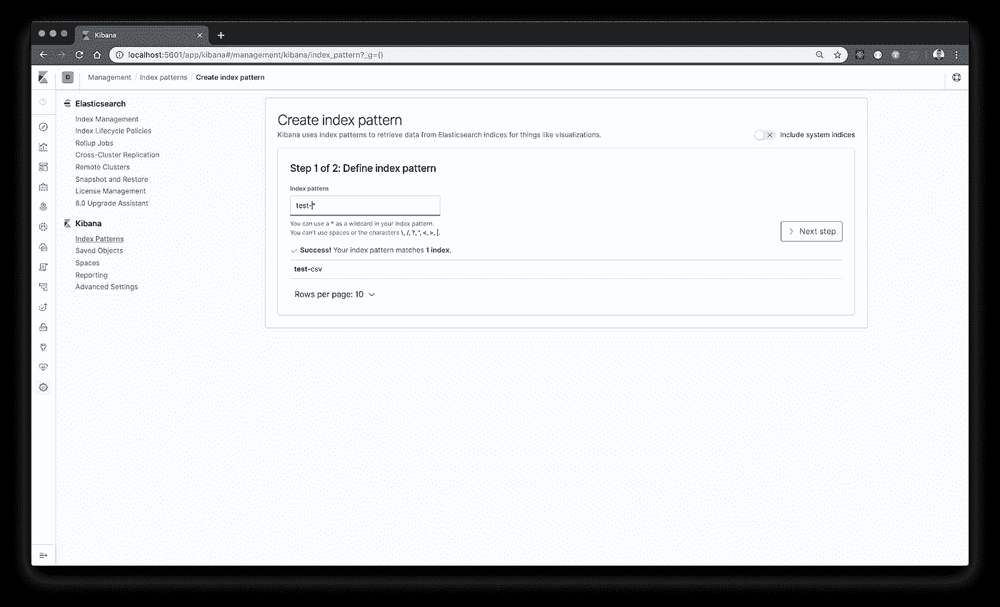
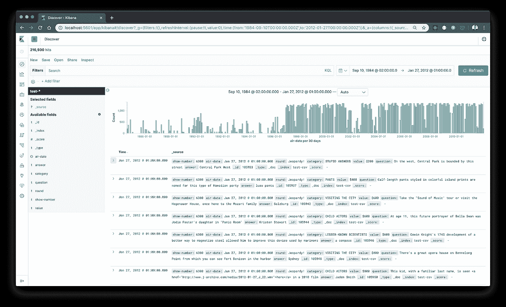
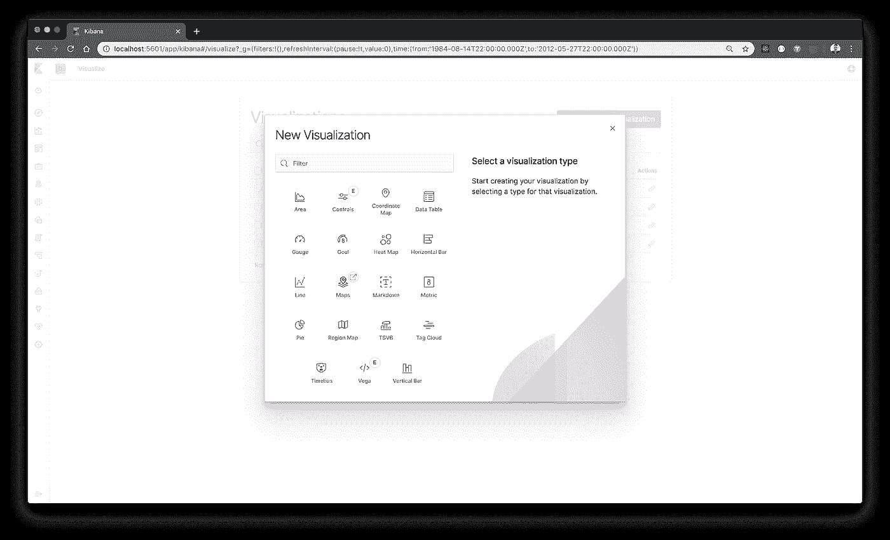
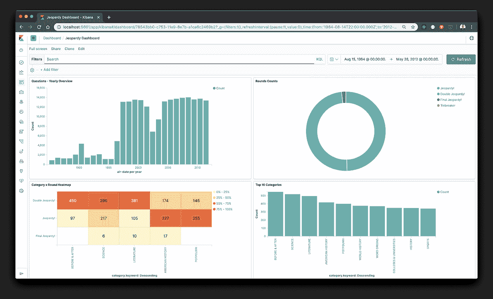

# 从零开始到搜索:设置 Elasticsearch 不到 4 分钟，用 Python 加载 CSV 并阅读更多相关内容

> 原文：<https://towardsdatascience.com/from-scratch-to-search-setup-elasticsearch-under-4-minutes-load-a-csv-with-python-and-read-e31405d244f1?source=collection_archive---------6----------------------->


Photo by [Kym Ellis](https://unsplash.com/@kymellis?utm_source=medium&utm_medium=referral) on [Unsplash](https://unsplash.com?utm_source=medium&utm_medium=referral)

## 实用技术介绍(针对数据科学、日志记录和监控、全文搜索等。)

# 准备，稳定，开始…

这篇文章的主要目的是提供一个简短的指导，告诉你如何最初设置你的第一个 Elasticsearch“开发”环境，以便快速开始探索/利用该技术提供的东西。简介将围绕 Elasticsearch 提供的最重要的 API 展开，这些 API 是获取数据和执行数据查询的基础。第二个目的是提供文档和其他有趣资源的链接，以了解其他潜在的操作方面、附加的酷功能和各种工具(通常是我在使用 Elasticsearch 时发现有用的东西)。我已经错过了这种“进一步的指针介绍”，所以这是任何人都一样的尝试:)。这些环节将在每章专门的 ***接下来的*** 章节中进行总结。

目标受众可能是个人数据分析师或 web 开发人员，最终是有相关数据用例并听说过 Elasticsearch 的小型预算团队。不打算提供技术的全面技术概述(集群、节点、分片、副本、Lucene、倒排索引等)。)或者深入探讨某个特定主题，因为有许多关于这方面的好资源……其中一些将在文章中或在*下一步是什么*部分中链接。


Elasticsearch is… (source: Elastic [https://www.youtube.com/watch?v=aLHH0eRciNE](https://www.youtube.com/watch?v=aLHH0eRciNE))

## 弹性搜索用例

如果你只是想知道 Elasticsearch 如何对你的目的有用，那么通常有三个主要领域(以及其他领域)可以被 [Elastic Stack](https://www.elastic.co/what-is/elk-stack) 有效支持

*   **“大数据”分析&特定的数据科学任务**，这些任务可能围绕大型半结构化数据(文本和 json 对象)展开，需要高度可用的存储和快速全文搜索功能。有趣的情况可以在 [NLP 区域](https://docs.google.com/presentation/d/1Odivp6TYoeUX6sisAzE-seqwV35Fr6HPIbqGWFbI1iE/mobilepresent?slide=id.p)中找到，或者在处理大量基于地理的数据时需要执行[地理位置查询和可视化](https://www.elastic.co/guide/en/kibana/current/maps.html)。如果您需要一个现成的探索/仪表板工具来处理一些更复杂的[业务分析查询](https://www.elastic.co/webinars/kibana-for-business-analytics-real-use-cases-tips-and-tricks)，它也能带来价值。
*   **时序处理、存储和浏览**与处理进入的时间戳数据流相关。这些可以包括 Elastic 的电源区域[来自大量运行服务的日志处理](https://www.elastic.co/products/log-monitoring)，或者从健康和正常运行时间的角度对其进行监控，并且还可以处理可以被摄取到 Elasticsearch 中的任何传感器数据等。
*   **对任何大型文本数据(网站、企业资料、文档档案等)进行全文搜索。)**使其内容可用于复杂的文本查询。这些可以(通过正确的设置)在几十毫秒内返回，从而高度支持用户体验和钻取相关信息的能力。也可以找到灵感，例如与其他技术如 OCR 结合使用。

## 我们将如何做

在我看来，开始试验 Elasticsearch(和许多其他软件技术)最简单的方法是通过 Docker，因此示例将利用这种方法。一般来说，集装箱化(已经有一段时间)也接管了实际生产部署/运营，因此这是二合一的好处。优步[展示了这方面的大规模实例，展示了他们采用数百个弹性集群的完全集装箱化方法](https://www.youtube.com/watch?v=Zl58abosobk)。所以让我们开始吧…

# 1.设置您的开发环境

我假设你已经熟悉 Docker 了(如果还不熟悉的话…安装 Docker for Desktop for[Mac](https://docs.docker.com/docker-for-mac/install/)、 [Windows](https://docs.docker.com/docker-for-windows/install/) 或 Linux [发行版](https://docs.docker.com/install/linux/docker-ce/centos/#install-docker-ce)，阅读[一些介绍](https://docs.docker.com/get-started/)的材料，你就可以开始了)。*注意:例子是在 macOS Mojave 上测试的，记住在 Linux 发行版或 Win 上可能有一些 Docker 细节。*

## 我们的第一个节点

当您准备好 docker 环境后，只需打开您的终端，使用以下命令启动 Elasticsearch 集群:

```
docker network create elastic-network
```

这将为我们未来的集装箱创造一个基本的通信“空间”。

现在，如果您只想进行单节点部署，只需运行:

```
docker run --rm --name esn01 -p 9200:9200 -v esdata01:/usr/share/elasticsearch/data --network elastic-network -e "node.name=esn01" -e "cluster.name=stanislavs-docker-cluster" -e "cluster.initial_master_nodes=esn01" -e "bootstrap.memory_lock=true" --ulimit memlock=-1:-1 -e ES_JAVA_OPTS="-Xms2g -Xmx2g" docker.elastic.co/elasticsearch/elasticsearch:7.3.0
```

等待几秒钟，在您的日志中，您应该会发现来自 Elasticsearch 集群的确认设置成功的消息:

```
{“type”: “server”, “timestamp”: “2019–08–18T13:40:18,575+0000”, “level”: “INFO”, “component”: “o.e.n.Node”, “cluster.name”: “stanislavs-docker-cluster”, “node.name”: “esn01”, “cluster.uuid”: “ilHqkY4UQuSRYnE5hFbhBg”, “node.id”: “KKnVMTDwQR6tinaGW_8kKg”, “message”: “started” }
```

万岁…我们已经启动了第一个运行在 Docker 容器(同名)中的 Elasticsearch 节点(esn01)，监听端口 9201 (docker *-p 参数*)。由于*cluster . initial _ master _ nodes*，它在被称为[集群引导](https://www.elastic.co/guide/en/elasticsearch/reference/current/modules-discovery-bootstrap-cluster.html)的过程中形成了一个新的集群(其名称在 *cluster.name* 中给出)，并立即选举自己为该集群的主集群(当你独自一人时还能做什么:)。最后值得一提的是 *-v 参数*，它创建了新的 Docker 卷 esdata01，并将其绑定到正在运行的 Elasticsearch 的数据目录中——这样在重启后我们的工作数据将被保留。其余参数更多地与“系统”相关(属于[重要系统设置](https://www.elastic.co/guide/en/elasticsearch/reference/current/system-config.html) ) —我们使用 *bootstrap.memory_lock* 禁用交换，使用 *ulimit memlock* 增加文件/进程限制，使用 *ES_JAVA_OPTS* 分配初始/最大堆大小(即专用内存，以便根据您的配置进行调整…但请记住，Elasticsearch 还利用堆外内存，因此不要设置超过可用内存的 50%[许可说明:默认情况下](https://www.elastic.co/guide/en/elasticsearch/reference/current/heap-size.html)使用基本许可运行，但是如果你想使用纯粹的开源风格，只需在镜像名称的末尾添加*-oss。

## 其他两个节点(可选)

现在，如果您想尝试分布式设置的味道，请向您的集群添加两个(或更多)其他节点。本教程的其余部分(在本地机器上运行:)甚至实际的基本操作都不需要它。然而，由于处理的分布实际上是 Elasticsearch 的核心增值功能之一(因为索引部分主要由 Apache Lucene 库负责)，了解这一点至少是有好处的。因此，如果您想…这里是我们的另外两个节点(在单独的终端中运行):

```
docker run --rm --name esn02 -p 9202:9200 -v esdata02:/usr/share/elasticsearch/data --network elastic-network -e "node.name=esn02" -e "cluster.name=stanislavs-docker-cluster" -e "discovery.seed_hosts=esn01" -e "bootstrap.memory_lock=true" --ulimit memlock=-1:-1 -e ES_JAVA_OPTS="-Xms1g -Xmx1g" docker.elastic.co/elasticsearch/elasticsearch:7.3.0docker run --rm --name esn03 -p 9203:9200 -v esdata03:/usr/share/elasticsearch/data --network elastic-network -e "node.name=esn03" -e "cluster.name=stanislavs-docker-cluster" -e "discovery.seed_hosts=esn01,esn02" -e "bootstrap.memory_lock=true" --ulimit memlock=-1:-1 -e ES_JAVA_OPTS="-Xms1g -Xmx1g" docker.elastic.co/elasticsearch/elasticsearch:7.3.0
```

现在，随着节点加入我们的集群，事情开始变得更有趣了。您可以在日志中观察这个过程，日志中有关于添加的消息(下面来自我们集群的主节点，关于新添加的节点 esn02)。通常，节点加入集群时会联系在 *discovery.seed_hosts* 参数中列出的其他“已经存在”的节点(以获得关于集群设置的最新信息)，该参数(与前面提到的*cluster . initial _ master _ nodes*一起)属于[重要发现设置](https://www.elastic.co/guide/en/elasticsearch/reference/current/discovery-settings.html)。集群中节点之间的所有通信都直接在传输层上执行(即没有 HTTP 开销),这就是为什么有端口 9300(而不是我们为与集群进行“外部”通信而公开的端口 920x)。

```
{“type”: “server”, “timestamp”: “2019–08–18T13:40:28,169+0000”, “level”: “INFO”, “component”: “o.e.c.s.ClusterApplierService”, “cluster.name”: “stanislavs-docker-cluster”, “node.name”: “esn01”, “cluster.uuid”: “ilHqkY4UQuSRYnE5hFbhBg”, “node.id”: “KKnVMTDwQR6tinaGW_8kKg”, “message”: “added {{esn02}{4xOwc-_fQDO_lwTlpPks2A}{FW-6YGVSSsmgEt3Mo_GY_Q}{172.18.0.3}{172.18.0.3:9300}{dim}{ml.machine_memory=8360488960, ml.max_open_jobs=20, xpack.installed=true},}, term: 1, version: 16, reason: Publication{term=1, version=16}” }
```

## 关于我们集群的信息

一切都已启动并运行，因此我们可以检查关于我们的 Elasticsearch 集群的一些事情(注意，我们可以联系我们集群中的任何节点，因为通常任何节点都可以成为协调节点，通过[分散-收集方法](https://www.elastic.co/guide/en/elasticsearch/reference/current/modules-node.html#coordinating-node))来处理传入的请求:

联系节点的基本信息:

```
curl localhost:9200
```

退货:

```
{
    "name" : "esn01",
    "cluster_name" : "stanislavs-docker-cluster",
    "cluster_uuid" : "ilHqkY4UQuSRYnE5hFbhBg",
    "version" : {
        "number" : "7.3.0",
        "build_flavor" : "default",
        "build_type" : "docker",
        "build_hash" : "de777fa",
        "build_date" : "2019–07–24T18:30:11.767338Z",
        "build_snapshot" : false,
        "lucene_version" : "8.1.0",
        "minimum_wire_compatibility_version" : "6.8.0",
        "minimum_index_compatibility_version" : "6.0.0-beta1"
    },
    "tagline" : "You Know, for Search"
}
```

关于集群状态的基本信息:

```
curl localhost:9202/_cluster/health?pretty
```

退货:

```
{
    "cluster_name" : "stanislavs-docker-cluster",
    "status" : "green",
    "timed_out" : false,
    "number_of_nodes" : 3,
    "number_of_data_nodes" : 3,
    "active_primary_shards" : 0,
    "active_shards" : 0,
    "relocating_shards" : 0,
    "initializing_shards" : 0,
    "unassigned_shards" : 0,
    "delayed_unassigned_shards" : 0,
    "number_of_pending_tasks" : 0,
    "number_of_in_flight_fetch" : 0,
    "task_max_waiting_in_queue_millis" : 0,
    "active_shards_percent_as_number" : 100.0
}
```

有关群集中节点的更多信息:

```
curl localhost:9203/_cat/nodes?v
```

退货:

```
ip heap.percent ram.percent cpu load_1m load_5m load_15m node.role master name
172.19.0.2 26 56 3 0.01 0.16 0.17 dim * esn01
172.19.0.4 13 56 1 0.01 0.16 0.17 dim — esn03
172.19.0.3 20 56 2 0.01 0.16 0.17 dim — esn02
```

最后一个回答可能是最有趣的(因为上面基本上说我们有一个空的集群:)。我们可以看到集群中的所有三个节点(*ESN 01–03*)。从 node.role 中我们可以看到，所有的[节点都属于类型](https://www.elastic.co/guide/en/elasticsearch/reference/current/modules-node.html) mdi，这意味着它们是符合主节点条件的(如果当前主节点“发生故障”，它们可以被选为主节点)、[数据](https://www.elastic.co/guide/en/elasticsearch/reference/current/modules-node.html#data-node)(保存实际数据 ie 碎片，可以执行 CRUD/搜索操作)和[摄取](https://www.elastic.co/guide/en/elasticsearch/reference/current/ingest.html)(可以设置特殊的摄取管道，以便在实际索引之前预处理 ie 转换/丰富传入数据)。我们也可以看到我们现在的主人(标有*)。

## 下一步怎么样

*   **部署**:与您的开发人员一起考虑在您的集成/生产环境中运行的最佳选项，选项包括:在您的服务器上进行标准[本地安装](https://www.elastic.co/guide/en/elasticsearch/reference/current/install-elasticsearch.html)，托管服务解决方案[弹性云](https://www.elastic.co/cloud/)或 [AWS 弹性搜索](https://aws.amazon.com/elasticsearch-service/)等。或者是前面提到的“中间选择”，将 docker/OCI 映像部署到某个容器化平台( [Kubernetes](https://www.elastic.co/guide/en/cloud-on-k8s/current/k8s-quickstart.html) 、 [OpenShift](https://www.openshift.com/) 、Swarm)中，再次在本地或云中运行
*   **配置**:基本配置资源是 elasticsearch.yml 文件(位于 *config* 目录中),该文件存在于任何 elasticsearch 实例中——在[重要设置](https://www.elastic.co/guide/en/elasticsearch/reference/current/important-settings.html)中阅读关于该文件(以及其他关键参数)的更多信息
*   **保安**:先……！你可以选择[原生的 ES 安全选项](https://www.elastic.co/blog/configuring-ssl-tls-and-https-to-secure-elasticsearch-kibana-beats-and-logstash)或者更复杂的安全插件( [SearchGuard](https://search-guard.com/) ， [Open Distro Security](https://opendistro.github.io/for-elasticsearch-docs/docs/security-configuration/) )。至少要有 TLS 和基于角色的 auth！
*   **集群**:分布式容错能力很强……不，如果你想更深入地了解集群概念，请阅读一些关于不同节点类型的内容，如[符合主节点条件的节点/数据/摄取/ML](https://www.elastic.co/guide/en/elasticsearch/reference/current/modules-node.html) ，并深入了解[发现模块和进程](https://www.elastic.co/guide/en/elasticsearch/reference/master/modules-discovery.html)(即了解为什么集群中应该有[三个或更多](https://www.elastic.co/guide/en/elasticsearch/reference/master/modules-discovery-quorums.html)符合主节点条件的节点)
*   **规模估算**:阅读关于[规模估算和容量规划](https://www.elastic.co/pdf/elasticsearch-sizing-and-capacity-planning.pdf)的更多信息
*   **DOCKER** :关于 Docker [设置](https://www.elastic.co/guide/en/elasticsearch/reference/current/docker.html)、[卷](https://docs.docker.com/storage/volumes/)、[网络](https://runnable.com/docker/basic-docker-networking)的更多信息，或者如果您正在处理特定的 Elasticsearch 版本，您可以[获得匹配的图像](https://www.docker.elastic.co/)
*   **弹性搜索**的测井:改变[特定层级的测井配置](https://www.elastic.co/guide/en/elasticsearch/reference/current/logging.html)(基于 log4j)等。设置时很有用
*   **许可**:检查某些特定的期望特性属于哪种[特定的许可模式](https://www.elastic.co/subscriptions)是很好的(在本文中，我尝试使用 Apache 2.0 下的纯操作系统或[基本许可](https://github.com/elastic/elasticsearch/blob/master/licenses/ELASTIC-LICENSE.txt)的东西进行测试)
*   **API**:elastic search 提供了一份关于他们所有[REST API](https://www.elastic.co/guide/en/elasticsearch/reference/current/rest-apis.html)的很好的文档，所以来看看吧
*   **API**:如果你喜欢带有集群信息的 cat API(比如我),你会知道还有更多覆盖节点、分片、索引、健康、段等。等等。



**TECHNOLOGY**: Read also more on the key constituting technology [components and concepts of Elasticsearch](https://www.elastic.co/guide/en/elasticsearch/reference/current/scalability.html) (source [elastic.co](https://www.elastic.co/pdf/elasticsearch-sizing-and-capacity-planning.pdf))

# 2.将您的数据发送到 Elasticsearch (CSV 示例)

当您设置好初始环境后，就该将我们的数据转移到正在运行的节点上，为搜索做好准备了。Elasticsearch 的基本原则是，放入其中的任何数据“单元”都称为文档。这些文件要求的格式是 JSON。这些文档不是单独存储的，而是被分组到称为索引的特定集合中。一个索引中的文档共享相似的特征(即数据类型映射、设置等)。)，因此索引还充当所包含文档的管理层和 API 层。

## 索引创建

因此，让我们用[Create-indexes API](https://www.elastic.co/guide/en/elasticsearch/reference/7.1/indices-create-index.html)创建一个索引，并用[Index-Document API](https://www.elastic.co/guide/en/elasticsearch/reference/7.3/docs-index_.html)将 ie 索引一个文档放入其中…

```
curl -X PUT \
  [http://localhost:9200/test-csv](http://localhost:9200/test-csv) \
  -H 'Content-Type: application/json' \
  -d '{
    "settings" : {
        "index" : {
            "number_of_shards" : 3, 
            "number_of_replicas" : 2 
        }
    }
}'
```

退货:

```
{“acknowledged”:true,”shards_acknowledged”:true,”index”:”test-csv”}
```

索引创建…已检查！我们已经创建了第一个名为 *test-csv* 的索引，并定义了一个重要的设置[碎片和副本的数量](https://www.elastic.co/guide/en/elasticsearch/reference/current/scalability.html)。主碎片和碎片副本(用正确的术语来说)是一种将我们的索引(即文档集合)分割成多个部分从而确保冗余的方法。实际值取决于(在基本意义上)我们有多少个节点。碎片的数量(即我们的索引将被分成多少个单元)在索引创建时是固定的。副本的数量决定了主碎片(即我们 3 个中的每一个)将被“复制”多少次。我们定义了 2，因为我们想达到这样一种状态:在每个节点上，我们有一个主碎片(我们数据的⅓)，但也有我们数据的其他⅔的副本，即完整的数据集。这种设置确保了如果我们丢失一个节点，我们不会丢失任何数据。提示:如果您不想让 starter 弄乱这些设置，您不必这样做，因为如果您试图在没有现有索引的情况下索引一个文档，它会自动创建(默认为 1 个碎片和 1 个副本)。

```
curl -X PUT \
  [http://localhost:9203/test-csv/_doc/1?pretty](http://localhost:9203/test-csv/_doc/1?pretty) \
  -H 'Content-Type: application/json' \
  -d '{
    "value": "first document"
}'
```

退货:

```
{
    "_index" : "test-csv",
    "_type" : "_doc",
    "_id" : "1",
    "_version" : 1,
    "result" : "created",
    "_shards" : {
        "total" : 3,
        "successful" : 3,
        "failed" : 0
    },
    "_seq_no" : 0,
    "_primary_term" : 1
}
```

文档索引…已检查！我们已经将我们的第一个文档索引到我们的 test-csv 索引中，所有的碎片都响应正确。我们已经索引了一个非常简单的只有一个字段的 json 文档，但是你基本上可以索引任何文档(从大小、深度等角度来看),只要它是有效的 JSON——但是尽量把它保持在 100MB 以下。现在，您可以使用 [Get API](https://www.elastic.co/guide/en/elasticsearch/reference/7.1/docs-get.html) 通过 id 轻松检索单个文档。我将把那件事留给你。

## 使用 Python 从 CSV 加载数据

显然你不想用 curl 一个接一个地索引你的文档。当您的应用程序、数据库或存储驱动器中可能已经有这些数据时，就越是如此。出于这些目的，各种[编程语言如 Java、JS、Go、Python 等都有官方的 Elasticsearch 客户端。您可以基于您的技术栈获取其中的任何一个，并使用其 API 以编程方式执行索引/删除/更新/…操作。](https://www.elastic.co/guide/en/elasticsearch/client/index.html)

但是，如果您只有数据，并希望快速获取它们，您有两个选择…我使用了 [Python 客户端](https://elasticsearch-py.readthedocs.io/en/master/index.html)并准备了非常简单的 CLI 脚本，允许您从给定文件中索引数据——支持 CSV 格式和 NDJSON 格式([换行符分隔的 JSON](http://ndjson.org/) ，这通常用于日志记录、流处理等。).把它作为一种解决你的数据“问题”的可能方法，并根据你的需要写一些更好的东西:)。您可以在[客户端文档](https://elasticsearch-py.readthedocs.io/en/master/)中浏览许多其他与 Elasticsearch APIs 匹配的方法和助手。无论如何不要忘记在使用脚本之前*pip install elastic search*(安装模块)。

本报告中免费提供的代码/脚本:

[](https://github.com/stanislavprihoda/load_csv_or_json_to_elasticsearch/blob/master/load_csv_or_json_to_elasticsearch.py) [## stanislavprihoda/load _ CSV _ or _ JSON _ to _ elastic search

### 此时您不能执行该操作。您已使用另一个标签页或窗口登录。您已在另一个选项卡中注销，或者…

github.com](https://github.com/stanislavprihoda/load_csv_or_json_to_elasticsearch/blob/master/load_csv_or_json_to_elasticsearch.py) 

我不会描述整个代码内容(因为它总是可以写得更好:)，但代码中有两个相关的部分:

1。它利用 Python 生成器的概念，逐行遍历给定文件，并为索引执行生成一个预处理元素/行。选择这种“基于元素”的操作是为了确保内存效率，以便能够处理更大的文件。

```
def _csv_generator(self, es_dataset, **kwargs):
    with open(es_dataset.input_file) as csv_file:
        csv_dict_reader = csv.DictReader(csv_file)
        for cnt, row in enumerate(csv_dict_reader):
            yield self._prepare_document_for_bulk(es_dataset, row, cnt)
```

2。另一方面，由于实际的索引操作有些昂贵，它利用批量 API 在多个文档块中建立索引(默认 500 个条目)，这与针对速度的[调整的建议一致。对于这个操作，它使用了 python elasticsearch 客户端提供的一个帮助器(这些帮助器是在原始 api 之上的便利抽象)—](https://www.elastic.co/guide/en/elasticsearch/reference/current/tune-for-indexing-speed.html)[elastic search . helpers . streaming _ bulk](https://elasticsearch-py.readthedocs.io/en/master/helpers.html#elasticsearch.helpers.streaming_bulk)。

```
for cnt, response in enumerate(streaming_bulk(self.client, generator, chunk_size)):
    ok, result = response
```

在执行之后，有必要使用 refresh API 来使文档立即可搜索。

```
self.client.indices.refresh(index=es_dataset.es_index_name)
```

从数据的角度来看，现在有很多选择来获得一些有趣的数据集( [Kaggle 数据集](https://www.kaggle.com/datasets)、 [AWS 数据集](https://registry.opendata.aws/)或其他[开放数据集的精选列表](https://skymind.com/wiki/open-datasets))，但是因为我们也想展示一些文本搜索功能，所以让我们在 NLP 领域的一些东西上测试/展示我们的脚本—这里可以找到很好的集合。例如，我们可以使用[危险问题数据集](https://www.reddit.com/r/datasets/comments/1uyd0t/200000_jeopardy_questions_in_a_json_file/)，因为它不是一个常见的演示数据集。*注意:如果您使用这个集合，也要考虑删除标题中的空格，以获得更简洁的列/字段名称。*

## 运转

现在，我们可以在终端中运行下面的命令，并观察 stdout 日志(出于测试目的，我保留了调试级别):

```
python3 load_csv_or_json_to_elasticsearch.py _data/JEOPARDY_CSV.csv test-csv
```

最后，我们应该会收到以下消息:

```
2019–08–18 17:03:19,013 — load_csv_or_json_to_elasticsearch.py — INFO — Script execution FINALIZED in 44.15356087684631 seconds. Dataset from file _data/JEOPARDY_CSV.csv loaded to Elasticsearch at localhost:9200\. Number of documents processed: 216929.
```

执行花费了 **44 秒**，这并不算快，但是因为我们在一台机器上运行所有的东西，这是(必须:)可以接受的。实际上，相当一部分是 3+2 分片的成本，所以对于测试来说，如果只使用 1+0(和单个节点)，我们将低于 **25 秒**。它可能会通过对块大小的自我优化管理得到进一步改善，正如 tune for speed documentation 中所建议的那样(即从 100 开始，然后逐渐增加，直到速度平稳)，因此您可以将它作为一个有趣的练习来做。另一方面，如果我们一个接一个地索引文档，我们会达到漂亮的 **1411 秒**:)，所以看起来批量 api 有一些意义。

现在我们可以重新检查*/_ cat/index？确保我们所有的数据都在适当的位置。*

## 下一步怎么样

*   **索引映射/设置**:用[获取映射 API](https://www.elastic.co/guide/en/elasticsearch/reference/current/indices-get-mapping.html) 检查索引的数据结构，用[获取设置 API](https://www.elastic.co/guide/en/elasticsearch/reference/current/indices-get-settings.html) 检查索引设置——有各种[设置选项](https://www.elastic.co/guide/en/elasticsearch/reference/7.1/index-modules.html)。
*   **索引模板**:对于在持续的基础上(即在某些时间段)创建相似索引的用例，使用预定义的结构是很方便的——这就是[索引模板](https://www.elastic.co/guide/en/elasticsearch/reference/current/indices-templates.html)的情况
*   **索引更改**:您可以使用 [Reindex API](https://www.elastic.co/guide/en/elasticsearch/reference/current/docs-reindex.html) 在索引之间移动数据(当您需要在分片中进行更改时非常有用——这在创建之后是不可能的),这可以与[索引别名](https://www.elastic.co/guide/en/elasticsearch/reference/current/indices-aliases.html)结合使用，后者允许创建一个“昵称”,我们可以将查询指向该别名(这个抽象层允许更自由地更改别名背后的索引)
*   **分析**:当我们对查询进行索引或全文搜索时，请阅读更多关于[分析器](https://www.elastic.co/guide/en/elasticsearch/reference/current/analyzer-anatomy.html)及其核心构建模块*字符过滤器、记号赋予器和记号过滤器*的信息，或者创建您的自定义[分析器](https://www.elastic.co/guide/en/elasticsearch/reference/current/analysis-analyzers.html)。
*   **客户端**:各种[编程语言的官方 Elasticsearch 客户端，如 Java、JS、Go、Python 等](https://www.elastic.co/guide/en/elasticsearch/client/index.html)。
*   **数据接收**:通常是基于时间的数据(如日志、监控等。)您可能会考虑使用来自 [Elastic Stack](https://www.elastic.co/products/) 的其他工具，例如 [Beats](https://www.elastic.co/products/beats) (多用途轻量级数据传送器)或/和 [Logstash](https://www.elastic.co/products/logstash) 在索引到 Elasticsearch 之前进行更复杂的数据预处理
*   **内存/存储**:如果您发现自己的索引数据越来越多，而磁盘空间却越来越少，您可能会考虑[索引生命周期管理](https://www.elastic.co/guide/en/elasticsearch/reference/current/index-lifecycle-management.html)，它允许根据定义的规则来更改或删除索引。或者/并且如果你的内存不足，你可以考虑[索引冻结](https://www.elastic.co/guide/en/elasticsearch/reference/master/frozen-indices.html)，这将把各种开销数据结构从堆中移出。或者干脆多买些磁盘空间和内存:)
*   **性能**:调整[索引速度](https://www.elastic.co/guide/en/elasticsearch/reference/current/tune-for-indexing-speed.html)或高效[磁盘使用](https://www.elastic.co/guide/en/elasticsearch/reference/current/tune-for-disk-usage.html)



**INDEX OPERATIONS & ANALYSIS**: read also more on how [Analysis](https://www.elastic.co/guide/en/elasticsearch/reference/current/analysis.html) process works — it is the core capability for fulltext searching and runs everytime we index or query our data (image source [elastic.co](https://www.elastic.co/pdf/elasticsearch-sizing-and-capacity-planning.pdf)).

# 3.搜索

现在我们已经索引了我们的数据，我们终于可以搜索和浏览我们的数据。Elasticsearch 使用特定的基于 JSON 的语言查询 DSL(领域特定语言)来执行跨索引数据的各种复杂查询。由于在 Elasticsearch 的 [Query DSL](https://www.elastic.co/guide/en/elasticsearch/reference/current/query-dsl.html) 世界中有许多选项，我们将只介绍几个，让您尝试其余的选项。

## URI 搜索

不过，在 Elasticsearch 中搜索的最简单方法是不使用查询 DSL，只提供搜索到的字符串作为查询参数在 [URI 搜索](https://www.elastic.co/guide/en/elasticsearch/reference/current/search-uri-request.html)中，这对快速卷曲测试很有用，正如 Elastic 自己所说:)。所以让我们从这里开始，搜索包含术语*印象主义*的文件。

```
curl localhost:9200/test-csv/_search?q=question:impressionism
```

退货:

```
{
    "took": 10,
    "timed_out": false,
    "_shards": {
        "total": 3,
        "successful": 3,
        "skipped": 0,
        "failed": 0
    },
    "hits": {
        "total": {
            "value": 4,
            "relation": "eq"
        },
        "max_score": 13.689855,
        "hits": [
(…)
        {
            "_index": "test-csv",
            "_type": "_doc",
            "_id": "68959",
            "_score": 12.518969,
            "_source": {
                "show-number": "4943",
                "air-date": "2006–02–22",
                "round": "Double Jeopardy!",
                "category": "ART & ARTISTS",
                "value": "$1200",
                "question": "Impressionism got its name thanks to his painting \"Impression: Sunrise\"",
                "answer": "(Claude) Monet"
            }
        }
(…)
```

我们可以看到，对我们的 216k 文档的查询花费了 10ms，已经成功地遍历了所有 3 个碎片，并且找到了具有给定术语的 4 个文档。实际结果在 hits 数组中的 hits 对象下。对于我们收到的每个文档 ie 命中，以及 _source 字段中的实际内容，还有 _score 字段，这是一个相关性计算

## 多匹配查询

现在让我们使用查询 DSL 跨多个字段进行搜索。为此，我们将使用[多匹配查询](https://www.elastic.co/guide/en/elasticsearch/reference/current/query-dsl-multi-match-query.html)来实现这一点。正如在链接的文档中可以看到的，有各种选项来处理条件、相关性计算和其他参数。让我们继续这个话题，寻找*克洛德·莫内*。我们将把[短语指定为类型](https://www.elastic.co/guide/en/elasticsearch/reference/current/query-dsl-match-query-phrase.html),因为我们希望两者都匹配，否则 Elasticsearch 也将返回只匹配其中一个术语的文档(Claude，但没有 Monet)。

```
curl -X GET \
  [http://localhost:9203/test-csv/_search](http://localhost:9203/test-csv/_search) \
  -H 'Content-Type: application/json' \
  -d '{
  "query": {
    "multi_match" : {
      "query":    "Claude Monet", 
      "fields": [ "category", "question", "answer" ],
      "type": "phrase" 
    }
  }
}'
```

退货:

```
{
"took": 16,
    "timed_out": false,
    "_shards": {
        "total": 1,
        "successful": 1,
        "skipped": 0,
        "failed": 0
    },
    "hits": {
        "total": {
            "value": 36,
            "relation": "eq"
        },
        "max_score": 22.763008,
        "hits": [
        {
            "_index": "test-csv",
            "_type": "_doc",
            "_id": "171125",
            "_score": 22.763008,
            "_source": {
                "show-number": "2918",
                "air-date": "1997–04–16",
                "round": "Jeopardy!",
                "category": "CROSSWORD CLUES \"I\"",
                "value": "$400",
                "question": "Claude Monet or Rich Little (13)",
                "answer": "Impressionist"
            }
        },
(…)
```

我们现在有 36 个点击，前 10 名在点击字段下返回。顺便说一句。第一个结果…我想知道克劳德会对他的同伴的印象说些什么:)。

## 布尔查询

对于第三个查询，让我们变得更复杂，以一种我们再次寻找克洛德·莫内(这是必须的)的方式组合以上两个搜索，但我们也重视更多的结果匹配也是术语印象主义(这是应该的)…必须/应该的东西可能对你来说看起来很奇怪，但因为我们将使用[布尔查询](https://www.elastic.co/guide/en/elasticsearch/reference/7.3/query-dsl-bool-query.html)进行我们的搜索，我们将完全使用这些术语。布尔查询是所谓的[复合查询](https://www.elastic.co/guide/en/elasticsearch/reference/current/compound-queries.html)的缺省值，它允许组合多个叶查询(匹配某个字段的实际查询)或其他复合查询。

```
curl -X GET \
  [http://localhost:9202/test-csv/_search](http://localhost:9202/test-csv/_search) \
  -H 'Content-Type: application/json' \
  -d '{
  "query": {
    "bool" : {
      "must" : {
        "multi_match" : {
            "query":    "Claude Monet", 
            "fields": [ "category", "question", "answer" ],
            "type": "phrase" 
        }
      },
      "should" : { 
          "match" : { "question" : "impressionism" } 
      }
    }
  }
}'
```

退货:

```
{
    "took": 6,
    "timed_out": false,
    "_shards": {
        "total": 3,
        "successful": 3,
        "skipped": 0,
        "failed": 0
    },
    "hits": {
        "total": {
            "value": 36,
            "relation": "eq"
        },
        "max_score": 28.663502,
        "hits": [
        {
            "_index": "test-csv",
            "_type": "_doc",
            "_id": "68959",
            "_score": 28.663502,
            "_source": {
                "show-number": "4943",
                "air-date": "2006–02–22",
                "round": "Double Jeopardy!",
                "category": "ART & ARTISTS",
                "value": "$1200",
                "question": "Impressionism got its name thanks to his painting \"Impression: Sunrise\"",
                "answer": "(Claude) Monet"
            }
        },
        {
            "_index": "test-csv",
            "_type": "_doc",
            "_id": "171125",
            "_score": 22.763008,
            "_source": {
                "show-number": "2918",
                "air-date": "1997–04–16",
                "round": "Jeopardy!",
                "category": "CROSSWORD CLUES \"I\"",
                "value": "$400",
                "question": "Claude Monet or Rich Little (13)",
                "answer": "Impressionist"
            }
        },
(…)
```

我们可以看到，我们已经收到了原始结果的最高分，因为它是唯一一个与我们的所有术语精确匹配的结果。



Search operation in one picture (image source [elastic.co](https://www.elastic.co/pdf/elasticsearch-sizing-and-capacity-planning.pdf))

## 下一步怎么样

*   **查询 DSL** :勾选[全文查询](https://www.elastic.co/guide/en/elasticsearch/reference/current/full-text-queries.html)的所有选项
*   **查询上下文&过滤上下文** : [文档是否匹配我们的查询以及匹配程度如何](https://www.elastic.co/guide/en/elasticsearch/reference/current/query-filter-context.html)
*   **叶查询&复合查询**:使用叶查询寻找特定字段中的特定值，例如[匹配](https://www.elastic.co/guide/en/elasticsearch/reference/7.3/query-dsl-match-query.html)、[术语](https://www.elastic.co/guide/en/elasticsearch/reference/7.3/query-dsl-term-query.html)或[范围](https://www.elastic.co/guide/en/elasticsearch/reference/7.3/query-dsl-range-query.html)查询，另一方面使用[复合查询](https://www.elastic.co/guide/en/elasticsearch/reference/current/compound-queries.html)可以将其他复合或叶查询包装在一起
*   **聚合**:您可以[将您的结果](https://www.elastic.co/guide/en/elasticsearch/reference/current/search-aggregations.html)聚合为不同类型的聚合结果，如桶、度量、矩阵、管道等，并有多种选择，而不是在“文档级”的基础上处理数据
*   **公共选项**:参见[各种选项](https://www.elastic.co/guide/en/elasticsearch/reference/7.3/common-options.html)，可以应用于所有的 REST APIs 或者专门应用于[搜索查询体](https://www.elastic.co/guide/en/elasticsearch/reference/7.3/search-request-body.html)
*   **性能**:调至最大[搜索速度](https://www.elastic.co/guide/en/elasticsearch/reference/current/tune-for-search-speed.html)
*   **分数调整**:您可以使用[函数分数查询](https://www.elastic.co/guide/en/elasticsearch/reference/current/query-dsl-function-score-query.html)或脚本分数查询(允许自定义分数计算脚本)来调整相关性分数，或者检查其他[调整选项](https://www.elastic.co/blog/easier-relevance-tuning-elasticsearch-7-0)(如 rank_feature)以使结果与您的案例更相关
*   **高亮显示&提示器**:还有很多其他很酷的特性，比如[自动完成/随键入搜索功能的完成提示器](https://www.elastic.co/guide/en/elasticsearch/reference/current/search-suggesters.html#completion-suggester)或者[高亮显示](https://www.elastic.co/guide/en/elasticsearch/reference/7.3/search-request-body.html#request-body-search-highlighting)将结果包装在 html 标签中以强调匹配的位置

# 4.享受 Kibana 带来的便利

到目前为止，我们一直在与我们的 Elasticsearch 集群直接互动。在第一章中，通过 python 客户端，但后来主要是用简单的终端 cURL 命令。cURL 非常适合快速测试和整理东西，但是当你想用绘图、过滤等方式进行一些数据探索时。或者需要一些工具来对集群和索引进行管理检查和更新，您可能希望选择一些更方便的基于 UI 的应用程序。这就是 Kibana 的真正含义，或者像 Elastic 所说的那样，是 Elasticsearch 的窗口。事不宜迟，让我们将它添加到我们的设置中，看看我们要做什么:

```
docker run --rm --link esn01:elasticsearch --name kibana --network elastic-network -p 5601:5601 docker.elastic.co/kibana/kibana:7.3.0
```

Kibana docker 的参数非常简单。我们基本上需要做两件事——将 Kibana 添加到我们的 docker 网络(使用 *—网络*)并将其与我们的 Elasticsearch 集群链接(例如，使用 *—链接*指向我们的 esn01 节点),我们还保留默认端口 5601 并选择相同的版本 7.3。因为我们正在运行我们的弹性搜索，所以为了兼容性目的[必须这么做](https://www.elastic.co/guide/en/kibana/current/setup.html)。*注意:这些也可以用绑定挂载的* [*自定义 kibana.yml*](https://www.elastic.co/guide/en/kibana/current/docker.html#bind-mount-config) *或者通过* [*环境变量*](https://www.elastic.co/guide/en/kibana/current/docker.html#environment-variable-config) 覆盖。加载完成后，您的 Kibana 实例就可以在: [http://localhost:5601](http://localhost:5601/) 上运行了，所以不要浪费时间去查看它:)它会带你到你的家，你可以开始浏览基巴纳街区。

## 管理和索引模式

我们的目标是快速开始处理数据，因此我们将直接进入管理->索引模式，并选择创建我们的第一个[索引模式](https://www.elastic.co/guide/en/kibana/current/tutorial-define-index.html)。从 Kibana 使用的角度来看，索引模式可能是最重要的概念。它们代表了 Elasticsearch 索引上的逻辑结构，并告诉 Kibana 使用什么索引(和相关字段)。索引模式可以匹配单个索引的名称，也可以包含通配符(*)来匹配多个索引。因此，让我们创建 test-*索引模式(这将匹配我们的 test-csv 索引)。



在下一步中，我们将选择一个时间戳字段，稍后将用于基于时间的过滤。这可以通过选择我不想使用时间过滤器来省略，但如果您的数据中有任何时间戳字段，我建议不要这样做，以便我们可以进行时间序列可视化。选择创建，我们就完成了。它会将您带到索引模式概述页面，在该页面中您有所有字段的列表(如果您添加了更多字段，可以在右上角刷新)。您可以更改单个字段的格式，也可以添加新的脚本(但出于性能目的，弹性建议*在使用脚本字段之前，请熟悉* [*脚本字段*](https://www.elastic.co/guide/en/elasticsearch/reference/7.3/search-request-script-fields.html) *和聚合* *中的* [*脚本)。*)。](https://www.elastic.co/guide/en/elasticsearch/reference/7.3/search-aggregations.html#_values_source)

我们可以在 Kibana [管理应用](https://www.elastic.co/guide/en/kibana/7.3/management.html)中做其他种类的弹性搜索管理/配置工作。例如，我们可以在索引上使用[信息/操作](https://www.elastic.co/guide/en/kibana/7.3/managing-indices.html)检查索引管理部分(例如，冻结、删除、合并等。)或[为索引生命周期管理设置自动作业和规则](https://www.elastic.co/guide/en/kibana/7.3/creating-index-lifecycle-policies.html)(这将为我们完成)。最后一点，所有的 Kibana 设置都存储在*的 Elasticsearch 中。基巴纳*系统索引，由于我们的 docker 卷，这些将在重启后与我们的其他数据一起保留。

## 发现

当您想要浏览、查询和过滤您的数据时，可以选择 [Discover](https://www.elastic.co/guide/en/kibana/7.3/discover.html) 应用程序(左侧菜单中的第一个)。当您打开它时，您将看到我们创建的默认索引模式和各个数据点。

在这里，您可以:

*   过滤所需的时间范围(记住我们的数据是从 1984 年到 2012 年)
*   筛选出所需的字段或值(提示:使用字段或值旁边的放大镜符号)
*   使用[基巴纳查询语言](https://www.elastic.co/guide/en/kibana/7.3/kuery-query.html)对数据进行搜索，即*类别:愚蠢的答案*
*   请参见基本字段统计
*   查看您的单个文档数据，并在其上下文中列出其他文档(即从时间角度)



## 可视化和仪表板

当您需要直观地展示您的数据发现或提供您正在处理的领域的交互式性能/状态/指标/KIPs 概述时，Kibana 也很有用。出于这些目的，您可以在 Kibana Visualize 应用程序中创建可视化效果，并在丰富的仪表板上对这些可视化效果进行分组，这些仪表板还可以提供解释性降价等。所有这些都建立在您的索引数据之上，并允许实时进行进一步过滤和定制视图，例如特定时间范围的视图。

由于我们的 showcase 数据集本质上并不是真正的数值型数据集，因此我们无法真正利用所有选项，但让我们至少创建几个文档计数可视化，并将它们放在一个仪表板上，以了解它的意义。因此，让我们转到 Visualize 应用程序(左侧第二个)并选择“创建新的可视化”。



让我们按年份对文件(我们资料中的问题)进行统计。选择一个竖线，并选择我们的 test-*索引模式，数据将通过该模式提取。然后，让我们添加到带有日期直方图聚合的时段和 X 轴时段，选择我们的日期字段并选择一个年度间隔。可选地，您可以放下部分存储桶，在右上角您应该会看到“播放箭头”按钮，该按钮会将定义的设置应用到我们的可视化中。然后…你完成了。

要将其放在仪表板上，请转到仪表板应用程序(如下 Visualize)并创建新仪表板。在顶部菜单中，您有一个添加选项，因此使用它来添加一个可视化面板。然后…你完成了。现在你可以尝试其中的几个，我相信你可以做得比我用我的简单仪表板更好。



## 下一步怎么样

*   **配置**:在某个时候你会发现需要改变其他[基巴纳配置](https://www.elastic.co/guide/en/kibana/current/settings.html)这里链接的是选项的概述
*   **安全性**:查看第一个*下一个*部分并检查链接的资源，因为这些资源显然*必须也适用于*基巴纳(通常基巴纳也有等效的插件或原生功能)
*   **可视化**:在[可视化](https://www.elastic.co/guide/en/kibana/7.3/visualize.html)应用程序中创建一个可视化，用交互式[仪表盘](https://www.elastic.co/guide/en/kibana/7.3/dashboard.html)将多个可视化放在一起，或者用[画布](https://www.elastic.co/guide/en/kibana/7.3/canvas.html)共享更多可视化定制报告，如果你有 GeoJSON 数据，将它放在[地图上](https://www.elastic.co/guide/en/kibana/current/maps.html)
*   **空格**:使用[空格](https://www.elastic.co/guide/en/kibana/master/xpack-spaces.html)分隔出不同的数据区/域等。
*   **监控**:[Stack MONITORING app](https://www.elastic.co/guide/en/elastic-stack-overview/7.3/xpack-monitoring.html)非常有用，尤其是在处理大量 Stack 工具实例时(部署了大量服务器，集群中有多个节点等)。)
*   **其他 KIBANA 应用**:根据您的堆栈设置有很多，例如[正常运行时间](https://www.elastic.co/guide/en/kibana/current/xpack-uptime.html)与[心跳](https://www.elastic.co/products/beats/heartbeat)一起用于端点监控
*   **开发工具**:当喜欢 Kibana UI 但仍然想执行一些基于请求的东西时，使用[开发工具](https://www.elastic.co/guide/en/kibana/current/devtools-kibana.html)
*   **CSV 文件加载**:您可以通过仍然相当新的 Kibana 工具(仍然具有*实验性*状态)[文件数据可视化器](https://www.elastic.co/blog/importing-csv-and-log-data-into-elasticsearch-with-file-data-visualizer)执行相同的 CSV/NDJSON 摄取(我们已经用 Python 脚本完成了),它允许索引数据高达 100 MB——非常适合快速数据检查。
*   **样本数据**:如果你只是想玩 Kibana，使用[提供的样本数据](https://www.elastic.co/guide/en/kibana/current/add-sample-data.html)

# 5.奖励——对于集群爱好者

如果没有看到主选举，这将不是一个完整的(分布式)图片。您可以在 Docker 中轻松地使用这些内容，但记得在之后将所有内容备份:)。我们检查谁是当前的主节点(例如 */_cat/nodes* 记住),要杀死它，我们可以运行:

```
docker stop esn01
```

这将立即在我们的集群中导致一个异常，并启动一个主选举。除了一个明显的例外(与主服务器的连接失败有关)，您可以在日志中看到，两个节点都成为了主服务器的候选节点(正如我们已经知道的，两个节点都符合主服务器的条件)，并且通过两个候选节点执行选举。所有事情都发生在 200 毫秒之内(对于真实生活场景，还会增加一些网络开销等。).

```
{“type”: “server”, “timestamp”: “2019–08–18T18:31:15,485+0000”, “level”: “INFO”, “component”: “o.e.c.s.ClusterApplierService”, “cluster.name”: “stanislavs-docker-cluster”, “node.name”: “esn02”, “cluster.uuid”: “w16btQPhSQ-iE96DSM6PnQ”, “node.id”: “yPAolS5gTxes0mcltF5WvA”, “message”: “master node changed {previous [{esn01}{EHEDowSVRMenU2BaVM442g}{thFwnNprQs-QwOx75KUbUg}{172.18.0.2}{172.18.0.2:9300}], current []}, term: 1, version: 5, reason: becoming candidate: onLeaderFailure” }(...){“type”: “server”, “timestamp”: “2019–08–18T18:31:15,626+0000”, “level”: “INFO”, “component”: “o.e.c.s.MasterService”, “cluster.name”: “stanislavs-docker-cluster”, “node.name”: “esn03”, “cluster.uuid”: “w16btQPhSQ-iE96DSM6PnQ”, “node.id”: “rLAI506ATr6lvqw-aiKgHg”, “message”: “elected-as-master ([2] nodes joined)[{esn03}{rLAI506ATr6lvqw-aiKgHg}{pf-3B_9GTGayL4KzmGkqIQ}{172.18.0.4}{172.18.0.4:9300} elect leader, {esn02}{yPAolS5gTxes0mcltF5WvA}{kadMA9eFTO2WR4v0t4aXzQ}{172.18.0.3}{172.18.0.3:9300} elect leader, _BECOME_MASTER_TASK_, _FINISH_ELECTION_], term: 2, version: 6, reason: master node changed {previous [], current [{esn03}{rLAI506ATr6lvqw-aiKgHg}{pf-3B_9GTGayL4KzmGkqIQ}{172.18.0.4}{172.18.0.4:9300}]}” }
```

事后你可以请求*/_ 猫/节点？再次 v* 看谁是新老板。完成后，您可以使用*docker system prune-volumes*清除未使用的容器、卷、网络等，重新开始。

# 结束

就这样…我们通过 Elasticsearch 完成了一个简单的“端到端”流程，从 Docker 设置开始，获取集群中的数据并执行基本的搜索查询。然后，我们还将 Kibana 添加到我们的堆栈中，以获得一些浏览和管理舒适性以及有用的可视化特性。从简介中概述的最初目标来看，可能并没有真正达到:)但是希望您对该技术能够提供什么有了一些了解，从而为决定如何最终将它部署到您的架构中提供了一个基础。请随意分享可以添加到*下一步*部分列表中的任何其他有趣的资源。


Photo by [Jan Tinneberg](https://unsplash.com/@craft_ear?utm_source=medium&utm_medium=referral) on [Unsplash](https://unsplash.com?utm_source=medium&utm_medium=referral)