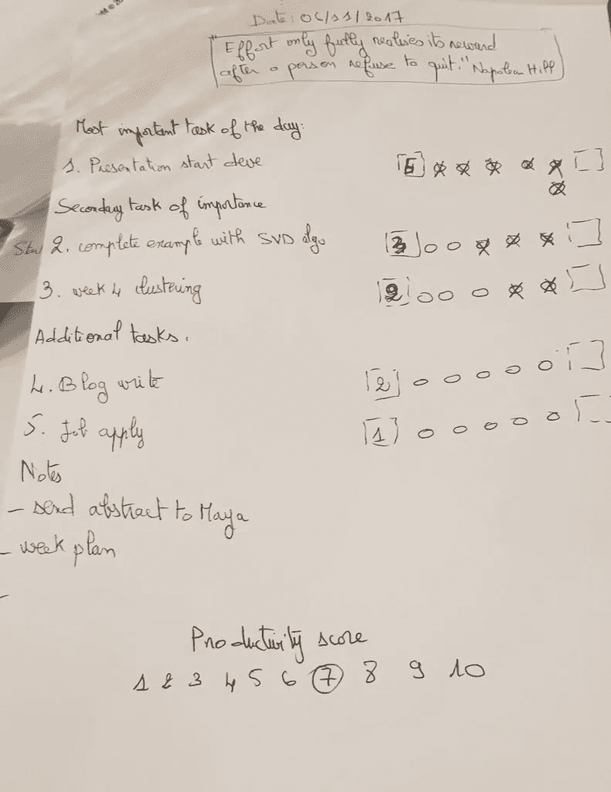
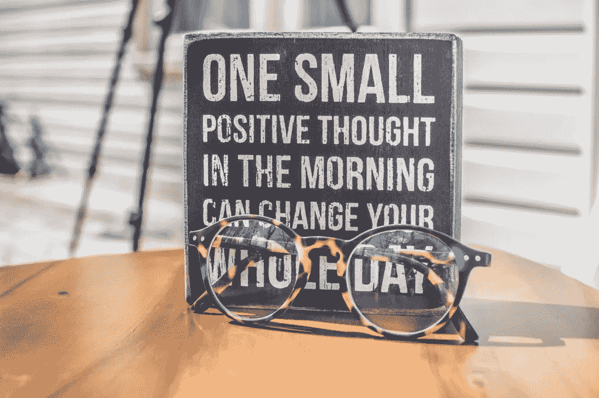
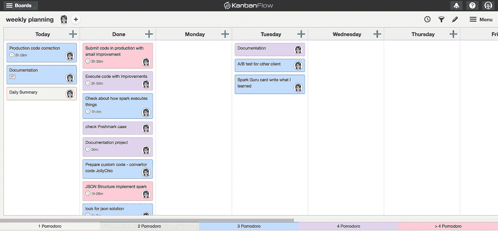
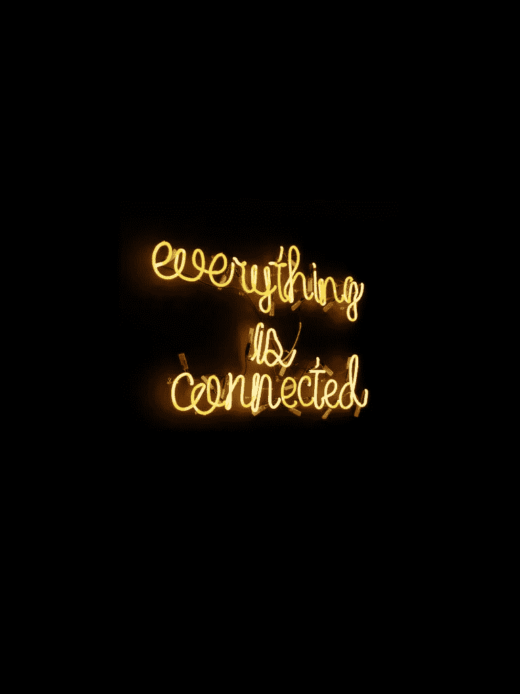

# 从软件工程到数据科学:战略进展和相互联系。

> 原文：<https://towardsdatascience.com/from-software-engineering-to-data-science-strategic-progress-and-being-connected-b90ea105cb7c?source=collection_archive---------11----------------------->

许多有抱负的数据科学家想知道如何走上这条道路并获得数据科学家的工作。幸运的是，现在，你不必开始一个昂贵的训练营或大学学位来成为一名数据科学家，因为有许多资源可用，而且其中许多资源是免费的，每个人都可以访问。在这篇文章的 [*第一部分*](/from-software-engineering-to-data-science-what-resources-helped-me-23b3f42b64db) *中，我分享了帮助我获得数据科学家工作的资源。然而，没有战略，就更难实现。*

我个人加入了一个社区，帮助我 ***知道我的目的******塑造我的梦想职业******明确我的目标和行动步骤*** 。是[优雅的职业女孩](https://www.classycareergirl.com/)。这是我时间管理工具和组织自己的主要资源。我还受到了其他一些推荐技巧的启发，如[番茄工作法](https://en.wikipedia.org/wiki/Pomodoro_Technique)、最重要的任务、感恩日志等..

让我们回顾一下我制定的战略支柱！

Photo by [JESHOOTS.COM](https://unsplash.com/@jeshoots?utm_source=medium&utm_medium=referral) on [Unsplash](https://unsplash.com?utm_source=medium&utm_medium=referral)

# 有计划

> 没有计划的目标只是一个愿望。安托万·德圣埃克苏佩里

我相信，没有一个计划，无论何时当你面对一些“沮丧”的时刻，你都不能坚持你的目标。因此，有一个计划是必不可少的，这样你就能一直关注它，并更新你对目标的承诺。我是这样做的:

1.  我从一个年度计划开始，从中我创建了一个四分之一板，上面有三个主要目标，并回答“为什么？”每一个。
2.  准备一份 90 天目标行动计划:填写一张表格，在上面我写下了*我每个月的重点*、*重点领域是什么*以及要在 30、60 和 90 天内完成的*任务*。
3.  每月做一次回顾。

# 每日优先级排序

每天早上，我首先写下我一天中的 5 个优先事项，或者被称为最重要的任务(MITs ):

首先，我选择 **1 个最重要的任务**，然后是 **2 个次要任务**，最后是 **3 个附加任务**。第二，我通过所需番茄的数量(有多少个 30 分钟的时间段)给他们每个人估计时间。最后，在一天结束的时候，我用效率分数来评估我的表现。

下面是一个例子(注意日期下面的引用，每天我都会选择一个引用来激励自己):

A Daily planning example

# 积极心态

我做的另一件事是确保正确的心态，这在这样的过渡阶段非常重要:

每天早上在纸上写下:

*   **我感激的 3 件事**(越具体越好)
*   **让今天变得伟大的三件事**
*   **一个日常肯定**。

[Unsplash](https://unsplash.com?utm_source=medium&utm_medium=referral)

然后，在一天结束时，我写下:

*   那天发生的 3 件令人惊奇的事情(当然，即使是最简单的好事也应该有！)
*   我怎样才能让这一天变得更好？

*免责声明:*我不会假装每天都完成了所有这些任务，但我学会了在完成最重要的任务和一些次要任务时感到快乐。

# 时间/任务记录

为了跟踪时间，我使用了 [Kanbanflow](http://www.kanbanflow.com) :我创建了一个名为周计划的面板，其中的列是:*一周的所有日子* + *今天* + *完成。*

在开始我写在纸上的任务之前(*见每日优先顺序* ) *，*我把与一周中的某一天相对应的任务移到“今天”栏，并用番茄工作法记录每项任务的时间(我还用标签 1 番茄工作法、2 番茄工作法等给它们涂上颜色)..).然后，它甚至可以检查时间日志，看看我花了多少小时。这真的是一个很棒的工具，我至今仍在使用。这有助于集中注意力，并有一个具体的任务日志概述。这里有一个例子:

Screenshot of my KanbanFlow board

# 好吧，那么现在，这些足够得到这份工作了吗？

依我看，答案是否定的。即使你参加了课程、学习、组织自己，如果你不努力，你得到工作的机会也是微乎其微的。

> 如果你不努力，你得到这份工作的机会微乎其微。

因此，您肯定需要:

*   分享你的学习成果:当你分享你的学习成果时，你是第一个从中受益的人，因为当你把新知识传授给别人时，你会更好地记住它。可以通过博客文章、youtube 视频或 LinkedIn 文章。我非常喜欢最近发现的一篇文章[我在一年中每周写一篇数据科学文章的收获](/what-i-learned-from-writing-a-data-science-article-every-week-for-a-year-201c0357e0ce)，它讲述了写一篇数据科学文章的好处。
*   **做一些小项目，并把它们放入 Github:** 一方面，这种实践可以让你获得实用的知识，正如我在第 1 部分中已经提到的将你所学应用到项目中的重要性。招聘人员更感兴趣的是你做过的项目，而不是你完成的课程。另一方面，使用 Github 将是有益的，因为很可能在你的工作中，你也必须使用它。
*   **参加数据科学活动/聚会**:通过参加数据科学/大数据活动，你可以了解该领域的现状，此外，它建立了一个网络，你可以利用这些活动的机会在一个项目中寻求帮助，或在一个项目中提供帮助，与其他想要整合该领域的人联系。在旅途中感受到支持和找到一个部落是非常重要的。有时甚至有免费的在线会议，我参加过一次由 [Metis](https://www.thisismetis.com/) 组织的免费在线会议。Kaggle 还将在下个月组织一个名为 [CareerCon](https://www.kaggle.com/careercon2019?utm_medium=social&utm_source=linkedin.com&utm_campaign=careercon-announcement-2019) 的活动。你也可以查看 meetup.com，在你所在的地区寻找关键词为数据科学、大数据、机器学习的聚会。
*   **与业内人士联系:**向业内人士介绍自己，无论是在参加活动时还是在网上。如果在网上，不要发送标准的邀请信息/电子邮件，要私人化:陈述他们写的博客，或者问一个问题，或者和他们谈谈你的旅程，也许他们有建议。如果你尝试的话，你甚至可以在他们中间找到一个导师。数据科学社区中有很多人愿意提供帮助，所以不要感到羞愧。你只需要知道如何介绍自己和你的目的。

> 数据科学社区中有很多人愿意提供帮助，所以不要感到羞愧。你只需要知道如何介绍自己和你的目的。

[Unsplash](https://unsplash.com?utm_source=medium&utm_medium=referral)

无论是作为与会者还是作为发言人，参加一些会议对我帮助很大( [Data Natives 2016](http://www.sarahmestiri.com/index.php/2016/10/27/data-natives-berlin-2016-day-1/) ， [Data Natives 2017](http://www.sarahmestiri.com/index.php/2017/11/26/data-natives-berlin-2017-my-talk-building-a-recommender-system-using-collaborative-filtering/) )。我也抓住了一个[的短期自由职业机会](http://www.sarahmestiri.com/index.php/2017/08/24/starting-with-opencv-and-tesseract-ocr-on-visual-studio-2017-challenge-1/)，这主要是通过在一个真实的项目中工作来学习。

另外，在我联系过的数据科学人士中，我强烈建议在 LinkedIn 上关注他们:

*   [**基里尔·叶列缅科**](https://www.linkedin.com/in/keremenko/) :数据科学管理顾问，superdata Science CEO，Udemy 平台数据科学讲师。
*   [**Eric Weber**](https://www.linkedin.com/in/eric-weber-060397b7/)**:**数据科学家总是分享他的知识。
*   [**法维奥·巴斯克斯**](https://www.linkedin.com/in/faviovazquez/) **:** 首席数据科学家，数据科学导师。
*   [**Lillian Pierson**](https://www.linkedin.com/in/lillianpierson/)**:**科技中小企业商业蔻驰，大数据战略家&企业培训师，Data-Mania 创始人。
*   [**Brandon Rohrer**](https://www.linkedin.com/in/brohrer/)**:**脸书大学的数据科学家，机器学习讲师，非常擅长在视频中解释事情。
*   [**克里斯托弗档案员**](https://www.linkedin.com/in/christopherdossman/) **:** 首席数据科学家。他在媒体上有很棒的系列。发现他关于成为机器学习工程师的系列时，我好开心。
*   [**杰森·布朗利**](https://machinelearningmastery.com/about/) **:** 机器学习大师的创始人
*   [**马修·梅奥**](https://www.linkedin.com/in/mattmayo13/) **:** 机器学习研究员和 KDnuggets 的编辑，出版关于机器学习和数据科学的各种内容。

最后一点，面试也能教会你很多东西，所以不要害怕尝试，即使一开始你觉得你没有达到要求。大多数情况下，在招聘过程中，你会收到一个数据挑战。做这些挑战才是真金白银！认真对待他们，尽你所能，如果你没有得到这份工作，那么你已经得到了一些东西，不要认为你失去了！是的，有时候会令人失望，但是继续向前看，你会发现所有这些面试都有助于你获得一份比你想象中更好的工作。史蒂夫·乔布斯曾经说过什么？

> “你的时间有限，所以不要浪费在过别人的生活上。不要被教条所困，那是活在别人思考的结果里。最重要的是，要有勇气跟随你的心和直觉。他们已经知道你真正想成为什么样的人。其他一切都是次要的。”—史蒂夫·乔布斯

# 摘要

总而言之，以下是第 1 部分和第 2 部分中提到的要点:

*   制定一个计划并定义你的目标——每天追踪你的进展是非常重要的。
*   做在线课程，使用在线资源
*   开始小项目
*   分享你的知识
*   走出去，和这个领域的人联系
*   做面试，不要害怕失败。挑战生活，赢得比赛！

我自己也遵循了这些步骤，尽管我花了大约一年时间才得到这份工作，但我相信这一年是必要的，因为最终我进入了我梦想的工作环境(尽管我以前的一位公司经理否认了它的存在)。此外，我发现自己在广告界和推荐系统项目中工作。事实上，我的职业吸引了我想得到的东西:

> “不仅如此，在所有的主题中，尤其是两个主题引起了我的注意: ***推荐系统*** 和**营销分析**(广告竞价，从广告中提取信息等)！他们是多么迷人啊！”(*我在我的*[*Up to my new tech challenges*](http://www.sarahmestiri.com/index.php/2017/01/27/up-to-challenges/)*文章*中写了这句话)。

看到了吗？记住我之前告诉你的话:**你会得到你所关注的**。:)

[Unsplash](https://unsplash.com?utm_source=medium&utm_medium=referral)

最后引用达芬奇*的一段话:*

> *有成就的人很少坐以待毙，让事情发生在他们身上。他们出去了，发生了一些事情。“莱昂纳多·达芬奇*

*那么，你还在等什么？现在就开始！如果你需要帮助，请通过 LinkedIn 联系我，我会很乐意支持你！*

****注* :** [**原创文章**](http://www.sarahmestiri.com/index.php/2019/03/29/what-helped-me-get-a-data-scientist-job-that-fits-my-ambition-part-2/) 发表在我的网站上。*