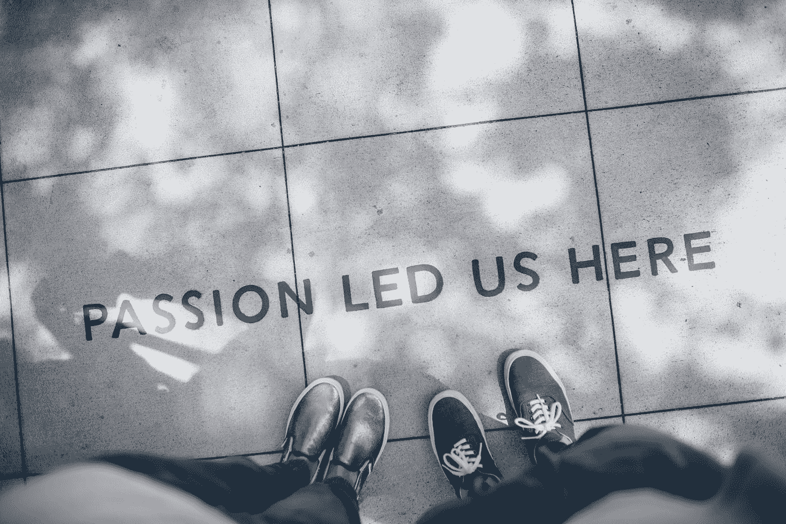
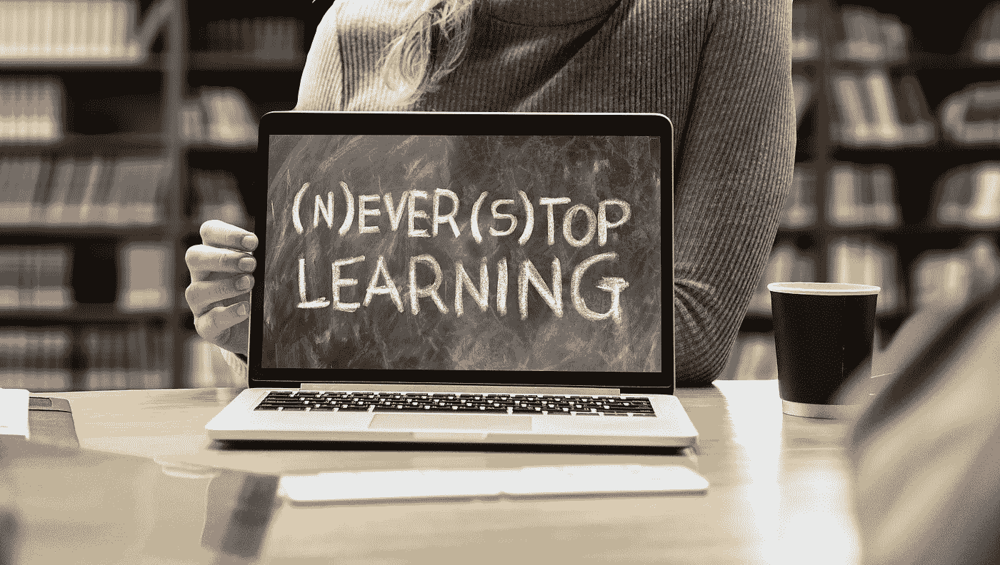
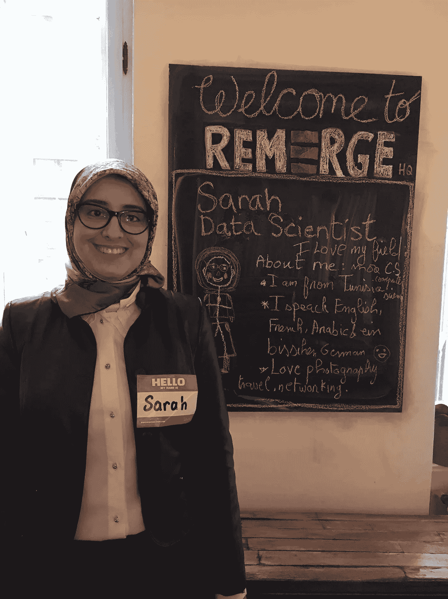

# 从软件工程到数据科学:哪些资源帮助了我？

> 原文：<https://towardsdatascience.com/from-software-engineering-to-data-science-what-resources-helped-me-23b3f42b64db?source=collection_archive---------9----------------------->

大约两年前，我决定辞去软件工程师的工作，开始在机器学习领域寻找工作。辞职后，我立即在我的博客 [*上写了一篇关于我的新技术挑战*](http://www.sarahmestiri.com/index.php/2017/01/27/up-to-challenges/) *的文章，旅程由此开始。*

Photo by [Ian Schneider](https://unsplash.com/@goian?utm_source=medium&utm_medium=referral) on [Unsplash](https://unsplash.com?utm_source=medium&utm_medium=referral)

在这篇文章中，我很高兴与大家分享我是如何找到梦想中的工作的。是的，我拿到了！我在柏林的 Remerge 公司做了一年的数据科学家。

现在就开始吧！

# 选择正确的课程

Photo by [Glenn Carstens-Peters](https://unsplash.com/@glenncarstenspeters?utm_source=medium&utm_medium=referral) on [Unsplash](https://unsplash.com?utm_source=medium&utm_medium=referral)

*首先，理解机器学习/数据科学中的* ***核心概念*** *和* ***技术*** *很重要，所以我开始在网上学习一些主要课程:*

[**机器学习专业化**](https://www.coursera.org/specializations/machine-learning) **，华盛顿大学，Coursera:**

> 您将学习不同的算法、如何预测、如何分类、如何评估结果、何时使用每种算法以及如何调整算法性能。

两位亚马逊教授教授的专业课是一个很好的起点，尤其是从基本理论知识的角度来看。它经历了主要的机器学习领域: ***回归******分类******聚类******信息检索*** 。

[**用于数据科学和机器学习的 Python**](https://www.udemy.com/python-for-data-science-and-machine-learning-bootcamp)**，Udemy:**

因为我也是从 python 开始的，所以我选择将 Coursera specialization 与这个训练营结合起来，以便获得实践和理论。我喜欢它的简单明了和非常有用！它教授以上主要的机器学习领域，但更侧重于 Python 和库的*，这些库可以用于每个算法 的 ***，它让您开始使用 *Jupyter 笔记本*、*探索数据*等等。****

> *在遵循它的同时，还探索了数据科学中的不同业务领域。*

*练习有时应用于金融数据，有时应用于电子商务数据，在课程结束时，还将介绍****神经网络*** 和 ***深度学习*** 。**

# **不要停留在网络课程上，要利用更多的资源**

****

***我在网上使用了一些免费资源，它们对我帮助很大，我可以列举一些主要的:***

*   **[**机器学习掌握**网站](https://machinelearningmastery.com):这个网站通过提供和解释步骤帮助我开始了我的第一个项目，除此之外还有很多其他解释得很好的教程！我建议从这篇文章开始:[机器学习掌握方法](https://machinelearningmastery.com/machine-learning-mastery-method/)。**
*   **[**精英数据科学**博客:](https://elitedatascience.com)该网站有一个工具&资源部分，提供项目创意、项目启动指南和一些免费数据集的链接。下面是它的一篇文章:[初学者的机器学习项目](https://elitedatascience.com/machine-learning-projects-for-beginners)。**
*   **[**Analytics Vidhya** 博客](https://www.analyticsvidhya.com/blog):该博客富含*应用机器学习*，不同机器学习领域的顶级技术，例如本文:[你应该知道的 7 种回归技术！](https://www.analyticsvidhya.com/blog/2015/08/comprehensive-guide-regression/)也是面试准备的有益资源:[数据科学面试问答](https://www.analyticsvidhya.com/blog/2018/06/comprehensive-data-science-machine-learning-interview-guide/)。**
*   **[**数据学校**](https://www.dataschool.io/start/) **:** 这个网站有教程，视频，笔记本，帮助我学习如何使用 python 库(熊猫，Scikit-learn，..).**

> **为了获得一份机器学习工程师或数据科学家的工作，在实践方面需要做大量的工作(开发项目)。**

**除了这些参考文献，还有一些社区在**中，像[走向数据科学](https://towardsdatascience.com)和[自由代码阵营](https://medium.freecodecamp.org)。他们都有每周精选，可以通过电子邮件订阅。他们有一套很好的话题:****

*   *****迈向数据科学*时事通讯提供了各种精选的数据科学主题。****
*   *****自由代码营*时事通讯提供了一些有趣的开发者话题。****

****通过这两个社区将特定范围和更广泛的范围结合起来是很好的。我还有一份电子邮件上收到的*媒体每日文摘*，它根据我在*媒体*中关注的内容分享新文章，我建议你也这样做。这有助于你保持更新和动力。****

# ****即使当你在公共交通工具上或做家务时，你也可以学习！****

********

****Photo by [Mohammad Metri](https://unsplash.com/@mohammad_leo?utm_source=medium&utm_medium=referral) on [Unsplash](https://unsplash.com?utm_source=medium&utm_medium=referral)****

> ****每当你想在做其他必要的事情的同时让你的时间富有成效的时候，听播客是一个绝妙的主意(我知道:我们的生活中有太多的事情)。****

****许多数据科学、人工智能、机器学习播客都存在，你可以在这里找到一个列表。我更坚持检查和遵循的一条是:****

*   ****[**超级数据科学播客**](https://www.superdatascience.com/podcast) :在这些播客系列中，超级数据科学 CEO*Kirill*采访了不同背景的人，分享着同样的激情: ***挖掘数据*** ！我发现他的播客信息量很大:它们将你与数据科学领域的人联系起来，让你发现不同领域的数据科学，因为这些人拥有非常广泛的专业经验，它们激励你挑战极限，更加努力地实现目标，因为这是可能的！****

# ****书籍也是用来强化知识的****

********

****Photo by [Susan Yin](https://unsplash.com/@syinq?utm_source=medium&utm_medium=referral) on [Unsplash](https://unsplash.com?utm_source=medium&utm_medium=referral)****

****我没有从头到尾读过一本关于数据科学或机器学习的书，每当我在处理一些数据时遇到机器学习问题，或者当我从课程或在线资源中不能很好地理解某个概念时，我都会使用它们。一些有用的书有:****

*   ****[**从零开始的数据科学**](https://www.amazon.com/Data-Science-Scratch-Principles-Python/dp/149190142X) **，Joel Grus:** 这本书在算法没有被很好理解的时候很有帮助，因为它教你如何从零开始，一步一步地实现它。****
*   ****[**做数据科学**](https://www.amazon.com/Doing-Data-Science-Straight-Frontline/dp/1449358659) **，作者 Cathy O'Neil:** 它介绍了数据科学中的不同主题和技术，以及它们在一些实际问题上的应用。它在我的小项目中帮助了我，比如垃圾邮件过滤器和建立推荐系统。****
*   ****[**Think Stats:Python 中的探索性数据分析**](https://www.amazon.com/Think-Stats-Exploratory-Data-Analysis/dp/1491907339) **，作者 Allen Downey:** 我用这本书作为参考，学习如何正确地做 EDA。它给出了必要的统计前提，并在此基础上构建了真实的数据集 EDA 示例。****
*   ****[**在线统计书籍:**](http://onlinestatbook.com/2/index.html) 当我发现这个在线资源时，我感到非常幸运，因为我正在与统计所需的背景作斗争，我不喜欢那些太多的理论书籍或课程。这个和我一起工作。****
*   ****[**特征提取&图像处理**](https://www.elsevier.com/books/feature-extraction-and-image-processing/nixon/978-0-08-055672-7) ，**作者 Mark Nixon** :在开始一个计算机视觉项目时很有帮助。****
*   ****推荐系统-教科书，作者 Aggarwal，Charu C: 当然，这都是关于推荐系统的，是最好的参考资料之一，我甚至买了纸质版的，因为我真的很想从事推荐系统的研究。****

****网上仍然有很多资源和课程，它们甚至是无限的，你只需要寻找和挑选更适合你的，但是**为了真正从这个工具包中受益，有一件事是绝对必要的**:那就是*致力于*，让*知道你想要实现什么以及何时实现*，并让*保持一致*，因为**你会得到你所关注的**！我打赌你现在在想:“说起来容易，做起来难”，我在这里回答:我写这篇博客是为了给出一个具体的、真实的例子。当然这并不容易，但是你可能想到的每一个成功人士都制定了成功/进步策略。****

****让我获得数据科学家工作的策略是什么？****

****让我们把它留到本文的第二部分。(**第二部**现已面世:[从软件工程到数据科学:进度策略与被连接](/from-software-engineering-to-data-science-strategic-progress-and-being-connected-b90ea105cb7c)。)****

> ****为了从这个工具包中真正受益，有一件事是绝对必要的:那就是坚持不懈，知道你想在什么时候实现什么，并且保持一致。****

********

******You get what you focus on!******

****…..****

****我想以这张我在 Remerge 的第一天办公室经理拍的照片来结束我的演讲:她让我画一张我自己的照片和一个简短的介绍。****

********

*******注* :** [**原文**](http://www.sarahmestiri.com/index.php/2019/03/17/what-helped-me-get-a-data-science-job-that-fits-my-ambitions-part-1-resources/) 发表在我的网站上。****