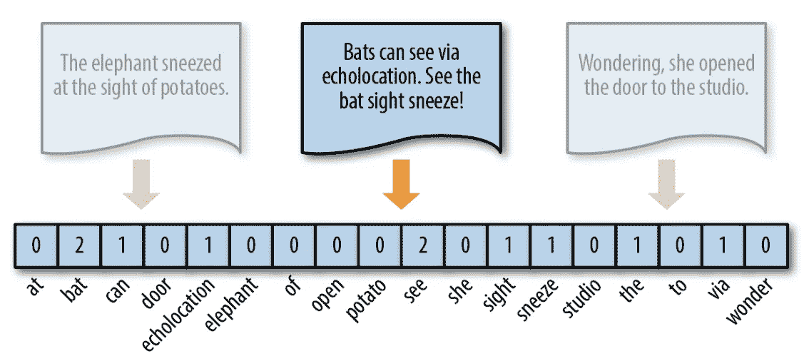
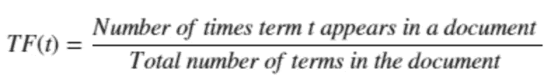
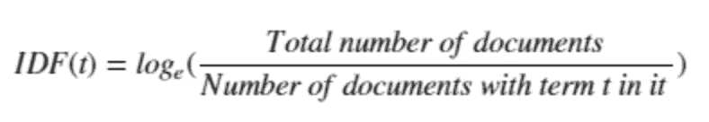
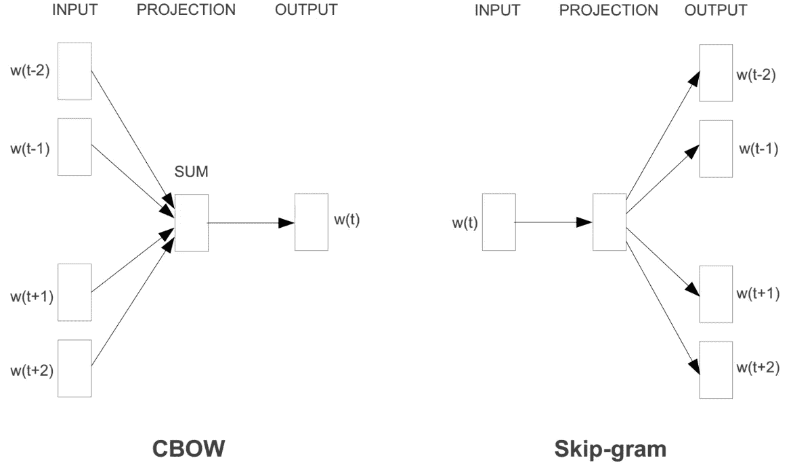

# 从单词嵌入到预训练语言模型——自然语言处理的新时代——第一部分

> 原文：<https://towardsdatascience.com/from-word-embeddings-to-pretrained-language-models-a-new-age-in-nlp-part-1-7ed0c7f3dfc5?source=collection_archive---------10----------------------->

对于机器学习模型要处理的单词，它们需要某种形式的数字表示，模型可以在计算中使用。这是 2 部分系列的第 1 部分，在这里我将介绍单词到矢量表示方法是如何随着时间的推移而发展的。第二部分可以在这里找到[。](https://medium.com/p/e9af9a0bdcd9/edit)

# **传统的上下文无关表示法**

## **一袋单词或一个热门编码**

在这种方法中，向量中的每个元素对应于语料库词汇表中的一个唯一的单词或 n 元语法(标记)。然后，如果文档中存在特定索引处的标记，则将该元素标记为 1，否则标记为 0。

BoW Representation

在上面的例子中，我们的语料库由三个文档中的每个唯一单词组成。第二个文档的 BoW 表示显示在图片中，我们可以看到向量的每个元素对应于特定单词在文档 2 中出现的次数。

这种方法的一个明显的局限性是，它没有将任何意义或单词相似性的概念编码到向量中。

## **TF-IDF 代表**

TF-IDF 是术语频率-逆文档频率的缩写。它是一种统计方法，用于评估一个词在一组文档或语料库中对一个文档的重要性。这种重要性与一个单词在文档中出现的次数成正比，但被语料库中包含该单词的文档数量所抵消。我们来分解一下。

词频(TF):是该词在当前文档中出现频率的得分。因为每个文档的长度不同，所以一个术语在长文档中出现的次数可能比短文档多得多。因此，将词频除以文档长度进行归一化。

逆文档频率(IDF):是对该单词在文档中的稀有程度的评分。术语越少，IDF 分数越高。

因此，TF-IDF 得分= TF * IDF

在这种方法中，不是用原始计数填充文档向量(像在 BoW 方法中)，而是用该文档的术语的 TF*IDF 分数填充它。

即使 TF-IDF BoW 表示为不同的单词提供权重，它们也不能捕捉单词的含义。

## **基于分布相似性的表示——单词嵌入**

上述两种方法都有一个明显的局限性，并且不能捕获单词语义，那就是随着词汇量的增加，文档的向量表示也会增加。这会产生一个有很多零分数的向量，称为稀疏向量或稀疏表示，在建模时会产生更多的内存和计算资源。

神经单词嵌入解决了这两个缺点——通过使用密集表示实现降维，以及使用上下文相似性实现更具表达力的表示。

单词嵌入是文本的学习表示(实值向量)，其中具有相同含义的单词具有相似的表示，例如，著名的“国王-男人+女人=女王”示例。这种方法的关键是对每个单词使用密集的分布式表示。每个单词用一个实值向量来表示，往往是几十维或者几百维。这与稀疏单词表示所需的数千或数百万维形成对比，例如一键编码。

两个最流行的单词嵌入是 Word2Vec 和 GloVe。

## **Word2Vec**

Word2Vec 基本上有两个版本——连续单词包
(CBOW)和 Skip-Gram。CBOW 模型通过基于上下文(周围的单词)预测当前单词来学习嵌入。Skip-Gram 模型通过预测给定当前单词的周围单词(上下文)来学习。

Word2Vec CBOW vs Skip-gram

现在让我们来看看 skip-gram，因为它在大多数任务上实现了更好的性能。

Skip-gram 试图预测给定单词的近邻。我们取一个中心单词和一个上下文(相邻)单词的窗口，并尝试预测该中心单词周围某个窗口大小的上下文单词。因此，我们的模型将定义一个概率分布，即给定一个中心词，一个词在上下文中出现的概率，我们将选择我们的向量表示来最大化该概率。一旦我们可以相当准确地预测周围的单词，我们就移除输出层，并使用隐藏层来获得我们的单词向量。我们从单词向量的小的随机初始化开始。我们的预测模型通过最小化损失函数来学习向量。在 Word2vec 中，这通过带有语言建模任务(预测下一个单词)和优化技术(如随机梯度下降)的前馈神经网络来实现。

杰伊·阿拉玛的这个博客在解释 Word2Vec 方面做得非常出色。

## **手套**

GloVe 是“Global Vectors”的缩写，其动机是基于上下文窗口的方法具有不能从全局语料库统计中学习的缺点。这可能导致无法学习重复和大规模的模式以及这些模型。手套模型背后的主要思想是关注文本语料库中单词的共现概率，以便将它们嵌入到有意义的向量中。换句话说，GloVe 查看一个单词 *j* 在我们所有文本语料库中的单词 *i* 的上下文中出现的频率。

Word2Vec 是一个“预测”模型，而 GloVe 是一个“基于计数”的模型。使用这两种方法生成的嵌入在下游 NLP 任务中的表现非常相似。

接下来，我们将在 [**第二部分**](/from-word-embeddings-to-pretrained-language-models-a-new-age-in-nlp-part-2-e9af9a0bdcd9) 中讨论情境化的表征。

## 参考

 [## Word2vec 自然语言处理白痴指南

### Word2vec 可以说是神经网络自然语言处理革命最著名的面孔。Word2vec…

opendatascience.com](https://opendatascience.com/an-idiots-guide-to-word2vec-natural-language-processing/)