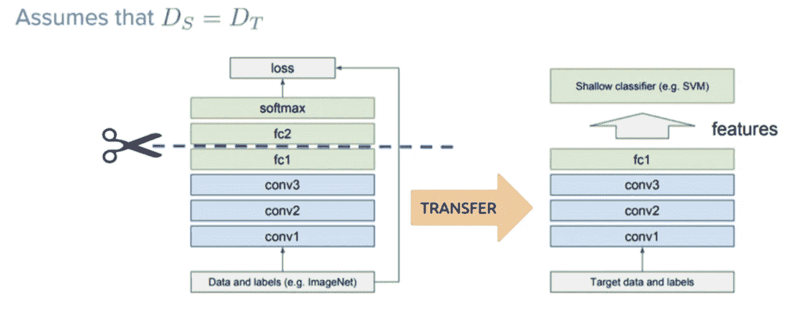
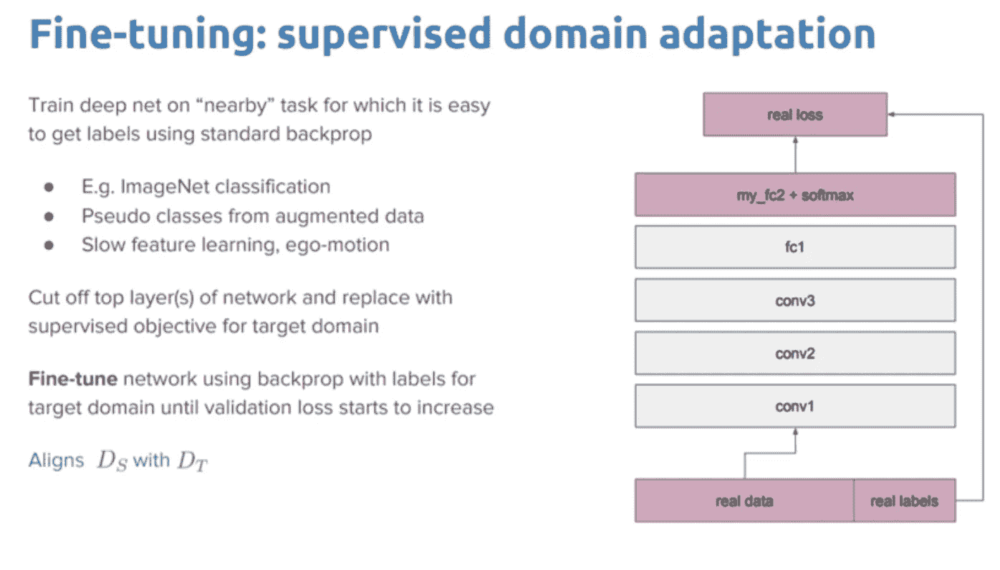

# 从单词嵌入到预训练语言模型——自然语言处理的新时代——第二部分

> 原文：<https://towardsdatascience.com/from-word-embeddings-to-pretrained-language-models-a-new-age-in-nlp-part-2-e9af9a0bdcd9?source=collection_archive---------7----------------------->

对于机器学习模型要处理的单词，它们需要某种形式的数字表示，模型可以在计算中使用。这是由两部分组成的系列文章的第 2 部分，其中我将介绍单词到矢量表示方法是如何随着时间的推移而发展的。如果你没有读过这个系列的 [**部分** 1](https://medium.com/p/7ed0c7f3dfc5/edit) ，我建议你先看看！

# 超越传统的上下文无关的表示

虽然我们在 [**第一部分**](https://medium.com/p/7ed0c7f3dfc5/edit) 中看到的预训练单词嵌入已经非常有影响力，但它们有一个主要的局限性——它们假设单词的意思在句子中相对稳定。事实并非如此。一词多义现象比比皆是，我们必须小心一个单词在意思上的巨大差异:例如 lit(描述某物燃烧的形容词)和 lit(文学的缩写)；或者 get(获得的动词)和 get(动物的后代)

传统的单词向量是浅层表示(单层权重，称为嵌入)。他们只是在模型的第一层中加入了以前的知识。对于新的目标任务，网络的其余部分仍然需要从头开始训练。

使用单词嵌入就像用只对边缘进行编码的预训练表示来初始化计算机视觉模型一样——它们将对许多任务有帮助，但它们无法捕捉可能更有用的更高级信息。单词嵌入只在捕捉单词的语义时有用，但我们还需要理解更高层次的概念，如回指、长期依赖、一致、否定等等。

例如，考虑不完整的句子“服务很差，但食物很棒”。为了预测随后的单词是“yummy”或“delicious ”,模型不仅必须记住用来描述食物的属性，还必须能够识别连接词“but”引入了对比，使得新属性具有“poor”的对立情绪。

这些单词嵌入不是上下文特定的——它们是基于单词并发性而不是顺序上下文来学习的。因此，在两个句子中，“*我正在吃苹果*”和“*我有一部苹果手机*”，两个“苹果”单词指的是非常不同的事物，但它们仍然共享同一个单词嵌入向量。

## 由浅入深的前期培训

大多数文本分类(或任何其他受监督的 NLP 任务)的数据集都相当小。这使得训练深度神经网络非常困难，因为它们往往会过度适应这些小的训练数据集，并且在实践中不能很好地推广。

在计算机视觉领域，几年来，趋势是在巨大的 ImageNet 语料库上预先训练任何模型。这比随机初始化好得多，因为该模型学习一般的图像特征，并且该学习可以用于任何视觉任务(比如字幕或检测)。预训练的 ImageNet 模型已经被用于在诸如[对象检测](https://arxiv.org/abs/1703.06870)、[语义分割](https://arxiv.org/abs/1612.01105)、[人体姿态估计](https://arxiv.org/abs/1701.01779)和[视频识别](https://arxiv.org/abs/1705.07750)等任务中实现最先进的结果。与此同时，他们使得 CV 能够应用于训练样本数量少且注释昂贵的领域。

基于语言建模的预训练模型可以被认为是用于 NLP 的 ImageNet 的对应物。语言建模已经被证明能够捕获与下游任务相关的语言的许多方面，例如[长期依赖性](https://arxiv.org/abs/1611.01368)、[层级关系](https://arxiv.org/abs/1803.11138)和[情感](https://arxiv.org/abs/1704.01444)。语言建模的最大好处之一是，任何文本语料库都可以免费获得训练数据，并且潜在地可以获得无限量的训练数据。

进行 NLP 项目的标准方式一直是——通过诸如 [word2vec](https://papers.nips.cc/paper/5021-distributed-representations-of-words-and-phrases-and-their-compositionality.pdf) 和 [GloVe](https://nlp.stanford.edu/pubs/glove.pdf) 等算法对大量未标记数据进行预训练的单词嵌入被用于初始化神经网络的第一层，其余部分则根据特定任务的数据进行训练。然而，目前许多用于监督 NLP 任务的先进模型都是在语言建模*(这是一项无监督的任务)*上预先训练的模型，然后使用特定于任务的标记数据进行微调*(监督)*。ULMFiT、ELMo、OpenAI transformer 和 BERT 的最新进展的核心是一个关键的范式转变——从仅仅初始化我们模型的第一层到用分层表示对整个模型进行预训练，以在自然语言处理的各种任务上实现最先进的水平，包括文本分类、问题回答、自然语言推理、共指消解、序列标记等。所有这些方法都允许我们在大型数据语料库(如所有维基百科文章)上预训练一个无监督的语言模型，然后在下游任务上微调这些预训练的模型。

## [来自语言模型的嵌入(ELMo)](https://arxiv.org/abs/1802.05365)

ELMo 的动机是单词嵌入应该包含单词级别的特征以及上下文语义。解决方案非常简单——ELMo 表示是双 LSTM 所有内部层的函数，而不是仅将深层双 LSTM 语言模型的最后一层作为单词表示。ELMo 获得每一层的每个内部功能状态的向量，并以加权的方式组合它们以获得最终的嵌入。深度表示优于仅从 LSTM 顶层得到的表示。

直觉上，双 LSTM 的较高层次状态捕捉到了上下文，而较低层次捕捉到了语法。通过比较第一层和第二层嵌入的性能，也可以从经验上看出这一点。虽然第一层在词性标注上表现更好，但第二层在词义消歧任务上实现了更好的准确性。

ELMo 通过训练来预测单词序列中的下一个单词，从而获得了语言理解能力——这是一项名为*语言建模*的任务。ELMo 没有为每个单词使用固定的嵌入，而是在为每个单词分配嵌入之前查看整个句子，从而为每个出现的单词生成稍微不同的嵌入。

例如，考虑句子“百老汇戏剧昨天首演”，在上面的句子中，单词“ ***play*** ”使用标准单词嵌入来编码多个意思，例如动词 ***来播放*** 或者在示例句子的情况下，一部戏剧作品。在诸如 Glove、Fast Text 或 Word2Vec 的标准单词嵌入中，单词 ***play*** 的每个实例将具有相同的表示。

## [通用语言模型微调(ULMFiT)](https://arxiv.org/abs/1801.06146)

ULMFiT 在六个文本分类任务上明显优于最先进的技术，在大多数数据集上减少了 18–24%的错误。此外，只有 100 个标记的例子，它匹配从零开始在 100 倍以上的数据上训练的性能。

ULMFiT 基于 [AWD-LSTM](https://arxiv.org/pdf/1708.02182.pdf) (这是一个多层双 LSTM 网络，无需关注)。该模型在 WikiText-103 语料库上进行训练。

ULM-FiT 引入了一些方法来有效地利用模型在预训练期间学习到的很多东西——不仅仅是嵌入，也不仅仅是情境化的嵌入。ULM-FiT 引入了一个语言模型和一个过程，以针对各种任务有效地微调该语言模型。

ULMFiT 遵循三个步骤来实现对下游语言分类任务的良好迁移学习结果

1)一般 LM 预培训—基于维基百科文本。

2)目标任务 LM 微调——ul mfit 提出了两种稳定微调过程的训练技术。见下文。

*   **区别性微调**的动机是 LM 的不同层捕获不同类型的信息。ULMFiT 提出用不同的学习速率来调整每一层。
*   **斜三角学习率(STLR)** 指一种特殊的学习率调度，先线性增加学习率，再线性衰减。

3)目标任务分类器微调——预训练的 LM 增加了两个标准前馈层，并在最后增加了 softmax 归一化，以预测目标标签分布。

*   **串联池**提取隐藏状态历史上的最大轮询和平均池，并将它们与最终隐藏状态串联。
*   **逐步解冻**从最后一层开始逐步解冻模型层，有助于避免灾难性遗忘。首先，最后一层解冻并微调一个时期。然后下一层解冻。重复该过程，直到所有层都被调整。

## [打开人工智能 GPT](https://s3-us-west-2.amazonaws.com/openai-assets/research-covers/language-unsupervised/language_understanding_paper.pdf) (创成式预训练变压器)

遵循 ELMo 的类似想法，OpenAI GPT 通过对庞大的自由文本语料库进行训练，将无监督语言模型扩展到更大的规模。尽管相似，GPT 和埃尔莫有两个主要的不同之处。

1.  模型架构是不同的:ELMo 使用独立训练的从左到右和从右到左的多层 LSTMs 的浅层级联，而 GPT 是多层变压器解码器。
2.  在下游任务中上下文化嵌入的使用是不同的:ELMo 将嵌入作为附加功能提供给为特定任务定制的模型，而 GPT 为所有最终任务微调相同的基础模型。

什么是变压器？

一般来说，Transformer 包括两个独立的机制——一个读取文本输入的编码器和一个为任务生成预测的解码器。编码器获取输入序列，并将其映射到更高维度的空间(n 维向量)。这个抽象向量被输入到解码器，解码器把它变成一个输出序列。输出序列可以是另一种语言、符号、输入的副本等。

把编码器和解码器想象成只会说两种语言的人类翻译。他们的第一语言是他们的母语，这在他们之间是不同的(例如德语和法语)，而他们的第二语言是他们共同的一种虚构的语言。为了将德语翻译成法语，编码器将德语句子转换成它知道的另一种语言，即想象语言。由于解码器能够阅读那种想象的语言，它现在可以从那种语言翻译成法语。模型(由编码器和解码器组成)一起可以将德语翻译成法语！

Transformer 使用了一种叫做“注意力”的东西。注意力机制查看输入序列，并在每一步决定序列的哪些其他部分是重要的。

这听起来很抽象，但让我们用一个简单的例子来澄清:当阅读这篇文章时，你总是专注于你所阅读的单词，但同时你的大脑仍然在记忆中保存着这篇文章的重要关键词，以便提供上下文。

对于一个给定的序列，注意机制的工作原理是相似的。对于我们的人类编码器和解码器的例子，想象一下，除了用想象的语言写下句子的翻译，编码器还写下对句子的语义重要的关键字，并且除了常规翻译之外，将它们交给解码器。这些新的关键字使翻译对解码器来说更容易，因为它知道句子的哪些部分是重要的，哪些关键术语给出了句子的上下文。关于注意力的更多细节，参考这篇优秀的[文章](https://skymind.ai/wiki/attention-mechanism-memory-network)。

正如[在他们的论文](https://s3-us-west-2.amazonaws.com/openai-assets/research-covers/language-unsupervised/language_understanding_paper.pdf)中所描述的，OpenAI GPT 是对谷歌大脑 2017 年论文《注意力是你所需要的全部》中著名变形金刚的改编。

谷歌大脑的原始版本使用了相同的编码器-解码器 6 层堆栈，而 GPT 使用的是 12 层解码器专用堆栈。每层有两个子层，由多头自注意机制和全连接(位置式)前馈网络组成。

以下步骤用于训练 OpenAI 变压器:

1.**无监督的预训练**:transformer 语言模型以无监督的方式在谷歌图书语料库的几千本图书上进行训练，预训练的权重在 OpenAI GitHub repo 上公开[以供他人使用。](https://github.com/openai/finetune-transformer-lm/tree/master/model)

2.**监督微调**:我们可以根据监督目标任务调整参数。输入通过预先训练的模型传递，以获得最终变压器块的激活。

第一步(无监督的预训练)是*非常*昂贵的，由 OpenAI(他在 8 个 GPU 上训练了一个月的模型！)—幸运的是，我们可以使用下载的预训练模型权重，并直接进行监督微调步骤。

GPT 的一个限制是它的单向性质-该模型仅被训练来预测未来从左到右的上下文。

## [变压器的双向编码器表示(BERT)](https://ai.googleblog.com/2018/11/open-sourcing-bert-state-of-art-pre.html)

BERT 是 GPT 的直接后代——在自由文本上训练大型语言模型，然后在没有定制网络架构的情况下针对特定任务进行微调。与 GPT 相比，BERT 最大的不同和改进是使训练双向化。该模型学习预测左侧和右侧的上下文。BERT 的模型架构是多层双向变换器编码器。

[这篇](https://lilianweng.github.io/lil-log/2019/01/31/generalized-language-models.html)博客文章在深入研究每一个模型的技术细节方面做了惊人的工作。

# 迁移学习

迁移学习(Transfer learning)是指使用一个经过训练的模型来解决一个问题(如对 ImageNet 中的图像进行分类)，作为解决其他一些有些类似问题的基础。一种常见的方法是通过*微调*原始模型。因为微调模型不必从头学习，所以它通常可以用比不使用迁移学习的模型少得多的数据和计算时间来达到更高的精度。

将学习转移到下游任务始于 2013 年左右，使用来自无监督单词模型包(word2vec，GloVe)的上下文无关单词向量，然后使用来自序列模型(Elmo)的上下文相关单词向量，到当前直接使用经过训练的变压器块，其中附加输出层堆叠用于任务特定的微调(ULMFiT，GPT，BERT)。

## 现成的预训练模型作为特征提取器

深度学习系统和模型是分层的架构，在不同的层学习不同的特征(分层特征的分层表示)。然后，这些层最终连接到最后一层(在监督学习的情况下，通常是完全连接的层)，以获得最终输出。这种分层的体系结构允许我们利用预训练的网络，而没有它的最终层作为用于其他任务的固定特征提取器。

Transfer Learning with Pre-Trained Deep Learning Models as Feature Extractors

这里的关键思想是仅利用预训练模型的加权层来提取特征，而不是在为新任务训练新数据的过程中更新模型层的权重。

这种方法的主要优点是比微调需要更少的资源。然而，它还需要为每个下游任务定制一个模型，并且通常得分低于微调。

## 微调现成的预培训模型

这是一个更复杂的技术，我们不仅替换最后一层(用于分类/回归)，而且我们还选择性地重新训练一些先前的层。深度神经网络是具有各种超参数的高度可配置的架构。正如前面所讨论的，最初的层被认为是捕捉一般的特征，而后来的层更关注手边的特定任务。利用这种洞察力，我们可以在重新训练时冻结(固定权重)某些层，或者微调其余层以满足我们的需要。

Transfer Learning with Fine Tuning Off-The-Shelf Pre-Trained Models

这种方法通常比基于特征的方法得分更高，但是由于重新训练原本很大的预训练模型，它需要更多的资源。

## 参考

 [## 有插图的伯特、埃尔莫等人(NLP 如何破解迁移学习)

### 讨论:黑客新闻(98 分，19 条评论)，Reddit r/MachineLearning (164 分，20 条评论)翻译…

jalammar.github.io](http://jalammar.github.io/illustrated-bert/)  [## 自然语言处理中的迁移学习

### 迁移学习无疑是目前深度学习领域的新热点。在视觉上，它…

medium.com](https://medium.com/explorations-in-language-and-learning/transfer-learning-in-nlp-2d09c3dfaeb6)  [## NLP 的 ImageNet 时刻已经到来

### NLP 的世界正在发生巨大的变化。词向量作为自然语言处理核心表示技术的长期统治地位已经…

ruder.io](http://ruder.io/nlp-imagenet/)  [## 什么是变压器？

### 机器学习中的变压器和序列对序列学习介绍

medium.com](https://medium.com/inside-machine-learning/what-is-a-transformer-d07dd1fbec04)  [## 通用语言模型

### 作为单词嵌入帖子的后续，我们将讨论学习上下文化单词向量的模型，以及…

lilianweng.github.io](https://lilianweng.github.io/lil-log/2019/01/31/generalized-language-models.html)  [## 在深度学习中通过真实世界的应用转移学习的综合实践指南

### 用知识转移的力量进行深度学习！

towardsdatascience.com](/a-comprehensive-hands-on-guide-to-transfer-learning-with-real-world-applications-in-deep-learning-212bf3b2f27a)