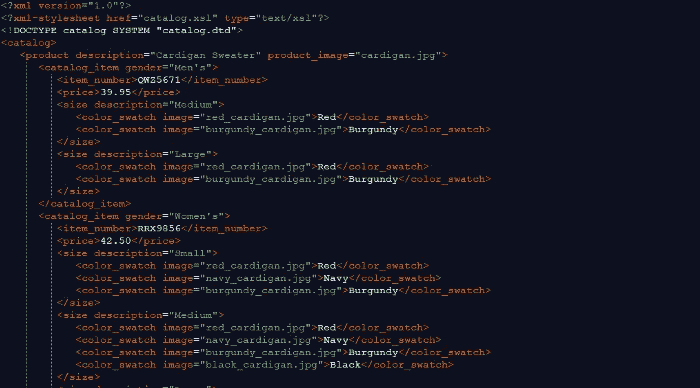
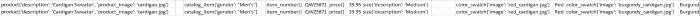

# 从 XML 到 Excel 进行数据分析

> 原文：<https://towardsdatascience.com/from-xml-to-excel-for-data-analysis-ac0c0c765b7d?source=collection_archive---------5----------------------->

## Python 中处理 XML 的介绍

根据您的角色和公司，有时您可能需要使用 XML。在本文中，我们将探讨如何利用 Python 来帮助您以一种使您能够进行分析的方式提取和形成数据。

XML 代表*可扩展标记语言*，它是一种主要用于存储和传输数据的语言。这种语言被设计成机器可读和人类可读的形式。这种语言的批评者通常会建议用 JSON 作为替代，这意味着更快的处理速度。

XML 语言由标签、元素和属性组成。理解这些术语以及我们如何使用它们的最好方法是通过例子的使用。


Photo by [fabio](https://unsplash.com/@fabioha?utm_source=medium&utm_medium=referral) on [Unsplash](https://unsplash.com?utm_source=medium&utm_medium=referral)

# Python 中的 XML

当谈到用 Python 处理 XML 时，最流行的库被恰当地命名为 XML。你可以在这里查阅相关文档[。如果您访问文档页面，您会发现有几个子模块可用于处理 XML，但出于我们的目的，我们将只使用](https://docs.python.org/3/library/xml.html)[*XML . etree . element tree*](https://docs.python.org/3.7/library/xml.etree.elementtree.html)。

# XML 速成班

首先，让我们复习一下 XML 知识。让我们看看以下情况:

```
<catalog>
 <product description="Cardigan Sweater">
  <catalog_item gender="Men's">
   <item_number>QWZ5671</item_number>
   <price>39.95</price>
  </catalog_item>
 </product>
<catalog>
```

在上面的示例中，我们注意到以下情况:

*   根元素是 catalog，并且只能存在一个
*   所有标签都区分大小写，并且所有元素都需要有一个结束标签(比如价格)
*   产品是子元素，目录是子元素，项目编号和价格是子元素。

# Python 和 XML

对于我们的例子，我将使用这个样本 XML 文件；唯一的区别是我重复了 product 子元素两次。



Screenshot depicting a part of the sample XML

我们需要做的第一件事是导入库并将 XML 文件读入我们的应用程序:

```
import xml.etree.ElementTree as ET
#Example XML files:
#   sample2 from:  [https://www.service-architecture.com/articles/object-oriented-databases/xml_file_for_complex_data.html](https://www.service-architecture.com/articles/object-oriented-databases/xml_file_for_complex_data.html)
tree = ET.parse(r'C:\xml\sample2.xml')
root = tree.getroot()
tag = root.tag
att = root.attribprint(root,'\n',tag,'\n',att)
```

它返回以下内容:

```
<Element 'catalog' at 0x0093FC60>
 catalog
 {}
```

因此，我们可以看到如何识别没有属性的根节点。然后，让我们在 XML 树上再往下一层，使用:

```
for child in root:
    print(child.tag, child.attrib)
```

它返回:

```
product {'description': 'Cardigan Sweater', 'product_image': 'cardigan.jpg'}
product {'description': 'Cardigan Sweater', 'product_image': 'cardigan.jpg'}
```

太好了。我们现在可以识别标签及其属性。如果我们想提取值呢？让我们再深入两层，在那里我们有这样的例子(例如，在 *<价格>* 元素):

```
for child in root:
    #print(child.tag, child.attrib)
    for subchild in child:
        #print(subchild.tag, subchild.attrib, subchild.text)
        for subsubchild in subchild:
            print(subsubchild.tag, subsubchild.attrib, subsubchild.text)
```

给了我们:

```
item_number {} QWZ5671
price {} 39.95
size {'description': 'Medium'}size {'description': 'Large'}
```

有了上面的知识，您现在应该能够轻松地浏览 XML 树并提取您想要的任何信息。这个对你帮助不大；但是，当您试图对 XML 树中的数据进行分析时。


Photo by [Markus Spiske](https://unsplash.com/@markusspiske?utm_source=medium&utm_medium=referral) on [Unsplash](https://unsplash.com?utm_source=medium&utm_medium=referral)

# 将数据展平为 CSV 格式，以便快速分析

在某些情况下，您只需要表格格式的数据，这样您就可以快速得出一些结论。也许您正试图查看特定标记的唯一值，或者您只是试图更好地理解数据。也许你想以你的利益相关者更熟悉的方式展示数据——比 excel 更熟悉的方式。

因此，我们接下来要使用的是 xml.etree.ElementTree python 库的 *iter()* 方法。这个方法将允许我们迭代每个 XML 元素:

```
for elem in root.iter():
    print(elem.tag, elem.attrib, elem.text)
```

如您所料，它会返回如下列表:

```
catalog {}product {'description': 'Cardigan Sweater', 'product_image': 'cardigan.jpg'}catalog_item {'gender': "Men's"}item_number {} QWZ5671
price {} 39.95
size {'description': 'Medium'}
```

假设我们想为每个*产品(即*第一级子产品)创建一行，我们可以使用以下脚本:

```
import xml.etree.ElementTree as ETtree = ET.parse(r'pathToXML')
root = tree.getroot()
tag = root.tag
att = root.attrib#Flatten XML to CSV
for child in root:
    mainlevel = child.tag
    xmltocsv = ''
    for elem in root.iter():
        if elem.tag == root.tag:
            continue
        if elem.tag == mainlevel:
            xmltocsv = xmltocsv + '\n'
        xmltocsv = xmltocsv + str(elem.tag).rstrip() + str(elem.attrib).rstrip() + ';' + str(elem.text).rstrip() + ';'print(xmltocsv)
```

我们可以用 Excel 打开哪个文件:



Part of the data as shown in Excel

这里值得注意的是，对于要对齐的数据(每行之间)，假设每个子节点都有所有 XML 属性。如果不是这样，那么可能需要对数据进行一些清理。

我希望你觉得这是有用的。

如果您喜欢这篇文章，您可能也会喜欢:

[](/how-to-extract-text-from-images-with-python-db9b87fe432b) [## 如何用 Python 从图像中提取文本

### 学习用 3 行代码从图像中提取文本

towardsdatascience.com](/how-to-extract-text-from-images-with-python-db9b87fe432b) [](/how-to-extract-text-from-pdf-245482a96de7) [## 如何从 PDF 中提取文本

### 学习使用 Python 从 pdf 中提取文本

towardsdatascience.com](/how-to-extract-text-from-pdf-245482a96de7)