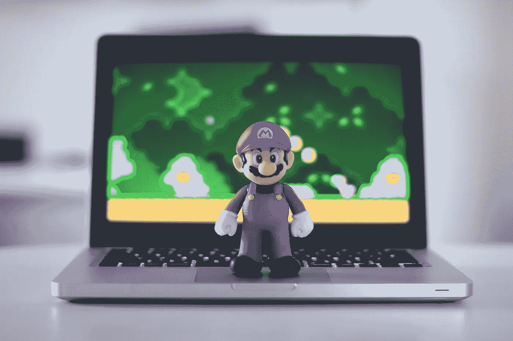
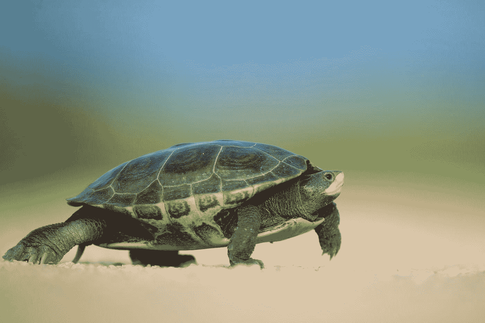
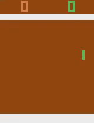
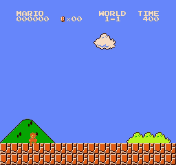

# 从零到旗杆英雄

> 原文：<https://towardsdatascience.com/from-zero-to-flagpole-hero-ead14fc46fba?source=collection_archive---------21----------------------->

## 我是如何从一个强化学习新手到在两周内从零开始编写一个 AI，并在《新超级马里奥兄弟》中以 1 比 1 击败世界的。

Can computers learn to control the famous Italian plumber?

# 没有 I/O 就拼不出马里奥

两周前，我还是强化学习的新手。我不是在说“你什么都不知道，琼恩·雪诺”对这个问题的无知程度，而是理解尝试一个行动、获得奖励和把那个事件记在记忆中的基本原则是关于我在这个问题上的知识程度。概念性的想法是很棒的，但是我完全不知道如何将这些想法编码并写出实际可行的东西。快进两个星期，我写了一个程序，看到马里奥成功地到达了第一关的旗杆。你问我是怎么做到的？好吧，继续读下去找出答案吧！

然而，在深入本文之前，我应该指出，虽然我的目的是帮助其他人学习，以便他们可以自己构建强化学习应用程序，但我将**而不是**深入描述我在本文中的工作所涉及的代码或理论。我的计划是写后续文章，描述实际的代码以及我以后如何设计它。话虽如此，我相信在潜入 AI 时最好退一步，先学习*如何*学习。在这篇文章中，我希望传达一个对我来说成功的过程。

Photo by [Ray Hennessy](https://unsplash.com/@rayhennessy?utm_source=medium&utm_medium=referral) on [Unsplash](https://unsplash.com?utm_source=medium&utm_medium=referral)

# 学习爬行

你可能在生活中的某个时候听说过这句话“在你会走路之前，你需要先学会爬”。这个令人谦卑的表达提醒我们，无论我们是谁，来自哪里，在学会走路之前，我们都必须学会如何爬行。这也给我们上了一课，如果不先了解领域的基本基础，我们没有人能立即掌握一个给定的任务或主题。人工智能当然没有什么不同，因为期望某人在几个小时后或仅仅阅读一篇文章后立即成为该领域的专家是令人愤慨的。为了很好地掌握人工智能，一个人必须学习核心基础知识才能成功。

说到强化学习，我也没什么不同。没有人工智能的高级学位，也没有 20 多年的实践经验，我不得不从头开始理解什么是超越我的基本背景的强化学习。

## “看一看，在一本书里！”

我生活中的许多讽刺之一是，我实际上是一个糟糕的读者，尽管经常阅读和半频繁地给一个大型博客网站投稿。不要误解我的意思，我可以读得很好，但是我读的速度相对较慢，而且经常会分心，很难带着新的概念离开。

尽管有这个限制，我还是选择通过阅读一些书籍来完成我的旅程。幸运的是，我的雇主是 O'Reilly Learning(以前的 Safari 在线图书)的合作伙伴，所以我可以“免费”访问他们的完整图书馆。如果你以前没有听说过他们，我鼓励你去看看他们，因为他们有很多很好的资源，尤其是对那些在技术领域工作的人来说。

我拿起的第一本书是 Praveen Palanisamy 写的《开放健身房的智能代理》，你可以在 O'Reilly Learning 或者任何你能买到 O'Reilly 书籍的地方找到。

我之所以选择这本书，是因为它关注我在工作中使用的 PyTorch，而且正如它的名字所暗示的，它还承诺了一种实践方法。我发现，当我真正动手做代码而不是纯粹阅读没有任何实际例子的理论片段时，我学得最好。在不把这变成一个完整的书评的情况下，我推荐这本书给任何想要深入强化学习的人。特别是前半部分在分解强化的关键原则方面做得很好，比如解释关键术语，给出简单的例子，以及演示如何实际配置一个环境。

在读完这本书的前半部分后，我觉得我对强化是如何在基础水平上学习的有了很好的理解，并对我如何编写一个能够学习玩并最终独自打败一个游戏的程序有了一些想法。有了这个新发现的知识，我决定下一步应该对它进行测试。

Work up a sweat in OpenAI’s Gym! Photo by [Alora Griffiths](https://unsplash.com/@aloragriffiths?utm_source=medium&utm_medium=referral) on [Unsplash](https://unsplash.com?utm_source=medium&utm_medium=referral)

# 你举起过兄弟吗？

埃隆马斯克(Elon Musk)几年前共同创立的人工智能研究公司 OpenAI 开发了一种强化学习模型和技术的通用基准，称为健身房。这个工具提供了几十个独特的环境，开发人员和研究人员可以使用这些环境快速轻松地迭代特定的模型，而无需担心配置测试套件。这不仅加快了测试和开发过程，还为团队、组织和世界各地的开发人员和研究人员提供了重复工作的标准。有了一个共同的测试环境，我们可以开始在各种模型之间进行比较，以确定哪些模型可以在特定的游戏中获得更高的分数，或者可以适应各种各样的游戏，甚至比同行更快地收敛。

我提到的环境大多是一系列迷你游戏，每个都有自己的一套规则、边界、奖励和成功标准。Gym 甚至支持为 Atari 2600 制作的游戏，如 Pong、Breakout 和 Ms. Pacman，允许开发人员在真实的视频游戏中轻松测试他们的模型。

从我读过的书中获得一些经验后，我决定创建一个简单的 Q-Learning 模型来试试运气，它可以解决一些更琐碎的健身房环境，例如 **CartPole-v0** 和 **MountainCar-v0** ，这两个都是 OpenAI 团队开发的，是进入该领域的一个很好的切入点。幸运的是，我所读的这本书提供了一个很好的例子，它创建了一个 Q 学习模型来解决 MountainCar-v0 问题，该模型在几分钟内就成功地收敛了。由于 Q-Learning 模型和 Gym 的灵活性，我还能够在 CartPole-v0 上测试该算法，而只需更改一行代码。

虽然这些演示看起来很酷，但我知道它不可扩展，因为我没有使用任何深度学习技术，而且我直接读取内部环境的状态，而不是读取原始图像。这感觉像是作弊，因为模型能够获得人类玩家无法获得的环境信息(如位置、速度和角度)。在看到书中和网上的许多例子后，我修改了代码，使用深度 Q 网络(DQN)并利用卷积来处理屏幕上的实际图像，而不是读取魔法状态。通过这种方式，模型将像人类一样学习玩游戏，通过阅读屏幕，提供动作，并重复响应该动作的结果，直到满足结束标准。

有了这个新模型，与我以前的简单 Q 学习模型相比，我能够更快地解决 CartPole-v0 和 MountainCar-v0，并且在收敛后也获得了更高的分数。虽然这很令人兴奋，但这些环境在逻辑上很简单，因为可能的状态相对较少，并且动作空间也很小，因为在这两种情况下，您都可以向左、向右或原地不动。因此，我想在一个更复杂的环境中测试这些模型，然后再尝试我的最终目标——训练马里奥超越一个等级。幸运的是，我前面提到的 Atari 环境是测试具有更复杂规则集的游戏模型的极好的沙箱。

让我最初感到惊讶的是，在不改变我正在使用的任何核心代码的情况下，我能够将我的模型部署到几个 Atari 游戏中，并且它们成功地融合到一个点上，在这个点上它们能够掌握一个游戏，例如持续地以 21 比 0 赢得一场 Pong 游戏。

My trained model on the right easily beating the CPU.

事实上，我的代码能够以非常小的修改击败这些游戏，这是对最初的 DQN 模型的健壮性的一个证明。很快变得很明显，该模型将能够适应各种环境，并学习如何正确处理它们。

作为一名专业的软件工程师，我在 GitHub 上创建了一个存储库，其中包含我用来训练我的模型击败 Pong 和其他 Atari 游戏的所有代码，并包括几个参数，以便在不修改任何代码的情况下轻松测试变化并适应新环境。想亲自尝试一下吗？查看以下链接了解更多详情。

 [## roclark/openai-gym-pytorch

### OpenAI 的 Gym 是一个开源工具包，包含几个环境，可以用来比较强化…

github.com](https://github.com/roclark/openai-gym-pytorch) 

我连续解决了多个游戏，但没有为新的场景定制我的软件，但我仍然有一个迫切的问题——人工智能真的可以学习如何在马里奥中击败一个级别吗？

The Mushroom Kingdom is a dangerous place! Photo by [Florian van Duyn](https://unsplash.com/@flovayn?utm_source=medium&utm_medium=referral) on [Unsplash](https://unsplash.com?utm_source=medium&utm_medium=referral)

# 蘑菇王国的审判

对于那些还在阅读的人来说，我上面提出的问题的答案显然是“是”，因为如果一切都悲惨地失败了，我就不会发表这篇文章。

Gym 本身不支持 NES 的游戏，所以我必须为超级马里奥兄弟设置一个环境，以便测试我的模型。幸运的是，GitHub 上的一些优秀的人已经创建了`gym-super-mario-bros`(可从 PyPI 获得)，它为我们处理一切，允许我们只需几行代码就可以设置我们的环境，就像其他受支持的健身房环境一样。

设置好一切后，我运行了我在 Atari 游戏中使用的代码，但目标是超级马里奥兄弟的第一关……什么也没发生。我等了一个小时，但马里奥只知道他会被关卡中的第一个古姆巴杀死，他通常不喜欢被杀死，所以更好的策略是站在原地，安全地等待时间结束。

显然，这不是我想要发生的，因为我希望马里奥能够完成这个级别，所以它回到了绘图板。

与任何数据科学项目一样，首先了解*您试图解决的问题是什么*，包括任何成功标准和限制，这一点至关重要。当我试图在没有真正思考问题的情况下解决马里奥时，我的兴奋占据了我的全部。

以今天的标准来看，Mario 和 Atari 游戏的复杂性都被认为是极其简单的，所以我天真地认为这个模型可以轻松处理这两种情况。然而，退一步讲，考虑到可能遇到的各种状态，很明显马里奥比像 Pong 这样的游戏复杂几个数量级。有了 Pong，你就有了上下移动的两个球拍和一个在屏幕上浮动的球。一个神经网络真的只需要学习如何上下移动并理解击球是好的，让它在你身后漂浮是坏的，同时也只需要担心单一的屏幕。然而，对于马里奥，你一次只能看到关卡的一小部分，还有许多不同的物体和敌人需要他去正确地研究和理解。

如果你回想一下你第一次玩马里奥的时候，你是否直觉地知道古姆巴和库帕斯是坏的，蘑菇是好的，曲管可以通向新的地方，同时也会产生敌人，问号可以提供能量和硬币？如果是这样，你比我小时候第一次玩这个游戏时要聪明得多。不过，你很可能没有立即知道所有这些信息。就像我们这些凡人不理解马里奥在蘑菇王国的旅程中遇到的一切一样，我的 DQN 也没有学会如何正确地通过关卡。

因为我发现这通常是强化学习中最棘手的部分，所以我必须为马里奥定制一个奖励系统，这样他才能积极地对环境做出反应。为了做到这一点，我不得不再次考虑如何完成这个关卡。我通常喜欢尽可能快地到达终点，同时踩死敌人，获得能量，收集硬币，如果他们方便接近的话，否则就不打扰了。当然，我也想不惜一切代价避免死亡，因为那只会让我从头开始。基于这种理解，我创建了一个定制的奖励系统，当马里奥到达旗帜时，它会给马里奥一堆额外的分数，他向右移动得越快(接近关卡末尾)，他得到的分数就越多。每当他被击中、死亡或时间耗尽时，我都会扣他几分，鼓励他避免这些情况。

在添加了我的自定义奖励后，是第二轮的时候了！我开始写剧本，但…还是一无所获。我看着马里奥一次又一次悲惨地失败。在经历了似乎永无止境的挫折后，我终于看到马里奥踩在了他的第一个古姆巴上，并第一次继续这个水平。也许，只是也许我是对的东西，我缺乏耐心需要在这里退居二线。

在让马里奥跑了一整夜(部分是双关语)后，我醒来时发现了一个美丽的地方:

My computer showing me how it’s done.

他做到了！他不仅学会了如何通过关卡，还想出了几个技巧，使他在一路上踩着 Goombas 时比我完成得更快。虽然我对结果非常激动，但我也突然意识到，我很可能永远不会如此擅长击败游戏。但是，看着马里奥毫不费力地再次通过关卡，我的悲伤很快就消失了，因为我知道我完成了我的一个目标。

Photo by [Aditya Chinchure](https://unsplash.com/@adityachinchure?utm_source=medium&utm_medium=referral) on [Unsplash](https://unsplash.com?utm_source=medium&utm_medium=referral)

# “你们都给我收回去！”

在结束之前，我想快速总结一下我的旅程，并提供一些额外的资源。

简单回顾一下，在两周的时间里，我从强化学习的完全新手变成了从零开始编写程序，解决了超级马里奥兄弟的第一关。对我来说，阅读一本书证明是至关重要的，因为它帮助我快速理解强化学习的核心概念，并使我能够应用它们。我个人觉得阅读是一个经常被忽视的知识来源，它对理解一个新的主题有很大的帮助，尤其是在我们被技术包围的时代。

在读完这本书(或者更确切地说，是前半部分)后，我将我的知识用于测试，并创建了实际实现我所读到的主题的程序。正如阅读对于理解一个新话题至关重要一样，实际动手尝试是真正巩固知识的唯一途径。

最后，抓住机会！如果你有一个你正在追逐的目标，那就去追求它吧！准备总是至关重要的，但最终你必须尝试，从经验中学习最终只会有所帮助。

当然，因为我在上面贴了我的 Atari 库的链接，所以我也在这里提供我的 Mario 库的链接才公平。请随意看看，甚至帮我解决一些更具挑战性的水平，在我寻求击败整个游戏使用强化学习。您可以在下面找到存储库:

 [## 罗克拉克/超级马里奥兄弟-dqn

### 一个强化学习项目，旨在学习和完成原来的任天堂超级马里奥兄弟…

github.com](https://github.com/roclark/super-mario-bros-dqn) 

正如在开始时提到的，我将在以后的文章中提供更多的细节，告诉那些感兴趣的人我是如何在更高的技术层面上实现这个程序的，敬请关注！否则，去跳，跳过，跳进强化学习的新冒险！哇哦！