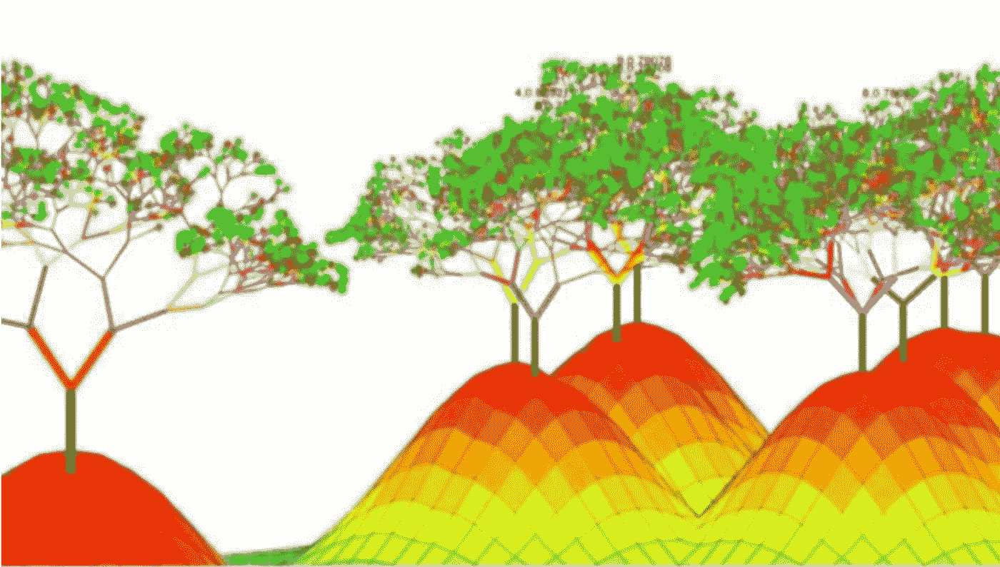
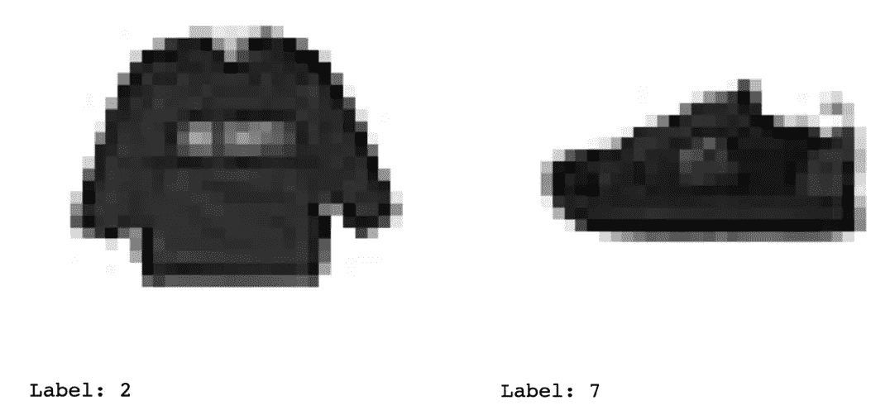

# XGBoost 调优从零到英雄

> 原文：<https://towardsdatascience.com/from-zero-to-hero-in-xgboost-tuning-e48b59bfaf58?source=collection_archive---------1----------------------->

## 走过一些最常见的(也不太常见！)XGBoost 的超参数



Boosted Trees by [Chen Shikun](http://cican17.com/an-overview-of-boosted-trees/).

[XGBoost](https://github.com/dmlc/xgboost) 或极端梯度增强是梯度增强算法的优化实现。自 2014 年[推出以来，XGBoost](https://github.com/dmlc/xgboost) 因其预测性能和处理时间而成为机器学习黑客马拉松和竞赛的宠儿。

# 这一切都始于助推…

增强是一种合奏技术。集成学习借鉴了[孔多塞的陪审团定理](https://en.wikipedia.org/wiki/Condorcet%27s_jury_theorem)和*群体智慧*的思想。因此，集成技术结合了不同模型的结果，以提高整体结果和性能

> 多数票正确分类的概率比任何人(模型)都高，随着人(模型)的数量变大，多数票的准确率接近 100% — Scott Page，模型思考者。

在基于决策树的机器学习中，Boosting 算法实现了一个顺序过程，其中每个模型都试图纠正以前模型的错误。这个想法是将许多*弱学习者*转化为一个*强学习者。*梯度推进采用梯度下降算法来最小化顺序模型中的误差。梯度推进的主要低效之处在于它一次只创建一个决策树。

为了克服这一点，陈天奇和卡洛斯·盖斯特林建立了一个可扩展的树增强系统。它具有并行树构建、[缓存感知](https://stackoverflow.com/questions/473137/a-simple-example-of-a-cache-aware-algorithm)访问、稀疏感知、正则化和加权分位数草图，作为其[系统优化和算法增强](/https-medium-com-vishalmorde-xgboost-algorithm-long-she-may-rein-edd9f99be63d)的一部分。

> 如有疑问，请使用欧文·张的智慧之言。

为了向您介绍 [XGBoost](https://github.com/dmlc/xgboost) 及其超参数，我们将使用[时尚 MNIST](https://www.kaggle.com/zalando-research/fashionmnist) 数据集构建一个简单的分类模型。

# 预处理数据

时尚 MNIST 数据集由与 10 个分类标签相关联的 60，000 幅 28x28 灰度图像的训练集和 10，000 幅图像的测试集组成。标签如下:

*   0 T 恤/上衣
*   1 条裤子
*   2 件套头衫
*   3 连衣裙
*   4 件外套
*   5 凉鞋
*   6 衬衫
*   7 运动鞋
*   8 袋
*   9 踝靴

让我们来看看第一个和最后一个图像。



数据集中的每个实例(图像)有 784 个特征(每个像素一个)，每个特征中的值范围从 0 到 255，因此我们将使用 [Scikit-Learn 的](https://scikit-learn.org/stable/index.html) `[StandardScaler](https://scikit-learn.org/stable/modules/generated/sklearn.preprocessing.StandardScaler.html)`将这些值重新调整到一个更小的范围，平均值为零，单位方差。

# 基线模型

我们将使用一个`[XGBoostClassifier](https://xgboost.readthedocs.io/en/latest/python/python_api.html#module-xgboost.sklearn)`来预测给定图像的标签。建造一个`[XGBoostClassifier](https://xgboost.readthedocs.io/en/latest/python/python_api.html#module-xgboost.sklearn)`非常简单。我们将从一个简单的基线模型开始，然后继续前进。

对于第一次迭代，我们将只指定一个超参数:objective，并将其设置为`“multi:softmax”`。`objective`是学习任务超参数的一部分，它指定了要使用的学习任务(回归、分类、排序等)和函数。

让我们回顾一下。什么是超参数？-它们是在训练模型之前初始化的参数，因为它们无法从算法中学习。它们控制定型算法的行为，并对模型的性能有很大影响。典型的比喻是这样的:*超参数是人们用来调整机器学习模型的旋钮*。它们对于优化和改进评估指标是必不可少的。

现在，让我们看看我们的模型和结果。

```
Training F1 Micro Average:  0.8794833333333333
Test F1 Micro Average:  0.8674
Test Accuracy:  0.8674
```

不算太寒酸！但是我们可以通过一些调整和*旋钮转动*来尝试打破这些最初的分数。

# 像老板一样调音！

[XGBoost](https://github.com/dmlc/xgboost) 的最大优势之一是可定制的程度，*即*一个令人生畏的长列表，您可以调整这些参数，它们主要是为了[防止过度调整](https://gabrieltseng.github.io/2018/02/25/XGB.html)。

在这种情况下，最重要的问题是调整什么以及如何调整？对于什么是理想的超参数没有基准，因为这些将取决于您的具体问题、您的数据和您优化的目标。但是一旦你理解了甚至是最模糊的超参数的概念，你就可以像老板一样**调优了**！

为了找到我们的最佳超参数，我们可以使用 [Scikit-Learn 的](https://scikit-learn.org/stable/index.html)或`[GridSearchCV](https://scikit-learn.org/stable/modules/generated/sklearn.model_selection.GridSearchCV.html)`。两者之间的区别是分别在[较低的运行时间和更好的性能](https://scikit-learn.org/stable/auto_examples/model_selection/plot_randomized_search.html)之间进行权衡。考虑数据集的大小`[RandomizedSearchCV](https://scikit-learn.org/stable/modules/generated/sklearn.model_selection.RandomizedSearchCV.html)`是这一次要走的路。

我们首先创建一个`[XGBClassifier](https://xgboost.readthedocs.io/en/latest/python/python_api.html#module-xgboost.sklearn)`对象，就像基线模型一样，除了`objective`之外，我们还直接传递超参数`tree_method`、`predictor`、`verbosity`和`eval_metric`，而不是通过参数网格。前两个允许我们直接访问 GPU 功能，`verbosity`让我们实时了解模型正在运行什么，`eval_metric`是用于验证数据的评估指标——如您所见，您可以以`Python list`的形式传递多个评估指标。

不幸的是，使用`tree_method`和`predictor`我们不断得到同样的错误。您可以在此处跟踪该错误[的状态。](https://github.com/dmlc/xgboost/issues/4287#issuecomment-494055233)

```
Kernel error:
In: /workspace/include/xgboost/./../../src/common/span.h, 	line: 489
	T &xgboost::common::Span<T, Extent>::operator[](long) const [with T = xgboost::detail::GradientPairInternal<float>, Extent = -1L]
	Expecting: _idx >= 0 && _idx < size()
terminate called after throwing an instance of 'thrust::system::system_error'
  what():  function_attributes(): after cudaFuncGetAttributes: unspecified launch failure
```

鉴于我们无法修复根本问题(**双关语为**)，该模型必须在 CPU 上运行。所以我们的`[RandomizedSearchCV](https://scikit-learn.org/stable/modules/generated/sklearn.model_selection.RandomizedSearchCV.html)`的最终代码看起来像这样:

`[RandomizedSearchCV](https://scikit-learn.org/stable/modules/generated/sklearn.model_selection.RandomizedSearchCV.html)`允许我们从参数网格给出的选项中找到超参数的最佳组合。然后我们可以通过`model_xgboost.best_estimator_.get_params()`访问它们，这样我们就可以在模型的下一次迭代中使用它们。下面是这个模型的最佳估计。

```
Learning Rate: 0.1
Gamma: 0.1
Max Depth: 4
Subsample: 0.7
Max Features at Split: 1
Alpha: 0
Lambda: 1
Minimum Sum of the Instance Weight Hessian to Make Child: 7
Number of Trees: 100
Accuracy Score: 0.883
```

我们的准确率提高了 2%！对于一个运行了 60 多个小时的模型来说，这已经不错了！

现在，让我们单独看看每个超参数。

*   首先，让我们澄清一下这个学习率和梯度下降中的学习率是不一样的。在梯度推进的情况下，学习率意味着 [*减少*每个附加树](https://stats.stackexchange.com/questions/354484/why-does-xgboost-have-a-learning-rate)对模型的影响。在他们的论文[*A Scalable Tree Boosting System*](https://arxiv.org/pdf/1603.02754.pdf)*Tianchi Chen 和 Carlos Guestrin 将这种正则化技术称为*收缩*，它是一种防止过拟合的附加方法。学习率越低，模型在防止过度拟合方面[就越稳健](https://blog.cambridgespark.com/hyperparameter-tuning-in-xgboost-4ff9100a3b2f)。*
*   *`gamma`:数学上，这被称为[](https://medium.com/data-design/xgboost-hi-im-gamma-what-can-i-do-for-you-and-the-tuning-of-regularization-a42ea17e6ab6)*拉格朗日乘数，其目的是控制复杂度。它是损失函数的伪正则项；它代表[在考虑分割](https://gabrieltseng.github.io/appendix/2018-02-25-XGB.html)时，为了使分割发生，损失必须减少多少。**
*   **`max_depth`:指一棵树的深度。它设置了在根和最远的叶子之间可以存在的最大节点数。请记住，较深的树容易过度拟合。**
*   **`colsample_bytreee`:表示在构建每棵树时要考虑的列(*特性*)的一部分，因此它在构建每棵树时出现一次。在陈天琦和 Carlos Guestrin 的论文 [*中提到了一种可扩展的树提升系统*](https://arxiv.org/pdf/1603.02754.pdf) *，作为防止过拟合和提高计算速度的另一种主要技术。***
*   **`subsample`:表示在构建每个子树时要考虑的行(*观察值*)的一部分。陈天琦和卡洛斯·盖斯特林在他们的论文 [*中提出了一种可扩展的树提升系统*](https://arxiv.org/pdf/1603.02754.pdf) 推荐`colsample_bytree`而不是`subsample`来防止过拟合，因为他们发现前者在这方面更有效。**
*   **`reg_alpha` : L1 正则项。L1 正则化鼓励稀疏性(意味着将权重拉至 0)。当`objective`是逻辑回归时，它会更有用，因为您可能需要在特征选择方面得到帮助。**
*   **`reg_lambda` : L2 正则项。L2 鼓励更小的权重，这种方法在树模型中更有用，在树模型中归零特性可能没有太大意义。**
*   **`min_child_weight`:类似于`gamma`，因为它在分割步骤执行规则化。这是创建一个新节点所需的最小 Hessian 权重。黑森是二阶导数。**
*   **`n_estimators`:适合的树数。**

****

**The Ugly Truth**

**但是等等！还有更多。根据您试图解决的问题或您试图优化的内容，您还可以修改其他超参数:**

*   **`booster`:允许您选择使用哪个助推器:`gbtree`、`gblinear`或`dart`。我们一直在使用`gbtree`，但是`dart`和`gblinear`也有它们自己额外的超参数需要探索。**
*   **`scale_pos_weight`:正负权重之间的平衡，在数据呈现高等级不平衡的情况下绝对应该使用。**
*   **`importance_type`:指`[feature_importances_](https://datascience.stackexchange.com/questions/12318/how-do-i-interpret-the-output-of-xgboost-importance)` [方法](https://datascience.stackexchange.com/questions/12318/how-do-i-interpret-the-output-of-xgboost-importance)要使用的特征重要性类型。`gain`计算一个特征对模型中所有树的相对贡献(相对增益越高，该特征越相关)。`cover`当用于决定叶节点时，计算与特征相关的观察值的相对数量。`weight`测量某个特征被用于在模型的所有树上分割数据的相对次数。**
*   **`base_score`:全局偏差。这个参数在处理高等级不平衡时很有用。**
*   **`max_delta_step`:设置重量的最大可能绝对值。在处理不平衡的类时也很有用。**

****注意:**我们使用 [Scikit-Learn](https://scikit-learn.org/stable/index.html) [包装器接口](https://xgboost.readthedocs.io/en/latest/python/python_api.html#module-xgboost.sklearn)为 [XGBoost](https://github.com/dmlc/xgboost) 执行了`[RandomizedSearchCV](https://scikit-learn.org/stable/modules/generated/sklearn.model_selection.RandomizedSearchCV.html)`。**

# **接下来是什么**

**一旦你有了模型的最佳估值器，你就可以做许多不同的事情。我建议将它们用作 XGBoost 内置交叉验证的超参数，这样您就可以利用`early_stopping_rounds`功能——这是优化和防止过度拟合的又一步。但那是以后的事了！**