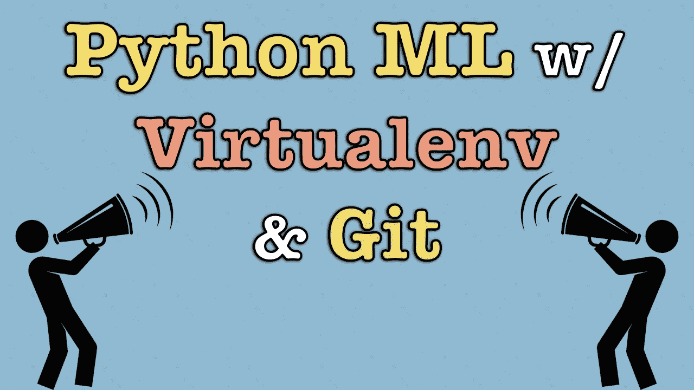

# 从零到一

> 原文：<https://towardsdatascience.com/from-zero-to-one-9b1926b7d7f6?source=collection_archive---------22----------------------->

## 开始一个新的 Python ML 项目

首先，我想宣布我将制作一部关于构建信用卡交易欺诈模型的新视频系列，作为 [IEEE-CIS 欺诈检测 Kaggle 竞赛的一部分](https://www.kaggle.com/c/ieee-fraud-detection)。

这将主要是我从零开始构建东西的截屏。这一挑战之旅将被用作探索各种建模技术和数据科学实践的背景。

# 设置新项目

首先，我想制作一个简短的视频，介绍我如何为一个全新的项目设置环境。有时候，观察某人是如何完成任务的是很有帮助的——尤其是那些被认为是理所当然的、不经常讨论的任务。也许你会学到新的技巧。如果你做得更好，请在评论中分享！

【https://blog.zakjost.com】原载于