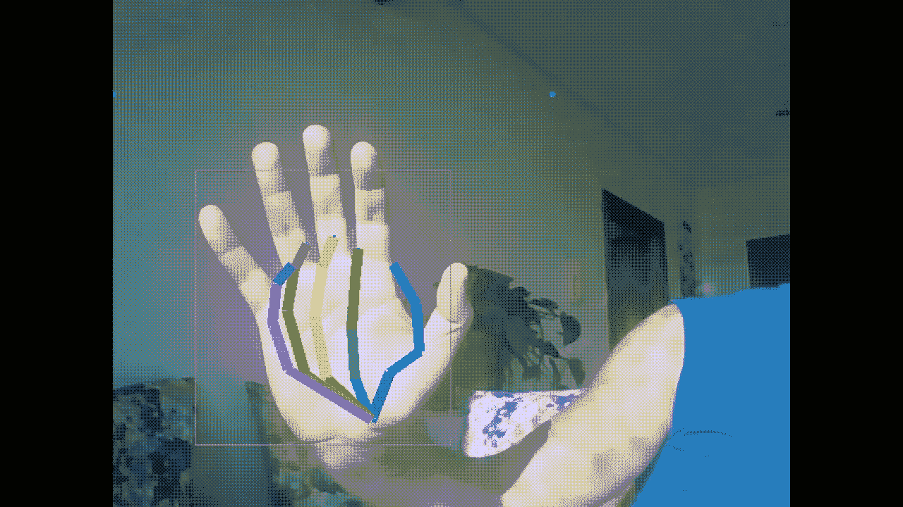
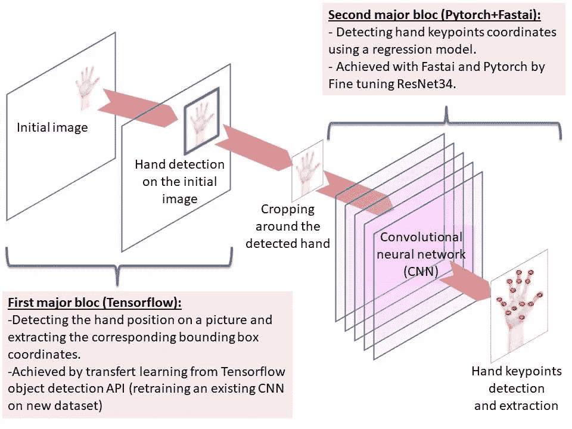
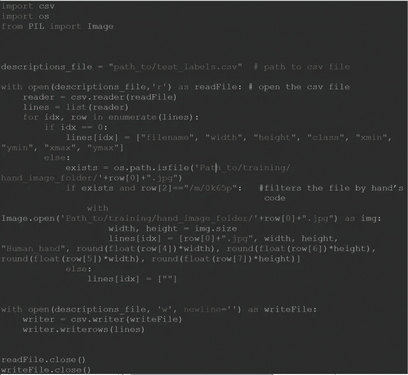
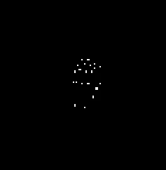
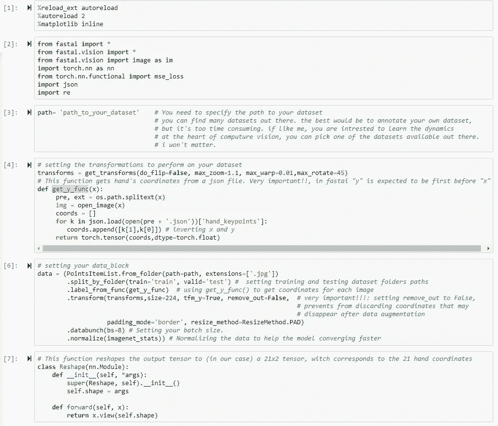
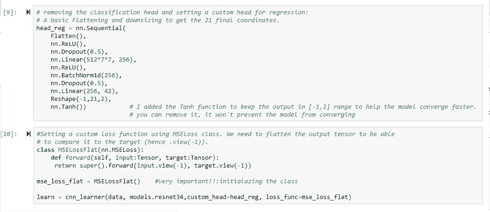
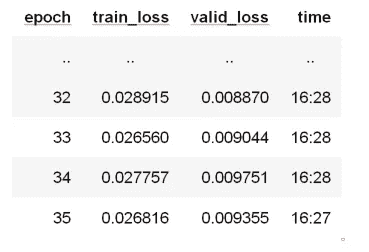
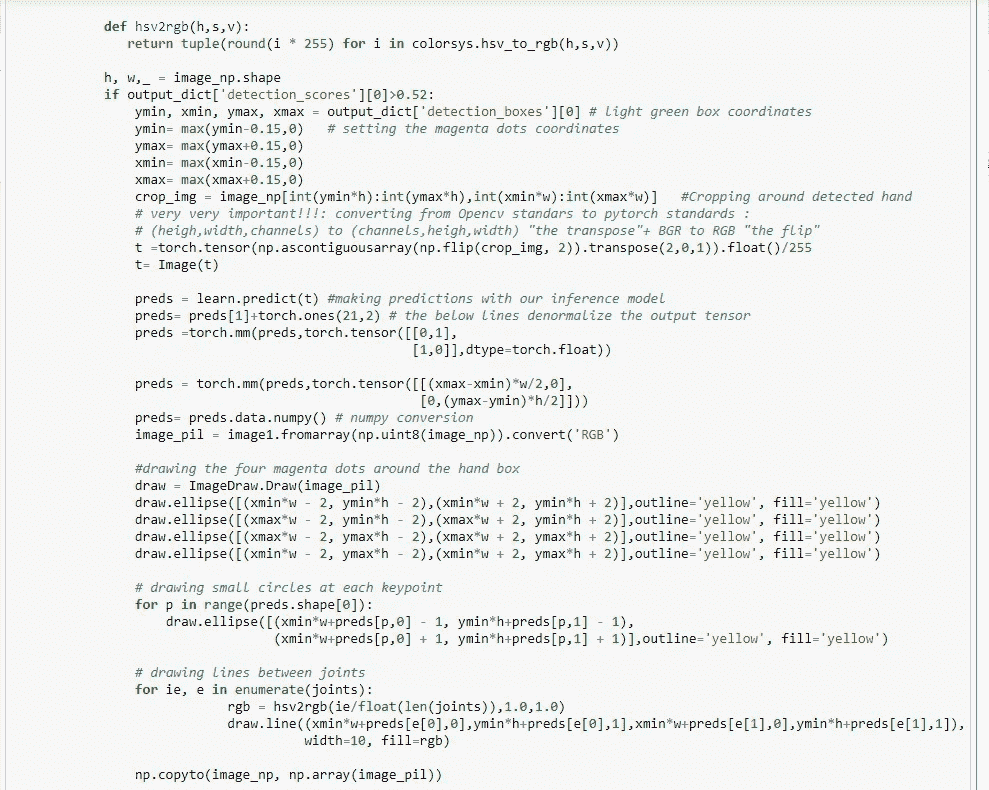

# 利用 OpenCV、Tensorflow 和 Fastai，在五个月内从零到实时手关键点检测

> 原文：<https://towardsdatascience.com/from-zero-to-real-time-hand-keypoints-detection-in-five-months-with-opencv-tensorflow-and-fastai-f98e87221475?source=collection_archive---------12----------------------->

在这篇文章中，我将一步一步地向你展示如何用 OpenCV、Tensorflow 和 Fastai (Python 3.7)构建你自己的实时手部关键点检测器。在为期 5 个月的精彩旅程中，我将专注于我在建造它时所面临的挑战。

你可以在这里看到这些模型:

The light green box detects the hand on the image, then i crop around the image by connecting the magenta dots before feeding a CNN for hand keypoints detection

# **动机:**

这一切都始于对理解人工智能核心动态的难以置信的痴迷。五个月前，我在谷歌上搜索了“人工智能 vs 机器学习 vs 深度学习”，这是我第一次试图抓住不同概念之间的细微差别😊。

在查看了多个视频和文章后，我决定从计算机视觉开始，使用移动相机开发自己的手部关键点检测器。

我知道人脑只需要 20 瓦的能量就能运作，我的目标一直是保持事物的简单性，尽可能降低任何模型的计算要求。复杂的事物需要复杂的微积分，而复杂的微积分本身是高度耗能的。

# **简单说说我的学习曲线:**

我有土木工程的学术背景，有一些 visual basic 的编码技能。毕业后一直在金融领域工作。

很不一般，我是从学习 [Javascript](https://www.freecodecamp.org/) ( [ex1](https://codepen.io/rafik-/pens/popular/) ， [ex2](https://glitch.com/@rafik.rahoui) )开始我的旅程的。这帮助我理解了代码背后的一般逻辑，当我后来开始学习 Python & Django 时，这当然很有用。

在密集编码的三个半月之后，我开始了吴恩达机器学习课程，同时阅读了成百上千的文章。通过从头开始构建我自己的人工神经网络，并对传播和反向传播进行编码，理解所有的机制是很重要的。

# **管道:**

我用相机检测手部关键点的过程遵循以下架构:

pipline for hand keypoints detection

⁃的图像被摄像机捕捉到；

⁃第一深度学习模型检测图像上的手，并估计其周围方框的坐标(通过重新训练手检测上的 tensorflow 对象检测 API 模型来完成，您也可以通过构建定制的深度学习模型来实现)；

⁃第二个深度学习回归模型采用盒子内部的图像，并估计所有手部关键点的坐标(通过用定制的头部微调 resnet34 来实现)。

# **手检测:**

对于这一部分，我决定在 hand 数据集上重新训练 tensorflow 的对象检测模型(在 COCO 数据集上训练)。为了速度，我选择了 MobileNet_v2。

这部分我就不细说了。你可以从公共资源中找到很多[教程。](/creating-your-own-object-detector-ad69dda69c85)

如果您使用 Open Image dataset，我已经编写了一个自定义脚本来将数据转换为所需的格式:

我花了大约 6 个小时重新训练模型。

# **关键点检测:**

在坚持使用 Fastai 之前，我尝试了不同的方法:

1-我第一次尝试使用 Keras 和 Tensorflow，但在早期阶段面临着数据扩充的挑战。我别无选择，只能使用 Tensorpack(一种低级 api)用 Python 实现自己的数据扩充，这相当复杂，因为我必须执行大量的转换(缩放、裁剪、拉伸、闪电和旋转)…并且因为所有的图像转换都必须影响以 Json 或 Csv 格式存储的坐标。

2-第二种方法是在灰度图像上画出与每只手相关的坐标位置(参见下面的蒙版图),并使用 Keras 的 DataImageGenerator 对图像及其相应的蒙版进行数据扩充。就指标(损失和准确性)而言，该模型表现良好，但预测是混乱的。我想不出哪里出了问题，于是采取了不同的方法。Keras 是一个很好的 API，但是在我的例子中很难调试。

Hand keypoints mask (grayscale image)

3-下一步证明是成功的。看了 Fastai，决定试一试。Fastai 的第一个优势在于您可以调试所有代码。第二个优点是坐标扩充是库核心开发的一部分。

我按照[的第一课教程](https://course.fast.ai/videos/?lesson=1)来习惯它，并立即开始在 Jupyter 笔记本上实现我的代码。

关于 Fastai 和 Pytorch 最有趣的事情是[整个代码](https://github.com/rafik-rahoui/Hand-keypoints-detection)总结成下面的脚本(简单，对吧😊！):

在执行了“learn.lr_find()”和“learn.recorder.plot()”之后，为了确定最优的学习速率，我在不同的周期内总共运行了 3 天代码(在一个 CPU 上！).

最后一个循环“learn.fit_one_cycle(36，slice(6e-3))”以以下结果结束:

要对单个图像进行预测，请使用以下代码之一:

> *img = im . open _ image(' path _ to/hand _ image . png ')*
> 
> *preds = learn . predict(img)*
> 
> *img.show(y=preds[0])*

或者:

> *img = im . open _ image(' path _ to/hand _ image . png ')*
> 
> *preds = learn . predict(img)*
> 
> *preds = preds[1]+torch . ones(21，2)* ***#反规格化***
> 
> *preds=torch.mm(preds，torch.tensor([[img.size[0]/2，0]，*
> 
> *[0，img.size[1]/2]]，dtype=torch.float))*
> 
> *预测值=图像点(流场(图像大小，预测值))*
> 
> *img.show(y=preds)*

# **推理和可视化:**

使用 learn.export()导出模型用于推理。您应该注意到 Fastai 在导出整形函数和自定义损失类时失败。在调用模型进行推理之前，应该将这些合并到您的脚本中。

要绘制关键点，您需要将以下内容添加到可视化代码中:

> 首先:
> 
> learn = load _ learner(' path _ to _ export . pkl ')#加载之前用 learn.export()保存的推理模型

然后:

# 我该何去何从？

1-我想利用深度学习开发一个股票交易模型。我在过去开发了几个定量模型，它们实现起来冗长而复杂。现在我很好奇通过 DL 看市场是什么样子的。

2-此外，我想在计算机视觉和增强现实的交叉点上推出一些有趣的端到端 ios 应用程序。

感谢您的关注。

如果你有任何问题，请随时加入我的 linkedin。