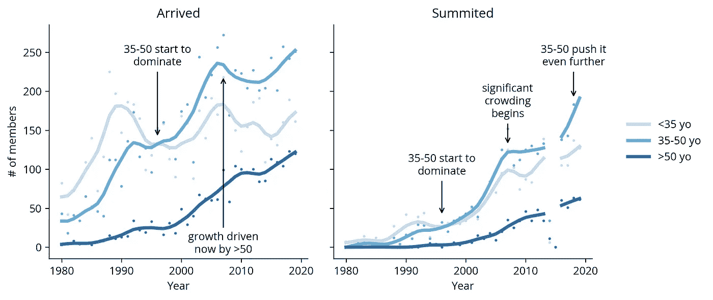
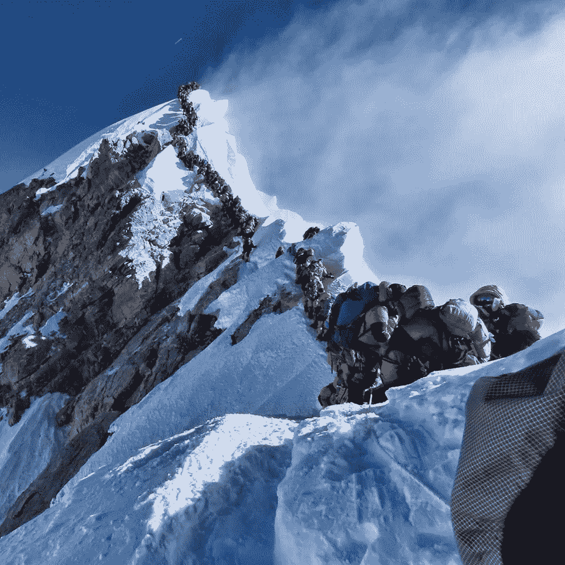

# 中年危机

> 原文：<https://towardsdatascience.com/frostbite-stories-part-1-mount-middle-life-crisis-97df574d58d7?source=collection_archive---------10----------------------->

## 使用数据科学从喜马拉雅数据库中获得新的见解。谁正在攀登珠穆朗玛峰？

Image by [David Mark](https://pixabay.com/users/12019-12019/?utm_source=link-attribution&utm_medium=referral&utm_campaign=image&utm_content=89590) from [Pixabay](https://pixabay.com/?utm_source=link-attribution&utm_medium=referral&utm_campaign=image&utm_content=89590)

你一定听说过今年五月人们在死亡地带排队登上珠穆朗玛峰。Nirmal Purja 的照片引起了媒体的关注，引发了一场关于[珠穆朗玛峰如今的情况有多复杂的激烈辩论](http://www.alanarnette.com/blog/2019/06/07/everest-2019-season-summary-the-year-everest-broke/)，不仅仅是因为人群，还有大量没有经验的登山者和不可靠的机构。我自己不是登山运动员，我很好奇:那里怎么会有这么多人？他们是谁？我对这个话题越来越感兴趣，不久之后，通过艾伦·阿内特的优秀的[博客，他广泛而频繁地报道喜马拉雅山的登山活动，我了解到了](http://www.alanarnette.com/blog/)[喜马拉雅山数据库](https://www.himalayandatabase.com/)。

喜马拉雅山数据库是一个真正独特的项目，它的存在是因为驻加德满都的记者伊丽莎白·霍利的决心，她的雄心是追踪自 1905 年以来喜马拉雅山的所有登山活动。在某种程度上，你可以说，没有她的同意，没有人可以声称他们已经登上了顶峰！虽然她在 2018 年不幸去世，但她已经围绕这个项目聚集了一小群爱好者，他们继续并延伸着她的工作。该数据库定期维护和更新，没有探险队可以不输入他们的详细资料就回家。

该数据库的特色是关于*成员*——付费登山的人——*雇佣的员工*——作为夏尔巴人或厨师被付费帮助成员的人，或保护路线的山地工人的数据。该数据库还包含关于所有喜马拉雅山峰的探险详细信息(谁参加了探险、所走的路线、赞助者和机构、伤亡人数、登顶出价、探险终止的原因、作为自由文本的进一步注释……)和参与人员(姓名、年龄、性别、职业、国籍、氧气或其他特殊设备如滑雪板的使用、死亡/受伤……)的信息。这些数据在很大程度上是经过整理的，但不时会有缺失值，因此并非所有经过分析的数字都能 100%地相互交叉核对。虽然数据库已经在[夫妇](https://www.himalayandatabase.com/publications.html) [的](https://aitorbp.github.io/lasescalerasdelcielo/#) [分析](http://graphics.reuters.com/NEPAL-EVEREST/0100B4S22JR/index.html)中精选，甚至包括[整本书](https://www.goodreads.com/book/show/15254085-the-himalaya-by-numbers)、*喜马拉雅山的数字、*包含各种各样的一般统计数据和故事，我觉得数据科学可以带来更多新的见解(也因为我相信在[栏](https://www.kaggle.com/tkubacka/a-story-told-through-a-heatmap) [地块](/beyond-the-bar-plot-visualizing-gender-inequality-in-science-7d77f5a01953)之外的世界)。由于数据库现在可以作为 SQL 文件在网上免费获得，我释放了 Python 等人的力量。在过去的几周里，我一直在这个数据集上进行一次真正迷人的旅行。

对数据库的探索性分析已经做了一些实质性的工作。例如，参见 Alan Arnette 的博客文章、Sandeep Nakarmi 的[Power BI dashboard](https://app.powerbi.com/view?r=eyJrIjoiNjRlNzliMDEtMjcxMy00MGY5LWI5MWQtM2U4NWE4Y2QzNTA4IiwidCI6IjIxZTQ2N2YzLWY4YzYtNGJmOC04NzNiLTRkZWNjNGY2NmI4NCIsImMiOjEwfQ%3D%3D)以及可在线访问的两个版本的*The Himalaya by Numbers*([2007](https://www.himalayandatabase.com/downloads/HimalayaByNbrs.pdf)、 [2011](https://www.himalayandatabase.com/downloads/hbnsampl.pdf) )。在这里，我不打算重复这项工作，但建立在他们的见解。

对于讲故事的情况，我将把我的见解作为一系列数据故事发布，敬请关注！

# 峰会上的高流量是整个十年的问题

为了了解过去几年里峰会上发生了什么，我将所有峰会日绘制成热图，其中一行对应于给定年份的所有峰会，一列对应于特定日期。我从数据库中汇总了所有成功的峰会投标，并用颜色对它们进行了编码——深蓝色表示某一天有更多的人参加。左侧是一个条形图，显示了给定年份中所有成功的峰会投标的总和。右边是一个条形图，记录了顶部至少有一个人的所有天数。

背景说明:一般来说，攀登珠穆朗玛峰的最佳季节是春天。秋天还有一个登顶窗口，但是在商业探险中非常冷门。因此，我将自己的时间限制在 4 月 14 日至 6 月 15 日，因为这涵盖了 1980 年至 2019 年之间的所有峰会日期。2014 年和 2015 年，由于雪崩和地震，登顶次数很少，这使得登顶变得危险甚至无法通行。

It is a calendar, but looks like a Himalayan version of Minesweeper

我们可以在这里看到一些东西。

首先，早在 2003 年，珠穆朗玛峰就出现过超过 100 人登顶的情况，之前的纪录是在 2012 年创下的，当时有 266 人登顶。你还可以看到，2018 年至 2019 年期间，登顶人数没有大幅增加——从很久以前开始就一直在稳步增长，早在 2007 年，人数就超过了 600 人。

然而，2019 年很特别，不仅因为它在 5 月 23 日打破了 357 人登顶的记录(注意，这是-假设 24 小时内稳定人流的不切实际的最佳情况-几乎每小时 15 人，因此全天每 4 分钟就有一个新人！实际上，我们稍后会看到，登山运动员在一天中更短的时间内登顶，这使得交通更加混乱。如果你仔细观察，前一天有 224 人登顶——这意味着那个季节大约 66%的登顶都是在这两天完成的！路透社图形最近发表了一篇优秀的[文章，讨论了导致这种结果的气象因素](http://graphics.reuters.com/NEPAL-EVEREST/0100B4S22JR/index.html)。

让我也简单评论一下其他见解。在 20 世纪 80 年代和 90 年代，不同探险队的登顶尝试遍布整个季节——早在 4 月份就有成功的投标。这些大多是探索性的考察，T2 有时间和资源在那里呆更长时间，尝试一些东西。此外，30 年后，他们[无法像我们现在](https://www.nationalgeographic.com/adventure/2019/06/mount-everest-highest-weather-station/)一样获得如此精确的天气预报。现在大多数探险都带有商业性质。他们的参与者通常没有时间来等待几个星期的时间窗口——他们在一年中的最佳时间到达，并试图在第一次机会到来时登顶。此外，他们可能需要依靠所谓的冰医生准备的固定绳索，这些医生是负责路线的山地工人，通常要到五月初才准备好。在这里，您可以从数据中看到总峰值窗口是如何逐年减少的。在过去的几年里，所有的峰会申办都集中在 5 月 10 日到 30 日之间的三周时间内。虽然至少有一次成功登顶的天数多年来比较少，但每个季节大约有 10-15 天，依赖于一个小的可用时间窗口的大群人使这座山更容易受到随机拥挤的影响。2017 年和 2018 年的可用人数和天数非常接近，但由于天气更加稳定和其他一些随机因素，人们更加平等地分配了他们的峰会出价。

# 在山顶看日出

现在我们知道了大多数人在一年中的哪一天登顶，那么我们能对登顶时间说些什么呢？我过滤了数据库中包含这些信息的记录，并对它们进行了分组，以获得给定年份顶部的平均每小时流量概况。顶部和底部的图表是相关年份的平均值。我还标出了五月的日出和日落时间。

正如我们所看到的，高峰时间已经逐渐转移到一天中更早的时间。25 年前，大多数人在中午时分登顶。近年来，大约 25%的人甚至在太阳升起之前就登顶了，几乎所有的登山者都在下午 12 点离开了峰顶。这意味着大多数在顶端的人在 8-12 小时内出现，这进一步加剧了路线的堵塞。

这不仅是因为登顶者想从世界之巅观看日出。尽早登顶要安全得多。下降通常比上升更困难，因为没有肾上腺素激增，身体会因上升和长时间停留在 8000 米以上的死亡区而变得虚弱。在白天从危险区下降会大大增加在没有任何伤亡的情况下回家的机会。

这种向更早、更安全的登顶时间的整体转变也意味着，在过去的几十年里，登山界积累了大量关于路线和不同安全因素的知识。稍后将详细介绍。

# 中年富人正涌入这座山

正如我们之前所看到的，这些年来，到达并登顶这座山的成员一直在稳步增加。我想更多地了解这些人是谁。

当然，大多数接近珠穆朗玛峰的登山者被定义为男性(自 1980 年以来稳步下降，目前男性占 80%)。我感兴趣的是它们的年龄以及它是如何随着时间而变化的。因此，我创建了自 1950 年以来每年会员人口的年龄分布图，并将其与时间相对照绘制出来(下图，左边的热图)。我还查看了三个时期的平均人口金字塔:1980-1987 年(所谓的“过渡期”的结束，在*喜马拉雅山由数字*定义)，1988-1995 年(“商业期”开始)，以及 2016-2019 年。

我们可以看到，在 20 世纪 80 年代，大多数人的年龄在 30+/-5 岁之间，这是一个人的身体能力与拥有足够的经验、成熟和精神力量来应对登山挑战之间的最佳状态。1990 年代初，移民人数有了相当大的增长，但与 1980 年代相比，同一年龄组的移民分布不太均匀。如果你将它与最近 4 年的人口金字塔进行比较，你会发现平均年龄已经向 40 岁转移。与 20 世纪 80 年代相比，近年来 30 岁左右的人几乎没有变化。大部分增长是由老年人口推动的。自 20 世纪 90 年代以来，这一趋势一直保持稳定，并且在热图上表现为最高年龄不断增加，并且两个年龄组都没有变暗。还要注意最近一个特殊的趋势:登山者试图在 18 岁生日之前或当天攀登珠穆朗玛峰。

为了量化这一趋势，我将人口分为三个主要年龄组:(1)35 岁以下，(2)35-50 岁，(3)50 岁以上。让我们来看看这三个人群自 1980 年以来在两种情况下是如何变化的:到达珠穆朗玛峰的成员(左)和成功登顶的成员(右)。

从 1980 年到 1990 年，所有年龄组的人口数量都在平均增长。自 1990 年以来，随着 35-50 岁的移民数量稳定在每年 250 人左右，50 岁的移民数量开始增加。

所以从绝对数字来看，大部分是中年男人，他们足够富有，能够支付或筹集平均 45 000 美元的探险费用，他们淹没了这座山，也是营地和峰顶附近危险人群的来源。

# 如今几乎每个人都能登上顶峰

如果你比较上面的两幅图，你会发现在最近几年，登顶的人数实际上与试图攀登的人数相差不远，这与 20 世纪 80 年代的情况形成了鲜明的对比。让我们来看看这三个年龄组在某一年的最高比率。

令人惊讶的是，现在 50 岁以下的人的峰值比率已经高达 80 %, 50 岁以上的人超过了 50%!同样引人入胜的是，自 1990 年以来，峰值利率几乎一直呈线性增长。尽管 35-50 岁的人可能不如年轻成员健康，但他们登顶的比率几乎与 50 岁的人相同，但相差不大，更大的登顶比率差距仅在 2005 年左右出现。

如果像我们倾向于认为的那样，攀登珠穆朗玛峰是一项如此艰难的成就——总而言之，它是世界之巅——那么登顶率为何如此之高？

一件事是，典型的珠穆朗玛峰探险已经从探险性质转变为商业性质。探险队遵循众所周知的、标准化的、安全的路线，有大量关于途中可能遇到的危险和陷阱的知识，登山装备在技术上比 30 年前好很多倍。所有这些都使得体能相对较差的人(虽然，还是有高于平均水平的体能！)和经历才能成功。

但这也有其黑暗的一面:投入大量自己积蓄来追求目标的人更有动力推动登顶，有时会危险地打破安全界限，一些机构和导游不愿意建议不要这样做，或者无法提供足够的支持。也有一群人尝试攀登，不是因为他们是激情或经验的登山者，而是因为一旦他们到达顶峰并返回 T2，他们将获得非常切实的利益:社会认可、经济奖励、荣誉和奖牌。

众所周知，没有经验的登山者在很大程度上是由他们的夏尔巴人照看的，直到登顶并返回 T4。它实际上反映在数据中，为了定性地说明这一点，我设计了一个可视化工具，从全球角度看夏尔巴人与成员的比例，以及他们在不同年份的峰会出价。

这里一行是一个单独的探险队，一个正方形代表属于这个探险队的一个人。中间的黑线将至少有一人成功登顶的探险队与从未登顶的探险队区分开来。一个登顶的人被涂上了更深的颜色。成员以蓝色阴影显示，位于每个金字塔的右侧。他们雇佣的员工——左边，灰色的。

我们可以看到，直到 2005 年，大约一半的探险队根本没有登顶，而在那些成功登顶的探险队中，大部分都是队员独自成功登顶的。探险队也没有像现在一样雇佣那么多夏尔巴人。

自 2005 年以来，到达珠穆朗玛峰的探险队数量越来越少。然而，越来越多的探险队成功登顶。同样显而易见的是，随着时间的推移，越来越多的属于一个探险队的成员到达了顶端。此外，现在大多数探险队都有 ca。成员和雇佣人员之间的比例为 1:1，尽管夏尔巴人比成员多。同样，几乎所有被雇佣的员工都能和他们的成员一起晋升到高层，这在 20 世纪 80 年代、90 年代甚至 21 世纪初都是不可能的。在 2019 年，几乎没有哪个探险队的成员不会在峰顶带上夏尔巴人。

# 中年危机

那么这一切告诉我们什么呢？

在 20 世纪 80 年代，探险队更具探索性:他们包括更年轻的成员，更少的夏尔巴人，并且在春季分散了几个星期。多亏了这些年的探索，人们在某种程度上知道了如何以正确的方式爬山。因此，探险可能变得更加标准化和商业化。如今，几乎所有的登顶都是在 5 月底的最佳时间，沿着相同的登山路线，包括不是专业登山运动员的老年成员，而且夏尔巴人与探险队成员的比例要大得多。

尽管受到广泛批评的事实是，那里有许多缺乏经验、身体不健康的探险队员，而且许多探险队是由没有适当喜马拉雅专业知识的新机构组织的，但大多数队员都成功登顶，与喜马拉雅其他山峰相比，伤亡率非常低(2019 年 900 人中有 11 人的死亡率为 1.2%)。

一方面，这意味着良好的设备、对路线的了解和良好的规划、足够的雇佣员工和良好的准备可以弥补经验、体能和人群存在的不足。另一方面，尽管珠穆朗玛峰是最高的，而且被媒体认为非常危险，但它现在看起来是一座在技术上相对容易攀登的山峰，而且对于一座 8000 米的山峰来说也是安全的。

登顶的队伍呢？这一分析表明，珠穆朗玛峰上的人群似乎很大一部分是中年富人和他们的高空保姆。但话虽如此，最好记住他们实际上成功到达顶部并返回——这是我，一个久坐不动的数据书呆子，永远无法复制的成就。

# 下一步是什么？

然而，这并不是结束。在接下来的故事中，我将探讨以下问题:

*   与新的或经验较少的机构一起攀登更危险吗？他们中谁的伤亡率最大？
*   现在的伤亡多与经验不足，准备不足有关吗？
*   先前的喜马拉雅山登山经历如何影响登顶成功？
*   不同的路线会发生什么？
*   一些国家比其他国家更有可能成功申办峰会吗？
*   喜马拉雅山的其他山峰呢？
*   …以及更多—敬请关注！

Waiting to summit on 23.05.2019 — [Nirmal Purja](https://www.facebook.com/NimsPurja/photos/a.1931134023607935/2155658064488862/?type=3)